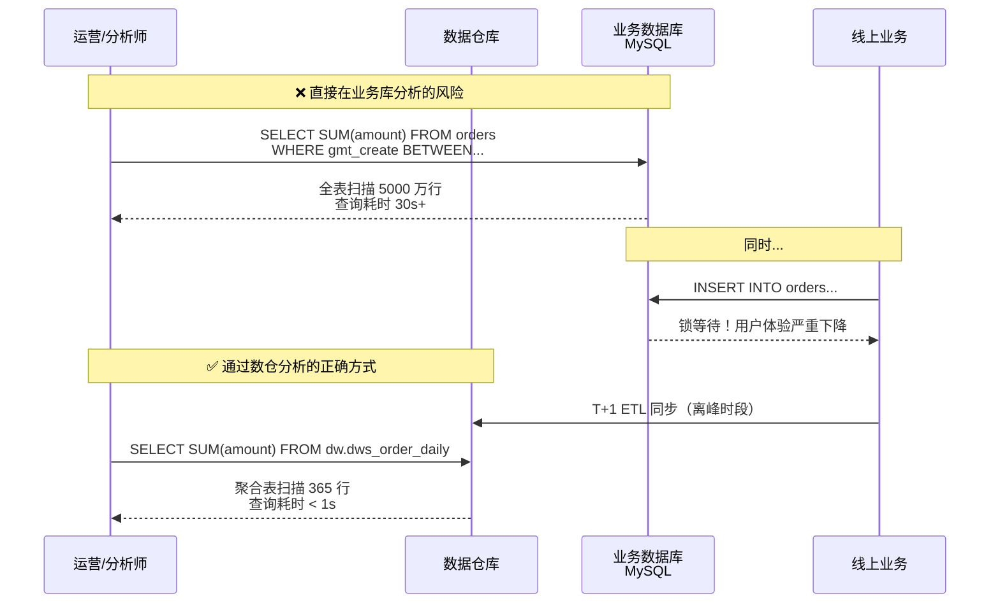
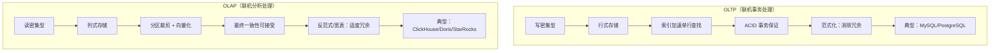
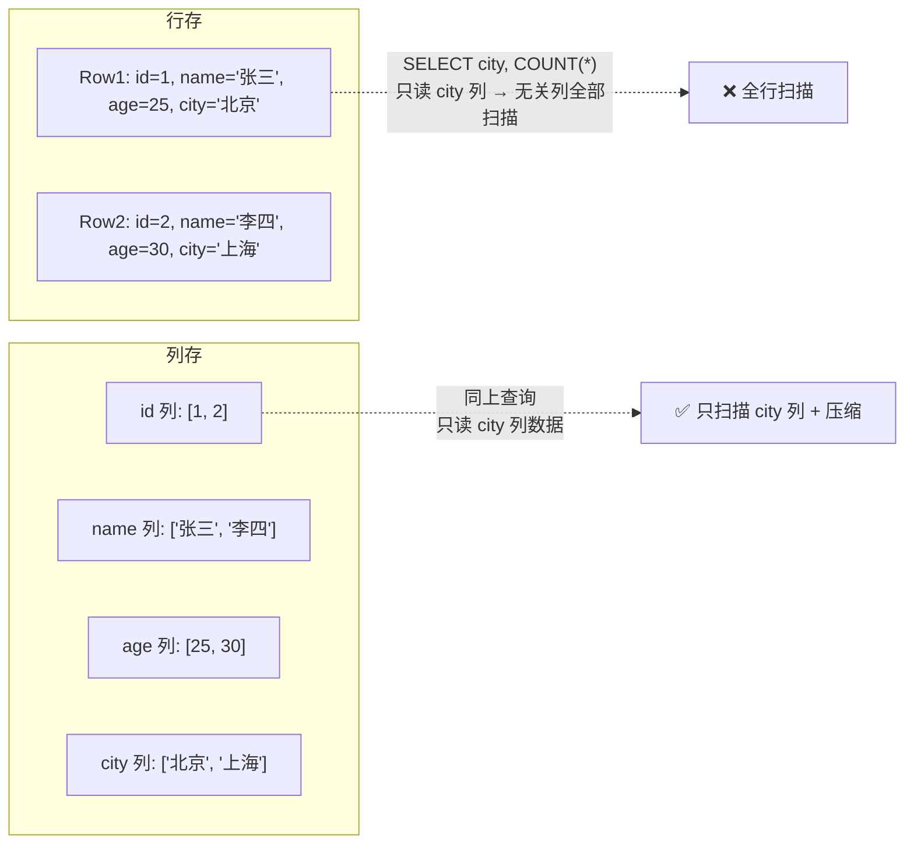
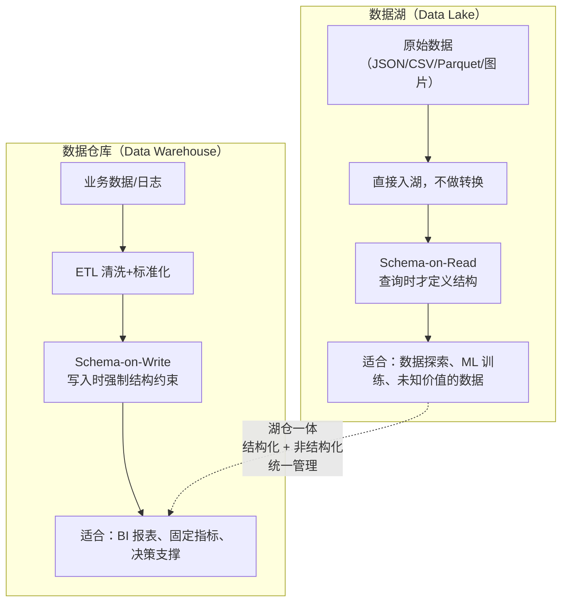
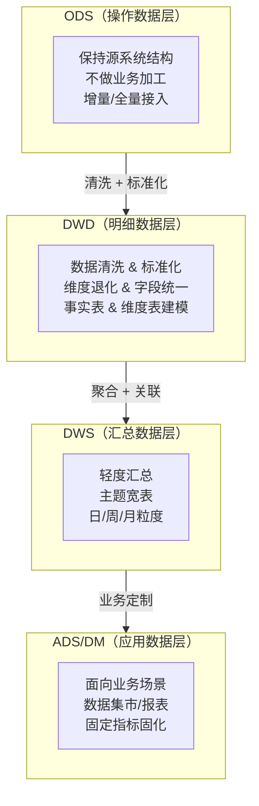
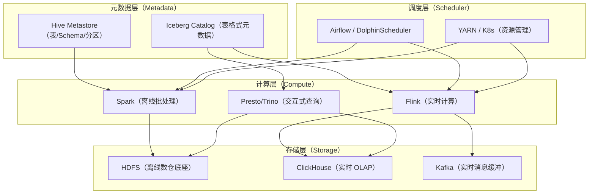
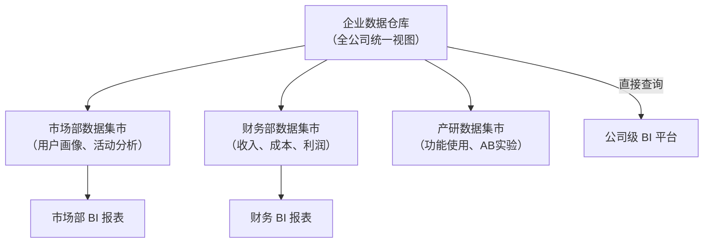

# 01 · 数仓定位与架构

> **本章要回答一个终极问题：数据仓库到底解决了什么问题？它和数据湖、OLTP 系统有什么区别？这套分层架构又是怎么来的？**
>
> 作为数据开发面试的第一道关卡，"什么是数据仓库"几乎必问。但面试官不想听你背定义——他要听你从**业务痛点**出发，讲清楚为什么需要数仓、分层架构怎么设计、以及数仓和数据湖怎么选。
>
> ```mermaid
> flowchart LR
>     A[业务数据库<br/>OLTP 系统] -->|ETL/CDC| B[数据仓库<br/>ODS→DWD→DWS→ADS]
>     B --> C[OLAP 分析查询]
>     B --> D[BI 报表 / 数据产品]
>     
>     E[原始日志/文件] -->|采集| B
>     
>     F[数据湖] -.->|Schema-on-Read<br/>与数仓互补| B
>     B -.->|湖仓一体趋势| F
> ```
>
> **阅读建议**：§1-§3 是递进主干（定义→OLAP vs OLTP→数仓 vs 数据湖），§4-§5 是架构展开（分层架构→分布式架构），§6 是数据集市作为延伸。如果时间紧，§1-§4 必须精读，§5-§6 可以在建模模块后再回来看。
>
> 覆盖原题：1, 4, 14, 21, 30, 36, 50。

---

## 1. 数据仓库定义与价值

### 为什么有了业务数据库，还要建数据仓库？

**因为业务数据库（OLTP）解决的是"跑业务"，数据仓库解决的是"做分析"——两者的设计哲学完全相反。**

| 维度 | 业务数据库（OLTP） | 数据仓库（OLAP） |
|------|-------------------|-----------------|
| 目的 | 支撑业务流程（下单、支付、发货） | 支撑分析决策（日报、周报、用户画像） |
| 数据组织 | 面向应用，高度范式化（3NF） | 面向主题，反范式/宽表 |
| 数据范围 | 当前状态，热数据 | 历史快照，全量数据 |
| 操作类型 | 小事务、高并发、低延迟读写 | 大查询、低并发、高吞吐扫描 |
| 数据冗余 | 尽量避免（范式化消除） | 适度冗余（空间换时间） |
| 典型产品 | MySQL、PostgreSQL、Oracle | Hive、ClickHouse、Doris、Snowflake |

**为什么不能直接在业务库上分析？**



**面试时怎么讲？**

> "数据仓库不是存数据的地方，是让数据**可分析**的地方。它的核心价值是三个统一：**主题统一**（按业务主题而不是按应用组织）、**历史统一**（保留全量历史快照而不是只存当前状态）、**口径统一**（ETL 过程中做清洗和标准化，保证跨部门指标一致）。"

### 数据仓库的核心特征（Inmon 四特性）

1. **面向主题（Subject-Oriented）**：按"用户""订单""商品"等业务主题组织，而不是按"订单系统""支付系统"等技术模块
2. **集成（Integrated）**：多源数据统一命名、统一编码、统一度量
3. **非易失（Non-Volatile）**：数据一旦进入数仓就不再修改，只有追加
4. **时变（Time-Variant）**：每条数据都带时间戳，可以回溯任意历史时刻

??? tip "面试嘴替 — 数据仓库定义与价值"
    **核心主张**（面试第一句就说对的）：
    > "数据仓库是面向主题的、集成的、非易失的、时变的，用于支撑管理决策的数据集合。它和业务库的本质区别是：业务库面向流程（OLTP，高并发小事务），数仓面向分析（OLAP，大查询高吞吐）。"

    **常见追问 & 防御**：
    - 追问："能举例说明'面向主题'和'面向应用'的区别吗？" → 答："面向应用是按订单系统、支付系统、库存系统分别存储；面向主题是把用户相关的订单、支付、浏览记录整合到'用户主题域'下，分析师只关心用户画像，不需要知道数据来自哪个系统。"
    - 追问："既然数仓不修改数据，那数据错了怎么办？" → 答："不是不修改，是不能直接 UPDATE。错误数据通过 ETL 重跑回刷，保留修正的时间戳和版本，保证可追溯。"

    **绑定项目**：
    > "我项目中的 ODS→DWD→DWS→DM 分层就是遵循数仓方法论：ODS 保持与源系统一致不做修改（非易失），DWD 做清洗和标准化（集成），DWS 按主题汇总（面向主题），每层数据都带 dt 分区（时变）。"

    | 一般回答 | 优秀回答 |
    |---------|---------|
    | "数据仓库就是存数据的地方，用来做报表分析。" | "数据仓库解决的是 OLTP 系统无法同时满足'跑业务'和'做分析'两个需求的问题。它通过面向主题的建模、历史快照保留和 ETL 口径统一，让分析师可以在不干扰线上业务的前提下，高效查询历史数据、做多维分析。" |

---

## 2. OLAP vs OLTP

### OLAP 和 OLTP 的本质区别是什么？为什么不能混用？

**一句话：OLTP 是"记流水账"，OLAP 是"做总结报告"——一个要写得快，一个要查得快。**



**OLAP 的五种操作类型（必背，面试官最喜欢让你数出来）：**

| 操作 | 含义 | 示例 |
|------|------|------|
| **上卷（Roll-up）** | 从细粒度向粗粒度聚合 | 日销售额 → 月销售额 |
| **下钻（Drill-down）** | 从粗粒度向细粒度拆分 | 省销售额 → 市销售额 |
| **切片（Slice）** | 固定一个维度值看数据 | 只看"北京市"的销售数据 |
| **切块（Dice）** | 固定多个维度值看数据 | 看"北京市 + 2024年"的销售数据 |
| **旋转（Pivot）** | 交换行/列维度 | 行是地区、列是月份 → 行是月份、列是地区 |

**OLAP 引擎分类（ROLAP vs MOLAP vs HOLAP）：**

| 类型 | 存储 | 代表 | 场景 |
|------|------|------|------|
| **ROLAP** | 关系型数据库，实时查询明细/聚合 | ClickHouse、Doris | 大数据量、灵活查询 |
| **MOLAP** | 专用多维数据库，预计算 Cube | Kylin、Essbase | 固定维度组合、极致查询性能 |
| **HOLAP** | 混合：明细在 ROLAP，聚合在 MOLAP | 部分商业 BI 工具 | 兼顾灵活性和性能 |

### 为什么 OLAP 引擎普遍使用列式存储？

**列式存储 = 查询只读需要的列 + 同列数据类型一致压缩率高 + 向量化执行。**



??? tip "面试嘴替 — OLAP vs OLTP"
    **核心主张**：
    > "OLTP 是记流水账——写得快、事务严格、按行存；OLAP 是做总结报告——查得快、批量扫、按列存。两者的存储引擎、索引策略、事务模型完全不同，所以要把分析负载从业务库剥离到数仓。"

    **常见追问 & 防御**：
    - 追问："ClickHouse 为什么那么快？" → 答："四个关键：列式存储减少 IO + 向量化执行（SIMD 批量处理） + 分区裁剪跳过无关数据 + MergeTree 引擎的稀疏索引。"
    - 追问："OLAP 的 ACID 为什么可以放松？" → 答："因为数据是批量加载的，不是实时事务。如果出错，重跑一个分区即可，不需要事务回滚。最终一致性 + 幂等 ETL 就够了。"

    **绑定项目**：
    > "我的实时数仓链路最终落地到 ClickHouse，选型原因就是它的列式存储和 MergeTree 引擎对时序聚合查询极快——一个 5000 万行的日活表，查单日维度下钻只需要几十毫秒。"

    | 一般回答 | 优秀回答 |
    |---------|---------|
    | "OLTP 是联机事务处理，OLAP 是联机分析处理。" | "OLTP 和 OLAP 是整个数据架构的一体两面：业务库是'写'的世界—ACID、范式化、行存；数仓是'读'的世界—最终一致、反范式、列存。数仓通过 ETL 把业务库的'流水'变成可分析的历史快照，同时避免分析查询拖垮线上服务。" |

---

## 3. 数据仓库 vs 数据湖 vs 湖仓一体

### 数据湖和数据仓库到底有什么不同？什么时候该用哪个？

**数据湖是"先存后治"，数仓是"先治后存"——核心区别是 Schema 施加的时机。**



| 维度 | 数据湖 | 数据仓库 | 湖仓一体 |
|------|--------|----------|----------|
| 数据类型 | 结构化 + 半结构化 + 非结构化 | 以结构化为主 | 统一管理所有类型 |
| Schema | Schema-on-Read（读时推断） | Schema-on-Write（写时校验） | 两者都支持 |
| 存储格式 | 原始格式 / Parquet / Avro | 严格建模后的表结构 | Iceberg/Hudi 表格式 |
| 用户 | 数据科学家、ML 工程师 | BI 分析师、业务运营 | 所有人 |
| ACID | 弱（传统 HDFS） | 强（Hive/Iceberg） | 强（通过表格式） |
| 典型技术 | HDFS + Spark | Hive + ClickHouse | Iceberg + Flink + Trino |
| 成本 | 低（对象存储） | 高（高性能引擎） | 中（分级存储） |

### 湖仓一体的核心突破是什么？

**一句话：在数据湖上加了 ACID 事务、Schema 演进和时间旅行，让数据湖具备数仓的能力。**

Iceberg/Hudi/Delta Lake 三大表格式的核心贡献：

| 能力 | 传统数据湖（HDFS） | 湖仓表格式（Iceberg） |
|------|-------------------|----------------------|
| ACID 事务 | ❌ 只能追加，不能安全 UPDATE/DELETE | ✅ 通过快照隔离实现 |
| Schema 演进 | ❌ 改 Schema = 全量重写 | ✅ 支持列增删、类型变更 |
| 时间旅行 | ❌ 无 | ✅ 按快照 ID 或时间戳回溯 |
| 分区演进 | ❌ 改分区 = 全量重建 | ✅ 元数据层变更，不重写数据 |
| 增量读取 | ❌ 全量扫描 | ✅ 按快照 diff 增量消费 |

??? tip "面试嘴替 — 数仓 vs 数据湖 vs 湖仓一体"
    **核心主张**：
    > "数据湖是 Schema-on-Read，先存后治，适合探索和 ML；数仓是 Schema-on-Write，先治后存，适合 BI 报表。湖仓一体用 Iceberg 等表格式在数据湖上加 ACID 和 Schema 管理，让数据湖'进化'出数仓的能力。"

    **常见追问 & 防御**：
    - 追问："什么时候选数据湖而不是数仓？" → 答："三个信号：① 数据价值不确定，需要低成本保留原始数据；② 团队有 ML/数据科学需求需要非结构化数据；③ 数据量级很大，全量进数仓成本太高。"
    - 追问："Iceberg 怎么实现 ACID 的？" → 答："乐观并发控制：每次写入生成新的 manifest 文件，commit 时原子性地将 metadata 指针指向新 snapshot。读操作始终读已提交的 snapshot，写操作冲突时后者重试。"

    **绑定项目**：
    > "我的 Flink + Iceberg 湖仓链路就是湖仓一体的实践：Flink 消费 Kafka 实时写入 Iceberg 表，同时支持流式读取（实时数仓）和批量读取（离线补数），一套数据、两种消费模式，避免了实时/离线两套存储口径不一致的问题。"

    | 一般回答 | 优秀回答 |
    |---------|---------|
    | "数据湖存原始数据，数仓存加工后的数据。" | "区别不在于存什么，在于 Schema 施加的时机和数据的治理程度。数仓入数据时就要定义清楚字段和口径——写时 Schema；数据湖是读的时候才去解析结构——读时 Schema。湖仓一体是把两者的优点结合：数据湖的低成本 + 数仓的 ACID 和治理能力。" |

---

## 4. 分层架构

### ODS → DWD → DWS → ADS，每一层到底在做什么？为什么不能跳层？

**分层的核心目的是"解耦"——每一层只做一件事，上游变化不影响下游。**



**每一层的核心问题：**

| 层 | 核心问题 | 设计原则 |
|----|---------|---------|
| **ODS** | "我有没有把源数据原样保存下来？" | 不加工、不删字段、保留原始时间戳。表名通常 `ods_{源系统}_{表名}` |
| **DWD** | "数据干净了吗？字段含义统一了吗？" | 去重、空值处理、枚举值标准化、维度退化。表名 `dwd_{主题域}_{事实/维度}_{粒度}` |
| **DWS** | "常用查询能直接取到汇总结果吗？" | 按主题 + 天/周/月预聚合，宽表化减少 JOIN。表名 `dws_{主题域}_{粒度}` |
| **ADS** | "业务方拿到的数据能直接用吗？" | 面向具体产品/报表定制，字段命名面向业务而非技术。表名 `ads_{产品}_{指标}` |

### 为什么不能从 ODS 直接跳到 DWS？

**因为 ODS 的数据是脏的、异构的、多版本的——直接聚合会得到一个没人信的结果。**

举个例子：两个业务系统的"用户状态"字段，一个用 0/1（禁用/启用），一个用 "active"/"frozen"。如果从 ODS 直接聚合，统计出来的"活跃用户数"两个系统口径不一致。DWD 层的价值就是在这里做标准化：统一枚举值、统一命名、统一数据类型。

**另一个关键原因：分层隔离上游变更。** 如果业务库改了一个字段名，你只需要在 DWD 层改映射逻辑，DWS 和 ADS 完全不受影响——这就是解耦的价值。

??? example "SQL：Hive 分层表命名示例"
    ```sql
    -- ODS 层：保持源系统原始结构
    CREATE TABLE ods_mysql_order_info (
        id              BIGINT    COMMENT '自增主键',
        order_no        STRING    COMMENT '订单号',
        user_id         BIGINT    COMMENT '用户ID',
        amount          DECIMAL(18,2) COMMENT '金额',
        status          INT       COMMENT '0未支付/1已支付/2已取消',
        gmt_create      STRING    COMMENT '创建时间',
        gmt_modified    STRING    COMMENT '修改时间'
    ) COMMENT '订单表-ODS层'
    PARTITIONED BY (dt STRING COMMENT '日期分区 yyyy-MM-dd')
    STORED AS PARQUET;

    -- DWD 层：清洗后的事实表
    CREATE TABLE dwd_trade_order_fact (
        order_id        BIGINT    COMMENT '订单ID',
        order_no        STRING    COMMENT '订单号',
        user_id         BIGINT    COMMENT '用户ID',
        amount          DECIMAL(18,2) COMMENT '订单金额(元)',
        order_status    STRING    COMMENT '订单状态: UNPAID/PAID/CANCELLED',
        create_time     TIMESTAMP COMMENT '创建时间',
        update_time     TIMESTAMP COMMENT '修改时间'
    ) COMMENT '交易订单事实表-DWD层'
    PARTITIONED BY (dt STRING COMMENT '日期分区 yyyy-MM-dd')
    STORED AS PARQUET;

    -- DWS 层：按天汇总
    CREATE TABLE dws_trade_order_daily (
        dt              STRING    COMMENT '统计日期',
        order_count     BIGINT    COMMENT '订单数',
        order_amount    DECIMAL(18,2) COMMENT '订单金额(元)',
        paid_count      BIGINT    COMMENT '支付订单数',
        paid_amount     DECIMAL(18,2) COMMENT '支付金额(元)',
        user_count      BIGINT    COMMENT '下单用户数(去重)'
    ) COMMENT '交易订单日汇总表-DWS层'
    PARTITIONED BY (dt STRING COMMENT '统计日期 yyyy-MM-dd')
    STORED AS PARQUET;

    -- ETL 逻辑：ODS → DWD
    INSERT OVERWRITE TABLE dwd_trade_order_fact PARTITION (dt = '${dt}')
    SELECT
        id,
        order_no,
        user_id,
        amount,
        CASE status
            WHEN 0 THEN 'UNPAID'
            WHEN 1 THEN 'PAID'
            WHEN 2 THEN 'CANCELLED'
            ELSE 'UNKNOWN'
        END,
        CAST(gmt_create AS TIMESTAMP),
        CAST(gmt_modified AS TIMESTAMP)
    FROM ods_mysql_order_info
    WHERE dt = '${dt}'
      AND order_no IS NOT NULL;  -- 基础数据质量过滤

    -- ETL 逻辑：DWD → DWS
    INSERT OVERWRITE TABLE dws_trade_order_daily PARTITION (dt = '${dt}')
    SELECT
        '${dt}' AS dt,
        COUNT(1) AS order_count,
        SUM(amount) AS order_amount,
        SUM(IF(order_status = 'PAID', 1, 0)) AS paid_count,
        SUM(IF(order_status = 'PAID', amount, 0)) AS paid_amount,
        COUNT(DISTINCT user_id) AS user_count
    FROM dwd_trade_order_fact
    WHERE dt = '${dt}';
    ```

??? tip "面试嘴替 — 分层架构"
    **核心主张**：
    > "分层不是教条，是解耦手段。ODS 保持源系统原样→ DWD 清洗标准化→ DWS 主题汇总→ ADS 业务定制。每一层只做一件事，上游变更不传导到下游。跳层的代价是脏数据 + 口径不一致 + 上游变更雪崩。"

    **常见追问 & 防御**：
    - 追问："DWS 和 ADS 的区别是什么？能合并吗？" → 答："DWS 是面向主题的通用汇总（'交易日汇总表'），ADS 是面向具体产品的定制指标（'大促活动实时 GMV 面板'）。小数据量可以合并，但数据量大了 DWS 会变成大杂烩——一个通用宽表几百列，分析师挑花眼。"
    - 追问："为什么要用 Parquet 格式？" → 答："列式存储 + 高压缩比 + 谓词下推。Hive 查询 SELECT dt FROM table WHERE dt='2024-01-01' 时，Parquet 可以只读 dt 列的元数据就完成分区过滤，根本不需要读数据文件。"

    **绑定项目**：
    > "我的项目遵循 ODS→DWD→DWM→DWS→DM 五层架构（多了一层 DWM 做轻度聚合），每层表命名都有规范，比如 `dwd_ai_query_fact_di` 表示 DWD 层 AI 查询事实日增量表。分层的好处是：当上游 MySQL 表加了一个字段，我只需要改 ODS 和 DWD 的映射，下游 DWS 和 DM 不受影响——隔离变更、保护下游。"

    | 一般回答 | 优秀回答 |
    |---------|---------|
    | "分四层：ODS 贴源层、DWD 明细层、DWS 汇总层、ADS 应用层。" | "分层解决三个问题：数据质量（ODS→DWD 清洗）、查询性能（DWD→DWS 预聚合）、变更隔离（每层独立演进）。实际上每层对应一种数据生命周期：ODS 是原始证据、DWD 是标准化事实、DWS 是业务洞察、ADS 是决策输出。" |

---

## 5. 分布式架构

### 数据仓库的分布式架构是如何设计的？怎么保证高可用？

**数仓的分布式架构 = 存算分离 + 多副本 + 元数据高可用。**



**各层高可用策略：**

| 层 | 高可用手段 | 具体机制 |
|----|-----------|---------|
| **存储（HDFS）** | 多副本 + 机架感知 | 默认 3 副本，分布在 2+ 机架，NameNode HA |
| **存储（ClickHouse）** | 副本表 + Distributed 表 | ReplicatedMergeTree 多副本同步，Distributed 表自动路由 |
| **存储（Kafka）** | ISR + 分区副本 | Leader 故障自动切换，min.insync.replicas 保证持久性 |
| **计算（Spark/Flink）** | Job 重试 + 资源动态分配 | YARN/K8s 自动重启失败 Container，Checkpoint 保证 Flink 状态恢复 |
| **元数据（Hive Metastore）** | MySQL 主从 + Metastore 无状态 | 多个 Metastore 实例负载均衡，共享 MySQL HA 集群 |
| **调度（Airflow）** | Scheduler HA + 外部 DB | 多个 Scheduler 实例竞争锁，失败自动接管 |

### 存算分离 vs 存算一体，怎么选？

| 维度 | 存算一体（传统 Hadoop） | 存算分离（云原生） |
|------|------------------------|-------------------|
| 架构 | 计算和存储在同一组节点 | 计算集群 + 对象存储独立 |
| 弹性 | 扩计算必须扩存储，不灵活 | 计算存储独立扩缩 |
| 成本 | 闲置时资源浪费 | 计算集群可按需缩到 0 |
| 性能 | 数据本地性，无网络开销 | 网络 IO 成为瓶颈（加缓存缓解） |
| 代表 | Cloudera Hadoop 集群 | Snowflake、Databricks、各云厂商数仓 |

??? tip "面试嘴替 — 分布式架构"
    **核心主张**：
    > "数仓分布式架构 = 存算分离（大势所趋）+ 分层高可用（每层有自己的 HA 策略）。存储层靠多副本，计算层靠 Job 重试和 Checkpoint，元数据层靠主从 + 无状态服务。"

    **常见追问 & 防御**：
    - 追问："存算分离的缺点是什么？" → 答："网络 IO 是瓶颈。本地磁盘读写是 GB/s 级，网络是 10GbE/25GbE。所以云数仓大量使用本地 SSD 缓存 + 谓词下推来减少网络传输。"
    - 追问："你们项目的数仓架构是存算分离吗？" → 答："部分分离：Hive 离线链路存算一体（DataNode 和 NodeManager 部署在同一组物理机），但实时链路的 Flink 计算和 ClickHouse 存储是分离的。"

    | 一般回答 | 优秀回答 |
    |---------|---------|
    | "用 Hadoop 集群搭数仓，HDFS 存数据，Spark 做计算。" | "数仓的分布式分四层看：存储层 HDFS/ClickHouse/Kafka 各有自己的高可用机制（多副本/ISR），计算层 Spark/Flink 通过 YARN/K8s 做资源管理和容错，元数据层 Hive Metastore 做 MySQL HA + 无状态服务，调度层 Airflow 做 DAG 编排。存算分离是趋势，选型时要考虑数据本地性损失 vs 弹性伸缩收益。" |

---

## 6. 数据集市

### 数据集市和数据仓库有什么区别？什么时候该建集市？

**数据集市是数据仓库的一个"子集"——面向特定业务部门或应用场景的数据服务层。**



| 维度 | 数据仓库 | 数据集市 |
|------|---------|---------|
| 范围 | 企业级、全域数据 | 部门级、特定主题 |
| 用户 | 全公司 | 特定业务团队 |
| 建模 | 遵循全域统一维度模型 | 可在统一维度上做定制化宽表 |
| 粒度 | 多粒度（细节+汇总） | 偏汇总，面向业务场景 |
| 数据量 | 海量 | 相对较小 |

**建集市的两个核心场景：**

1. **性能隔离**：某些业务的查询负载极高（如实时大屏），需要独立的计算和存储资源，避免影响数仓主链路
2. **口径定制**：不同部门对同一指标可能有不同的定义——"收入"对财务是权责发生制，对运营是现金收付制。集市可以做部门口径的二次加工

??? tip "面试嘴替 — 数据集市"
    **核心主张**：
    > "数据集市是数仓面向业务部门的'专窗'。不是另起炉灶，而是在统一数仓基础上按业务视角重组。"

    **常见追问 & 防御**：
    - 追问："先建集市还是先建数仓？" → 答："Kimball 主张先建集市再汇总成数仓（自底向上），Inmon 主张先建数仓再拆集市（自顶向下）。实践中，如果公司只有一个业务线急需数据，可以先建集市；长期必须收敛到统一数仓，否则每个部门各建各的，数据口径永远对不齐。"

    | 一般回答 | 优秀回答 |
    |---------|---------|
    | "数据集市是小的数据仓库。" | "集市不是'小仓'，是数仓的'业务视图'。它解决两个问题：查询负载隔离（大促大屏不能拖垮数仓主集群）和业务口径定制（财务'收入'和运营'收入'可能不是一个口径）。但前提是有统一数仓底座——没有底座直接建集市 = 数据孤岛。" |

---

## 面试串讲（本章连贯表述）

> "数据仓库面试的第一关就是概念关。我建议你按这条线练习自我介绍：'数据仓库是面向主题、集成、非易失、时变的数据集合，它解决 OLTP 系统无法同时做业务和分析的问题。数仓通过分层架构（ODS→DWD→DWS→ADS）实现数据质量的逐层提升和上游变更的隔离。相比数据湖的 Schema-on-Read，数仓的 Schema-on-Write 更适合 BI 报表和决策场景。现在湖仓一体用 Iceberg 等表格式让数据湖也具备了 ACID 和 Schema 管理能力，两条路线在融合。'"

> "分布式架构的答题策略：分层描述——存储层多副本（HDFS 3 副本/ClickHouse ReplicatedMergeTree/Kafka ISR），计算层 Job 重试 + Checkpoint（Flink），元数据层 MySQL HA + 无状态 Metastore，调度层 Scheduler HA + 外部 DB。存算分离是大趋势，但要承认网络 IO 的代价和本地 SSD 缓存的补偿。"

---

## 自测 Q&A

<details>
<summary><b>Q：OLTP 和 OLAP 的根本设计差异是什么？为什么不能直接在业务库上跑分析 SQL？</b></summary>

A：OLTP 是行存、高并发小事务、面向流程；OLAP 是列存、大查询高吞吐、面向分析。直接在业务库跑分析 SQL 会导致全表扫描锁表，拖垮线上业务。正确做法是通过 ETL 把数据搬到数仓，在数仓侧做分析查询。

</details>

<details>
<summary><b>Q：数据仓库的四个核心特征是什么？每个怎么理解？</b></summary>

A：面向主题（按业务主题组织而非按应用）、集成（多源数据统一命名和编码）、非易失（数据入仓后不修改只追加）、时变（数据带时间戳，可回溯历史）。

</details>

<details>
<summary><b>Q：Schema-on-Read 和 Schema-on-Write 的区别？各适用于什么场景？</b></summary>

A：Schema-on-Write 在写入时强制校验结构（数仓），适合 BI 报表等确定性场景；Schema-on-Read 在查询时才解析结构（数据湖），适合数据探索和 ML 训练。湖仓一体通过 Iceberg 表格式同时支持两者。

</details>

<details>
<summary><b>Q：ODS、DWD、DWS、ADS 每层的核心职责和设计原则是什么？</b></summary>

A：ODS 保持源系统原样（不加工）；DWD 清洗标准化（去重、统一枚举值、字段标准化）；DWS 主题汇总（天/周/月粒度宽表）；ADS 业务定制（面向产品/报表）。每层只做一件事，跳层会导致脏数据 + 口径不一致 + 上游变更雪崩。

</details>

<details>
<summary><b>Q：数仓分布式架构分几层？每层怎么高可用？</b></summary>

A：四层。存储层：HDFS 3 副本 + 机架感知，ClickHouse ReplicatedMergeTree；计算层：Job 重试 + Checkpoint；元数据层：MySQL HA + 多 Metastore 实例；调度层：Scheduler HA + 外部 DB。

</details>

<details>
<summary><b>Q：数据集市和数仓的区别？先建哪个？</b></summary>

A：数据仓库企业级全域数据，数据集市面向特定部门的定制视图。Kimball 自底向上（先集市后仓），Inmon 自顶向下（先仓后集市）。实践中长期必须收敛到统一数仓底座，否则各部门集市 = 数据孤岛。

</details>

<details>
<summary><b>Q：湖仓一体的核心突破是什么？Iceberg 怎么实现 ACID？</b></summary>

A：在数据湖上加了 ACID 事务、Schema 演进和时间旅行。Iceberg 通过乐观并发控制：每次写入生成新 manifest 文件，commit 时原子性更新 metadata 指针。读操作始终读已提交 snapshot，写冲突时后者重试。

</details>

---

## 推荐源
- Kimball《数据仓库工具箱》第三版：维度建模圣经
- Inmon《Building the Data Warehouse》：数仓概念奠基之作
- Apache Iceberg 官方文档：<https://iceberg.apache.org/docs/latest/>
- ClickHouse MergeTree 引擎：<https://clickhouse.com/docs/zh/engines/table-engines/mergetree-family/mergetree>

!!! question "卡住了？"
    分层架构中 DWM（中间汇总层）的定位和必要性、Data Vault 2.0 建模方法论、Hive vs Iceberg 在元数据管理上的差异——任意点直接问老师展开或出题。
