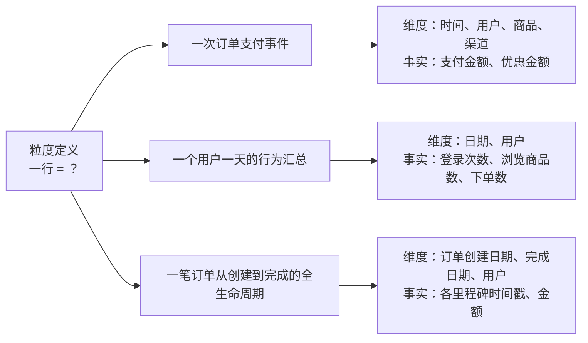
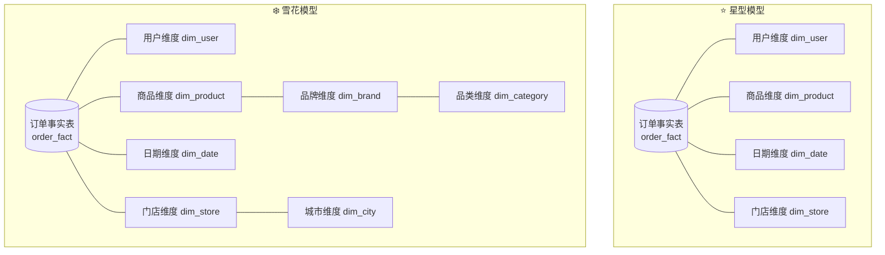
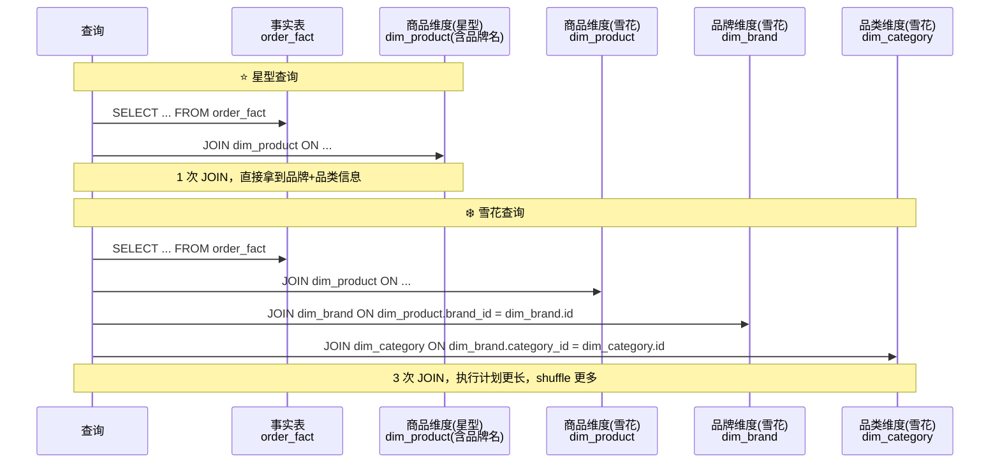
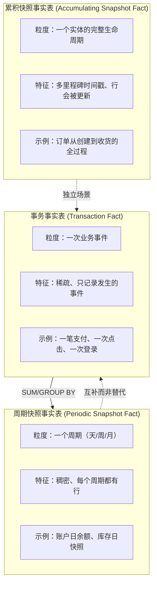
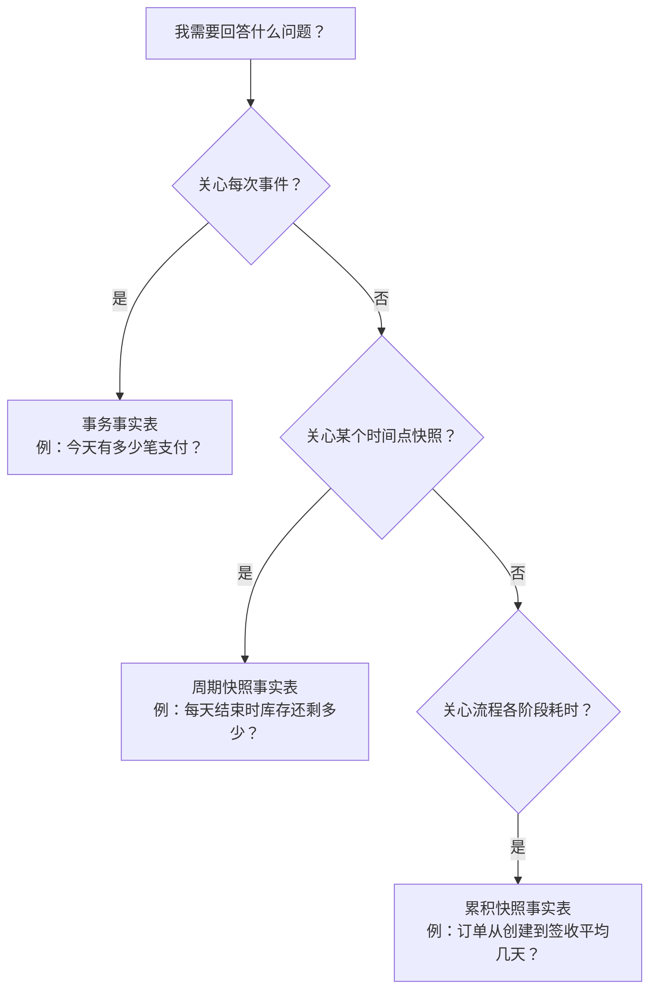
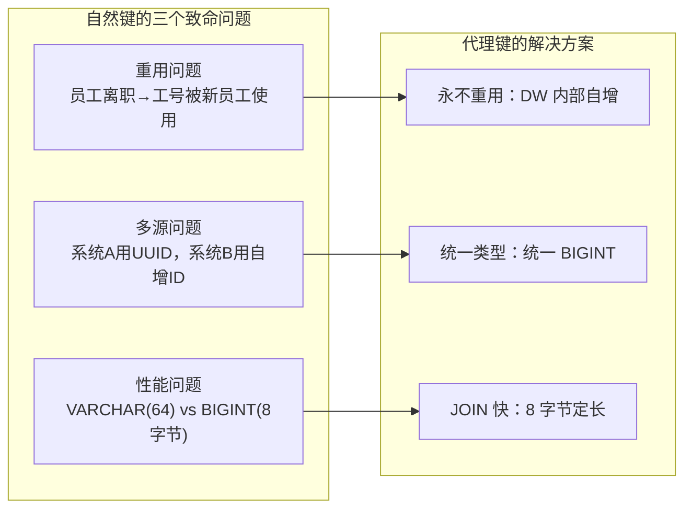
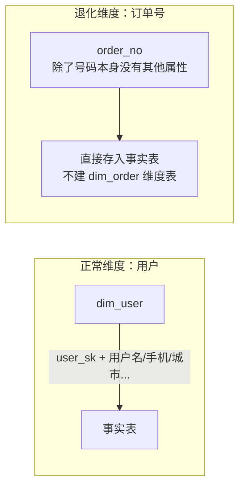
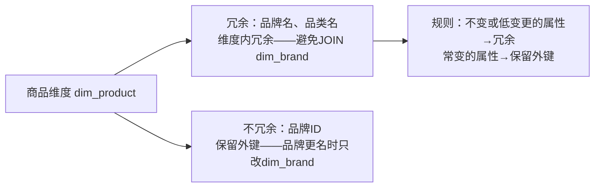

# 02 · 建模基础

> **本章要回答一个终极问题：拿到一堆业务数据后，怎么设计表结构才能让查询又快又准？**
>
> 建模是数仓的核心竞争力——同样的数据，建得好 50ms 出结果，建不好跑了 30 秒还没完。本章聚焦维度建模中最基础的构件：星型 vs 雪花、事实表类型、维度表设计原则。
>
> ```mermaid
> flowchart LR
>     A[粒度先行<br/>先定数据粒度] --> B[维度设计<br/>星型 vs 雪花]
>     A --> C[事实表设计<br/>类型选择]
>     B --> D[维度退化<br/>维度属性入事实表]
>     C --> D
>     D --> E[设计原则<br/>冗余适度 + 高扇入]
>     
>     F[事实表类型<br/>事务/周期快照/累积快照] -.->|独立理解| C
>     G[维度表设计细节<br/>代理键/SCD/层次] -.->|关联 L03| B
> ```
>
> **阅读建议**：§1-§3 是递进主干（粒度→维度→事实），§4-§5 是维度设计细节和原则总结。§3 的事实表三类型是面试高频题，需要能口述每种类型的适用场景。
>
> **前置依赖**：L01 的分层架构（理解 DWD 层的定位）。
>
> 覆盖原题：2, 3, 6, 16, 17, 28, 31, 37。

---

## 1. 粒度：建模的起点

### 一行数据代表什么？为什么建模要从"粒度"开始？

**粒度（Grain）是事实表中一行数据所代表的业务含义。所有建模决策都围绕粒度展开。**

Kimball 的第一条法则：**在确定维度之前，先确定粒度。** 因为维度是描述粒度的，事实是度量粒度的。如果粒度不清，维度会溢出、事实会重复。



**粒度三问（设计事实表前必须回答）：**

| 问题 | 示例回答 |
|------|---------|
| 一行代表什么业务事件？ | 一次用户点击、一笔订单支付、一个用户一天的行为 |
| 当前粒度能否满足所有分析需求？ | 如果需要"用户路径分析"，逐事件粒度才行，天汇总粒度不够 |
| 是否需要保留明细粒度的原始数据？ | DWD 保留明细，DWS 做汇总——不要用汇总代替明细 |

**粒度的核心权衡：越细 = 查询越灵活，但存储越大、查询越慢。**

??? tip "面试嘴替 — 粒度"
    **核心主张**：
    > "建模的第一步不是选星型还是雪花，而是问清楚'一行数据代表什么'。粒度定了，维度和事实就自然归位了。"

    **常见追问 & 防御**：
    - 追问："粒度和分区有什么关系？" → 答："粒度是行的含义（一行 = 一次事件 or 一天汇总），分区是行的物理组织方式（按 dt 分目录存储）。粒度决定了你能问什么，分区决定了你多快能问出来。"

    | 一般回答 | 优秀回答 |
    |---------|---------|
    | "粒度就是数据的精细程度。" | "粒度是建模的第一性原理：先确定一行代表什么业务事件，再决定维度怎么关联、事实怎么度量。粒度越细查询越灵活但越慢，粒度越粗查询越快但丢失细节。DWD 保留最细粒度做原子事实，DWS 按分析场景预聚合——这是分层的粒度哲学。" |

---

## 2. 星型模型 vs 雪花模型

### 星型模型和雪花模型的本质区别是什么？为什么星型更常用？

**星型模型：所有维度直接关联到中心事实表。雪花模型：维度表之间存在层级关联（子维度）。**



**对比表（面试必背）：**

| 维度 | 星型模型 | 雪花模型 |
|------|---------|---------|
| 结构 | 维度表直接关联事实表，**一层 JOIN** | 维度表可关联子维度，**多层 JOIN** |
| SQL 复杂度 | 简单：1 事实 + N 维度的简单 JOIN | 复杂：需要穿透子维度 |
| 查询性能 | **快**（JOIN 层数少，CBO 优化空间大） | 慢（多层 JOIN 增加执行计划复杂度） |
| 存储空间 | 大（维度表冗余：每个商品都重复存品牌名） | **小**（品牌标准化到 dim_brand） |
| 数据一致性 | 需应用层保证（改品牌名要更新所有相关商品的维度行） | 天然保证（改 dim_brand 一行即可） |
| ETL 复杂度 | **低**（扁平的维度映射） | 高（多层级维度加载需要串行） |
| 适用场景 | BI 报表、大部分分析场景 | 维度属性频繁变更且属性层次深的场景 |

### 为什么数仓中星型模型更常用？

**三个核心原因：**

1. **查询性能优先**：数仓的核心负载是分析查询，JOIN 越少越快。大宽表 + 一层维度 JOIN 是设计常态
2. **分析人员友好**：业务分析师不需要理解"品牌表→品类表→商品表"的层级关系，直接 `JOIN dim_product` 即可
3. **现代存储便宜**：存储冗余的成本远低于查询延迟的成本——用空间换时间是数仓的核心策略

**那雪花模型就一无是处吗？** 不。当维度属性层次很深（商品→三级品类→二级品类→一级品类），且品类的变更频率高时，雪花模型通过子维度表实现了归一化，修改一行品类名即可全局生效。

### 为什么星型查询更快而雪花更省存储？



??? example "SQL：星型模型建表示例"
    ```sql
    -- 星型模型：商品维度表直接包含品牌信息（冗余存储）
    CREATE TABLE dim_product (
        product_id      BIGINT    COMMENT '商品ID（代理键）',
        product_name    STRING    COMMENT '商品名称',
        brand_name      STRING    COMMENT '品牌名称（冗余）',
        category_name   STRING    COMMENT '品类名称（冗余）',
        price           DECIMAL(18,2) COMMENT '单价',
        supplier        STRING    COMMENT '供应商'
    ) COMMENT '商品维度表-星型'
    STORED AS PARQUET;

    -- 星型查询：一次 JOIN 解决
    SELECT 
        p.brand_name,
        COUNT(1) AS order_cnt,
        SUM(f.amount) AS total_amount
    FROM dwd_trade_order_fact f
    JOIN dim_product p ON f.product_id = p.product_id
    WHERE f.dt = '2024-01-15'
    GROUP BY p.brand_name;

    -- 雪花模型：品牌独立成子维度表
    CREATE TABLE dim_brand (
        brand_id        BIGINT    COMMENT '品牌ID',
        brand_name      STRING    COMMENT '品牌名称',
        category_id     BIGINT    COMMENT '所属品类ID'
    ) STORED AS PARQUET;

    CREATE TABLE dim_category (
        category_id     BIGINT    COMMENT '品类ID',
        category_name   STRING    COMMENT '品类名称',
        parent_id       BIGINT    COMMENT '父品类ID'
    ) STORED AS PARQUET;

    CREATE TABLE dim_product_snowflake (
        product_id      BIGINT    COMMENT '商品ID',
        product_name    STRING    COMMENT '商品名称',
        brand_id        BIGINT    COMMENT '品牌ID（外键，不再冗余品牌名）',
        price           DECIMAL(18,2) COMMENT '单价'
    ) STORED AS PARQUET;

    -- 雪花查询：需要穿透多层维度
    SELECT 
        b.brand_name,
        c.category_name,
        COUNT(1) AS order_cnt
    FROM dwd_trade_order_fact f
    JOIN dim_product_snowflake p ON f.product_id = p.product_id
    JOIN dim_brand b ON p.brand_id = b.brand_id
    JOIN dim_category c ON b.category_id = c.category_id
    WHERE f.dt = '2024-01-15'
    GROUP BY b.brand_name, c.category_name;
    ```

??? tip "面试嘴替 — 星型 vs 雪花"
    **核心主张**：
    > "星型模型用冗余换查询性能——维度表扁平化，事实表 JOIN 一次维度就拿到所有属性。雪花模型用范式化省存储——维度属性分层存储，但查询要多层 JOIN。数仓首选星型，因为存储便宜、查询时间贵。"

    **常见追问 & 防御**：
    - 追问："什么情况下用雪花？" → 答："维度属性频繁变更且层次结构很重要。比如零售行业，三级品类（食品→零食→薯片）的结构经常调整，用雪花只需改 dim_category 一行。还有一种是数据集市——从星型数仓往部门集市推时可能做局部范式化。"
    - 追问："星型模型的维度表是不是和关系型数据库的范式化矛盾？" → 答："恰恰相反，这是有意为之。OLTP 用范式化消除写异常，OLAP 用反范式化提升读性能。数仓的根本原则是'空间换时间'。"

    **绑定项目**：
    > "我的项目中维度建模全部采用星型模型：DIM_USER 维度表直接包含身份证号、注册渠道、用户等级等所有属性，DWD 层的事实表只需要 JOIN 一次 dim_user 就能拿到用户全貌。这种设计在 Flink 实时关联维表时也大有裨益——一次 Async I/O 就能拿到完整用户信息。"

    | 一般回答 | 优秀回答 |
    |---------|---------|
    | "星型是维度直接关联事实，雪花是维度再分层。" | "这是存储范式化和查询性能的经典权衡。星型用冗余换一次 JOIN 出结果，雪花用范式化省存储但多几次 JOIN。数仓选星型的原因很简单：1TB 磁盘 500 块，但查询慢 10 秒老板等不起。真正的问题是'冗余到什么程度'——后面我们讲的维度退化就是这个平衡点。" |

---

## 3. 事实表类型

### 事务事实表、周期快照事实表、累积快照事实表——分别解决什么问题？

**事实表按照"记录了什么样的度量时机"分为三种类型，这是在 DWD 层设计的核心决策。**



**三种事实表对比（面试高频，必须能脱口而出）：**

| 维度 | 事务事实表 | 周期快照事实表 | 累积快照事实表 |
|------|-----------|---------------|---------------|
| 粒度 | 一次业务事件 | 固定周期（天/周/月） | 一个实体的生命周期 |
| 数据密度 | 稀疏（有事件才有行） | 稠密（每个周期都有行） | 一行多列（多里程碑） |
| 是否更新 | **不更新**（只追加） | **不更新** | **会被更新**（里程碑推进） |
| 经典场景 | 每笔支付流水 | 每天结束时账户余额 | 订单创建→支付→发货→签收 |
| 事实列 | 交易金额、数量 | 期初/期末余额、日均 | 各里程碑时间戳、间隔天数 |
| 分析能力 | 任意时间窗口的聚合 | 固定周期点的状态 | 流程耗时分析、转化漏斗 |

### 三种类型怎么选？



**关键判断：**

- 如果问题形如"XX 时间内发生了多少次"→ 事务事实表
- 如果问题形如"某天结束时的状态"→ 周期快照事实表
- 如果问题形如"从 A 到 B 的平均耗时"→ 累积快照事实表

??? example "SQL：三种事实表建表示例"
    ```sql
    -- 1. 事务事实表：每笔支付事件
    CREATE TABLE dwd_trade_pay_fact (
        pay_id          BIGINT    COMMENT '支付ID',
        order_id        BIGINT    COMMENT '订单ID',
        user_id         BIGINT    COMMENT '用户ID',
        product_id      BIGINT    COMMENT '商品ID',
        pay_amount      DECIMAL(18,2) COMMENT '支付金额',
        pay_time        TIMESTAMP COMMENT '支付时间',
        channel         STRING    COMMENT '支付渠道'
    ) COMMENT '交易支付事务事实表'
    PARTITIONED BY (dt STRING)
    STORED AS PARQUET;
    -- 典型查询：SELECT COUNT(1), SUM(pay_amount) FROM ... WHERE dt BETWEEN ...

    -- 2. 周期快照事实表：每日库存快照
    CREATE TABLE dwd_inventory_daily_snapshot (
        product_id      BIGINT    COMMENT '商品ID',
        warehouse_id    BIGINT    COMMENT '仓库ID',
        begin_qty       BIGINT    COMMENT '期初库存',
        inbound_qty     BIGINT    COMMENT '入库数量',
        outbound_qty    BIGINT    COMMENT '出库数量',
        end_qty         BIGINT    COMMENT '期末库存'
    ) COMMENT '库存日快照事实表'
    PARTITIONED BY (dt STRING)
    STORED AS PARQUET;
    -- 注意：每天每个商品一行，即使库存无变化也有行（稠密）

    -- 3. 累积快照事实表：订单全生命周期
    CREATE TABLE dwd_trade_order_accum (
        order_id            BIGINT    COMMENT '订单ID',
        user_id             BIGINT    COMMENT '用户ID',
        create_time         TIMESTAMP COMMENT '创建时间',
        pay_time            TIMESTAMP COMMENT '支付时间',
        ship_time           TIMESTAMP COMMENT '发货时间',
        sign_time           TIMESTAMP COMMENT '签收时间',
        create_to_pay_hours  DOUBLE   COMMENT '创建→支付 耗时(小时)',
        pay_to_ship_hours    DOUBLE   COMMENT '支付→发货 耗时(小时)',
        ship_to_sign_hours   DOUBLE   COMMENT '发货→签收 耗时(小时)',
        current_status      STRING    COMMENT '当前状态'
    ) COMMENT '订单累积快照事实表'
    STORED AS PARQUET;
    -- 注意：这一行会被 UPDATE！支付后回刷 pay_time，发货后回刷 ship_time
    ```

??? tip "面试嘴替 — 事实表类型"
    **核心主张**：
    > "事实表有三种：事务型记录每次事件（流水）、周期快照型记录每个时间点的状态（库存）、累积快照型追踪一个实体的完整生命周期（订单漏斗）。选择的标准不是谁更'高级'，而是你要回答什么问题。"

    **常见追问 & 防御**：
    - 追问："事务事实表和周期快照事实表能否互相替代？" → 答："不能。事务型可以算出快照（累积流水），但查询成本高——查第 100 天的余额需要从第 1 天开始累加。快照型直接给出第 100 天的余额，但无法回答'第 50 到 60 天发生了什么'。两者互补而非替代。"
    - 追问："累积快照表需要 UPDATE，数仓不是应该只追加吗？" → 答："累积快照是数仓少有的可更新场景。用 MERGE 或 INSERT OVERWRITE 按主键覆盖整行——这里更新的是同一个业务对象的新状态，不是修改历史数据。Iceberg/Hudi 让这种更新变得可控。"

    **绑定项目**：
    > "我项目中使用的是事务事实表 + 周期快照表的组合：Flink 实时链路在 DWD 层写入事务事实表（每次 AI 查询事件一行），然后按 5 分钟/1 小时在 DWS 层生成周期快照汇总表。累积快照表当前项目没用，但在面试中我可以讲订单场景的用法。"

    | 一般回答 | 优秀回答 |
    |---------|---------|
    | "事实表有三种类型：事务、快照、累积快照。" | "三种事实表不是按'复杂度'分的，是按'你要回答什么问题'分的。想回答'今天有多少笔交易'→ 事务型；想回答'今天结束时库存剩多少'→ 周期快照型；想回答'从下单到收货平均几天'→ 累积快照型。一个成熟的数仓通常三种都建，互不替代。" |

---

## 4. 维度表设计

### 维度表有哪些关键设计要素？代理键和自然键怎么选？

**维度表不只是"存个名字"——它是分析的入口，设计质量直接影响查询体验。**

**维度表的五个核心要素：**

| 要素 | 说明 | 示例 |
|------|------|------|
| **代理键（Surrogate Key）** | 无业务含义的自增 ID，DW 内部使用 | `user_sk` BIGINT 自增 |
| **自然键（Natural Key）** | 业务系统的主键 | `user_id` VARCHAR（可能重复、可能重用） |
| **SCD 处理列** | 支持维度变更追踪 | `start_date`, `end_date`, `is_current` |
| **退化维度** | 直接放到事实表中的维度属性 | 订单号、发票号 |
| **层次结构** | 维度内的父子关系 | 一级品类→二级品类→三级品类 |

### 为什么一定要有代理键？



**维度表设计的三个原则：**

1. **高扇入（High Fan-in）**：一个维度可以被多个事实表引用。用户维度被订单、支付、浏览、收藏等多个事实表共享——这是维度建模可复用性的核心
2. **一致性维度（Conformed Dimension）**：全公司的"用户"应使用统一的维度定义。不能市场部的用户维度和财务部的用户维度是两个口径
3. **冗余适度**：星型模型中，维度表应包含所有关联属性，包括从其他维度"拉过来"的属性（如商品维度包含品牌名），避免查询时多次 JOIN

??? example "SQL：代理键维度表设计"
    ```sql
    -- 用户维度表（带代理键 + SCD2 支持）
    CREATE TABLE dim_user (
        user_sk         BIGINT    COMMENT '代理键（DW内部自增，永不重用）',
        user_id         STRING    COMMENT '自然键（业务系统用户ID）',
        user_name       STRING    COMMENT '用户名',
        phone           STRING    COMMENT '手机号',
        register_channel STRING   COMMENT '注册渠道：APP/WEB/MINI_PROGRAM',
        city            STRING    COMMENT '城市',
        user_level      STRING    COMMENT '用户等级：NORMAL/SILVER/GOLD',
        start_date      STRING    COMMENT 'SCD2：生效日期',
        end_date        STRING    COMMENT 'SCD2：失效日期（9999-12-31 表示当前有效）',
        is_current      INT       COMMENT 'SCD2：是否当前版本 1=是 0=否'
    ) COMMENT '用户维度表'
    STORED AS PARQUET;

    -- 与事实表的关联：事实表始终使用代理键
    CREATE TABLE dwd_order_fact (
        order_id        BIGINT    COMMENT '订单ID',
        user_sk         BIGINT    COMMENT '用户代理键（关联dim_user.user_sk）',
        product_sk      BIGINT    COMMENT '商品代理键',
        amount          DECIMAL(18,2) COMMENT '金额',
        order_time      TIMESTAMP COMMENT '下单时间'
    ) STORED AS PARQUET;
    ```

??? tip "面试嘴替 — 维度表设计"
    **核心主张**：
    > "维度表的精髓是代理键 + 一致性维度。代理键解决自然键的重用和多源问题，一致性维度保证全公司用同一把尺子量数据。"

    **常见追问 & 防御**：
    - 追问："代理键的好处是什么？直接用业务 ID 不行吗？" → 答："三个风险：① 业务系统可能删除后重用 ID（离职员工工号给新人）；② 多源系统 ID 不兼容；③ VARCHAR 比 BIGINT JOIN 慢。代理键是数仓内部的身份证号，永不重用。"
    - 追问："你和 SCD 的关系是什么？" → 答："代理键是 SCD2 的前提——自然键 user_id=1001 对应多个代理键 user_sk=1, 2, 3（每次维度变更生成新代理键），事实表通过代理键精确关联到变更时的维度版本。"

    | 一般回答 | 优秀回答 |
    |---------|---------|
    | "维度表存维度属性，事实表存度量值。" | "维度表是分析的'入口'——它的设计质量决定了分析能走多深。代理键保证 JOIN 性能和可追溯性，一致性维度保证跨部门口径统一，冗余适度保证查询效率。所有这些设计决策都服务于一个目标：让分析查询能以最少的 JOIN 拿到最多维度的信息。" |

---

## 5. 维度退化

### 维度退化是什么？为什么要把维度属性搬到事实表里？

**维度退化（Degenerate Dimension）是把那些"看起来是维度，但除了 ID 没有任何其他属性"的标识号直接放到事实表中，不建独立的维度表。**

**最典型的例子：订单号**



| 特征 | 正常维度 | 退化维度 |
|------|---------|---------|
| 有独立属性？ | ✅ 有很多（用户名、城市、等级…） | ❌ 只有 ID 本身 |
| 需要代理键？ | ✅ 需要 | ❌ 不需要 |
| 建独立维度表？ | ✅ 必须 | ❌ 不建，直接放事实表 |
| 典型例子 | 用户、商品、时间、门店 | **订单号、发票号、运单号** |

**为什么退化维度不建维度表？** 因为订单号除了自身没有任何描述属性——它不是"订单维度"（订单状态、金额等属于事实），只是一个用于追溯的标识符。建一个只有 ID 列的表没有意义，凭空多一次 JOIN。

??? tip "面试嘴替 — 维度退化"
    **核心主张**：
    > "维度退化不是建模瑕疵，而是有意的设计决策：当一个维度只有 ID、没有属性，就别建表了，直接放到事实表里——省一次 JOIN，查询更快。"

    **常见追问 & 防御**：
    - 追问："订单号不建维度表，那怎么查订单相关的属性？" → 答："订单的属性（金额、状态、时间）本身就在事实表里——它们是度量。查询只需要事实表本身的数据，不需要额外 JOIN。按订单号做下钻分析时，订单号只是 GROUP BY 的一个字段。" 
    - 追问："那运单号、发票号呢？" → 答："同样是退化维度——它们都只有标识作用，没有描述属性。全部直接放入事实表。"

    | 一般回答 | 优秀回答 |
    |---------|---------|
    | "维度退化就是把维度属性放到事实表里。" | "退化维度是 Kimball 维度建模的精妙设计之一：识别那些'看起来是维度实际上只是标识符'的字段，不给它们建表，直接放事实表。判断标准很简单：这个维度除了 ID，还有其他分析需要的属性吗？没有 → 退化；有 → 建维度表。订单号、发票号、运单号——三大经典退化维度。" |

---

## 6. 维度建模设计原则

### 把前面几节串起来——维度建模有哪些铁律？

**Kimball 维度建模的四条设计原则（面试时能说出来说明你真的理解了）：**

1. **粒度先行（Grain First）**：在确定任何维度之前，先明确定义一行数据的粒度
2. **高扇入维度（High Fan-in）**：一个维度被多个事实表共享——这是维度建模复用性的来源
3. **退化维度谨慎使用**：只有无属性的标识符才退化，不要把有属性的维度也"退化"了
4. **冗余适度**：星型模型的核心就是适度冗余——宁可冗余存储，也不要查询时多层 JOIN

| 原则 | 违反的例子 | 后果 |
|------|----------|------|
| 粒度先行 | 没想清楚粒度就开始建表 | 维度溢入事实、事实粒度过粗无法下钻 |
| 高扇入 | 每个事实表建自己的用户维度 | 用户口径不一致，跨主题分析无法进行 |
| 谨慎退化 | 把有 20 个属性的"品牌"退化到事实表 | 事实表膨胀，品牌属性变更需要回刷全表 |
| 冗余适度 | 走到极端——所有表全部范式化 | 每次查询 5+ 次 JOIN，性能崩溃 |

**什么叫"适度"冗余？**



??? tip "面试嘴替 — 建模原则"
    **核心主张**：
    > "建模有四个铁律：粒度先行、高扇入、退化维度谨慎、冗余适度。这四个原则是互锁的——粒度定了维度范围就定了，高扇入决定了维度的复用价值，退化维度决定要不要建表，冗余适度决定维度表长什么样。"

    **绑定项目**：
    > "我的项目严格遵守这四条原则：建表前先文档化粒度定义（DWD 层'一次 AI 查询事件'，DWS 层'一个用户一个时间段'），用户/模型/会话等维度被多个事实表高扇入复用，查询 ID 等退化维度直接入事实表，用户和模型维度表冗余存储了注册渠道和模型名称等低变更属性——这就是'适度冗余'。"

    | 一般回答 | 优秀回答 |
    |---------|---------|
    | "建模就是设计表结构。" | "建模不是凭空画图，是从业务问题出发的逆向工程：你想回答什么问题 → 需要什么粒度 → 粒度对应什么维度和事实 → 维度怎么组织（星型还是雪花）→ 哪些维度可以退化 → 哪些属性可以冗余。每一步都有明确的取舍逻辑，不是'我觉得这样建好'。" |

---

## 面试串讲（本章连贯表述）

> "建模是数仓的核心竞争力——面试官聊到建模，最想听到的不是你背定义，而是你脑子里有一个清晰的决策树：拿到业务之后，先问粒度——一行代表什么事件？再问维度——主体是谁、时间是什么、什么东西、在哪发生？然后问事实——度量什么？最后决定表结构——星型还是雪花、哪些维度退化、冗余到什么程度。"

> "事实表三类型的区分是建模模块的面试高频题。一句话讲清：事务型记录每次事件（支付流水），周期快照型记录每个时间点的状态（日终库存），累积快照型追踪一个对象的全过程（订单漏斗）。三种表不是互斥的，一个数仓通常三种都建——事务表查明细，快照表看趋势，累积表做漏斗分析。"

---

## 自测 Q&A

<details>
<summary><b>Q：什么时候用星型模型，什么时候用雪花模型？</b></summary>

A：数仓首选星型（一层 JOIN、查询快、分析人员友好）。雪花模型仅当维度属性层次深且频繁变更时使用（如品类层级结构经常调整）——用一次范式化换全局一致性。

</details>

<details>
<summary><b>Q：三种事实表的区别？各举一个经典场景。</b></summary>

A：事务事实表：每次事件一行（支付流水），不更新；周期快照事实表：每个周期一行（日终库存），稠密不更新；累积快照事实表：一个对象一行多列（订单全生命周期），会被更新。选型标准：看你要回答什么问题——判断标准而非复杂度。

</details>

<details>
<summary><b>Q：代理键为什么要用？不用代理键会有什么问题？</b></summary>

A：三个问题：① 自然键可能重用（离职员工工号→新人），代理键永不重用；② 多源系统 ID 不兼容（UUID vs 自增），代理键统一 BIGINT；③ VARCHAR JOIN 比 BIGINT 慢，代理键 8 字节定长。代理键也是 SCD2 的前提——同一自然键多版本通过不同代理键区分。

</details>

<details>
<summary><b>Q：什么是维度退化？怎么判断一个维度要不要退化？</b></summary>

A：维度退化指把只有 ID 没有属性的"维度"直接放事实表不建维度表。判断标准：这个维度除了 ID 有其他分析属性吗？没有→退化；有→建表。经典退化维度：订单号、发票号、运单号。

</details>

<details>
<summary><b>Q：维度建模的四条核心设计原则是什么？</b></summary>

A：① 粒度先行——所有决策以粒度为准绳；② 高扇入——维度被多个事实表共享；③ 退化维度谨慎——只有无属性标识符才退化；④ 冗余适度——低变更属性冗余、高变更属性保留外键。

</details>

<details>
<summary><b>Q：为什么"不能跳层"也适用于建模？</b></summary>

A：跳层 = 粒度跳变。从 ODS 的"每条记录"直接跳到 DWS 的"每天汇总"，中间没有 DWD 的清洗和标准化，汇总出来的数据可能口径完全错误。建模也是：粒度不先定好就直接设计维度→维度可能溢入事实→查询得出的结果没人信。

</details>

---

## 推荐源
- Kimball《数据仓库工具箱》第三版，第 1-4 章（粒度、维度、事实表）
- 《阿里巴巴大数据之路》第 4 章——维度建模实践
- Kimball Group 设计技巧：<https://www.kimballgroup.com/data-warehouse-business-intelligence-resources/kimball-techniques/dimensional-modeling-techniques/>

!!! question "卡住了？"
    多值维度（一个商品多个标签怎么建模？）、桥接表处理多对多维度关系、Data Vault vs 星型模型——任意点直接问老师展开或出题。
