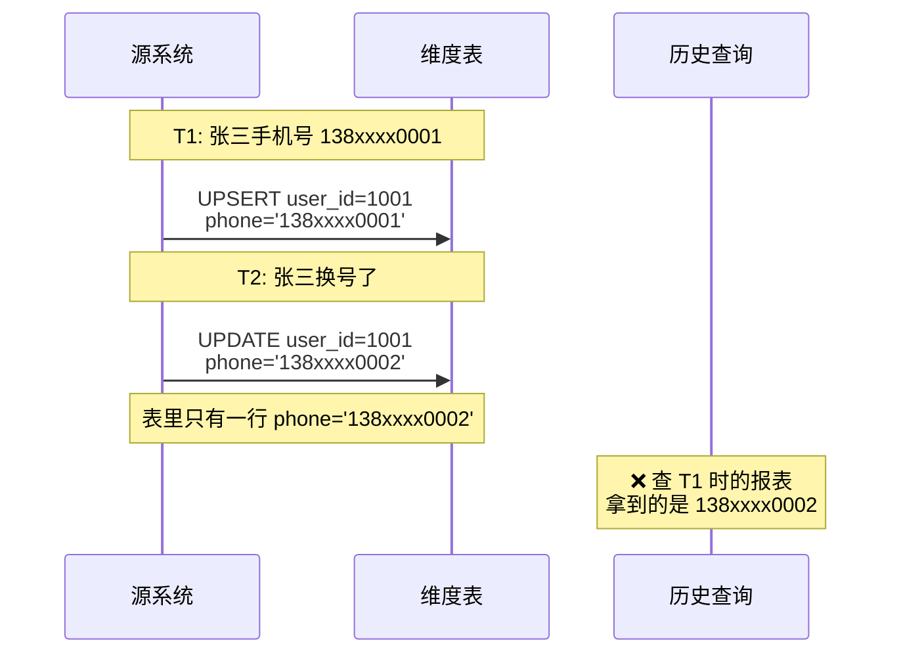
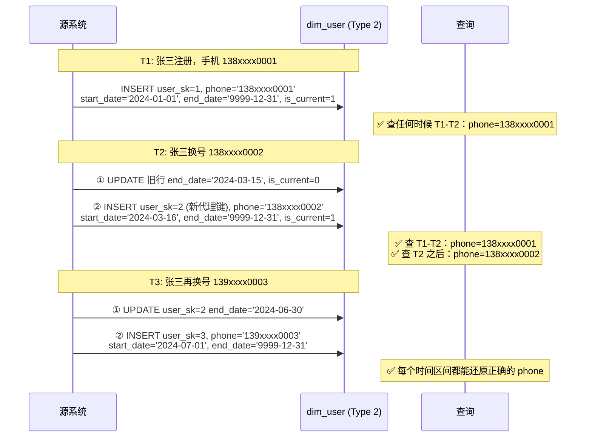
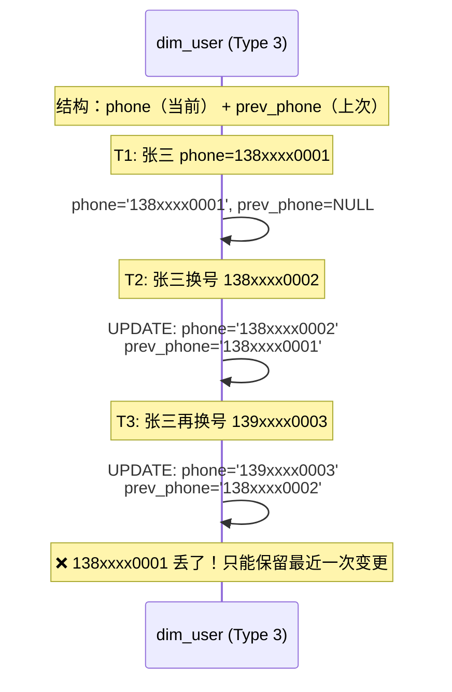
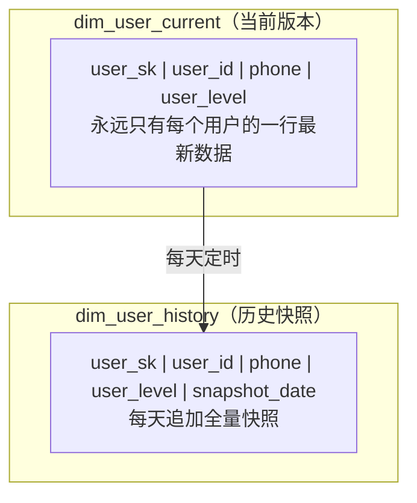
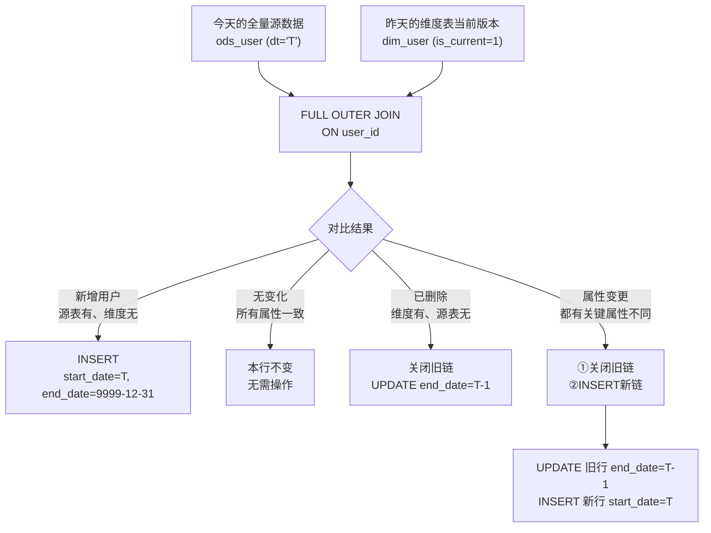
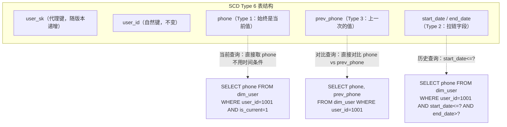

# 03 · 缓慢变化维度(SCD)

> **本章要回答一个终极问题：用户的手机号改了、商品的价格调了、部门的名称变了——数仓怎么在不丢掉历史的前提下，正确回答"当时是什么"？**
>
> SCD（Slowly Changing Dimension）是数仓面试中仅次于分层架构的第二高频考点。面试官不会只问"SCD 有几种类型"，他一定会追问"Type 2 拉链表的 SQL 怎么写"和"为什么不用 Type 3 而要上 Type 2"。本章从原理到 SQL，帮你把 SCD 吃透。
>
> ```mermaid
> flowchart LR
>     A["维度属性变更"] --> B{变更了要追溯历史吗？}
>     B -->|"❌ 不需要<br/>覆盖即可"| C["SCD Type 1<br/>直接 UPDATE"]
>     B -->|"✅ 需要<br/>保留历史"| D{只需知道<br/>变更前一个值？}
>     D -->|"✅ 是<br/>只要前一版本"| E["SCD Type 3<br/>加 prev_ 列"]
>     D -->|"❌ 不<br/>需要完整历史"| F["SCD Type 2<br/>拉链表"]
>     
>     F -.->|组合型| G["SCD Type 6<br/>Type1 + Type2 + Type3 的混合"]
> ```
>
> **阅读建议**：§1-§4 按 Type 顺序递进（从简单到复杂），§5 是生产级拉链表的完整 SQL 实战（最重要），§6 是 Type 6 作为高级话题。§5 的拉链 SQL 建议手写两遍——面试可能会让你在白板上写。
>
> **前置依赖**：L02 的维度表设计（代理键、SCD 处理列）、维度建模原则。
>
> 覆盖原题：8, 12, 22, 26, 39。

---

## 1. SCD Type 1：覆盖

### 改了就是改了——Type 1 的设计哲学是什么？

**SCD Type 1 是"不追溯历史"：维度属性变更时，直接用新值覆盖旧值。历史查询只能看到当前最新值。**



**Type 1 的实现：**

```sql
-- Type 1：直接用新值覆盖，一条 UPDATE 搞定
UPDATE dim_user
SET phone = '138xxxx0002', user_level = 'GOLD'
WHERE user_id = '1001';
-- 历史数据永久丢失，T1 时刻的 phone 再也查不回来
```

**Type 1 的适用场景：**

| 场景 | 原因 |
|------|------|
| 纠正性变更 | 用户姓名登记错误→修正，旧值是错的，不需要保留 |
| 格式化变更 | 地址从"北京市海淀区中关村大街1号"→标准化为"北京/海淀/中关村大街1号" |
| 对分析无影响的变更 | 用户备注、标签（分析不关心历史） |

**Type 1 的风险**：所有关联的事实表在 Type 1 变更后，回看历史报表时拿到的都是"当前维度值"，导致历史事实与维度不匹配。这是很多数据问题的根源。

??? tip "面试嘴替 — SCD Type 1"
    **核心主张**：
    > "Type 1 就是覆盖——简单粗暴，但历史会丢失。只适用于纠正性变更（旧值是错的）和对分析无影响的属性变更。"

    **常见追问 & 防御**：
    - 追问："Type 1 的风险是什么？" → 答："回看历史报表时，维度信息是'当前的'而非'当时的'。比如用户去年是普通会员、今年升黄金会员，用 Type 1 的话，查去年的数据也显示黄金会员→结论全错。"

    | 一般回答 | 优秀回答 |
    |---------|---------|
    | "Type 1 就是直接更新覆盖。" | "Type 1 简单但危险——它把维度'冻结'在当前时刻。只适合纠正性变更和与历史分析无关的属性。如果一个属性需要'当时是什么就是什么'的查询能力，Type 1 不够，上 Type 2。" |

---

## 2. SCD Type 2：拉链表

### 如何保留完整的变更历史？拉链表的 start_date / end_date / is_current 怎么设计？

**SCD Type 2 是数仓的"时光机"：每次维度变更，不修改旧行，而是插入新行并标记生效时间区间。这样任何历史时刻的查询都能还原当时的维度状态。**



**Type 2 的三列核心控制字段：**

| 字段 | 含义 | 示例 |
|------|------|------|
| `start_date` | 该版本生效日期 | 2024-03-16 |
| `end_date` | 该版本失效日期 | 2024-06-30 或 9999-12-31（当前有效） |
| `is_current` | 是否当前版本 | 1=当前, 0=历史 |

**Type 2 查询模式——每个查询都要加时间条件：**

```sql
-- 查当前值：is_current = 1
SELECT * FROM dim_user WHERE user_id = '1001' AND is_current = 1;

-- 查历史某一天的值：start_date <= 查询日期 < end_date
SELECT * FROM dim_user 
WHERE user_id = '1001' 
  AND start_date <= '2024-05-01' 
  AND '2024-05-01' < end_date;

-- 查事实表关联——关键：事实表的日期决定关联哪个维度版本
SELECT 
    f.order_id,
    f.amount,
    u.user_name,
    u.phone  -- 这是下单时刻的手机号！
FROM dwd_order_fact f
JOIN dim_user u ON f.user_sk = u.user_sk;
-- 注意：这里用代理键 JOIN，而不是 start_date/end_date！
-- 因为 ETL 时已经用 start_date/end_date 匹配到正确的 user_sk 写入了事实表
```

**关键点：事实表使用代理键（user_sk）而非自然键（user_id）关联维度表。ETL 时已经用 start_date/end_date 确定了应该用哪个版本的 user_sk。**

??? tip "面试嘴替 — SCD Type 2"
    **核心主张**：
    > "Type 2 的核心思想是'不改旧行、插入新行'。用 start_date/end_date 标记版本的生命周期，用 is_current 标记当前版本。查询时通过时间条件还原任意历史时刻的维度快照。"

    **常见追问 & 防御**：
    - 追问："Type 2 会不会让维度表膨胀得很厉害？" → 答："会，但可控。只对频繁变更且需要追溯的维度属性做 Type 2，稳定属性（性别、出生日期）不需要 Type 2。另外可以定期归档过期版本（end_date < '3 年前'）到冷存储。"
    - 追问："9999-12-31 这个魔法值有什么讲究？" → 答："表示'至今仍有效'，方便查询：`WHERE '查询日期' < end_date` 统一处理当前版本和历史版本，不需要特殊逻辑。也可以不用魔法值而用 IS NULL 表示当前有效，但 NULL 在分区和索引上不太友好。"

    | 一般回答 | 优秀回答 |
    |---------|---------|
    | "Type 2 就是每次变更加一条新记录，用日期标记有效区间。" | "Type 2 是数仓的'时间机器'——它是唯一能完整回答'当时是什么'的方案。代价是维度表膨胀和 ETL 复杂度上升。实践中会对变更频率分级：高频变更属性用 Type 2，低频/不变属性用 Type 1。代理键是 Type 2 的基石——自然键 user_id 不变，代理键 user_sk 随版本递增。" |

---

## 3. SCD Type 3：加列

### "我只需要知道上一次是什么"——Type 3 怎么用？

**SCD Type 3 是在维度表上增加一个 `prev_xxx` 列，只保留前一个值。适合"只关心变更前是什么"的场景。**



**Type 3 vs Type 2 对比：**

| 维度 | Type 2 | Type 3 |
|------|--------|--------|
| 历史追溯深度 | 完整历史，全版本保留 | 只保留当前 + 上一个值 |
| 存储膨胀 | 行数 × 变更次数 | 不变，只多一列 |
| 查询复杂度 | 需要时间条件 | 不需要，直接取列 |
| 更新操作 | INSERT 新行 + UPDATE 旧行 | UPDATE 当前行 |
| 适用场景 | "过去任意一天的用户等级是什么" | "用户上次的部门是哪个" |

**Type 3 的致命缺陷**：只能保留最近一次变更。如果 T3 时刻查询 T1 时刻的值——拿不到。这也是为什么面试官会更关注 Type 2。

??? tip "面试嘴替 — SCD Type 3"
    **核心主张**：
    > "Type 3 是 Type 1 和 Type 2 的折中方案——加一列存前一个值。实现简单但历史深度只有 1，三次变更后就无能为力。"

    **常见追问 & 防御**：
    - 追问："什么场景用 Type 3 而不是 Type 2？" → 答："业务方明确说'我们只需要对比当前和上一个'，比如用户上期和本期的会员等级对比。如果将来可能需要更多历史，宁可现在就上 Type 2——事后从 Type 3 迁移到 Type 2 成本巨大。"

    | 一般回答 | 优秀回答 |
    |---------|---------|
    | "Type 3 加列存上一个值。" | "Type 3 是一个过渡方案——实现成本低但天花板也低。只加一列，历史深度=1。除非你 100% 确定只需要对比'上次'，否则迟早要迁到 Type 2。我的建议：除非是极低频变更的属性（如婚姻状态），否则直接 Type 2。" |

---

## 4. SCD Type 4：快照表 + 当前表分离

### 如果不想维护 start_date/end_date，还有其他办法保留历史吗？

**SCD Type 4 使用两张表分离当前和历史：一张"当前维度表"永远只有最新版本（Type 1），一张"历史快照表"定期追加全量快照。**



**Type 4 的优缺点：**

| 优点 | 缺点 |
|------|------|
| 逻辑简单，当前表就是 Type 1，不需要 UPDATE end_date | 存储极大膨胀（每天全量快照） |
| 历史查询不需要时间条件（直接按 snapshot_date 过滤） | 非变更日也全量快照——大量冗余 |
| 当前表查询性能好（没有历史行） | 不如 Type 2 精确（快照是天的粒度，不是时刻） |

??? tip "面试嘴替 — SCD Type 4"
    **核心主张**：
    > "Type 4 是粗粒度的 Type 2——用全量快照代替增量拉链，牺牲存储换取简单。适合维度行数不大但对历史有需求的场景。"

    **常见追问 & 防御**：
    - 追问："Type 4 和 Type 2 怎么选？" → 答："维度行数小（< 100 万行）且变更频率低→ Type 4 简单可用。维度行数大或变更频繁→ Type 2 存储效率高得多。"

---

## 5. Type 2 生产级拉链 SQL（核心实战）

### 面试官让你写拉链表的 ETL SQL，怎么写？

**拉链表的核心 ETL 逻辑：对每天的全量源数据，和昨天的维度表做 FULL OUTER JOIN，识别新增、变更、无变化三种情况。**



??? example "SQL：Type 2 拉链表完整 ETL（Hive 版）"
    ```sql
    -- ============================================================
    -- SCD Type 2 拉链表日增量 ETL
    -- 作用：根据今天的全量源数据，更新维度表的拉链
    -- 表结构：
    --   dim_user: user_sk, user_id, user_name, phone, user_level,
    --             start_date, end_date, is_current
    -- ============================================================

    -- Step 1：标记变更——昨天 vs 今天的全量对比
    WITH yesterday AS (
        SELECT * 
        FROM dim_user 
        WHERE is_current = 1  -- 只取昨天的当前版本
    ),
    today AS (
        SELECT * 
        FROM ods_user_full 
        WHERE dt = '${today}'   -- 今天的全量快照
    ),
    -- Step 2：FULL OUTER JOIN 识别变更类型
    comparison AS (
        SELECT
            -- 处理新增和匹配上的记录
            COALESCE(t.user_id, y.user_id)                          AS user_id,
            NVL(t.user_name, y.user_name)                           AS user_name,
            NVL(t.phone, y.phone)                                   AS phone,
            NVL(t.user_level, y.user_level)                         AS user_level,
            -- 关键：记录旧链的 user_sk（关闭旧链用）
            y.user_sk                                               AS old_user_sk,
            -- 变更标记
            CASE 
                WHEN t.user_id IS NULL          THEN 'DELETE'       -- 源表已无此用户
                WHEN y.user_id IS NULL          THEN 'INSERT'       -- 新用户
                WHEN t.phone  != NVL(y.phone, '')  
                  OR t.user_level != NVL(y.user_level, '') THEN 'UPDATE'  -- 属性变更
                ELSE 'NONE'                                         -- 无变化
            END AS change_type
        FROM today t
        FULL OUTER JOIN yesterday y ON t.user_id = y.user_id
    )
    -- Step 3：处理旧链——关闭已变更/已删除用户的旧拉链
    INSERT INTO dim_user_inc (user_sk, user_id, user_name, phone, 
                               user_level, start_date, end_date, is_current, op_type)
    SELECT
        old_user_sk,
        user_id,
        user_name,
        phone,
        user_level,
        '${yesterday}'       AS start_date,
        '${yesterday}'       AS end_date,     -- 旧链在昨天失效
        0                     AS is_current,   -- 标记为非当前
        'CLOSE'              AS op_type
    FROM comparison
    WHERE change_type IN ('UPDATE', 'DELETE')
      AND old_user_sk IS NOT NULL
    UNION ALL
    -- Step 4：新增新链——INSERT 新增用户，UPDATE 变更用户的新版本
    SELECT
        -- 新代理键由自增序列生成（这里用 ROW_NUMBER + 最大 user_sk）
        (SELECT MAX(user_sk) FROM dim_user) 
            + ROW_NUMBER() OVER (ORDER BY user_id)  AS user_sk,
        user_id,
        user_name,
        phone,
        user_level,
        '${today}'            AS start_date,     -- 新链从今天生效
        '9999-12-31'          AS end_date,
        1                      AS is_current,
        CASE 
            WHEN change_type = 'INSERT' THEN 'INSERT'
            WHEN change_type = 'UPDATE' THEN 'NEW_VERSION'
        END AS op_type
    FROM comparison
    WHERE change_type IN ('INSERT', 'UPDATE');

    -- Step 5：MERGE 到主表（简化版：INSERT OVERWRITE 分区覆盖）
    INSERT OVERWRITE TABLE dim_user
    SELECT user_sk, user_id, user_name, phone, user_level, 
           start_date, end_date, is_current
    FROM (
        -- 未变更的旧行保持不变
        SELECT user_sk, user_id, user_name, phone, user_level,
               start_date, end_date, is_current
        FROM dim_user
        WHERE NOT (is_current = 1 AND user_id IN (
            SELECT user_id FROM comparison WHERE change_type IN ('UPDATE', 'DELETE')
        ))
        UNION ALL
        -- 新增的增量行
        SELECT user_sk, user_id, user_name, phone, user_level,
               start_date, end_date, is_current
        FROM dim_user_inc
    ) t;

    -- Step 6：查询验证——查指定日期的维度快照
    SELECT user_sk, user_id, user_name, phone, user_level
    FROM dim_user
    WHERE user_id = '1001'
      AND start_date <= '2024-06-15'
      AND end_date > '2024-06-15';
    ```

??? tip "面试嘴替 — 拉链表 ETL"
    **核心主张**：
    > "拉链表的核心是 FULL OUTER JOIN + 识别变更类型。每天拿全量源数据和昨天的当前版本做比较，识别出新增/变更/删除/不变四种情况，新增和变更 INSERT 新链并关闭旧链，删除关闭旧链。"

    **常见追问 & 防御**：
    - 追问："如果源表没有全量快照怎么办？" → 答："用 CDC（binlog）做增量更新。每次变更事件到来时，拿到变更前的旧值和变更后的新值，关闭旧链 + 插入新链。这种方式比全量对比更实时，但需要保证 CDC 不丢消息。"
    - 追问："拉链表膨胀怎么办？" → 答："两个策略：① 只对需要追溯的属性做 Type 2（如用户等级），稳定属性继续 Type 1；② 定期归档历史版本到冷存储（end_date < 'N 年前'），减少主表行数。"
    - 追问："为什么用 FULL OUTER JOIN 而不是 LEFT JOIN？" → 答："LEFT JOIN 只能发现新增和变更，无法发现删除——源表不再有这个用户时，在 LEFT JOIN 中这一行也是 NULL，无法区分'属性无变化'和'用户已删除'。"

    **绑定项目**：
    > "在我的项目中，用户维度和店铺维度都使用了 SCD Type 2 管理。每天 T+1 离线链路拿到 MySQL 业务库的全量用户快照，和 dim_user 的当前版本做 FULL OUTER JOIN，识别变更后执行拉链更新。DWD 层的事实表在写入时通过 user_sk 关联，确保每条事实记录的维度信息都是'当时的值'。"

    | 一般回答 | 优秀回答 |
    |---------|---------|
    | "Type 2 就是拉链表，用 start_date 和 end_date 标记有效期。" | "拉链表的 ETL 有四步：FULL OUTER JOIN 对比→识别变更类型→关闭旧链（UPDATE end_date）→插入新链（INSERT start_date=T）。核心难点不在 SQL 语法，在分区策略（拉链表不分 dt 分区，否则 JOIN 要跨所有分区）和代理键生成（变更时新行要分配新的 user_sk）。" |

---

## 5. SCD Type 6：Type 1 + Type 2 + Type 3 的混合体

### 既要当前值快，又要历史值全，还要能对比——Type 6 怎么做到的？

**SCD Type 6 在一张表上同时支持 Type 1（覆盖当前值列）、Type 2（完整历史链）、Type 3（上一值列）。**



**Type 6 示例——张三换号三次：**

| user_sk | user_id | phone (Type1) | prev_phone (Type3) | start_date | end_date | is_current |
|---------|---------|---------------|--------------------|------------|----------|------------|
| 1 | 1001 | 139xxxx0003 | NULL | 2024-01-01 | 2024-03-15 | 0 |
| 2 | 1001 | 139xxxx0003 | 138xxxx0001 | 2024-03-16 | 2024-06-30 | 0 |
| 3 | 1001 | 139xxxx0003 | 138xxxx0002 | 2024-07-01 | 9999-12-31 | 1 |

注意：所有历史行的 `phone` 都是**当前最新值**（Type 1 回刷），`prev_phone` 才是该版本时的上一个值。

**Type 6 的权衡：**

| 能力 | 是否支持 |
|------|---------|
| 查询当前值（不需要时间条件） | ✅ phone 列 |
| 查询任意历史值 | ✅ start_date/end_date |
| 对比当前 vs 上一版本 | ✅ phone vs prev_phone |
| 回看超过两个版本前的值 | ⚠️ 能查到，但 prev_phone 只有上一版 |

??? tip "面试嘴替 — SCD Type 6"
    **核心主张**：
    > "Type 6 = Type 1（当前值列）+ Type 2（拉链字段）+ Type 3（上一值列）的杂交品种。解决了'当前查询慢'和'只能比上一次'两个痛点，代价是 ETL 逻辑最复杂。"

    **常见追问 & 防御**：
    - 追问："什么时候用 Type 6？" → 答："当前值查询占比很大（>90%），但又需要完整历史追溯。比如电商的'商品当前价格'是高频查询，但也要能做价格走势分析。Type 2 查当前值需要加 is_current=1，Type 6 直接取 price 列即可。"
    - 追问："Type 6 的 phone 列怎么维护？" → 答："每次变更时，UPDATE 所有历史行的 phone = 新值（Type 1 回刷）。这在 Hive 中不太方便，但在支持 UPDATE 的引擎（ClickHouse、MySQL、Doris）中可行。Hive 场景可以在查询时用窗口函数补救。"

    | 一般回答 | 优秀回答 |
    |---------|---------|
    | "Type 6 是 Type 1+2+3 的组合。" | "Type 6 解决一个实际问题：99% 的查询只需要当前值，但 1% 的查询需要历史追溯。与其让 99% 的查询都加 is_current=1，不如在表上加一个 phone 列始终存当前值——用少量存储冗余换查询体验。关键是 Type 1 列的回刷策略：变更时 UPDATE 所有历史行还是只在查询时补救。" |

---

## 面试串讲（本章连贯表述）

> "SCD 是数仓面试的'必杀题'——如果你只能完整回答 Type 1/2/3/6 的区别，并现场写出 Type 2 拉链表的 SQL，你已经超过了 80% 的候选人。面试表述的思路：先讲场景——'当一个维度属性可能随时间变化，而分析需要追踪历史时，就需要 SCD'。然后按决策树讲：不需要历史的→Type 1 覆盖；只需知道上一个→Type 3 加列；需要完整历史→Type 2 拉链表；既要当前快又要历史全→Type 6 混合。"

> "我建议你重点练习两个内容：① 口述 Type 2 拉链表 ETL 的四步逻辑（FULL OUTER JOIN → 识别变更类型 → 关闭旧链 → 插入新链）；② 画出 ODS→DWD→DIM 的数据流图展示拉链表在分层架构中的位置。这两个能力会让面试官觉得你真的做过。"

---

## 自测 Q&A

<details>
<summary><b>Q：SCD Type 1/2/3 的区别？各自的适用场景？</b></summary>

A：Type 1 直接覆盖（纠正性变更、不追溯历史）；Type 2 插入新行标记有效期（需要完整历史追溯，如用户等级、商品价格）；Type 3 加一列存上一值（只需要对比上一次，如对比上期会员等级）。

</details>

<details>
<summary><b>Q：Type 2 拉链表的 ETL 核心步骤是什么？</b></summary>

A：① 拿今天的全量源数据和昨天的当前版本做 FULL OUTER JOIN；② 识别变更类型（新增/变更/删除/无变化）；③ 关闭旧链（UPDATE end_date = 昨天）；④ 插入新链（INSERT start_date = 今天，end_date = 9999-12-31）。关键是用 FULL OUTER JOIN 而非 LEFT JOIN——否则无法发现已删除的维度行。

</details>

<details>
<summary><b>Q：Type 2 中代理键（user_sk）的作用是什么？</b></summary>

A：代理键是 Type 2 的基石。同一自然键 user_id=1001 在不同时间有不同版本的维度属性，每个版本分配一个唯一的 user_sk。事实表通过 user_sk 关联，确保每条事实行看到的维度是"当时的值"。如果直接用 user_id 关联，所有事实行都会看到最新的维度值。

</details>

<details>
<summary><b>Q：Type 2 和 Type 4 的区别？</b></summary>

A：Type 2 是增量拉链（start_date/end_date），精确保留变更时刻；Type 4 是全量快照（每天一张快照表），粗粒度但逻辑简单。维度小且变更低频→Type 4；维度大或变更高频→Type 2 更省存储。

</details>

<details>
<summary><b>Q：Type 6 的设计动机是什么？表结构是怎样的？</b></summary>

A：动机：99% 查询只要当前值但 1% 需要历史。Type 6 = Type 1 列（始终存当前值）+ Type 2 列（start_date/end_date）+ Type 3 列（prev_value）。Type 1 列需在变更时回刷所有历史行。

</details>

<details>
<summary><b>Q：拉链表膨胀怎么治理？</b></summary>

A：① 只对需要追溯的属性做 Type 2，稳定属性继续 Type 1；② 定期归档历史版本（end_date < N 年前）到冷存储；③ 合并相邻的未变更版本（如果用户连续 3 个版本只有 phone 变了但 查询不关心 phone，可以合并成 1 行）。

</details>

---

## 推荐源
- Kimball《数据仓库工具箱》第三版，第 5 章——缓慢变化维度
- 《阿里巴巴大数据之路》第 5.3 节——拉链表设计与实践
- Delta Lake SCD Type 2 实现：<https://docs.delta.io/latest/delta-update.html#slowly-changing-data-scd-type-2-operation>

!!! question "卡住了？"
    拉链表的分区策略（要不要按 dt 分区？）、CDC 增量方式实现 Type 2、Micro-batch 下的拉链更新性能问题——任意点直接问老师展开或出题。
