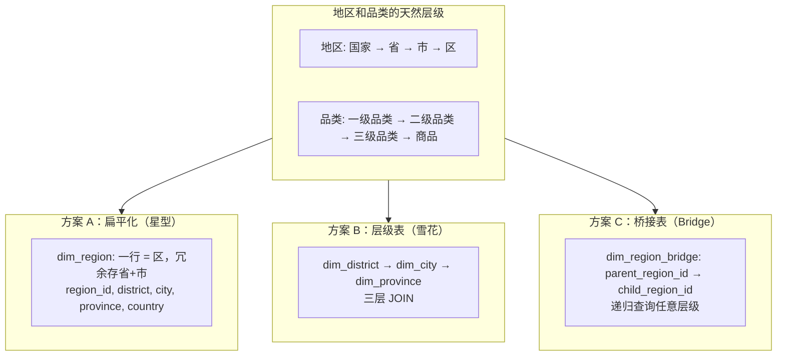
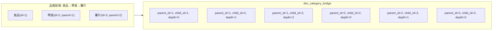
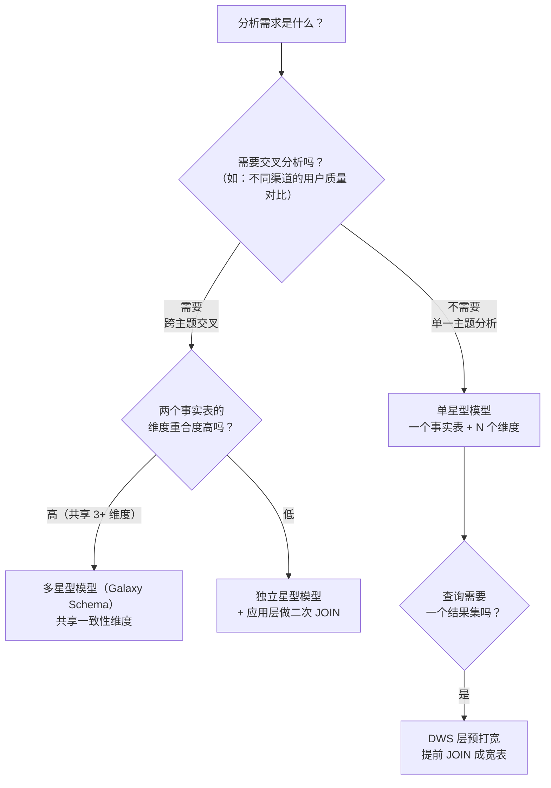
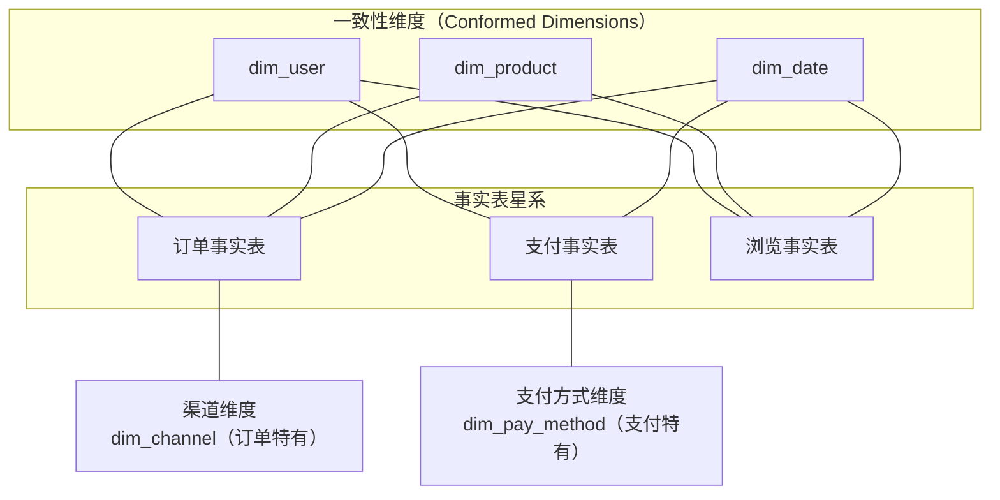
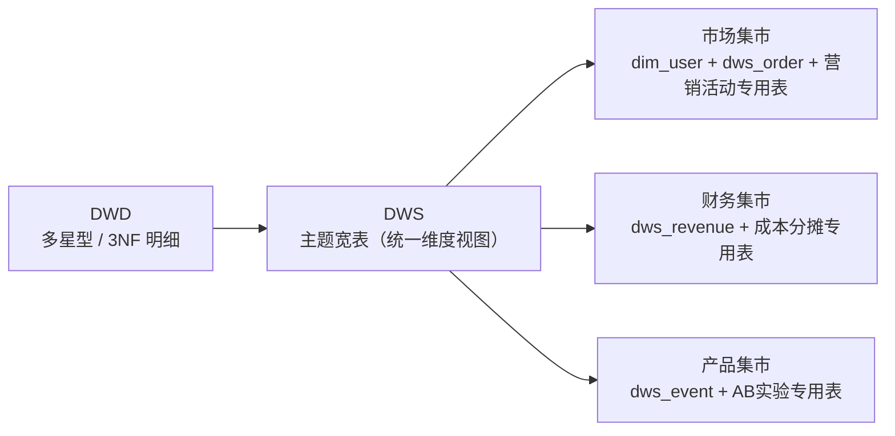

# 04 · 建模进阶

> **本章要回答一个终极问题：L02 的星型模型只覆盖了最基础的建模，当维度有层级、模型更复杂、或者看问题的角度不同时，建模该怎么升级？**
>
> 如果说 L02 是建模的"基本功"，本章就是建模的"变招"——多层级维度如何组织、时间维度如何设计、什么时候该建多星型而非大宽表。
>
> ```mermaid
> flowchart LR
>     A[多层级维度] --> B[层次桥接表<br/>or 扁平化冗余]
>     A -.-> C[雪花模型的适用边界]
>     D[时间维度] -.->|独立主题<br/>每个数仓都需要的维度| E[dim_date<br/>标准日期维度设计]
>     F[数据集市] -.->|L02 维度建模的应用层| G[面向业务的扁平化建模]
>     H[复杂模型选择] --> I{分析需求}
>     I -->|"交叉分析"| J["多星型模型"]
>     I -->|"统一视图"| K["大宽表"]
>     I -->|"混合负载"| L["星型 + 预聚合"]
> ```
>
> **阅读建议**：§1 多层级维度是核心，§2 时间维度是工具型内容，§3 复杂模型选择是决策框架，§4 数据集市是架构延伸。如果时间紧，§1-§2 必读，§3-§4 可以作为面试防守内容。
>
> **前置依赖**：L02 建模基础（星型/雪花/维度表设计/事实表类型）。
>
> 覆盖原题：28, 43, 49, 36。

---

## 1. 多层级维度建模

### 省→市→区、品类→品牌→商品——这种层级维度怎么建模？

**层级维度（Hierarchical Dimension）是维度内部存在天然的父子关系。建模的核心问题是：扁平化还是保持层级？**



**三种方案对比：**

| 方案 | 上卷/下钻 | 查询性能 | 存储 | 适用 |
|------|----------|---------|------|------|
| **扁平化（星型）** | 简单 GROUP BY 即可 | 最快 | 冗余大 | 层级固定且浅（<4 层），如省市 |
| **层级表（雪花）** | 需要 JOIN 层级表 | 多 JOIN 慢 | 最小 | 层级需灵活调整，如品类重组 |
| **桥接表** | 递归查询 | 中等 | 中等 | 层级深且需要任意层聚合 |

### 扁平化——最实用的方案

**大部分数仓场景，扁平化就够了：**

```sql
-- 地区维度：扁平化，一行代表最细粒度，向上层级全部冗余
CREATE TABLE dim_region (
    region_sk       BIGINT    COMMENT '代理键',
    region_code     STRING    COMMENT '行政区划代码（自然键）',
    country         STRING    COMMENT '国家',
    province        STRING    COMMENT '省',
    city            STRING    COMMENT '市',
    district        STRING    COMMENT '区',
    region_level    STRING    COMMENT '层级: COUNTRY/PROVINCE/CITY/DISTRICT'
) STORED AS PARQUET;

-- 上卷：按省汇总
SELECT province, SUM(amount) 
FROM fact_sales f 
JOIN dim_region r ON f.region_sk = r.region_sk
GROUP BY province;

-- 下钻：从省钻到市
SELECT city, SUM(amount)
FROM fact_sales f 
JOIN dim_region r ON f.region_sk = r.region_sk
WHERE province = '广东省'  -- 上卷筛选后
GROUP BY city;
```

### 桥接表——当层级深且需要"任意层汇总"时



桥接表的核心思想：预计算所有祖先-后代对，查询时直接 JOIN 桥接表即可实现任意层级的上卷。

```sql
-- 桥接表结构
CREATE TABLE dim_category_bridge (
    parent_id       BIGINT    COMMENT '祖先节点',
    child_id        BIGINT    COMMENT '后代节点（包含自身）',
    depth           INT       COMMENT '层级差（0=自身，1=直接子节点...）'
) STORED AS PARQUET;

-- 查询：零食（id=2）及其所有子品类的销售额
SELECT SUM(f.amount)
FROM fact_sales f
JOIN dim_category_bridge b ON f.category_id = b.child_id
WHERE b.parent_id = 2;
-- 结果包含 child_id=2(零食) + child_id=3(薯片) 的销售额
```

??? tip "面试嘴替 — 多层级维度"
    **核心主张**：
    > "层级维度的建模方案取决于层级深度和变更频率。层级浅（<4 层）且固定→扁平化冗余；层级深且灵活→桥接表预计算祖先关系。数仓实践中 90% 的层级维度用扁平化就够了——冗余省市的存储成本远低于多 JOIN 的查询成本。"

    **常见追问 & 防御**：
    - 追问："扁平化和雪花在层级维度上怎么选？" → 答："问两个问题：这个层级结构会变吗？查询需要'任意层级汇总'吗？如果层级稳定（如行政区划），扁平化无脑选。如果品类三级结构经常调整，雪花模型或桥接表更灵活。"
    - 追问："桥接表会不会很大？" → 答："假设有 n 个节点，每个节点到祖先的路径长度平均为 d，桥接表大小约 n*d。对于品类树（n=1000, d=3），只有 3000 行，完全可接受。"

    | 一般回答 | 优秀回答 |
    |---------|---------|
    | "多层级维度用雪花模型。" | "层级维度建模有三种方案，按复杂度递进：扁平化（冗余）→ 雪花（范式化）→ 桥接表（预计算）。关键是看层级是否会变：地理维度用扁平化（省市关系稳定），品类维度用雪花或桥接表（品类结构经常调整）。桥接表的精髓在于用少量存储换任意层级聚合的查询性能。" |

---

## 2. 时间维度设计

### 日期维度怎么建？为什么每个数仓都应该有 dim_date？

**时间维度是整个数据仓库中唯一"100% 出现在每个事实表"的维度。设计一个好的 dim_date 是一劳永逸的投资。**

```sql
-- dim_date：一条 SQL 生成未来 10 年的所有日期
CREATE TABLE dim_date (
    date_sk         INT       COMMENT '日期代理键 yyyyMMdd',
    date_str        STRING    COMMENT '日期字符串 yyyy-MM-dd',
    year            INT       COMMENT '年',
    quarter         INT       COMMENT '季(1-4)',
    quarter_name    STRING    COMMENT 'Q1/Q2/Q3/Q4',
    month           INT       COMMENT '月(1-12)',
    month_name      STRING    COMMENT '月份名称',
    day_of_month    INT       COMMENT '日(1-31)',
    day_of_week     INT       COMMENT '星期几(1=周一...7=周日)',
    week_of_year    INT       COMMENT '年中第几周',
    is_weekend      INT       COMMENT '是否周末 0/1',
    is_holiday      INT       COMMENT '是否节假日 0/1',
    holiday_name    STRING    COMMENT '节假日名称',
    fiscal_year     INT       COMMENT '财年',
    fiscal_quarter  INT       COMMENT '财季'
) STORED AS PARQUET;
```

**dim_date 的关键价值：**

| 价值 | 说明 |
|------|------|
| **统一口径** | 全公司用同一套日期定义（如周一是 1 还是 2、财年怎么划分） |
| **复杂时间运算零成本** | "上周同期"、"同比"、"各月的工作日天数"——JOIN dim_date 用维度属性代替复杂日期函数 |
| **事实表瘦身** | 事实表只需存 date_sk，不需要按 year/month/week 分区（除了主分区 dt） |

```sql
-- 用法示例：计算各月工作日销售额均值
SELECT 
    d.year,
    d.month,
    SUM(f.amount) / COUNT(DISTINCT CASE WHEN d.is_weekend = 0 THEN d.date_str END) AS avg_workday_amount
FROM fact_sales f
JOIN dim_date d ON f.date_sk = d.date_sk
WHERE d.year = 2024
GROUP BY d.year, d.month;
```

**时间维度的三个关键设计决策：**

1. **代理键格式**：推荐 `yyyyMMdd` INT 格式（如 20240315），比 VARCHAR 省 3/4 空间，且天然有序
2. **假日维度**：需要维护假日表，通常每年更新一次（法定节假日安排）
3. **财年定义**：按公司实际定义（如 4 月开始），避免硬编码

??? tip "面试嘴替 — 时间维度"
    **核心主张**：
    > "dim_date 是整个数仓唯一每个事实表都需要的维度。它把复杂的时间运算（同比、工作日、财季）变成了简单的维度属性过滤，既统一口径又简化 SQL。"

    **常见追问 & 防御**：
    - 追问："为什么不用 MySQL 的日期函数？" → 答："Hive/Spark 的日期函数不如 MySQL 丰富，且各引擎实现不一致。用 dim_date 可以跨引擎一致，JOIN 一个维度表的计算成本远低于每次查询都执行 DATE_FORMAT 和 WEEKDAY。"
    - 追问："事实表已经按 dt 分区了，为什么还需要 dim_date？" → 答："dt 分区解决的是物理裁剪（跳过不相关的数据目录），dim_date 解决的是逻辑运算（'去年同期的工作日'）。两者互补——dt 上做分区裁剪，dim_date 上做时间逻辑。"

    | 一般回答 | 优秀回答 |
    |---------|---------|
    | "时间维度表存日期相关属性。" | "dim_date 是建模的'基础建设'——一劳永逸。它的价值不在建表本身，而在于用维度的思维解决时间运算问题：同比环比、工作日/节假日、财年财季，这些都是维度属性而非计算逻辑。事实表只需存一个 date_sk，所有时间相关的复杂查询都是 JOIN dim_date 的简单维度过滤。" |

---

## 3. 复杂模型选择

### 什么时候用多星型模型？什么时候压大宽表？

**核心决策：交叉分析需求决定了模型复杂度。**



**多星型模型（Galaxy Schema）**：



**多星型 vs 大宽表：**

| 维度 | 多星型模型 | 大宽表 |
|------|----------|--------|
| 灵活性 | 高：每个事实表独立演进 | 低：加字段影响所有消费者 |
| 查询性能 | 需要 JOIN（但有预聚合补偿） | 快：一次扫表出结果 |
| 存储效率 | 高：事实表只存本域度量 | 低：大量 NULL（不同域数据密度不同） |
| 维护成本 | 中：多表 ETL | 低：单表管理 |
| 适用场景 | 跨主题交叉分析 | 固定报表、实时大屏 |

**选择决策矩阵：**

| 场景 | 推荐方案 |
|------|---------|
| 单主题分析（只看订单、或只看用户行为） | 单星型 |
| 跨主题交叉分析（付费用户的行为特征） | 多星型 + 一致性维度 |
| 固定报表、指标 <= 50、刷新 < 每日 1 次 | DWS 大宽表 |
| 灵活 Ad-hoc 分析、指标不定 | 多星型 |

??? tip "面试嘴替 — 复杂模型选择"
    **核心主张**：
    > "选模型不是选技术，是选平衡点——灵活性 vs 查询性能 vs 维护成本。多星型灵活但查询复杂，大宽表快但维护成本高。数仓实践中的答案是'都要'：DWD 层多星型保证灵活性，DWS 层预打宽表保证查询性能。"

    **绑定项目**：
    > "我的项目中 DWD 层使用多星型模型：AI_QUERY 事实表、FEEDBACK 事实表和 RESPONSE 事实表共享用户、模型、会话三个一致性维度。到了 DWS 层则按分析场景预打宽——查询事实宽表（query+response 左连接）、反馈事实宽表（feedback+query 关联），Ad-hoc 分析用 DWD 多星型，固定报表用 DWS 宽表。"

    | 一般回答 | 优秀回答 |
    |---------|---------|
    | "复杂分析用多事实表模型。" | "模型复杂度应该匹配分析需求复杂度。DWD 层保持多星型的灵活性（事实表独立、维度共享），DWS 层做预打宽优化查询（牺牲灵活性换性能）。这是'分层建模'的核心思想——不是选一个模型，而是不同层用不同模型满足不同需求。" |

---

## 4. 数据集市

### 数据集市怎么从数仓导出来？和 DWS/ADS 的关系是什么？

数据集市是 L01 介绍的概念在本章的实践落地。从建模视角看：



**建模视角的数据集市设计原则：**

1. **基于一致性维度**：集市不重新定义维度，复用数仓的统一维度
2. **扁平化偏好**：集市更倾向于大宽表——业务分析师不需要理解 JOIN
3. **性能隔离**：集市可以部署在独立集群/引擎上，不影响数仓主集群

??? tip "面试嘴替 — 数据集市建模"
    **核心主张**：
    > "数据集市的建模比数仓更扁平、更业务化。它的前提是数仓的一致性维度，否则各部门集市口径对不齐。"

    | 一般回答 | 优秀回答 |
    |---------|---------|
    | "数据集市是小数据仓库。" | "建模视角下，集市是数仓一致性维度的应用层。核心设计原则：复用统一维度（不另起炉灶）、扁平化建模（大宽表优先）、性能隔离（可独立集群/引擎）。" |

---

## 面试串讲（本章连贯表述）

> "建模进阶的核心思辨是'深度 vs 宽度'：多层级维度考验的是'层级建模的深度'——扁平化 or 桥接表；复杂模型考验的是'事实表的宽度'——多星型 or 大宽表。这两个选择没有标准答案，要看你的分析场景是偏灵活性还是偏性能。"

> "记一个万能公式：DWD 用多星型保灵活（事实表独立、维度共享），DWS 预打宽保性能（按场景提前 JOIN），ADS 做集市定制化。前两层是'数据建模'，后两层是'服务建模'——思路不同，不要用一把尺子衡量。"

---

## 自测 Q&A

<details>
<summary><b>Q：多层级维度（省市区、品类树）怎么建模？</b></summary>

A：三种方案：① 扁平化（最常用，冗余上级属性到最低层级）；② 雪花模型（层级独立子表）；③ 桥接表（预计算所有祖先-后代关系）。层级浅且固定→扁平化；层级深且灵活→桥接表。注意雪花模型的多 JOIN 代价。

</details>

<details>
<summary><b>Q：dim_date 为什么每个数仓都要有？关键字段有哪些？</b></summary>

A：统一全公司日期口径、把时间运算变维度过滤、简化 SQL。关键字段：代理键(yyyyMMdd INT)、年/季/月/日、星期几、是否周末、是否节假日、财年/财季。事实表只需存 date_sk 一个字段。

</details>

<details>
<summary><b>Q：多星型模型 vs 大宽表，怎么选？</b></summary>

A：多星型灵活但多 JOIN（适合 Ad-hoc 分析），大宽表快但维护成本高（适合固定报表）。实践中分层解决：DWD 多星型保灵活，DWS 大宽表保性能。

</details>

<details>
<summary><b>Q：数据集市在建模视角下的设计原则？</b></summary>

A：① 基于数仓一致性维度（不另起炉灶）；② 扁平化优先（大宽表，方便业务分析师）；③ 性能隔离（独立集群/引擎）。关键是保证口径一致性——部门集市必须在统一维度底座上构建。

</details>

---

## 推荐源
- Kimball《数据仓库工具箱》第 7 章——日期维度
- Kimball《数据仓库工具箱》第 9 章——多星型模型与数据集市
- 《阿里巴巴大数据之路》第 6 章——维度设计

!!! question "卡住了？"
    日期维度的财年/财季切换逻辑、桥接表在大数据量下的性能问题、多星型模型中一致性维度的管理工具——任意点直接问老师展开或出题。
