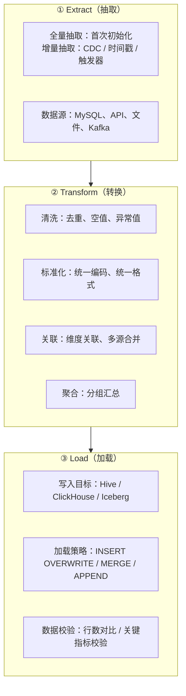
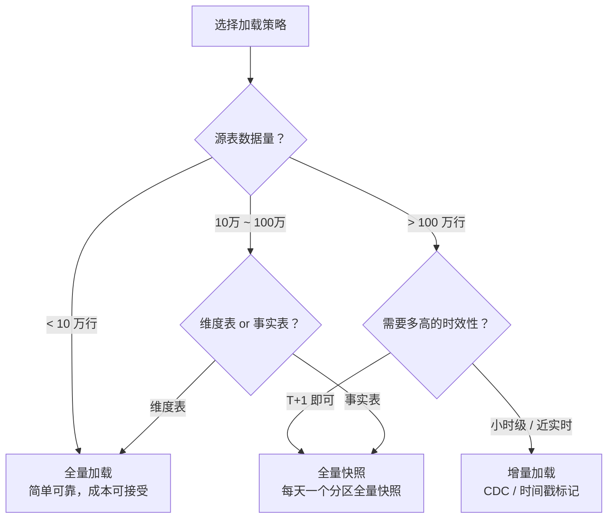
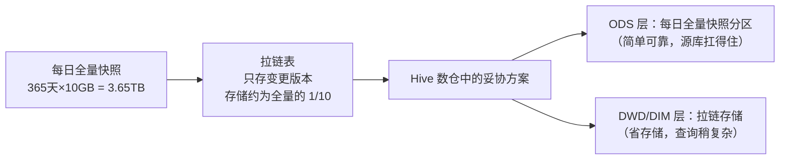
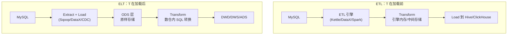
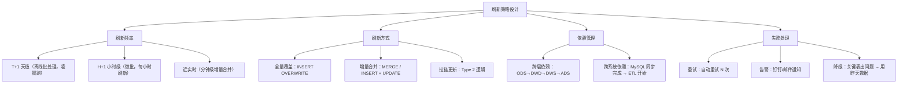
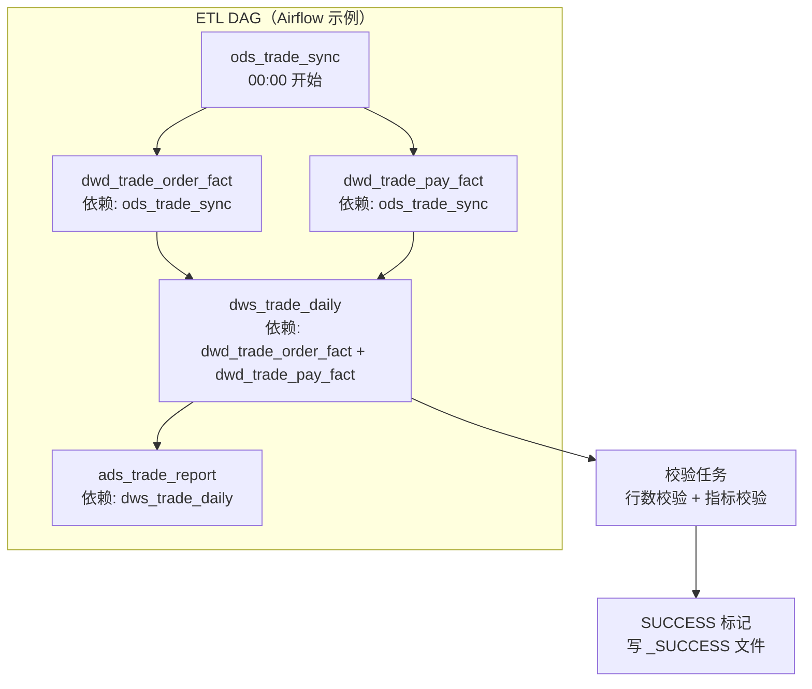

# 05 · ETL/ELT 与离线链路

> **本章要回答一个终极问题：数据怎么从业务库搬到数仓里？每天上亿行数据怎么稳定、准时、不出错地完成加工？**
>
> ETL 是数仓的"血液循环系统"——建模再好，数据搬不过来就是死库。本章从 ETL 基本流程讲到离线链路的工程化实践。
>
> ```mermaid
> flowchart LR
>     A["Extract<br/>数据抽取"] --> B["Transform<br/>数据转换"]
>     B --> C["Load<br/>数据加载"]
>     
>     A -.->|ELT 变体<br/>T 后移到数仓内| D["ELT: Extract → Load → Transform"]
>     
>     C --> E["增量 vs 全量<br/>刷新策略"]
>     C -.-> F["调度与任务管理<br/>DAG/依赖/重跑"]
>     E -.-> F
> ```
>
> **阅读建议**：§1-§2 是递进主干（ETL 流程→增量/全量），§3 是战略选择（ETL vs ELT），§4-§5 是工程落地（刷新策略→调度）。§5 如果需要详细讲调度工具可以单独扩展。
>
> 覆盖原题：5, 11, 18, 23, 35, 51。

---

## 1. ETL 基本流程

### ETL 的三步到底是什么？每一步有哪些容易被忽略的坑？

**ETL = Extract（抽取）→ Transform（转换）→ Load（加载）。这三个词面试官会问你每组动词后面具体的操作。**



**各步骤的坑与解法：**

| 步骤 | 常见坑 | 解法 |
|------|--------|------|
| Extract - 全量 | 大表全量抽取耗时太久，影响业务库 | 离线抽取用备库，分批拉取（LIMIT/OFFSET 或按主键分片） |
| Extract - 增量 | 时间戳不准确（延迟写入/时区问题） | 时间窗口加缓冲（T-5min ~ T 而非精确 00:00） |
| Transform - 去重 | 自关联全表扫描太慢 | 用 ROW_NUMBER() + 分区排序代替自关联 |
| Transform - 空值 | COUNT 漏算 NULL | 统一用 NVL/COALESCE 处理，建表时设 DEFAULT |
| Load - 全量覆盖 | INSERT OVERWRITE 过程中查询失败 | 用临时表 + RENAME 原子切换 |
| Load - 回刷 | 历史数据重跑覆盖了最新分区 | 回刷脚本加白名单过滤，禁止覆盖当天分区 |

??? example "SQL：ETL 三步示例（ODS → DWD）"
    ```sql
    -- ============================================================
    -- ETL：ODS → DWD 订单事实表
    -- 覆盖：去重、标准化、维度关联
    -- ============================================================

    -- Step 1: Extract（抽取）—— Hive 外部表映射 MySQL 同步到 ODS 的数据
    -- 此步骤假设 MySQL → HDFS 同步已完成（通过 Sqoop/DataX 或 CDC）

    -- Step 2: Transform + Load（转换 + 加载）
    INSERT OVERWRITE TABLE dwd_trade_order_fact PARTITION (dt = '${dt}')
    SELECT
        -- 维度关联：把 ODS 的 user_id 转成代理键 user_sk
        u.user_sk,
        p.product_sk,
        -- 标准化：统一数值精度
        ROUND(NVL(o.pay_amount, 0), 2)           AS pay_amount,
        -- 清洗 + 标准化：枚举值转统一编码
        CASE o.order_status
            WHEN 0 THEN 'UNPAID'
            WHEN 1 THEN 'PAID'
            WHEN 2 THEN 'CANCELLED'
            WHEN 3 THEN 'REFUNDED'
            ELSE 'UNKNOWN'
        END                                         AS order_status,
        -- 标准化：字符串时间 → TIMESTAMP
        CAST(o.gmt_create AS TIMESTAMP)            AS create_time,
        CAST(o.gmt_pay AS TIMESTAMP)               AS pay_time,
        o.dt
    FROM (
        -- 去重：同一订单取最新版本
        SELECT *,
            ROW_NUMBER() OVER (
                PARTITION BY order_id 
                ORDER BY gmt_modified DESC
            ) AS rn
        FROM ods_mysql_order_info
        WHERE dt = '${dt}'
    ) o
    LEFT JOIN dim_user u 
        ON o.user_id = u.user_id AND u.is_current = 1  -- 取当前维度版本
    LEFT JOIN dim_product p 
        ON o.product_id = p.product_id AND p.is_current = 1
    WHERE o.rn = 1;  -- 去重：只保留最新版本

    -- Step 3: 校验（Load 后的数据质量检查）
    -- 行数校验：源表去重行数 == 目标表行数
    -- 指标校验：源表 SUM(amount) ≈ 目标表 SUM(amount)（允许舍入误差）
    ```

??? tip "面试嘴替 — ETL 流程"
    **核心主张**：
    > "ETL 三步看似简单，坑在细节：抽取阶段的性能影响业务库、转换阶段的空值和编码陷阱、加载阶段的原子性保证。生产级 ETL 必须做好三件事：幂等（重跑不出错）、校验（跑完能验证）、可回滚（出错能恢复）。"

    **常见追问 & 防御**：
    - 追问："ETL 失败后怎么重跑？" → 答："INSERT OVERWRITE 天然幂等——重跑覆盖同一分区，结果一致。回刷历史分区时注意不要覆盖当天正在跑的当前分区。配合调度系统的失败重试（3 次，间隔递增）。"
    - 追问："ETL 效率怎么提升？" → 答："核心三板斧：① 分区裁剪（WHERE dt='${dt}' 只处理当天数据）；② 增加并行度（Spark SQL 的 spark.sql.shuffle.partitions）；③ 小文件治理（ETL 输出后合并文件，避免 NameNode 压力）。"

    **绑定项目**：
    > "我的项目离线链路用 Airflow 调度，每天凌晨 2 点触发 ODS→DWD→DWS→DM 四级 ETL。每层 ETL 都是一个独立的 DAG Task，上一层的输出分区 = 下一层的输入分区，通过 ExternalTaskSensor 保证依赖。所有 INSERT 语句都用 INSERT OVERWRITE 保证幂等——失败了重跑同一个分区就行。"

    | 一般回答 | 优秀回答 |
    |---------|---------|
    | "ETL 就是抽取、转换、加载。" | "ETL 不只是三个步骤，而是数据从业务库到数仓的'质量把关链'。抽取时要注意对业务库的影响（读备库、分批拉），转换时要处理脏数据（空值、重复、异构编码），加载时要保证原子性（临时表+RENAME、INSERT OVERWRITE 幂等）。每一步都有工程细节——这些细节决定数据质量和链路稳定性。" |

---

## 2. 增量 vs 全量加载

### 增量加载和全量加载到底怎么选？谁能替代谁？

**全量 = 每次都搬所有数据，增量 = 只搬变化的数据。选择的核心是数据量 × 时效性要求的乘积。**



**全量 vs 增量深度对比：**

| 维度 | 全量加载 | 增量加载 |
|------|---------|---------|
| 实现复杂度 | **低**：SELECT * 全覆盖 | **高**：需要变更标识（时间戳/binlog） |
| 数据一致性 | **高**：每次都是全量快照，天然一致 | **中**：增量有丢失/重复风险 |
| 对源库压力 | **大**：每次扫全表 | **小**：只扫变更部分 |
| 存储占用 | **大**：每天一个全量分区 | **小**：ODS 只存增量，DWD 合并后存快照 |
| 容错/重跑 | **简单**：重跑覆盖分区 | **复杂**：需要记录消费位点 |
| 适用 | 维度表、小事实表、T+1 离线 | 大事实表、实时/准实时链路 |

**增量加载的三种实现方式：**

| 方式 | 原理 | 优点 | 缺点 |
|------|------|------|------|
| **时间戳增量** | SQL WHERE gmt_modified > '上次最大时间戳' | 简单、无额外依赖 | 物理删除检测不到，时区问题 |
| **CDC（binlog）** | 解析 MySQL binlog 获取 INSERT/UPDATE/DELETE | 完整捕获（含删除）、低延迟 | 需要 Canal/Flink CDC 组件，运维复杂 |
| **全量对比增量** | 每天全量和昨天全量 FULL OUTER JOIN 取差异 | 不依赖时间戳、可检测删除 | 每次都要读全量，源库压力大 |

### 每天全量快照的存储成本太大怎么办？

**拉链表（SCD Type 2）就是从这个需求来的——也是一种增量思想在存储层的实现。**



增量/全量选择的实战建议：
- **ODS 层**：全量快照（简单可靠是第一位）
- **DWD 事实表**：全量分区（每分区独立，天然的"重分区"成本低于 SQL 合并成本）
- **DIM 维度表**：拉链表（SCD Type 2）

??? tip "面试嘴替 — 增量 vs 全量"
    **核心主张**：
    > "全量和增量不是互斥的，是分层配合的。ODS 用全量保证简单可靠，DWD 用分区保证回刷方便，DIM 用增量拉链节省存储。选择的标准是数据量 × 时效性要求的乘积。"

    **常见追问 & 防御**：
    - 追问："CDC 有什么坑？" → 答："三件事：① binlog 格式必须 ROW 模式（STATEMENT 模式拿不到具体变更数据）；② DDL 变更（加列、改类型）会导致 Canal 挂掉，需要监控和自动恢复；③ 消费位点管理——Flink CDC 用 Checkpoint 自动管理，自建消费需要存 offset 到外部存储（ZK/Redis）。"
    - 追问："全量快照每天覆盖，怎么避免查询时看到一半的数据？" → 答："不要直接 INSERT OVERWRITE 目标表，先写入临时表（dwd_xxx_tmp），写入完成后 RENAME 原子切换。查询方永远看到完整快照。"

    | 一般回答 | 优秀回答 |
    |---------|---------|
    | "全量每次搬全部，增量只搬变更的。" | "选择全量还是增量的本质是'简单性 vs 效率'的权衡。ODS 层我倾向于全量——每天一个分区，坏了重跑，架构最简单。DWD 事实表也是全量分区，因为分区天然隔离了天级数据，不需要做增量合并。唯独 DIM 维度表我会用增量拉链——维度表变更频率低但需要全量历史，拉链表存储比全量快照小一个数量级。" |

---

## 3. ETL vs ELT

### 为什么现在都改成 ELT 了？真的只有字母顺序的区别吗？

**ETL = 在 ETL 工具/中间层做转换再加载到数仓。ELT = 先原样加载到数仓，再在数仓内做转换。**



**为什么从 ETL 转向 ELT？**

| 变化 | ETL 时代（2010s） | ELT 时代（2020s） |
|------|-------------------|-------------------|
| 计算瓶颈 | ETL 引擎弱，数仓计算也弱 | 数仓计算强（Spark/Presto MPP） |
| 数据量 | GB 级 | TB~PB 级 |
| 转换复杂度 | 少量转换 | 复杂多层转换，需要历史数据回溯 |
| 存储成本 | 贵（SAN/NAS） | 便宜（HDFS/对象存储） |
| 灵活性 | 低：改了转换逻辑要全量回导 | **高**：存在 ODS 的原始数据可以随时重新转换 |

**ELT 的核心优势——"可回放性"**：

> ODS 层保留了原始数据，如果 DWD 的转换逻辑有 bug，只需要修改 SQL 重跑 DWD 即可，不需要重新从源系统抽取。

??? example "SQL：ELT 模式（先 Load 到 ODS，再在数仓内 Transform）"
    ```sql
    -- Step 1: Extract + Load —— 用 Sqoop/DataX 把 MySQL 数据全量抽到 Hive ODS
    -- Sqoop 命令示例（非 SQL，伪代码）：
    -- sqoop import --table order_info --target-dir /warehouse/ods/order_info/dt=${dt}
    -- Load 结果：ODS 表结构和 MySQL 一模一样，不做任何转换

    -- Step 2: Transform —— 数仓内 SQL 转换 ODS → DWD
    -- 这是"ELT 的 T"，在数仓引擎（Spark/Hive）内执行
    INSERT OVERWRITE TABLE dwd_trade_order_fact PARTITION (dt = '${dt}')
    SELECT
        o.id,
        u.user_sk,
        CASE o.status WHEN 0 THEN 'UNPAID' WHEN 1 THEN 'PAID' END,
        o.amount,
        CAST(o.create_time AS TIMESTAMP)
    FROM ods_mysql_order_info o
    LEFT JOIN dim_user u ON o.user_id = u.user_id AND u.is_current = 1
    WHERE o.dt = '${dt}';

    -- 如果转换逻辑有 bug：改 SQL → 重跑 DWD 即可
    -- 不用重新从 MySQL 抽数据（ODS 已有的数据可以反复使用）
    ```

**ETL 和 ELT 的选择指南：**

| 场景 | 推荐 | 原因 |
|------|------|------|
| 数据量大（TB 级） | ELT | 利用数仓的分布式计算能力做 T |
| 需要敏感数据脱敏 | ETL | 脱敏必须在加载到共享数仓之前完成 |
| 多源异构数据整合 | ELT | 原始数据入仓后在统一 SQL 下转换 |
| 流式实时处理 | ETL 变体 | Kafka → Flink（T）→ ClickHouse（L） |

??? tip "面试嘴替 — ETL vs ELT"
    **核心主张**：
    > "ELT 不是 ETL 的简单重排——它代表从'计算瓶颈在 ETL 引擎'到'计算瓶颈在数仓'的架构转变。ELT 的核心价值是 ODS 保留原始数据，转换逻辑可重放——bug 修复后不需要重新抽数据。"

    **常见追问 & 防御**：
    - 追问："ELT 的缺点是什么？" → 答："ODS 层存储原始数据，存储成本高；敏感数据到了数仓才能脱敏，合规风险更大；转换逻辑全写成 SQL，比 ETL 工具的可视化更难维护（需要版本管理）。"
    - 追问："你们项目用 ETL 还是 ELT？" → 答："离线链路用 ELT：MySQL→Sqoop→ODS→Hive SQL→DWD/DWS。实时链路更像 ETL：Kafka→Flink（T）→ClickHouse/ODS（L），因为 Flink 在消费 Kafka 时就需要做清洗和聚合。"

    | 一般回答 | 优秀回答 |
    |---------|---------|
    | "ETL 先转换后加载，ELT 先加载后转换。" | "选 ETL 还是 ELT 的决策依据是'计算能力在哪'和'需不需要可回放性'。数仓侧计算能力强（Spark/Hive MPP）→ ELT 把 T 推到数仓内做；需要敏感数据脱敏 → ETL 在加载前做。实际上现在大部分数仓实践是混合模式——批量链路用 ELT，实时链路用 ETL，各有各的场景。" |

---

## 4. 刷新策略

### 每天跑批怎么设计才能保证数据准时出、不出错？

**刷新策略 = 增量还是全量 + 多久刷新一次 + 依赖怎么编排。**

**刷新策略的四个关键决策：**



**刷新时间窗口设计：**

| 层级 | 开始时间 | 最晚完成时间 | 依赖 |
|------|---------|-------------|------|
| ODS（数据同步） | 00:00 | 02:00 | MySQL 备库可读 |
| DWD（清洗加工） | 02:00（等 ODS 完成） | 04:00 | ODS 同步完成 |
| DWS（主题汇总） | 04:00（等 DWD 完成） | 06:00 | DWD 加工完成 |
| ADS（报表产出） | 06:00（等 DWS 完成） | 08:00 | DWS 汇总完成 |

**失败处理策略矩阵：**

| 失败层级 | 重试策略 | 降级方案 |
|---------|---------|---------|
| ODS 同步失败 | 重试 3 次，间隔 5/10/30 分钟 | 使用昨天的 ODS 分区（T-1 数据） |
| DWD 转换失败 | 重试 2 次 | 使用上游 ODS 直接查询（脏数据但可用） |
| DWS 汇总失败 | 重试 2 次 | 应用层查询改为查 DWD 原始数据 |
| ADS 产出失败 | 重试 1 次 | 报表显示昨天的数据，标注"数据延迟" |

??? tip "面试嘴替 — 刷新策略"
    **核心主张**：
    > "刷新策略不是'全量还是增量'一个选择题——它是一个矩阵：频率 × 方式 × 依赖 × 容错。生产级的刷新策略必须能回答'失败了怎么办'和'最晚什么时候能出数据'。"

    **常见追问 & 防御**：
    - 追问："如果源数据凌晨 3 点才准备好怎么办？" → 答："设置等待窗口——ODS 同步等待到 03:00（1 小时窗口），超过则告警并用 T-1 数据。调度系统通过 Sensor 监听上游就绪信号（HDFS 分区有 SUCCESS 标记文件），而不是硬编码时间。"
    - 追问："某层 ETL 跑了一个小时还没完怎么办？" → 答："设置 timeout + 告警。Spark 任务超过 60 min → 自动 kill + 重试。重试时调大资源（更多 executor）快速跑完。root cause 通常是数据倾斜，从监控看 shuffle size 判断是否倾斜导致。"

    | 一般回答 | 优秀回答 |
    |---------|---------|
    | "每天定时跑全量或增量。" | "刷新策略的核心是'准时性'和'可恢复性'。四级依赖链路的每层都要设定 SLA（最晚完成时间）、重试策略和降级方案。设计原则是'越上层越关键'——ODS 挂了可以用 T-1 数据，ADS 挂了报表直接白屏。失败要有预案、延迟要有通知、数据要有校验。" |

---

## 5. 调度与任务管理

### 几十个 ETL 任务、跨层依赖，怎么保证有序执行？

**调度系统负责编排 ETL 任务的 DAG（有向无环图），保证依赖关系、失败重试、SLA 告警。**



**调度系统的关键能力：**

| 能力 | 为什么重要 | Airflow 实现 |
|------|----------|-------------|
| **DAG 依赖** | 保证 ODS→DWD→DWS→ADS 顺序执行 | `set_upstream()` / `>>` 运算符 |
| **跨 DAG 依赖** | 上一层的 DAG 完成后触发下一层 | `ExternalTaskSensor` |
| **失败重试** | 瞬时故障（网络抖动）自动恢复 | `retries=3, retry_delay=timedelta(minutes=5)` |
| **SLA 监控** | 任务超时报警 | `sla=timedelta(hours=1)` |
| **回填（Backfill）** | 补跑历史数据 | `airflow dags backfill -s 2024-01-01 -e 2024-01-15` |

**高效数据流设计原则：**

1. **上游输出即下游输入**：每层 ETL 完成后写 `_SUCCESS` 标记文件，下游 Sensor 检测到标记后触发
2. **独立分区，并行执行**：不同分区的 ETL 可以并行（如 T-1 和 T-2 同时回填）
3. **小任务合并，大任务拆分**：避免一个 Task 跑 3 小时（失败重试成本高），拆成子任务

??? tip "面试嘴替 — 调度管理"
    **核心主张**：
    > "调度系统是 ETL 的'指挥中心'。核心能力是 DAG 编排（依赖管理）+ 失败重试 + SLA 告警 + 回填。Airflow 是最主流的选择——Python 定义 DAG、Web UI 可视化管理、社区成熟。"

    **常见追问 & 防御**：
    - 追问："调度系统挂了怎么办？" → 答："Airflow Scheduler 支持 HA（多实例竞争锁）。外部 DB（MySQL/PostgreSQL）做元数据持久化。挂了之后，恢复时自动检查哪些 DAG Run 应该处于 running 状态但实际是 queued，重新触发。"
    - 追问："大促期间想提前把未来几天的 ETL 预跑一遍怎么办？" → 答："Airflow 的 backfill 天然支持——指定日期范围，自动生成历史 DAG Run 按依赖顺序执行。"

    | 一般回答 | 优秀回答 |
    |---------|---------|
    | "用 Airflow 调度 ETL 任务。" | "调度的核心不是工具选择，而是依赖链设计。我的原则是：一层一个 DAG（ods_dag → dwd_dag → dws_dag），DAG 之间用 ExternalTaskSensor 衔接——这样单层故障不会影响其他层的正常产出。每个 Task 的 SQL 模板化（INSERT OVERWRITE ... WHERE dt='{{ ds }}'），Airflow 自动注入执行日期。" |

---

## 面试串讲（本章连贯表述）

> "ETL 链路的面试回答要有'链感'——不要孤立讲每个点，而要说清楚数据流动的完整路径。我的表述方式是：'离线链路设计从抽取开始——ODS 层通过 Sqoop/DataX 每天凌晨同步 MySQL 全量快照；然后进入 ELT 模式的转换阶段——Hive SQL 逐层加工 ODS→DWD→DWS→ADS；整个过程由 Airflow 调度，每层写完 _SUCCESS 标记触发下游；失败自动重试 3 次，超时告警。'"

> "增量/全量的选择、ETL/ELT 的选择、刷新策略的设计——这三个话题本质上是同一个决策的不同维度：数据量 × 时效性 × 一致性 × 成本。面试时你不需要给出'正确答案'，而是要展示你的权衡逻辑——知道什么时候该选哪个。"

---

## 自测 Q&A

<details>
<summary><b>Q：ETL 三步各有哪些常见坑？怎么解决？</b></summary>

A：Extract——全量抽取影响业务库（用备库/分片拉取）、增量时间戳不准确（加缓冲窗口）。Transform——去重全表扫描慢（用 ROW_NUMBER+分区排序）、空值漏算（统一 NVL）。Load——INSERT OVERWRITE 覆盖中查询失败（临时表+RENAME 原子切换）。

</details>

<details>
<summary><b>Q：增量加载和全量加载怎么选？三种增量实现方式的优劣？</b></summary>

A：选择标准 = 数据量 × 时效性。小表全量，大事实表增量。三种增量：时间戳（简单但检测不到删除）、CDC（完整但运维复杂）、全量对比增量（不依赖时间戳但每次扫全量）。实战中 ODS 用全量，DWD 用全量分区，DIM 用增量拉链。

</details>

<details>
<summary><b>Q：为什么 ELT 会取代 ETL？什么场景仍然需要 ETL？</b></summary>

A：ELT 优势：计算力在数仓侧（利用 Hive/Spark 分布式能力）、原始数据可回放。仍需 ETL 的场景：敏感数据脱敏必须在加载前完成、流式处理（Kafka→Flink→ClickHouse 本身就是 ETL 模式）。

</details>

<details>
<summary><b>Q：刷新策略的四个关键决策是什么？</b></summary>

A：刷新频率（天级/小时级/近实时）、刷新方式（全量覆盖/增量合并/拉链更新）、依赖管理（跨层/跨系统依赖）、失败处理（重试/告警/降级）。每层需要设定 SLA 和降级方案。

</details>

<details>
<summary><b>Q：调度系统怎么保证 ODS→DWD→DWS→ADS 按顺序执行？</b></summary>

A：DAG 定义依赖关系（>> 运算符）+ ExternalTaskSensor 跨 DAG 依赖 + _SUCCESS 标记文件。失败时自动重试（指数退避），超时告警，支持回填历史数据。

</details>

---

## 推荐源
- Airflow 官方文档：<https://airflow.apache.org/docs/>
- 《阿里巴巴大数据之路》第 5 章——数据同步与 ETL
- DataX 官方文档（阿里开源离线同步工具）：<https://github.com/alibaba/DataX>

!!! question "卡住了？"
    CDC 消费位点的 Exactly-once 管理、实时 ETL 和离线 ETL 的 Lambda 架构统一、ETL 任务的资源隔离（YARN 队列设计）——任意点直接问老师展开或出题。
