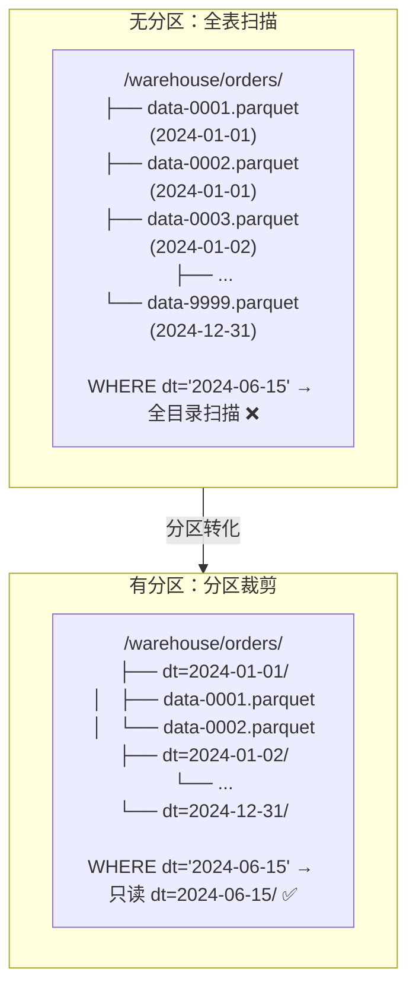
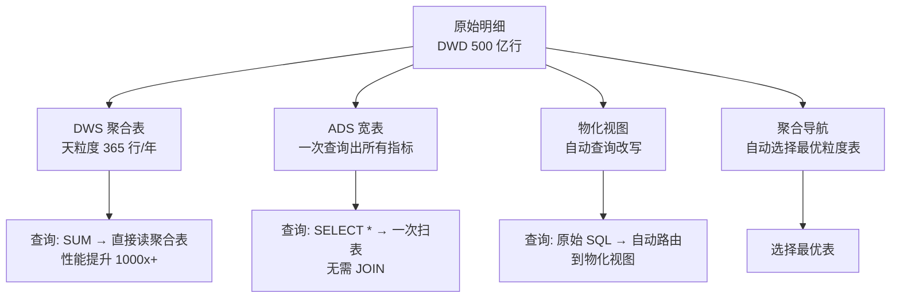
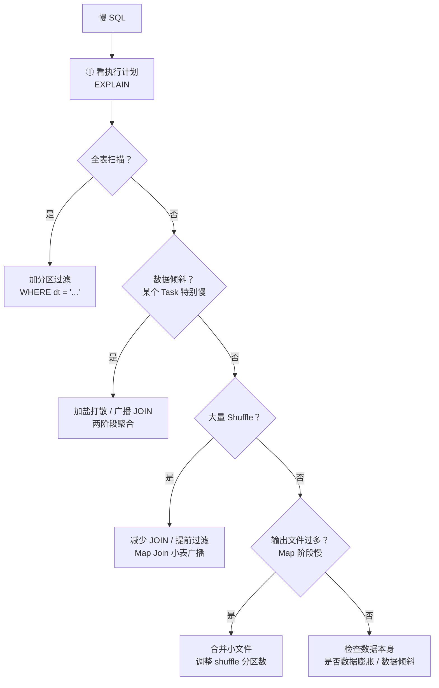
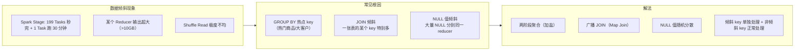
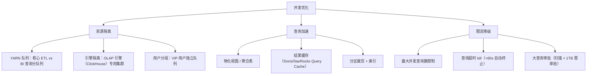

# 06 · 查询性能与分层优化

> **本章要回答一个终极问题：数仓建好了，数据也跑通了，但一条 SQL 跑了 30 秒——怎么优化？**
>
> 查询性能是数仓面试中最"实战"的部分——面试官可能会直接给你一段 SQL 问你哪里慢、怎么改。本章从分区设计到 SQL 优化，覆盖 12 道原题，帮你建立系统性的性能优化思维。
>
> ```mermaid
> flowchart LR
>     A[分区设计<br/>物理裁剪数据] --> B[聚合策略<br/>预计算减少扫描]
>     B --> C[SQL 优化<br/>JOIN/聚合/裁剪]
>     C --> D[数据倾斜<br/>分布不均→长尾]
>     C --> E[物化视图<br/>查询改写加速]
>     F[高并发<br/>资源隔离/缓存] -.->|独立主题| G[并发与查询优化器]
>     H[分层性能<br/>设计即优化] -.->|贯穿全局| A
>     D -.->|交叉影响| C
> ```
>
> **阅读建议**：§1-§3 是递进主干（分区→聚合→SQL），§4-§6 是专项问题（倾斜/并发/优化器），§7 是回看分层。§1 必须精读——分区是所有优化的基础。
>
> **前置依赖**：L01 分层架构、L02 建模基础、L05 ETL 链路。
>
> 覆盖原题：9, 10, 13, 15, 19, 25, 29, 38, 41, 42, 45, 48。

---

## 1. 分区设计

### 为什么加了分区，查询就能快 100 倍？分区键怎么选？

**分区的本质是"目录索引"——把大表按分区键拆成多个子目录，查询时通过分区裁剪只读需要的目录。**



**Hive 分区语法：**

```sql
-- 分区表定义
CREATE TABLE dwd_order_fact (
    order_id    BIGINT,
    user_id     BIGINT,
    amount      DECIMAL(18,2)
) PARTITIONED BY (dt STRING COMMENT '日期分区 yyyy-MM-dd')
STORED AS PARQUET;

-- 查询时自动分区裁剪
SELECT SUM(amount) FROM dwd_order_fact 
WHERE dt = '2024-06-15';  -- 只扫描 dt=2024-06-15/ 目录

-- 分区裁剪的"动态范围"也生效
SELECT SUM(amount) FROM dwd_order_fact 
WHERE dt BETWEEN '2024-06-01' AND '2024-06-30';  -- 只扫描 30 个分区目录
```

### 分区键怎么选？

**分区键选择的四原则：**

| 原则 | 说明 | 示例 |
|------|------|------|
| **高选择性** | 每个分区过滤掉大部分数据 | `dt`（每个日期过滤掉其他 365 天） |
| **查询必带** | 大部分查询的 WHERE 条件中都会出现 | `dt` 出现在 99% 的查询中 |
| **分区数量可控** | 分区数不能太多（Hive 建议 < 10 万） | 不要用 `user_id` 做分区（百万分区，NameNode 爆炸） |
| **分区大小均匀** | 避免有的分区 1GB、有的分区 1KB | 不要用 `country` 做分区（中国区数据占 90%） |

**常用分区键选择：**

| 分区键 | 适用 | 风险 |
|--------|------|------|
| **dt（日期）** | ✅ 几乎所有表的第一分区 | 当日分区可能很大 |
| **dt + hour** | 小时级数据的表 | 分区数 8760/年，合理 |
| **dt + biz_type** | 多业务线共存的表 | biz_type 需枚举值少且均匀 |
| **region** | ❌ 不推荐 | 数据倾斜（京沪深占 50%） |
| **user_id** | ❌ 禁止 | 百万级分区数，NameNode OOM |

### 分区过多会有什么问题？

**小文件问题**：每个分区目录下有多个小文件（如 spark.sql.shuffle.partitions=200），365 天 * 200 = 73,000 个文件——NameNode 内存压力大，文件打开开销高。

**解法**：
1. ETL 后合并文件：`INSERT OVERWRITE` 后执行 `CONCATENATE` 或重分区写入
2. 设置合适的 shuffle 分区数：`SET spark.sql.shuffle.partitions=20`（不是越大越好）
3. 定期合并历史分区的文件（>30 天的分区）

??? example "SQL：分区设计与小文件治理"
    ```sql
    -- 合理分区：dt + biz_type 二级分区
    CREATE TABLE dwd_order_fact (
        order_id    BIGINT,
        user_id     BIGINT,
        amount      DECIMAL(18,2)
    ) PARTITIONED BY (dt STRING, biz_type STRING)
    STORED AS PARQUET;

    -- 查询裁剪：两个分区键都可以裁剪
    SELECT SUM(amount) FROM dwd_order_fact 
    WHERE dt = '2024-06-15' AND biz_type = 'ECOMMERCE';

    -- 小文件治理：重分区写入（控制输出文件数）
    SET spark.sql.shuffle.partitions=20;  -- 200→20，输出文件数减少 10 倍
    INSERT OVERWRITE TABLE dwd_order_fact PARTITION (dt = '${dt}', biz_type = '${biz_type}')
    SELECT /*+ REPARTITION(10) */ order_id, user_id, amount  -- Hint 额外控制
    FROM ods_order_info
    WHERE dt = '${dt}';

    -- 历史分区文件合并（Hive）
    ALTER TABLE dwd_order_fact PARTITION (dt='2024-01-15', biz_type='ECOMMERCE') CONCATENATE;
    ```

??? tip "面试嘴替 — 分区设计"
    **核心主张**：
    > "分区是数仓性能优化的第一板斧——用目录结构代替全表扫描。分区键的选择原则：高选择性 + 查询必带 + 分区数可控。dt 是 90% 表的第一分区键。分区过多的小文件问题需要 ETL 端合并文件解决。"

    **常见追问 & 防御**：
    - 追问："dt 分区 + gmt_create 字段都有日期，为什么还需要 dt 分区？" → 答："gmt_create 是字段过滤（扫描后再过滤），dt 是分区裁剪（扫描前就过滤掉目录）。gmt_create 只能做筛选，无法跳过数据文件——这就是分区裁剪和字段过滤的本质区别。"
    - 追问："二级分区有必要吗？" → 答："当一级分区 dt 仍无法充分裁剪时用二级分区。比如每天有 10 个业务线的数据，WHERE dt='...' AND biz_type='...' 比只按 dt 过滤多裁剪了 90% 的数据。但分区数 = 365 * 10 = 3650，仍在安全范围。"

    **绑定项目**：
    > "我项目中所有 Hive 表都以 dt 为第一分区键，核心事实表加了 biz_type 二级分区。Flink 实时链路写入的 ClickHouse 表用 PARTITION BY toYYYYMMDD(event_time) 做日期分区，配合 ORDER BY (user_id, event_time) 做主键索引——查询特定用户的时间范围数据时，ClickHouse 自动跳过无关分区+稀疏索引精准定位。"

    | 一般回答 | 优秀回答 |
    |---------|---------|
    | "分区就是把数据按日期分目录存。" | "分区的本质是物理裁剪——把'读完所有文件再过滤'变成'只读相关目录的文件'。这一层优化能带来 10-100x 的性能提升。分区键选 dt 是因为 99% 的查询都有时间范围，且分区数可控（365/年）。做分区的关键不是创建语句，而是治理——小文件合并、分区数量监控、自动添加未来 N 天分区。" |

---

## 2. 聚合策略

### 聚合表、宽表、物化视图——这些预计算手段分别解决什么问题？

**聚合的本质是"空间换时间"——提前把常用的汇总结果算好，查询时直接用。**



| 手段 | 原理 | 适用场景 | 代价 |
|------|------|---------|------|
| **DWS 聚合表** | 预计算天/周/月粒度的汇总 | 固定粒度的报表 | 存储 + ETL 计算时间 |
| **ADS 宽表** | 提前 JOIN 好所有维度 | 固定指标的报表 | 存储翻倍、宽表维护 |
| **物化视图** | 保存查询结果，自动查询改写 | 复杂 SQL 加速、Grafana 看板 | 刷新延迟、存储 |
| **聚合导航** | 查询优化器自动选最粗粒度的表 | ClickHouse/Doris 内置能力 | 需要引擎支持 |

### DWS 聚合表怎么设计？

**聚合表设计三步：**

1. **确定聚合粒度**：天/周/月/年？一个业务维度还是一组？
2. **确定聚合指标**：SUM？COUNT DISTINCT？MAX？——**COUNT DISTINCT 不能直接聚合**，需要 bitmap/hll 近似
3. **确定刷新策略**：全量重算（简单）还是增量合并（复杂）

```sql
-- DWS 聚合表：订单日汇总
CREATE TABLE dws_order_daily (
    dt              STRING    COMMENT '统计日期',
    biz_type        STRING    COMMENT '业务线',
    order_count     BIGINT    COMMENT '订单数',
    order_amount    DECIMAL(18,2) COMMENT '订单金额',
    user_count      BIGINT    COMMENT '下单用户数（去重，全量重算）',
    avg_amount      DECIMAL(18,2) COMMENT '客单价'
) PARTITIONED BY (dt STRING)
STORED AS PARQUET;

-- ETL：从 DWD 聚合到 DWS
INSERT OVERWRITE TABLE dws_order_daily PARTITION (dt = '${dt}')
SELECT
    '${dt}' AS dt,
    biz_type,
    COUNT(1) AS order_count,
    SUM(amount) AS order_amount,
    COUNT(DISTINCT user_id) AS user_count,  -- 全量重算去重
    ROUND(SUM(amount) / COUNT(1), 2) AS avg_amount
FROM dwd_order_fact
WHERE dt = '${dt}'
GROUP BY biz_type;
```

### 聚合导航机制（Hive 没有，但面试要能讲）

聚合导航（Aggregate Navigation）是 OLAP 引擎（如 Kylin、Doris）提供的能力：查询优化器自动判断查询是否能命中预聚合表，如果能，自动重写查询路由到聚合表。

例如：
```sql
-- 用户写：SELECT SUM(amount) FROM orders WHERE dt='2024-06-15'
-- 优化器自动改写为：SELECT amount_sum FROM dws_order_daily WHERE dt='2024-06-15'
```

??? tip "面试嘴替 — 聚合策略"
    **核心主张**：
    > "聚合策略的核心是'空间换时间'——用 DWS/ADS 层的预计算存储，换查询时的扫描量。DWS 按天/周/月预聚合，ADS 按固定指标打宽表。物化视图和聚合导航是更高级的手段——优化器自动路由到聚合表，用户无感知。"

    **常见追问 & 防御**：
    - 追问："COUNT DISTINCT 怎么在聚合表中处理？" → 答："不能直接 SUM（distinct_count），因为跨天的去重不等于每天去重的和。方案：① 全量重算（简单但慢）；② RoaringBitmap 精确去重（Hive 不原生支持，用 UDF）；③ HyperLogLog 近似去重（误差 1-2%，速度快）。ClickHouse 原生支持 uniqExact() 和 uniq()。"
    - 追问："聚合表的指标改了怎么办？" → 答："全量重算或者回刷历史分区。如果改的指标不从聚合表产生（从 DWD 直接计算），影响更小——所以 DWD 层保留明细永远比聚合表重要。"

    | 一般回答 | 优秀回答 |
    |---------|---------|
    | "聚合表就是预计算好的汇总数据。" | "聚合策略是一个层级体系：DWS 层做标准粒度聚合（天/周/月），ADS 层做业务指标聚合（宽表），物化视图做查询加速。核心权衡在'预计算成本 vs 查询收益'：如果一个聚合表只有 1 人用、每周用 1 次——成本 > 收益。高收益的聚合表是：被 10+ 个报表引用、每天调用 100+ 次。" |

---

## 3. SQL 优化

### 一条慢 SQL 到你面前，你怎么优化？

**SQL 优化有固定的排查链路——按顺序逐层排查，而不是凭感觉改。**



### SQL 优化的核心手段：

| 手段 | 场景 | 效果 |
|------|------|------|
| **分区裁剪** | WHERE 缺 dt 条件 | 10-100x |
| **列裁剪** | SELECT * 但只用 3 列 | 2-5x（Parquet 列存天然支持） |
| **谓词下推** | JOIN 前先过滤，减少 JOIN 数据量 | 2-10x |
| **Map Join（广播 JOIN）** | 小表 JOIN 大表 | 消除 Shuffle，10x+ |
| **提前聚合** | 先 GROUP BY 再 JOIN | 取决于聚合压缩比 |
| **避免笛卡尔积** | 漏了 JOIN 条件 | 灾难级后果 |
| **减少 COUNT(DISTINCT)** | 大表精确去重 | 替换为 GROUP BY + COUNT |

??? example "SQL：SQL 优化案例集"
    ```sql
    -- ❌ 反例 1：没有分区裁剪
    SELECT SUM(amount) FROM orders 
    WHERE gmt_create >= '2024-06-01';  -- gmt_create 不是分区键！
    -- ✅ 正例：必须带分区条件
    SELECT SUM(amount) FROM orders 
    WHERE dt >= '2024-06-01' AND gmt_create >= '2024-06-01 00:00:00';

    -- ❌ 反例 2：SELECT * 
    SELECT * FROM orders WHERE dt = '2024-06-15';
    -- ✅ 正例：只 SELECT 需要的列（Parquet 列存可跳过无关列）
    SELECT order_id, user_id, amount FROM orders WHERE dt = '2024-06-15';

    -- ❌ 反例 3：大表 JOIN 大表
    SELECT a.*, b.user_name 
    FROM orders a JOIN users b ON a.user_id = b.user_id
    WHERE a.dt = '2024-06-15';
    -- ✅ 正例：如果 users 是小表（<100M），用 Map Join
    SELECT /*+ MAPJOIN(b) */ a.*, b.user_name 
    FROM orders a JOIN users b ON a.user_id = b.user_id
    WHERE a.dt = '2024-06-15';
    -- Map Join 原理：所有 mapper 加载 users 全量到内存（广播）

    -- ❌ 反例 4：先 JOIN 后聚合
    SELECT b.category, SUM(a.amount) 
    FROM orders a JOIN products b ON a.product_id = b.product_id
    WHERE a.dt = '2024-06-15' GROUP BY b.category;
    -- ✅ 正例：先聚合再 JOIN（如果聚合能大幅压缩数据量）
    SELECT b.category, agg.total_amount
    FROM (
        SELECT product_id, SUM(amount) AS total_amount
        FROM orders WHERE dt = '2024-06-15' GROUP BY product_id
    ) agg 
    JOIN products b ON agg.product_id = b.product_id;

    -- ❌ 反例 5：用 IN 子查询
    SELECT * FROM orders WHERE user_id IN (
        SELECT user_id FROM users WHERE level = 'GOLD'
    );
    -- ✅ 正例：用 LEFT SEMI JOIN（Hive 优化器会转换成 Map Join）
    SELECT a.* FROM orders a 
    LEFT SEMI JOIN users b ON a.user_id = b.user_id 
    WHERE b.level = 'GOLD' AND a.dt = '${dt}';

    -- ❌ 反例 6：COUNT(DISTINCT) 多个字段
    SELECT COUNT(DISTINCT user_id), COUNT(DISTINCT product_id) 
    FROM orders WHERE dt = '2024-06-15';
    -- ✅ 正例：拆成多个子查询分别去重
    SELECT 
        (SELECT COUNT(DISTINCT user_id) FROM orders WHERE dt = '2024-06-15') AS user_cnt,
        (SELECT COUNT(DISTINCT product_id) FROM orders WHERE dt = '2024-06-15') AS product_cnt;
    ```

??? tip "面试嘴替 — SQL 优化"
    **核心主张**：
    > "SQL 优化的思想是'减少数据扫描和传输'。排查链路：先看有没有分区裁剪 → 再看 JOIN 能不能换成 Map Join → 再看有没有数据倾斜 → 再看能不能提前聚合。按这个顺序排查，80% 的慢 SQL 都能定位到。"

    **常见追问 & 防御**：
    - 追问："Map Join 有什么限制？" → 答："小表必须能完全加载到每个 Mapper 的内存中（建议 < 100MB）。如果小表超过这个限制，用 Bucket Map Join（分桶 JOIN）或 SMB Join（Sort Merge Bucket Join）——把两张表按相同 key 分桶排序，避免全量 Shuffle。"
    - 追问："执行计划怎么看？" → 答："EXPLAIN 看是否有 TableScan（全表扫描）、Map Join 是否生效、是否有 Reduce（Shuffle）。更细的可以看 Spark UI 的 Stage 耗时分布，定位哪个 Stage 最慢。"

    | 一般回答 | 优秀回答 |
    |---------|---------|
    | "加索引、优化 SQL 写法。" | "Hive/Spark SQL 的优化和 MySQL 完全不是一回事——没有索引，靠的是分区裁剪（跳过目录）、Map Join（消除 Shuffle）、提前聚合（减少数据量）和避免数据倾斜。排查有固定链路：EXPLAIN → 看有没有 Full Scan → 看 Shuffle 大小 → 看 Task 耗时分布（定位倾斜点）。" |

---

## 4. 数据倾斜处理

### 数据倾斜从哪来？怎么治？和 Flink 的倾斜处理有什么异同？

**数据倾斜 = 数据分布不均匀导致某些 Task 处理的数据量远超其他 Task，成为慢节点（长尾任务）。**



### Hive/Spark 倾斜处理 vs Flink 倾斜处理：

| 维度 | Spark/Hive（批） | Flink（流） |
|------|-----------------|------------|
| 倾斜检测 | 看 Stage 耗时分布（Task Metrics） | Web UI BackPressure + 各 SubTask 输入量 |
| 核心解法 | 加盐 + 两阶段聚合 | 加盐 + 两阶段聚合 |
| 广播 JOIN | Map Join / Broadcast Hint | broadcast() |
| 可拆分聚合 | sum/count ✅, countDistinct ❌ | 同上 |
| 额外手段 | 调大 shuffle 分区数（治标） | rescale() / rebalance() |
| 特殊处理 | Hive 的 skew join 优化（`hive.optimize.skewjoin`） | SideOutput 隔离热点 |

??? example "SQL：Spark SQL 倾斜处理——两阶段聚合"
    ```sql
    -- 场景：GROUP BY 时某个 category 占 80% 数据，直接聚合 1 个 Task 跑 30 分钟
    -- 解法：两阶段聚合

    -- Phase 1：加盐分桶 + 局部聚合
    CREATE TEMP VIEW phase1 AS
    SELECT
        CONCAT(category, '_', CAST(RAND() * 10 AS INT)) AS salted_category,  -- 加 0-9 随机盐
        COUNT(1) AS local_cnt,
        SUM(amount) AS local_amount
    FROM orders
    WHERE dt = '2024-06-15'
    GROUP BY CONCAT(category, '_', CAST(RAND() * 10 AS INT));

    -- Phase 2：去盐 + 全局聚合
    SELECT
        SPLIT(salted_category, '_')[0] AS category,  -- 去掉盐值
        SUM(local_cnt) AS total_cnt,
        SUM(local_amount) AS total_amount
    FROM phase1
    GROUP BY SPLIT(salted_category, '_')[0];
    ```

```sql
    -- 场景：JOIN 时大表有热点 key
    -- 解法：倾斜 key 单独处理 + 非倾斜正常 JOIN

    -- Step 1：分离热点 key（假设 category='HOT_SELLER' 是倾斜 key）
    -- 非倾斜部分：正常 JOIN
    CREATE TEMP VIEW normal_result AS
    SELECT a.*, b.category_name
    FROM orders a JOIN dim_category b ON a.category_id = b.category_id
    WHERE a.category_id != 'HOT_SELLER' AND a.dt = '${dt}';

    -- 倾斜部分：加盐 JOIN
    CREATE TEMP VIEW skew_result AS
    SELECT a.*, b.category_name
    FROM (
        SELECT *, CONCAT(category_id, '_', CAST(RAND()*10 AS INT)) AS salted_key
        FROM orders WHERE category_id = 'HOT_SELLER' AND dt = '${dt}'
    ) a
    JOIN (
        SELECT *, CONCAT(category_id, '_', n) AS salted_key
        FROM dim_category
        LATERAL VIEW EXPLODE(ARRAY(0,1,2,3,4,5,6,7,8,9)) t AS n
        WHERE category_id = 'HOT_SELLER'
    ) b ON a.salted_key = b.salted_key;

    -- 合并结果
    INSERT OVERWRITE TABLE result_table PARTITION (dt = '${dt}')
    SELECT * FROM normal_result
    UNION ALL
    SELECT /* omit salted_key */ * FROM skew_result;
    ```

??? tip "面试嘴替 — 数据倾斜"
    **核心主张**：
    > "数据倾斜的核心解法就两个：两阶段聚合（加盐打散后再聚合）和广播 JOIN（小表广播）。判断用哪个要看是 GROUP BY 倾斜还是 JOIN 倾斜。Hive/Spark 和 Flink 的处理思路一致——都是加盐打散——但检测手段不同：批处理看 Task 耗时分布，流处理看 SubTask 输入量和 BackPressure。"

    **绑定项目**：
    > "在 Flink 实时链路中遇到过 AI_QUERY 倾斜——某个热门模型 ID 的查询量是其他模型的 100 倍，导致 keyBy 后该 SubTask 反压严重。我的解法是两阶段聚合：Phase 1 给 model_id 加 0-9 随机前缀局部计数，Phase 2 去前缀全局汇总。离线 Spark 中遇到同样的倾斜也是同一思路——加盐打散 + 两阶段聚合。"

    | 一般回答 | 优秀回答 |
    |---------|---------|
    | "用两阶段聚合解决数据倾斜。" | "数据倾斜的本质是计算分布不均——hash 把热点数据全分到同一个 partition。治本的方法是打破这个不均匀分布：加盐打散、广播小表、分离热点 key 单独处理。治标的方法是调大并行度（让每个 Task 处理更少数据，但不解决根本分布问题）。" |

---

## 5. 并发查询与查询优化器

### 100 个 BI 用户同时查数，怎么保证不崩？

**并发查询优化的三个层面：资源隔离 → 查询加速 → 限流降级。**



**查询优化器的工作原理（面试高频）：**

| 优化器类型 | 原理 | 代表 |
|-----------|------|------|
| **RBO（Rule-Based）** | 基于规则的优化：谓词下推、列裁剪、常量折叠 | Hive 早期 |
| **CBO（Cost-Based）** | 基于统计信息的代价估算：选择最优 JOIN 顺序 | Spark 3.0+、Presto、Calcite |
| **HBO（History-Based）** | 基于历史查询的统计学习 | Spark 3.2+ Adaptive Query Execution |

**CBO 的核心依赖——统计信息：**

```sql
-- Hive/Spark 需要先收集统计信息，CBO 才能生效
ANALYZE TABLE orders COMPUTE STATISTICS;                        -- 表级统计
ANALYZE TABLE orders COMPUTE STATISTICS FOR COLUMNS user_id;   -- 列级统计
ANALYZE TABLE orders PARTITION (dt='2024-06-15') COMPUTE STATISTICS;  -- 分区统计
```

**Spark AQE（Adaptive Query Execution）的三大能力：**

| 能力 | 说明 |
|------|------|
| **动态合并分区** | 如果 shuffle 后某些分区数据很少，自动合并，减少 Task 数 |
| **动态切换 JOIN 策略** | 运行时发现小表 → 自动从 SortMergeJoin 切换为 BroadcastHashJoin |
| **动态优化倾斜 JOIN** | 发现某 partition 数据倾斜 → 自动拆分 + 复制小表侧数据 |

??? tip "面试嘴替 — 并发与优化器"
    **核心主张**：
    > "并发优化的核心是'分'：资源分队列、查询分离速通道、大查询分审批。查询优化器是引擎层的自动优化——CBO 基于统计信息选最优计划，AQE 能根据运行时数据动态调整执行计划。两者互补而非替代。"

    **常见追问 & 防御**：
    - 追问："CBO 和 AQE 的区别？" → 答："CBO 是编译时优化，靠预先收集的统计信息；AQE 是运行时优化，靠实际 shuffle 数据量动态调整。AQE 能解决 CBO 解决不了的问题（如统计信息过时、数据倾斜未被预测）。"
    - 追问："CBO 一定比 RBO 好吗？" → 答："不一定。如果统计信息缺失或过时，CBO 可能做出错误的 JOIN 顺序选择。生产环境必须保证统计信息定期更新（每天 ETL 后 ANALYZE），否则 CBO 不如 RBO 稳定。"

    | 一般回答 | 优秀回答 |
    |---------|---------|
    | "加查询缓存和限流。" | "高并发问题本质是资源竞争问题。解法分三层：底层资源隔离（YARN 队列、专用集群），中层查询加速（物化视图、聚合表、缓存），上层流量管控（并发限制、超时 kill、大查询审批）。查询优化器是自动化的加速手段——CBO 选最优计划，AQE 运行时动态调整。" |

---

## 6. 物化视图

### 物化视图和普通视图有什么区别？什么时候用？

**普通视图 = 保存 SQL 定义，查询时展开；物化视图 = 保存 SQL 结果，查询时直接读。**

| 维度 | 普通视图 | 物化视图 |
|------|---------|---------|
| 存储 | 不存数据，只存 SQL | 存查询结果（磁盘） |
| 查询 | 每次执行原 SQL | 直接读预计算结果 |
| 数据新鲜度 | 实时（底层表最新） | 有延迟（需刷新） |
| 维护 | 零维护 | 需要刷新 ETL |
| 适用 | 简化复杂 SQL | 加速固定模式的查询 |

**物化视图的查询改写**：查询优化器自动把用户的 SQL 重写成读取物化视图。这是 ClickHouse/Doris/StarRocks 的标配能力。

```sql
-- 定义物化视图（ClickHouse 语法）
CREATE MATERIALIZED VIEW mv_order_daily_sum
ENGINE = SummingMergeTree()
ORDER BY (dt, category)
AS SELECT
    dt,
    category,
    SUM(amount) AS total_amount,
    COUNT(1) AS order_count
FROM dwd_order_fact
GROUP BY dt, category;

-- 用户查询原始语句
SELECT SUM(amount) FROM dwd_order_fact WHERE dt = '2024-06-15';
-- 优化器自动改写为 → SELECT total_amount FROM mv_order_daily_sum WHERE dt = '2024-06-15';
-- 用户无感知，但性能提升 1000x
```

??? tip "面试嘴替 — 物化视图"
    **核心主张**：
    > "物化视图是'手动创建、自动使用'的加速器。它的核心价值在查询改写——优化器自动把用户查询路由到物化视图，用户不需要改 SQL。代价是存储和刷新延迟，需要权衡'多少查询能命中这个物化视图'。"

    | 一般回答 | 优秀回答 |
    |---------|---------|
    | "物化视图预存查询结果，查询快。" | "物化视图的生命周期包括：定义（选哪些维度和指标）、刷新（全量 or 增量）、命中分析（哪些查询命中、哪些没命中）、淘汰（命中率低的删除）。不是'建了就快了'，而是要持续看物化视图的命中率和性价比。" |

---

## 7. 分层设计对性能的影响

### 回顾——从性能视角重新理解 ODS→DWD→DWS→ADS 分层

**分层不是流程教条，而是性能设计。**

| 层 | 性能优化角色 | 关键技术 |
|----|------------|---------|
| **ODS** | 数据源缓冲带：全量分区 + 不再查明细 | 分区（dt）+ Parquet 列存 |
| **DWD** | 明细查询层：粒度最细 + 可以 JOIN 维度 | 分区（dt）+ Map Join + 维度退化 |
| **DWS** | 预聚合加速层：天/周/月粒度 | 分区（dt）+ 聚合表 + bitmap 去重 |
| **ADS** | 结果缓存层：宽表 + 固定指标 | 分区（dt）+ 无 JOIN 查询 |

**一句话**：每一层都在做空间换时间——ODS 用分区换扫描、DWD 用列存换 IO、DWS 用聚合换计算、ADS 用宽表换 JOIN。

??? tip "面试嘴替 — 分层性能"
    **核心主张**：
    > "分层本质上是性能的阶梯式设计。ODS 解决'如何少读数据'（分区），DWD 解决'如何快速读数据'（列存、维度退化），DWS 解决'如何不要每次都算'（预聚合），ADS 解决'如何一次读就出结果'（大宽表）。"

---

## 面试串讲（本章连贯表述）

> "查询性能优化的面试战术是'分级响应'——不要上来就说加索引（Hive 没有索引），按数据链路逐层排查：先看分区裁剪有没有生效 → 再看 JOIN 能不能广播 → 再看有没有数据倾斜 → 最后看聚合策略和物化视图。每一层优化都有明确的数据量级效果：分区裁剪 10-100x、Map Join 10x+、预聚合 100-1000x。"

> "如果你只能准备一个优化案例，准备'倾斜排查与解决'——从 EXPLAIN/Spark UI 发现 Stage 倾斜 → 判断是 GROUP BY 还是 JOIN 倾斜 → 加盐两阶段聚合 → 验证效果。这个案例可以覆盖 80% 的 SQL 优化面试场景。"

---

## 自测 Q&A

<details>
<summary><b>Q：分区键怎么选？为什么推荐 dt 而不是其他字段？</b></summary>

A：四原则：高选择性（每个分区过滤大量数据）、查询必带（99% 查询都有此条件）、分区数可控（< 10 万）、分区大小均匀。dt 满足全部四个原则——365 分区/年，绝大部分查询按日期范围，且数据量每天相对均匀。

</details>

<details>
<summary><b>Q：分区裁剪和字段过滤的区别？</b></summary>

A：分区裁剪是 Hive 在打开文件之前就通过目录名跳过不相关分区（扫描前过滤）；字段过滤是读取数据后才进行 WHERE 条件判断（扫描后过滤）。加了 dt 分区后，WHERE dt='...' 是裁剪，WHERE gmt_create='...' 只是过滤。

</details>

<details>
<summary><b>Q：Map Join 的原理和限制？</b></summary>

A：原理：小表全部加载到每个 Mapper 内存，大表不需要 Shuffle，直接在 Map 端完成 JOIN。限制：小表必须能放入单个 Mapper 内存（建议 < 100MB）。超出时用 Bucket Map Join 或 SMB Join。

</details>

<details>
<summary><b>Q：Spark/Hive 的数据倾斜怎么处理？</b></summary>

A：核心解法：两阶段聚合（加盐打散 + 去盐聚合）解决 GROUP BY 倾斜；广播 JOIN 解决小表 JOIN 倾斜；拆分热点 key 单独处理解决特定 key 倾斜。和 Flink 的区别在检测手段（离线看 Task 耗时分布，实时看 BackPressure），核心解法思想一致。

</details>

<details>
<summary><b>Q：CBO 和 AQE 的区别？</b></summary>

A：CBO 编译时基于统计信息选最优计划（JOIN 顺序、JOIN 策略），AQE 运行时根据实际数据量动态调整（合并分区、切换 JOIN 策略、拆分倾斜分区）。CBO 依赖统计信息准确性，AQE 能弥补统计信息过时的问题。

</details>

<details>
<summary><b>Q：物化视图和聚合表的区别？</b></summary>

A：聚合表在 DWS/DWD 层定义和维护（手动写 ETL），物化视图由引擎自动管理刷新和查询改写。聚合表更灵活但对用户不透明，物化视图自动路由但对 SQL 模式有限制。

</details>

<details>
<summary><b>Q：高并发查询怎么保证不崩？</b></summary>

A：三层防护：底层资源隔离（YARN 队列、专用集群）、中层查询加速（物化视图、缓存）、上层流量管控（最大并发限制、超时 kill、大查询审批）。核心原则：别让 Ad-hoc 查询和 ETL 任务跑在同一个资源池里。

</details>

---

## 推荐源
- Spark SQL Performance Tuning：<https://spark.apache.org/docs/latest/sql-performance-tuning.html>
- AQE 详解：<https://spark.apache.org/docs/latest/sql-performance-tuning.html#adaptive-query-execution>
- ClickHouse 物化视图：<https://clickhouse.com/docs/zh/sql-reference/statements/create/view#materialized>

!!! question "卡住了？"
    Bucket Map Join 和 SMB Join 的实现细节、动态分区裁剪（DPP）、Z-Order 索引与 Data Skipping——任意点直接问老师展开或出题。
