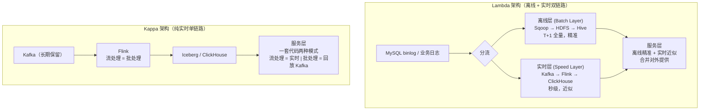
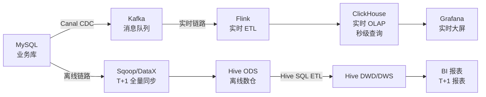
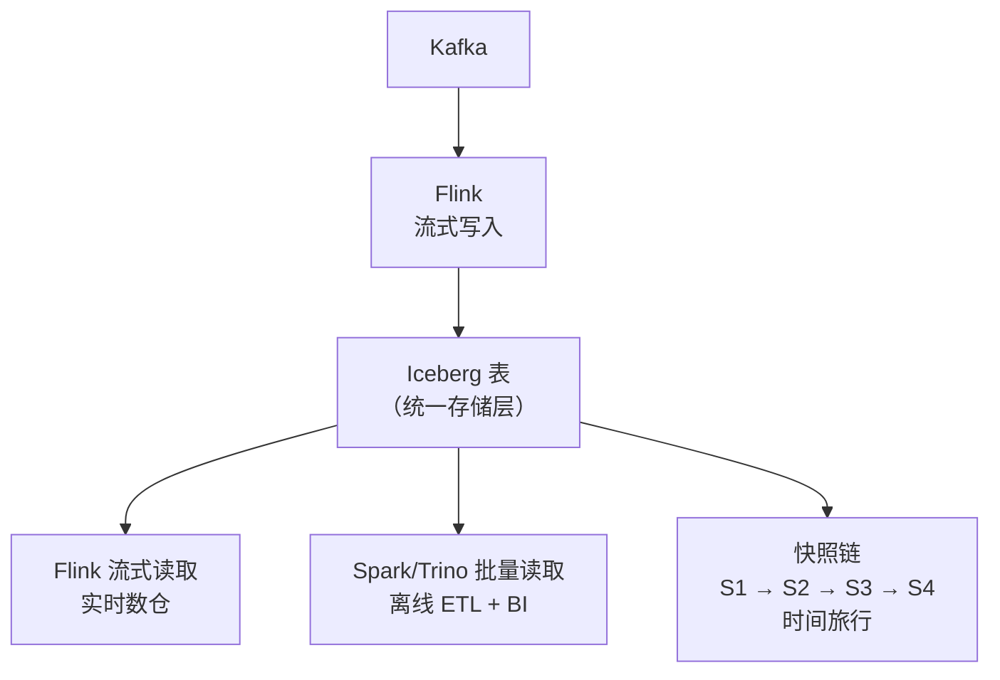
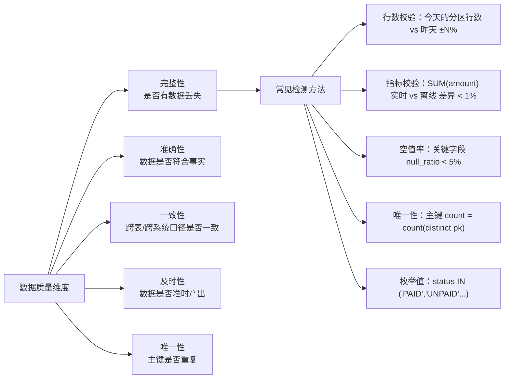
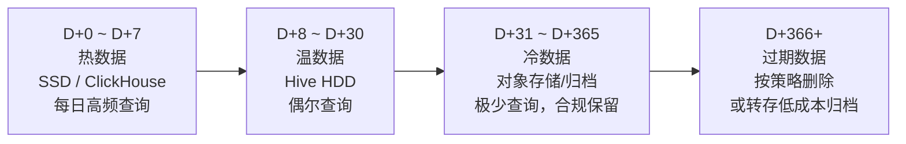
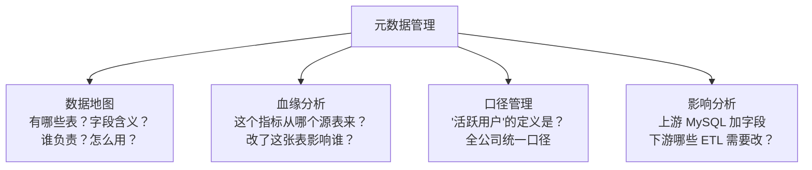
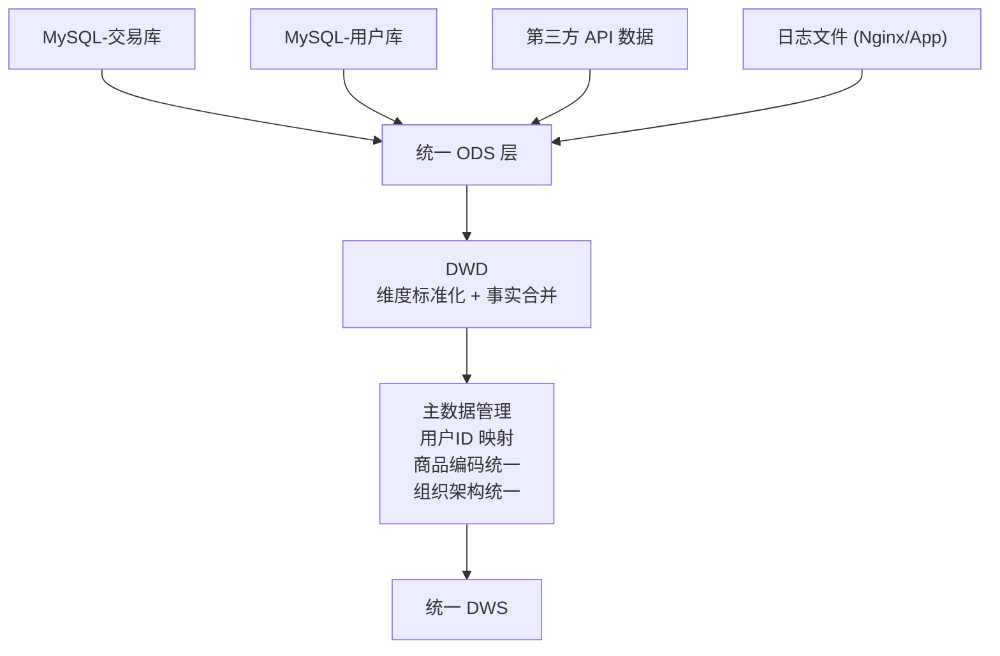

# 07 · 实时数仓与治理收尾

> **本章要回答一个终极问题：数据仓库不能只做"昨天的分析"——当业务需要秒级数据时，实时数仓怎么建？建完之后怎么治理？**
>
> 这是课程的收尾模块，覆盖"实时链路"和"数据治理"两大板块——前者是数仓的趋势方向，后者是数仓的长期保障。
>
> ```mermaid
> flowchart LR
>     A["实时数仓"] --> B["Kafka + Flink + ClickHouse<br/>经典 Lambda 架构"]
>     B --> C["Kafka → Flink → Iceberg<br/>湖仓一体流批统一"]
>     
>     D["数据治理"] -.-> E["数据质量监控<br/>DQC 规则/异常检测"]
>     D -.-> F["生命周期管理<br/>冷热分层/归档删除"]
>     D -.-> G["元数据管理<br/>血缘/口径/影响分析"]
>     D -.-> H["跨源整合<br/>统一ODS/主数据/口径对齐"]
>     
>     B -.->|数据质量监控也适用于实时| E
>     C -.->|湖仓融合| H
> ```
>
> **阅读建议**：§1-§2 是实时数仓核心技术（递进），§3-§6 是数据治理独立主题。§1 必须精读——实时数仓是面试中能拉开差距的核心内容。治理部分以理解概念和能讲清楚价值为主。
>
> **前置依赖**：L01 分层架构与数仓定义、L05 ETL 与离线链路。
>
> 覆盖原题：7, 20, 24, 27, 32, 33, 34, 40, 44, 46, 47。

---

## 1. 实时数仓架构

### 传统 T+1 太慢——实时数仓怎么建？Lambda 和 Kappa 有什么不同？

**实时数仓 = 把"凌晨跑批"改成"流式持续加工"，让数据从产生到可见的时间从小时缩到秒/分钟。**



| 维度 | Lambda | Kappa |
|------|--------|-------|
| 链路数量 | 2 条（离线 + 实时） | 1 条（纯实时） |
| 实时性 | 秒级（实时层） | 秒级 |
| 数据一致性 | 两套逻辑 → 口径可能不一致 | 一套逻辑 → 口径天然一致 |
| 维护成本 | 高（两套代码、两套存储） | 低（一套代码） |
| 离线回补 | 离线链路天然支持 | 需 Kafka 保留足够长历史 + 回放 |
| 适用场景 | Kafka 保留期短 或 需要离线做复杂计算 | Kafka 保留期长 + 流处理能力够 |
| 存储 | Hive(离线) + ClickHouse(实时) 双份 | Iceberg 统一存储 |

### 为什么 Lambda 仍然最常用？

**Kafka 保留全部历史数据的成本太高**（TB 级数据存 1 年），且复杂计算（如全量去重、多表交叉分析）在流处理中很难高效实现。Lambda 虽然维护成本高，但"离线保精准 + 实时保时效"的分工在实践中最稳妥。

**实际项目中的 Lambda 实现**：



### 实时数仓的分层怎么和离线对齐？

| 离线分层 | 实时分层 | 技术 |
|----------|---------|------|
| ODS（原始层） | Kafka Topic（消息缓冲） | Kafka |
| DWD（明细层） | Flink ETL 清洗后写入 Kafka/ClickHouse | Flink DataStream API |
| DWS（汇总层） | Flink 窗口聚合写入 ClickHouse | Flink Window + ClickHouse |
| ADS（应用层） | ClickHouse 物化视图 / Grafana | ClickHouse MV |

??? example "SQL/代码：Flink 实时数仓 DWD → DWS"
    ```sql
    -- ClickHouse 建表：DWD 明细层（ReplacingMergeTree 做幂等去重）
    CREATE TABLE dwd_ai_query_realtime (
        event_id        String,
        user_id         String,
        model_id        String,
        query_text      String,
        event_time      DateTime64(3),
        dt              Date DEFAULT toDate(event_time)
    ) ENGINE = ReplacingMergeTree()
    PARTITION BY dt
    ORDER BY (event_id);

    -- DWS 汇总层：物化视图做实时聚合
    CREATE MATERIALIZED VIEW dws_ai_query_minute
    ENGINE = AggregatingMergeTree()
    PARTITION BY dt
    ORDER BY (dt, hour_minute, model_id)
    AS SELECT
        toDate(event_time) AS dt,
        formatDateTime(event_time, '%H:%M') AS hour_minute,
        model_id,
        COUNT(1) AS query_count,
        uniqExact(user_id) AS user_count
    FROM dwd_ai_query_realtime
    GROUP BY dt, hour_minute, model_id;
    ```

??? tip "面试嘴替 — 实时数仓架构"
    **核心主张**：
    > "实时数仓的架构选择取决于业务对'一致性'和'时效性'的权衡。Lambda = 离线精准 + 实时近似（两条链路），Kappa = 一套代码流批统一（一条链路）。目前主流还是 Lambda——Kafka 全量存历史太贵，复杂计算在流处理中不高效。实时链路核心组件：Kafka 做消息缓冲 → Flink 做流式 ETL → ClickHouse/Doris 做实时 OLAP。"

    **常见追问 & 防御**：
    - 追问："Lambda 的两条链路数据对不齐怎么办？" → 答："实时链路用 T+1 离线数据做最终对账——凌晨离线跑完后，用离线数据覆盖实时数据（INSERT OVERWRITE）。如果每天对账差异 < 1%，说明链路健康。超过阈值告警排查。"
    - 追问："为什么选 ClickHouse 而不是 Doris/StarRocks？" → 答："选型取决于团队的运维能力和查询模式。ClickHouse 单表查询极快、物化视图灵活，但分布式 JOIN 弱；Doris/StarRocks 更接近传统数仓体验（标准 SQL、JOIN 强），但运维复杂度更高。我们的场景是时序聚合 + 低 JOIN，ClickHouse 最匹配。"

    **绑定项目**：
    > "我的核心项目就是实时数仓：MySQL binlog → Canal → Kafka → Flink → ClickHouse。Flink 消费 Kafka 做清洗、打宽（Async I/O 关联维表）、窗口聚合，结果写入 ClickHouse。离线链路用 Sqoop 同步到 Hive，凌晨跑 DWD/DWS/DM SQL。每天凌晨 4 点对账——实时和离线的指标差异在 0.5% 以内。"

    | 一般回答 | 优秀回答 |
    |---------|---------|
    | "用 Kafka+Flink+ClickHouse 建实时数仓。" | "实时数仓不是替换离线数仓，而是补充——Lambda 架构的精髓在于'离线保精准、实时保时效'。关键设计决策：Kafka 主题如何对应 ODS 层（一个业务表一个 topic），Flink 作业如何对应 DWD/DWS 层（DataStream API 做清洗，Window 做聚合），ClickHouse 如何对应 ADS 层（物化视图秒级刷新）。每天离线链路做全量对账，差异 > 1% 告警。" |

---

## 2. 湖仓融合（Iceberg 实时写入）

### Flink 直接写 Iceberg——这和传统 T+1 有什么本质不同？

**Flink + Iceberg 实现了"一套存储、两种消费"：同一张 Iceberg 表，流式读取做实时分析，批量读取做离线计算。**



**关键能力：**

| 能力 | 实现方式 | 价值 |
|------|---------|------|
| **流式写入** | Flink Iceberg Sink，checkpoint 触发 commit | 延迟分钟级 |
| **ACID 事务** | 乐观并发控制，snapshot 隔离 | 读写互不阻塞 |
| **时间旅行** | `SELECT * FROM table FOR VERSION AS OF snapshot_id` | 数据回溯、bug 恢复 |
| **增量读取** | 从指定 snapshot 读取变更数据 | 下游增量消费 |
| **Schema 演进** | 加列、改类型不重写数据 | 业务变更零成本 |

??? tip "面试嘴替 — 湖仓融合"
    **核心主张**：
    > "Flink + Iceberg 湖仓一体的核心价值：一套存储（Iceberg）、两种消费（流 + 批）、三个 ACID 能力（事务写入、时间旅行、Schema 演进）。和传统 Hive 的本质区别：Hive 的分区是目录级别的——改一个分区的数据其他分区无感知，Iceberg 是表级别的——每次写入产生一个新 snapshot，整个表的状态原子切换。"

    **绑定项目**：
    > "我项目中的 Flink + Iceberg 链路：Flink 流式消费 Kafka 写入 Iceberg，每分钟 checkpoint 触发 commit 生成新 snapshot。离线链路通过 Spark 读取 Iceberg 做批量 ETL。同一个 Iceberg 表支撑了实时（Flink 增量读）和离线（Spark 批量读）两个场景，避免了实时/离线两套存储口径不一致的痛点。"

---

## 3. 数据质量监控（DQC）

### 怎么保证数仓产出的数据是"对的"？光靠人工看报表不够

**数据质量监控 = 在数据链路的关键环节埋点检测，发现异常自动告警。**



**DQC 规则层级：**

| 层级 | 检测内容 | 实现方式 |
|------|---------|---------|
| **ODS 入仓** | 行数是否齐（和源表对比），是否有全量分区 | `source_count ≈ ods_count ±5%` |
| **DWD 加工** | 去重是否生效，脏数据比例 | `dwd_count ≤ ods_count` |
| **DWS 聚合** | 聚合值单调性（今天 >= 昨天 T-1 累计值） | `SUM(today) >= SUM(yesterday)` |
| **ADS 产出** | 关键指标波动率 | `ABS(today - yesterday) / yesterday ≤ 30%` |
| **跨层对账** | 实时 vs 离线数据差异 | `realtime_sum ≈ offline_sum ±1%` |

??? example "SQL：数据质量检测SQL示例"
    ```sql
    -- 规则 1：行数校验——今天的订单数不应比昨天少 30% 以上
    SELECT
        today_cnt,
        yesterday_cnt,
        ROUND((today_cnt - yesterday_cnt) * 100.0 / yesterday_cnt, 2) AS change_pct,
        CASE WHEN ABS(today_cnt - yesterday_cnt) * 1.0 / yesterday_cnt > 0.3 
             THEN 'ALERT' ELSE 'OK' END AS status
    FROM (
        SELECT
            (SELECT COUNT(1) FROM dwd_order_fact WHERE dt = '${today}') AS today_cnt,
            (SELECT COUNT(1) FROM dwd_order_fact WHERE dt = '${yesterday}') AS yesterday_cnt
    );

    -- 规则 2：空值率——关键字段空值比例不能超过 5%
    SELECT
        'user_id' AS col_name,
        ROUND(SUM(IF(user_id IS NULL, 1, 0)) * 100.0 / COUNT(1), 2) AS null_pct,
        CASE WHEN SUM(IF(user_id IS NULL, 1, 0)) * 1.0 / COUNT(1) > 0.05 
             THEN 'ALERT' ELSE 'OK' END AS status
    FROM dwd_order_fact WHERE dt = '${today}'
    UNION ALL
    SELECT
        'amount' AS col_name,
        ROUND(SUM(IF(amount IS NULL, 1, 0)) * 100.0 / COUNT(1), 2) AS null_pct,
        CASE WHEN SUM(IF(amount IS NULL, 1, 0)) * 1.0 / COUNT(1) > 0.05 
             THEN 'ALERT' ELSE 'OK' END
    FROM dwd_order_fact WHERE dt = '${today}';

    -- 规则 3：唯一性校验——主键不应该重复
    SELECT
        CASE WHEN COUNT(1) = COUNT(DISTINCT order_id) THEN 'OK' 
             ELSE CONCAT('DUPLICATE: ', CAST(COUNT(1) - COUNT(DISTINCT order_id) AS STRING))
        END AS pk_check
    FROM dwd_order_fact WHERE dt = '${today}';
    ```

??? tip "面试嘴替 — 数据质量监控"
    **核心主张**：
    > "数据质量监控不是事后检查，是嵌入 ETL 链路的自动化流程。每层 ETL 结束后自动跑 DQC 规则，异常自动告警、阻断下游。核心指标：行数波动率、空值率、唯一性、枚举值合法性、跨层对账差异。"

    **常见追问 & 防御**：
    - 追问："遇到数据质量问题怎么处理？" → 答："分级处理：P0（影响核心报表）→ 立即告警 + 阻断下游 + 回刷数据；P1（波动但可接受）→ 告警 + 延迟修复；P2（轻微异常）→ 记录日志周末修复。关键是'阻断下游'——宁可报表延迟，也不能用错误数据。"
    - 追问："怎么避免 DQC 规则的误告警？" → 答："规则设置弹性阈值——不是绝对值比较（>昨天就算异常），而是比例（> ±30% 才算异常）。特殊日期（大促/节假日）用白名单跳过低阈值规则。告警分级后，P2 不打电话、P0 才打电话。"

    **绑定项目**：
    > "我的项目在 Airflow 每个 DAG 末尾挂载 DQC Task：ODS 同步完后检查行数是否 ±20%（允许 MySQL 删除导致减少），DWD 加工后检查空值率和唯一性，DWS 汇总后检查指标单调性。实时链路用 Flink 自定义 Metric 上报（Counter 记录错误行数），Grafana 看板配置阈值告警。"

    | 一般回答 | 优秀回答 |
    |---------|---------|
    | "监控数据行数、检查空值。" | "数据质量监控是一个分层、分级、自动化的体系。分层：ODS/DWD/DWS/ADS 每层有不同的检查规则；分级：P0 阻断下游 P1 告警 P2 记录；自动化：DQC Task 嵌入 ETL 链路，异常自动通知 + 阻断。不是'出了问题再看'，而是'出问题前就拦截'——这是数据可信度的根本保障。" |

---

## 4. 生命周期管理

### 数仓数据只进不出，存储成本怎么控制？

**数据生命周期管理 = 热数据（SSD，高性能）→ 温数据（HDD，普通）→ 冷数据（归档存储，低成本）→ 删除**



| 策略 | 操作 | 适用 |
|------|------|------|
| **冷热分层** | 数据按时间自动迁移到低成本存储 | 所有数仓表 |
| **分区归档** | N 天前的分区迁移到归档存储 | Hive 分区表 |
| **数据删除** | 超过保留期的数据物理删除 | 日志/临时表 |
| **聚合降维** | 3 个月前的明细数据聚合为天粒度，删除明细 | DWD 事实表 |
| **压缩** | 冷数据用更高压缩比（zstd→gzip） | Parquet/ORC 文件 |

```sql
-- Hive 分区归档：30 天前的分区移到更低成本的存储
ALTER TABLE dwd_order_fact PARTITION (dt < '2024-06-01') 
SET LOCATION 'hdfs://cold-cluster/archive/dwd_order_fact/';

-- 删除超期数据（需确认合规要求）
ALTER TABLE dwd_order_fact DROP IF EXISTS PARTITION (dt < '2023-01-01');
```

??? tip "面试嘴替 — 生命周期管理"
    **核心主张**：
    > "生命周期管理的核心是冷热分层——热数据高性能、冷数据低成本。Hive 通过 SET LOCATION 将旧分区迁移到低成本存储；ClickHouse 通过 TTL 自动删除或归档过期数据；实时数据保留期短（Kafka 7 天，ClickHouse 30 天），离线保留期长（Hive 1-3 年）。"

---

## 5. 元数据管理

### 表越来越多、字段越来越多——元数据管理解决什么问题？

**元数据管理的四大核心价值：**



**血缘分析的价值（面试重点）：**

- **上游变更影响评估**：MySQL 删了一个字段 → 扫描血缘图，找出所有受影响的 Hive 表、ETL 任务、报表
- **指标溯源**：报表上的数字不对 → 顺着血缘反向追踪到源表和加工步骤
- **问题定位**：出问题时，问"这个指标从哪来"而不是"不知道，我只管这个表"

??? tip "面试嘴替 — 元数据管理"
    **核心主张**：
    > "元数据管理解决的是'数据以外的数据'——表结构、字段含义、血缘关系、指标口径。最核心的价值是血缘分析和影响评估：上游变更时知道下游谁受影响，报表出错时知道从哪追溯。"

    **常见追问 & 防御**：
    - 追问："元数据管理用什么工具？" → 答："大中型公司用 Atlas/DataHub（自动采集 Hive/Spark 的血缘），小型团队用 Excel/Wiki 也够（只要维护得好）。关键是'自动化采集'——手动维护的元数据永远是过时的。"

---

## 6. 跨源数据整合

### 多个业务系统的数据怎么融合到一个数仓里？

**跨源整合 = 统一 ODS 接入 + 统一主数据 + 口径对齐。**



**跨源整合的三大挑战与解法：**

| 挑战 | 解法 |
|------|------|
| **ID 不统一**（系统A用UUID，系统B用自增ID） | 建立 ID 映射表（MDM 主数据管理），ODS 入仓时统一映射 |
| **口径不一致**（系统A"活跃用户"=登录过，系统B=下单过） | 在 DWD 层统一口径定义，DWS 层只取 DWD 的输出 |
| **编码不一致**（性别用 0/1 vs M/F vs male/female） | DWD 标准化为统一编码，建立编码映射字典表 |
| **时区问题**（各系统时间戳时区不同） | ODS 入仓时统一转为 UTC+8，存储 TIMESTAMP 类型 |

??? tip "面试嘴替 — 跨源整合"
    **核心主张**：
    > "跨源整合不是简单的'把数据搬过来'——核心挑战是 ID 映射、口径统一、编码标准化。解法是三层防线：ODS 层保留原始格式（不丢失信息），DWD 层做标准化（统一映射 + 编码转换），DWS 层输出统一口径的指标。"

---

## 面试串讲（本章连贯表述）

> "实时数仓 + 数据治理是面试的'最后一公里'——前面的建模、ETL、性能优化都能讲，但如果最后不会讲'数据怎么治理'，面试官会觉得你只会建不会管。我建议的表述思路：先说实时数仓架构（Kafka→Flink→ClickHouse Lambda 架构），再说数据质量的自动化保障（每层 DQC + 阻断下游），最后说治理的长尾保障（冷热分层、元数据血缘、跨源统一口径）。"

> "绑定项目的秘诀：用你的 Kafka→Flink→ClickHouse 实时链路讲出一套完整的'建→跑→管'闭环——建（Lambda 架构设计）、跑（分层 ETL 实现）、管（DQC 监控 + 冷热分层 + 血缘管理）。当你把这三个环节串起来讲时，面试官会相信你真的做过完整项目。"

---

## 自测 Q&A

<details>
<summary><b>Q：Lambda 和 Kappa 架构的区别？为什么 Lambda 更常用？</b></summary>

A：Lambda 两条链路（离线+实时）→ 离线精准、实时快速，Kappa 一条链路（纯实时）→ 代码统一但 Kafka 存储历史成本高。Lambda 更常用因为 Kafka 全量存历史太贵 + 复杂计算（全量去重、多表交叉）在流处理中不高效。

</details>

<details>
<summary><b>Q：数据质量监控的核心指标和检测方法？</b></summary>

A：五维：完整性（行数校验）、准确性（指标对账）、一致性（跨表口径一致）、及时性（出品时间 SLA）、唯一性（主键去重）。实现：每层 ETL 后挂 DQC SQL Task，异常分级告警（P0 阻断下游、P1 告警、P2 记录）。

</details>

<details>
<summary><b>Q：冷热分层的策略？Hive 和 ClickHouse 分别怎么做？</b></summary>

A：热数据 SSD/ClickHouse（7 天内）、温数据 HDD/Hive（30 天内）、冷数据归档（1 年内）、过期删除（>1 年）。Hive 用 SET LOCATION 迁移分区，ClickHouse 用 TTL 自动删除。

</details>

<details>
<summary><b>Q：元数据管理的四大核心价值？</b></summary>

A：数据地图（表/字段/负责人）、血缘分析（字段从哪来/影响谁）、口径管理（统一指标定义）、影响分析（上游变更 → 下游影响评估）。最关键的是自动化采血——手动维护的元数据永远是过时的。

</details>

<details>
<summary><b>Q：跨源整合的三大挑战？</b></summary>

A：ID 不统一（MDM 主数据映射）、口径不一致（DWD 层统一）、编码不一致（标准化字典表）。解法：ODS 保留原始 → DWD 标准化 → DWS 统一口径。

</details>

<details>
<summary><b>Q：数据归档和数据删除怎么平衡成本和合规？</b></summary>

A：分层策略：D+7 热、D+30 温、D+365 冷、D+366 按合规要求决定删除或长期归档。DWD 明细表 3 个月后聚合保留、原始明细归档。关键原则：归档前通知所有下游消费者，避免他们突然查不到数据。

</details>

---

## 推荐源
- Apache Iceberg 官方文档：<https://iceberg.apache.org/docs/latest/>
- ClickHouse 实时数仓实践：<https://clickhouse.com/docs/zh/guides/developer/deduplication>
- 《阿里巴巴大数据之路》第 10 章——数据质量

!!! question "卡住了？"
    多流 JOIN 在实时数仓中的实现（双流 JOIN、维表 JOIN）、事件时间 vs 处理时间在实时数仓对账中的差异、Atlas/DataHub 的血缘自动采集原理——任意点直接问老师展开或出题。
