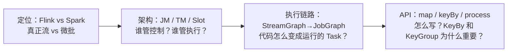
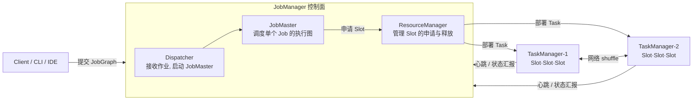
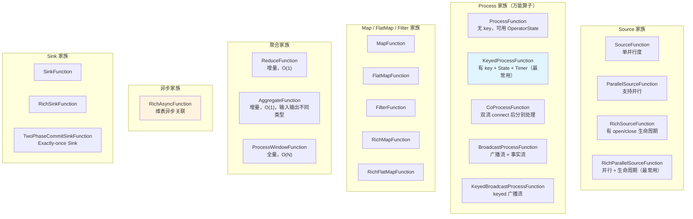
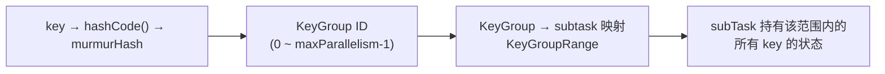
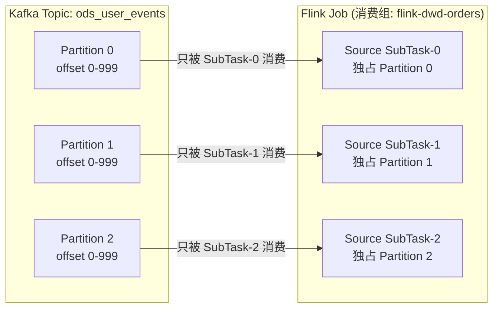

# 01 · 定位 / 架构 / DataStream API

> **本章要回答：Flink 到底是什么？你的代码（`env.execute`）背后，到底发生了什么？**
>
> 如果你只说"Flink 是流处理引擎"，面试官会追问三件事：和 Spark 到底差在哪？作业怎么跑起来的？KeyBy 为什么能和状态绑定？
> 这三个问题恰好是本章的三条主线——它们之间有明确的递进关系。



**阅读建议**：§1-§3 是面基础架构题的核心（必读），§4-§5 是 API 层面防守（结合代码内化）。

覆盖原题：1, 3, 29, 55, 68, 2, 4, 9, 12, 65。

---

## 1. Flink 定位与 Spark Streaming 对比

### Flink 和 Spark Streaming 在计算模型上的本质区别是什么？

**Flink 是真正流（record-by-record），Spark Streaming 是微批（micro-batch）。**

这句话你说了，面试官一定会追问"为什么真正流更好？"——你要的不是一句话鉴别，而是一个能说 3 分钟的回答：

**计算模型的差异**：

| | Flink | Spark Streaming |
|---|---|---|
| 处理方式 | 数据到达即处理，**逐条**通过 DAG | 把流切成固定间隔的**小批**（如每 1 秒一批） |
| 时延 | 毫秒级 | 秒级（最短受 batch 间隔限制） |
| 本质 | **流是一等公民**，批 = 有界流 | **批是一等公民**，流 = 无限个批 |

这会导致什么？

1. **乱序处理能力不同**：Flink 有原生 Event Time + Watermark，数据迟到也能按事件发生时间正确统计。Spark Structured Streaming 后来才补事件时间，但底层仍然是微批窗口。
2. **状态管理不同**：Flink 的状态是**一等公民**——KeyedState 按 key 自动隔离，并行度变化时通过 KeyGroup 重分配。Spark 早期的状态靠 RDD 缓存或外部存储。
3. **精确一次实现路径不同**：Flink 靠 Checkpoint Barrier 对齐 + 两阶段提交 Sink。Spark 靠 Checkpoint + 幂等/事务写。

??? example "代码：Flink pipeline vs Spark Streaming 伪代码"
    ```java
    // Flink：真正的逐条处理
    env.addSource(kafkaSource)           // 每条数据来就处理
       .map(e -> transform(e))           // 不等待 batch
       .keyBy(e -> e.key)
       .window(TumblingEventTimeWindows.of(Time.minutes(5)))
       .aggregate(...);

    // Spark Streaming：微批处理
    // JavaStreamingContext jssc = ...;
    // JavaInputDStream<String> lines = jssc.textFileStream("...");
    // lines.map(...).foreachRDD(rdd -> { ... });  // 每个 RDD 是一个 mini-batch
    ```

### Flink 的"流批一体"是怎么统一的？

Flink 的做法不是"流引擎 + 批引擎"，而是**只有流引擎**——批就是"有界流"。

```java
// 同一份代码
StreamExecutionEnvironment env = StreamExecutionEnvironment.getExecutionEnvironment();

// 读 Kafka → 流模式（无界流）
DataStream<String> stream = env.fromSource(kafkaSource, ...);

// 读文件 → 批模式（有界流，Flink 自动识别）
DataStream<String> batch = env.fromSource(fileSource, ...);

// 流模式下永不终止，批模式下数据读完自动结束
env.execute("my-job");
```

本质是**统一运行时**：用户代码 → `StreamGraph` → `JobGraph`，流和批共享同一套图。区别在底层调度（见 §3）。

??? tip "面试嘴替 — Flink 定位与 Spark 对比"
    **核心主张**（面试第一句就说对的）：
    > "Flink 是面向流式数据的分布式计算引擎，核心是真正逐条处理——数据到达即处理，不是微批。批被当成有界流统一进同一套运行时。事件时间、Watermark、状态管理、精确一次语义都是为实时场景原生设计的。"

    **常见追问 & 防御**：
    - 追问："Spark Structured Streaming 不是也能做事件时间吗？" → 答："能，但底层仍然是微批引擎。事件时间窗口触发依赖于 batch 边界，不是真正的流式触发。Flink 的窗口是 Watermark 驱动的——watermark 过了窗口结束边界即触发，不受 batch 间隔大小影响。"
    - 追问："项目里怎么选？" → 答："实时数仓、低时延指标、乱序容忍场景用 Flink。重离线批处理、ML 训练用 Spark。两者常共存，不是二选一——我们既有 Flink 实时链路，也有 Spark 离线补数。"

    **对比**：
    | 一般回答 | 优秀回答 |
    |---------|---------|
    | "Flink 是流处理，Spark 是批处理" | "Flink 以流为核心——逐条处理、Watermark 驱动窗口、KeyedState 按 key 隔离。Spark Streaming 是微批——把流切成小批，时延受 batch 间隔限制。Flink 的流批一体是把批当有界流跑同一套运行时，而非 Spark 的两套 API" |

---

## 2. Flink 架构：JobManager / TaskManager / Task Slot

### JobManager 和 TaskManager 各自负责什么？

**一句话**：JobManager 是大脑（控制面），TaskManager 是手脚（执行面）。



**三个角色各自在干什么？**

| 组件 | 归属 | 职责 |
|------|------|------|
| **Dispatcher** | JobManager | 接收客户端提交的作业，为每个 Job 启动一个 JobMaster |
| **JobMaster** | JobManager | 管理**单个 Job** 的执行图——将 JobGraph 转为 ExecutionGraph，协调 Checkpoint，监控 Task 状态 |
| **ResourceManager** | JobManager | 管理 TaskManager 的 Slot——申请和释放 |
| **TaskManager** | 独立进程 | 真正执行算子的 JVM 进程，内含多个 Task Slot |
| **Task Slot** | TaskManager 内 | 资源隔离单元——隔离内存，不隔离 CPU |

### Task Slot 到底隔离了什么？为什么不隔离 CPU？

**Slot 隔离的是托管内存（Managed Memory）**：每个 Slot 分到固定份额的内存，Slot 之间不会互相 OOM。

**为什么不管 CPU？** Slot 是内存资源的基本单位，CPU 由 TaskManager 内的线程池共享。如果 Slot 隔离 CPU，会导致资源碎片化——一个 Slot 闲着但 CPU 核不能用，另一种 Slot 打满但没 CPU 了。

### Slot Sharing：多个算子怎么塞进一个 Slot？

**默认开启的 Slot Sharing** 让同 Job 内不同算子的子任务共享一个 Slot。效果：

```
没有 Slot Sharing：Source 的 2 个 subTask 占 2 个 Slot，Map 的 2 个 subTask 再占 2 个 Slot → 需要 4 个 Slot
有 Slot Sharing：Source-0 和 Map-0 共享 Slot-0，Source-1 和 Map-1 共享 Slot-1 → 只需要 2 个 Slot
```

好处：**减少跨 Slot 网络开销**（同 Slot 的算子不经过网络），**提高资源利用率**（轻量算子和重量算子互补）。

### 并行度与 Slot 的数学关系

**硬约束**：`p_max ≤ TM数量 × taskSlots`。超过就提交失败。

```java
// 全局并行度
env.setParallelism(4);

// 算子级并行度覆盖全局值
source.setParallelism(8);  // Source 单独 8 并发
map.setParallelism(4);     // Map 回到 4 并发
```

??? tip "面试嘴替 — 架构与 Slot"
    **核心主张**（面试第一句就说对的）：
    > "JobManager 是控制面——Dispatcher 接收作业、JobMaster 调度执行图、ResourceManager 管 Slot 分配。TaskManager 是执行进程，内含多个 Task Slot——Slot 隔离内存不隔离 CPU。默认 Slot Sharing 下，同 Job 不同算子的子任务共享一个 Slot，减少跨 Slot 网络开销。"

    **常见追问 & 防御**：
    - 追问："Slot 和并行度什么关系？" → 答："并行度是算子拆成几个子任务。Slot 是物理执行容器。p_max ≤ 总 Slot 数，超过就起不来。Slot Sharing 下一条 pipeline 可以放进一个 Slot。"
    - 追问："为什么不隔离 CPU？" → 答："CPU 共享能避免资源碎片——轻量算子的空余 CPU 周期给重量算子用，整体吞吐更高。内存隔离是刚需（防 OOM 蔓延），CPU 不是。"
    - 追问："TM 和 JM 怎么协同？" → 答："JM 向 RM 申请 Slot，RM 在 TM 上分配 Slot → JM 把 Task 部署到 Slot → TM 执行 Task，定期心跳汇报状态。JM 通过心跳丢失判断 TM 是否存活。"

    **对比**：
    | 一般回答 | 优秀回答 |
    |---------|---------|
    | "JM 管调度，TM 跑任务" | "JM = 控制面（Dispatcher → JobMaster → RM），TM = 执行面（Slot 容器）。Slot 隔离内存不隔离 CPU，Slot Sharing 让 pipeline 中不同算子共享 Slot 减少网络开销" |

---

## 3. 执行链路：从代码到真正跑起来

### `env.execute()` 按下后，发生了什么？

你写的 `map.keyBy.window.sink` 在 `execute()` 之前只是一张"设计图"——`execute()` 之后才真正编译、优化、部署。


**三层图各自干了什么？**

| 图 | 阶段 | 做什么 |
|----|------|--------|
| **StreamGraph** | 客户端生成 | 用户代码直接映射——每个 `map/flatMap/keyBy` 是节点，数据流向是边 |
| **JobGraph** | 客户端优化后提交 | Operator Chain 合并（`map→filter→map` 合并成一个节点）、拆解迭代边 |
| **ExecutionGraph** | JobMaster 生成 | 真正的执行计划——每个算子按并行度展开成 N 个 `ExecutionVertex`，每个 Vertex 对应一个物理 Task |

**关键：什么情况下链在一起？** `map().filter().map()` 这串无 shuffle 的操作会被 Operator Chain 合并成一个 Task——同一线程顺序执行，零序列化、零网络传输。但如果中间插了 `keyBy()`（需要 shuffle），链就断了。

??? example "代码：WordCount 完整 Job（可运行）"
    ```java
    --8<-- "code/L01/job/WordCountJob.java"
    ```

??? tip "面试嘴替 — 执行链路"
    **核心主张**（面试第一句就说对的）：
    > "用户代码在 execute() 之前只是逻辑 DAG。execute() 后经历三层图：StreamGraph（代码映射）→ JobGraph（Operator Chain 合并优化）→ ExecutionGraph（按并行度展开成物理 Task）。JobMaster 把展开后的 Task 部署到 TaskManager 的 Slot 里执行。"

    **常见追问 & 防御**：
    - 追问："JobGraph 做了什么优化？" → 答："最主要的是 Operator Chain——把无 shuffle 的相邻算子（map→filter→map）合并成一个 Task，减少序列化和网络开销。并行度不同的、有 keyBy/rebalance 的就断链。"
    - 追问："ExecutionGraph 怎么保证并行度？" → 答："每个算子的并行度决定了它展开成几个 ExecutionVertex。JobMaster 根据 Slot 分布把 Vertex 分配到不同 TM。如果 Slot 不够，作业提交失败。"

    **对比**：
    | 一般回答 | 优秀回答 |
    |---------|---------|
    | "代码提交后就运行了" | "用户代码 = 逻辑 DAG。execute() 触发 StreamGraph → JobGraph(chain 优化) → ExecutionGraph(并行展开) → Task 部署到 Slot。三层图从逻辑到物理逐步细化，中间的 chain 优化能省掉大量序列化/网络开销" |

---

## 4. DataStream API 核心算子

### map、filter、flatMap、keyBy、process——这些算子各自解决什么问题？

| 算子 | 输入→输出 | 核心场景 |
|------|----------|---------|
| `map` | 一进一出 | 字段转换、类型转换、数据补齐 |
| `filter` | 一进零/一 | 脏数据过滤、事件类型筛选 |
| `flatMap` | 一进多出 | 拆分行、展开数组、分词 |
| `keyBy` | 按 key 哈希重分区 | 分组聚合的前提——相同 key 进同一 subTask |
| `process` | 一进任意出 | **最通用算子**——可拿 Context（时间戳、Watermark、Timer）、访问 State |
| `connect` | 双流合并（保留各自类型） | 双流不同数据结构时合并处理 |
| `union` | 多流合并（要求同类型） | 多个同构流汇总 |

### `process` 为什么是"万能算子"？

`map` 能做的 `process` 都能做，但 `process` 还能：
- 拿到 `Context.timestamp()` —— 当前数据的事件时间
- 拿到 `Context.timerService()` —— 注册定时器
- 访问 `getRuntimeContext().getState()` —— 读写 KeyedState

**代价**：`process` 比 `map` 开销稍大（多一层 Context 包装），所以在只需要转换时用 `map/filter`，需要状态、Timer 时才用 `process`。

??? example "代码：常用算子组合管道"
    ```java
    DataStream<String> source = env.socketTextStream("localhost", 9999);

    source
        .filter(s -> s != null && !s.trim().isEmpty())  // 过滤空行
        .flatMap((String line, Collector<String> out) -> {
            for (String word : line.split("\\s+")) {
                out.collect(word);                       // 拆分单词
            }
        })
        .returns(String.class)
        .map(word -> Tuple2.of(word, 1))                 // 转成 (word, 1)
        .returns(Types.TUPLE(Types.STRING, Types.INT))
        .keyBy(t -> t.f0)                                 // 按 word 分区
        .sum(1)                                           // 按 key 累加
        .print();
    ```

??? tip "面试嘴替 — DataStream API 算子"
    **核心主张**（面试第一句就说对的）：
    > "map/filter/flatMap 是无状态的转换算子。keyBy 是分区算子——按 key 哈希把数据路由到正确的 subTask，这是访问 KeyedState 的前提。process 是最通用的算子，Context 可以拿时间戳、注册 Timer、访问 State——但开销比 map 大。"

    **常见追问 & 防御**：
    - 追问："process 和 map 什么时候用哪个？" → 答："纯数据转换用 map（轻量）。需要状态、Timer、Context 元数据时用 process。process 每次调用都会创建 Context 包装，有少量开销。"
    - 追问："connect 和 union 什么区别？" → 答："connect 允许两条流的类型不同，输出时可分别处理。union 要求流的类型相同，背后就是简单合并。connect 用 CoProcessFunction，可以同时访问两条流的状态。"
    - 追问："`out.collect()` 是立即发送还是攒着统一发？和 Spark 的 `collect()` 一样吗？" → 答："Flink 的 `collect()` 调用一次就发送一次——逐条推送到下游，不是攒着批量发。同 Chain 内是直接内存传递（函数调用），跨 Chain 是写入网络缓冲区异步发送。和 Spark 的 `collect()` 完全不是一回事——Spark 的 `collect()` 是 Action，触发整个 DAG 执行并拉数据到 Driver；Flink 的 `collect()` 是逐条输出到下游算子。"

    **对比**：
    | 一般回答 | 优秀回答 |
    |---------|---------|
    | "map 是一对一，filter 是过滤" | "map/filter/flatMap 是无状态转换。keyBy 触发 shuffle 并建立 key→subTask 映射（KeyGroup 机制）。process 是万能算子——有 Context、Timer、State，代价也是最大的" |

### Flink Function 家族全景：自定义类型与 Rich 的含义

Flink 提供了丰富的自定义 Function 接口。理解它们的层级和"Rich"的含义，是写好生产级 Flink 代码的基础。

#### 家族全景图



#### "Rich" 到底是什么？

**Rich = 有生命周期 + 能访问 RuntimeContext。** 普通 Function 只有一个处理方法（如 `map()`），Rich Function 多了两个关键方法：

```java
public class MyRichMap extends RichMapFunction<Input, Output> {
    
    @Override
    public void open(Configuration parameters) throws Exception {
        // 算子初始化时调用一次
        // 这里可以：创建数据库连接、初始化 State、加载配置文件
    }
    
    @Override
    public Output map(Input value) throws Exception {
        // 每条数据调用一次（和普通 MapFunction 一样）
        return transform(value);
    }
    
    @Override
    public void close() throws Exception {
        // 算子关闭时调用一次：关闭连接、清理资源
    }
}
```

| | 普通 Function | Rich Function |
|---|---|---|
| **生命周期** | ❌ 无 | ✅ `open()` / `close()` |
| **访问 RuntimeContext** | ❌ 不能 | ✅ `getRuntimeContext()` |
| **访问 State** | ❌ 不能 | ✅ `getRuntimeContext().getState()` |
| **获取并行度/子任务编号** | ❌ 不能 | ✅ `getRuntimeContext().getNumberOfParallelSubtasks()` |
| **适用** | 纯无状态转换 | **生产主流**——有状态、需要连接、需要初始化 |

**生产代码几乎全用 Rich 版本**——因为总要访问 State 或创建外部连接。

#### 各家族选型指南

| 家族 | 最常用类 | 什么时候用 |
|------|---------|-----------|
| **Source** | `RichParallelSourceFunction` | 自定义数据源（生产优先用内置 `KafkaSource`） |
| **Process** | `KeyedProcessFunction` | 去重、累计、定时触发——**有 key + State + Timer 的主力算子** |
| **Process** | `CoProcessFunction` | 双流 `connect` 后分别处理 |
| **Process** | `BroadcastProcessFunction` | 规则广播 + 事实流匹配 |
| **Map/FlatMap/Filter** | `RichMapFunction` / `RichFlatMapFunction` | 需要 State 或外部连接的转换 |
| **聚合** | `AggregateFunction` + `ProcessWindowFunction` | combo 模式——增量预聚合 O(1) + 窗口上下文 |
| **异步** | `RichAsyncFunction` | 维表关联——异步查 Redis/HBase，不阻塞处理线程 |
| **Sink** | `TwoPhaseCommitSinkFunction` | Exactly-once Sink（如 Kafka 事务） |

#### 面试嘴替

> "Flink 的 Function 家族分普通版和 Rich 版——Rich 多了 `open()/close()` 生命周期和 `getRuntimeContext()`，能访问 State、获取并行度。生产代码几乎全用 Rich 版本。Process 家族里 `KeyedProcessFunction` 是最主力——有 key + State + Timer，去重和累计都靠它。聚合用 `AggregateFunction` 做增量 O(1)，维表关联用 `RichAsyncFunction` 异步不阻塞。"

---

## 5. KeyBy、KeyedStream 与 KeyGroup

### 为什么 keyBy 之后才能用 KeyedState？

**普通 DataStream 没有"key 归属"概念**——每条数据不知道自己是哪个 key 的，状态自然不知道按什么维度隔离。

`keyBy()` 干了三件事：
1. **哈希重分区**：计算 `key.hashCode()` → map 到目标 subTask
2. **返回 KeyedStream**：类型标记"这个流是按 key 分区的"
3. **激活 KeyedState**：`getRuntimeContext().getState()` 这里才能拿到按 key 隔离的状态

### KeyGroup 机制：并行度变化时状态怎么不丢？



**KeyGroup 是 key 和 subTask 之间的中间层**：

- Flink 把 key 的 hash 空间预先分成 `maxParallelism` 个 KeyGroup（默认 128，可配到 32768）
- 每个 subTask 负责连续的 KeyGroup 范围
- **并行度变化时**：只是 KeyGroup 范围重新分配，key 仍然属于相同的 KeyGroup → 状态可以从原 subTask 迁移到新 subTask

```
并行度=2 时：SubTask#0 管 KeyGroup[0..63], SubTask#1 管 KeyGroup[64..127]
并行度=4 时：SubTask#0 管 [0..31], SubTask#1 管 [32..63], #2 管 [64..95], #3 管 [96..127]
```

**为什么能无缝迁移？** key 的 KeyGroup ID 没变！从 Savepoint 恢复时，新 DAG 重新算 KeyGroup → subTask 映射，按 KeyGroup 把状态分配给新 subTask。

??? tip "面试嘴替 — KeyBy 与 KeyGroup"
    **核心主张**（面试第一句就说对的）：
    > "KeyBy 做三件事：哈希分区、返回 KeyedStream、激活按 key 隔离的 KeyedState。底层通过 KeyGroup 机制实现 key→subTask 的灵活映射——并行度变化时只是 KeyGroup 范围重新分配，key 的归属 KeyGroup 不变，状态可以无缝迁移。"

    **常见追问 & 防御**：
    - 追问："KeyGroup 和并行度什么关系？" → 答："maxParallelism 决定 KeyGroup 总数（默认 128，可配）。当前并行度决定每个 subTask 分到几个连续的 KeyGroup。KeyGroup 数量必须 ≥ 当前并行度。"
    - 追问："KeyBy 的底层是单纯 hashCode 吗？" → 答："先 hashCode()，再 murmurHash 散列化——避免用户实现的 hashCode() 不均匀导致数据倾斜。最后取模映射到 KeyGroup。"

    **对比**：
    | 一般回答 | 优秀回答 |
    |---------|---------|
    | "keyBy 按 key 分区" | "keyBy = 哈希分区 + KeyedStream + KeyedState 激活。底层 KeyGroup 机制：key → murmurHash → KeyGroup → subTask。并行度变化时 KeyGroup 范围重分配，key 归属不变，状态能迁移" |

---

## 6. Kafka 并行消费：多个 Job、同一个 Topic、各自独立

### 多个 Flink Job 读同一个 Kafka Topic，它们会互相干扰吗？

**不会。** 这是 Kafka 消费组机制的核心价值。

```
Topic: ods_user_events (3 分区)

消费组: flink-dwd-orders    → offset: p0=1000, p1=800,  p2=1200
消费组: flink-dwd-payments  → offset: p0=500,  p1=300,  p2=900
消费组: flink-dws-daily     → offset: p0=2000, p1=1800, p2=2200
```

每个 Flink Job 是一个**独立的 Kafka consumer group**。不同 Job 的消费进度完全独立——DWD-orders 消费到 offset 1000 不影响 DWD-payments 从 offset 500 开始。同一份 Kafka 数据可以被多个下游 Job 独立消费，互不干扰。

### 同一个 Job 内，怎么并行读一个 Topic 的多个分区？



**Kafka 规则：同一个消费组内，一个分区只能被一个消费者消费。** Flink 利用这个规则：Source 并行度 ≤ 分区数时，每个 SubTask 独占一个分区。三个 SubTask 同时消费三个分区——**分区级别的并行**，吞吐量翻倍。

| Source 并行度 vs 分区数 | 效果 |
|------------------------|------|
| Source 并行度 **=** 分区数 | ✅ **最优**——每个 SubTask 独占一个分区，CPU 利用率 100% |
| Source 并行度 **<** 分区数 | ⚠️ 某个 SubTask 扛多个分区——成为瓶颈，其他 SubTask 空转 |
| Source 并行度 **>** 分区数 | ❌ 多余的 SubTask 空闲——浪费资源 |

**这就是 Flink 提高 Source 端吞吐量的核心方式**：Source 并行度 = Kafka 分区数，每个 SubTask 独占一个分区并行消费。如果需要更高的 Source 吞吐量，**先增加 Kafka 分区数，再提高 Source 并行度**——分区数是并行度的上限。

### 和 Operator State 的关系

每个 Source SubTask 的消费进度（offset）存在 **OperatorState** 中，随 Checkpoint 一起备份。故障恢复时，每个 SubTask 从自己记录的 offset 继续消费。这就是为什么 Flink 能从 Checkpoint 精确恢复消费位点——offset 是状态的一部分。

---

## 面试串讲

> "Flink 是真正流处理引擎——逐条处理不是微批，以流为核心把批当有界流统一。JobManager（控制面：Dispatcher→JobMaster→RM）管调度，TaskManager（执行面：Slot 容器）跑算子。
>
> 用户代码在 execute() 后经历三层图：StreamGraph→JobGraph（Operator Chain 合并）→ExecutionGraph（按并行度展开成物理 Task），部署到 TaskManager 的 Slot 中。Slot 隔离内存不隔离 CPU，Slot Sharing 让 pipeline 共享 Slot 省网络开销。
>
> API 层面：map/filter/flatMap 无状态转换，keyBy 是状态的分水岭——底层靠 KeyGroup 实现 key→subTask 映射，并行度变化时状态能无缝迁移。process 是万能算子，有 Context/Timer/State，但开销最大。"

---

## 自测（先口述，再点开）

<details>
<summary><b>Q：Flink 和 Spark Streaming 在"计算模型"和"精确一次"上的本质区别？</b></summary>

A：Flink 是真正流——逐条处理，数据到达即处理。Spark Streaming 是微批——流切成固定间隔小批，时延受 batch 间隔限制。

精确一次：Flink 靠 Checkpoint Barrier 对齐 + 两阶段提交 Sink（内置）。Spark Structured Streaming 靠 Checkpoint + 幂等/事务写。两者都能做到，但实现路径不同——Flink 的 Barrier 是注入数据流的，Spark 的是 RDD lineage + 事务。

</details>

<details>
<summary><b>Q：JobManager 和 TaskManager 各自负责什么？一次作业从提交到运行经历了什么？</b></summary>

A：JM = 控制面（Dispatcher 接收→JobMaster 调度→RM 管 Slot）。TM = 执行面（Slot 容器，跑 Task）。

链路：Client 生成 JobGraph（StreamGraph 经 chain 优化）→ 提交 JM → JobMaster 向 RM 申请 Slot → Task 部署到 TM 的 Slot → 算子链式执行 → TM 间网络 shuffle。

</details>

<details>
<summary><b>Q：Task Slot 隔离的是什么？为什么不隔离 CPU？Slot Sharing 有什么好处？</b></summary>

A：Slot 隔离的是托管内存——防 OOM 蔓延。不隔离 CPU 是因为 CPU 共享能避免资源碎片化（轻量算子的空余 CPU 给重量算子用）。

Slot Sharing 让同 Job 不同算子的子任务共享一个 Slot——把 pipeline 放进同一个 Slot，减少跨 Slot 网络/序列化开销，提升资源利用率。

</details>

<details>
<summary><b>Q：keyBy 之后的数据去哪了？为什么 keyBy 后才能用 KeyedState？</b></summary>

A：keyBy 做哈希重分区——相同 key 进同一 subTask。然后返回 KeyedStream 激活按 key 隔离的 KeyedState。

普通 DataStream 没有"key 归属"概念，状态不知道怎么按维度隔离。KeyedStream 是 KeyedState 的前提——`getRuntimeContext().getState()` 只能在 keyBy 后调用。

</details>

<details>
<summary><b>Q：KeyGroup 是用来解决什么问题的？并行度从 2 变 4，状态怎么迁移？</b></summary>

A：KeyGroup 是 key 和 subTask 之间的中间层。key → murmurHash → KeyGroup ID → subTask。

并行度 2→4：每个 subTask 原来管 64 个 KeyGroup，现在管 32 个。key 的 KeyGroup ID 没变，但 KeyGroup→subTask 的映射变了——状态按 KeyGroup 从原 subTask 迁移到新 subTask，不会丢。这正是 Savepoint 能改并行度恢复的原理。

</details>

<details>
<summary><b>Q：Operator Chain 是什么？什么时候会断链？</b></summary>

A：相邻算子（无 shuffle、并行度相同）被合并成一个 Task 在同一线程顺序执行——零序列化、零网络。

断链条件：keyBy()/rebalance()（非 FORWARD 分发）、并行度不同、不同 SlotSharingGroup、下游多输入、手动 disableChaining()。

</details>

---

## 推荐源
- Flink 架构总览：<https://nightlies.apache.org/flink/flink-docs-stable/docs/concepts/flink-architecture/>
- DataStream API：<https://nightlies.apache.org/flink/flink-docs-stable/docs/dev/datastream/overview/>
- Task Slot 与资源：<https://nightlies.apache.org/flink/flink-docs-stable/docs/concepts/flink-architecture/#task-slots-and-resources>

!!! question "卡住了？"
    StreamGraph → JobGraph 的优化细节（迭代边拆解、chain 算法）、ExecutionGraph 的 failover region 划分、KeyGroup 分配公式——任意点直接问老师展开或出题。
