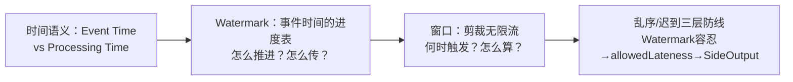
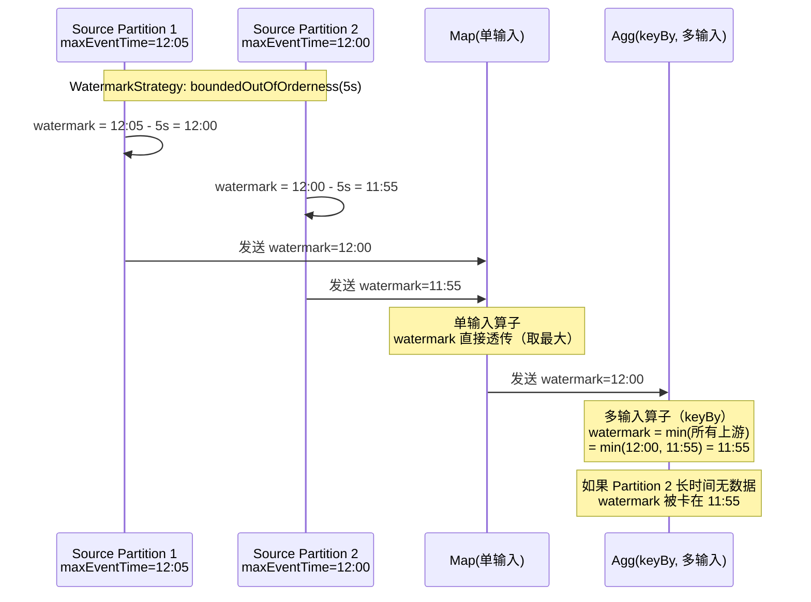
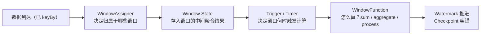
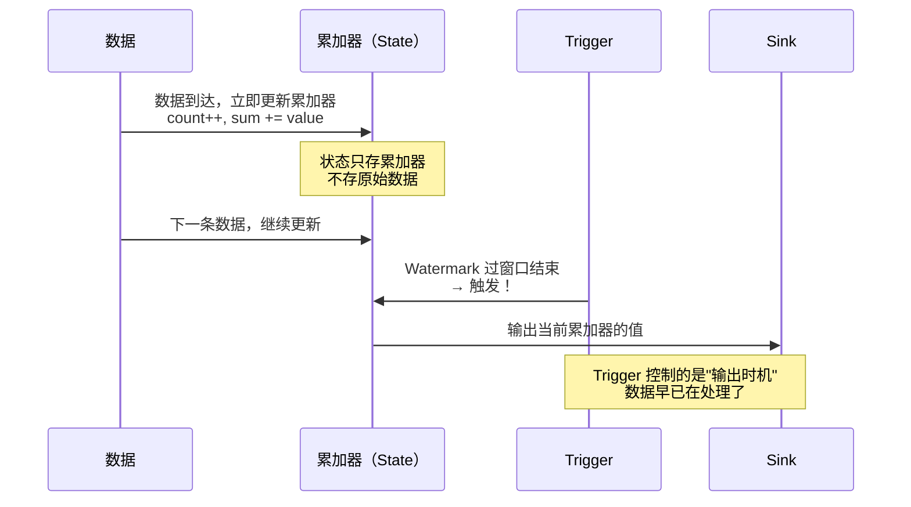
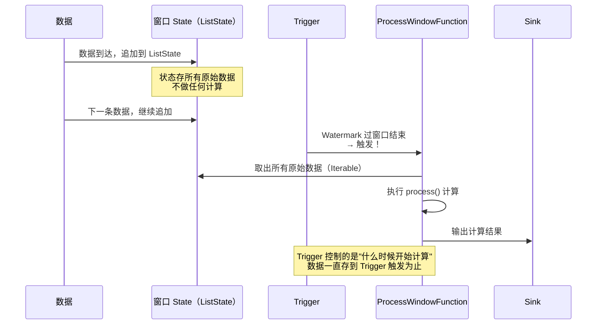
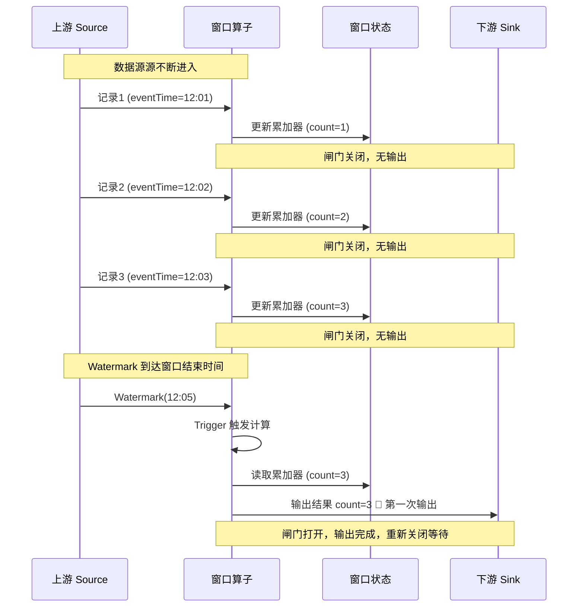
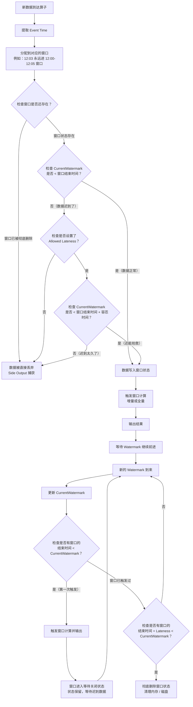
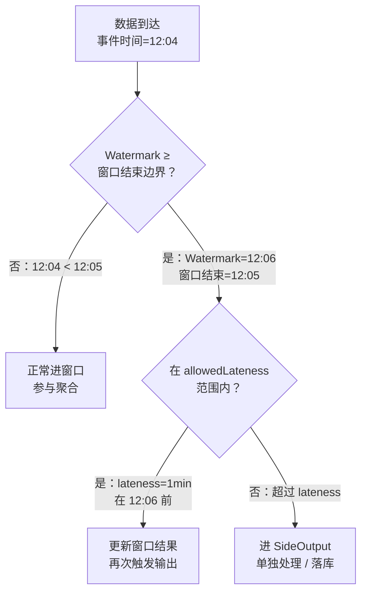
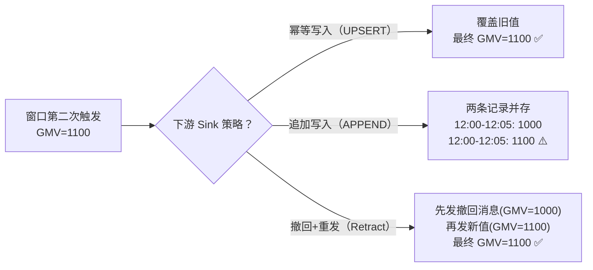

# 02 · 时间语义 / Watermark / 窗口

> **本章要回答：Flink 怎么知道"现在是几点"？窗口什么时候该触发？数据来晚了怎么办？**
>
> 这三个问题是实时计算中最容易出错的——选错时间语义，指标对不上；Watermark 没配好，窗口永远不会触发；迟到数据直接丢弃，口径有缺口。



**阅读建议**：§1-§2 是基础（必读），§3-§4 是窗口机制和迟到处理（核心高频），按顺序递进。

覆盖原题：7, 22, 8, 27, 53, 69, 6, 15, 44, 52。

---

## 1. 时间语义

### Event Time 和 Processing Time 的本质区别是什么？

| 语义 | 谁说了算 | 典型场景 | 误区 |
|------|---------|---------|------|
| **Event Time** | **数据自带的时间戳**（事件发生的真实时刻） | 实时数仓指标——GMV、UV、转化率 | 不是"数据到达 Flink 的时间" |
| **Processing Time** | **Flink 算子所在机器的系统时钟** | 简单告警、速率监控 | 无法反映业务真实时刻 |
| **Ingestion Time** | 数据进入 Flink Source 的时刻 | 介于两者之间，很少用 | 和 Event Time 容易混淆 |

### 为什么实时数仓必须用 Event Time？

**假如你用 Processing Time 统计"过去 5 分钟的 GMV"：**
- 数据 A（事件时间 12:00）因为网络抖动，12:08 才到 → 被算进"12:05-12:10"窗口
- 数据 B（事件时间 12:04）在 12:05 准时到 → 被算进"12:00-12:05"窗口

**结果**：两个同时发生的订单被分到不同窗口。你的"过去 5 分钟 GMV"和业务真实发生的 GMV 对不上——口径就乱了。

Event Time 纠正了这个错误：不管数据几点到，按事件时间分配窗口 → 口径一致。

??? tip "面试嘴替 — 时间语义"
    **核心主张**（面试第一句就说对的）：
    > "实时数仓默认选 Event Time——指标必须反映业务真实发生时刻。Processing Time 只看机器时钟，乱序到达会导致数据被分到错误窗口，口径失真。只有超低时延告警且业务容忍才用 Processing Time。"

    **常见追问 & 防御**：
    - 追问："Event Time 依赖数据自带时间戳，如果时间戳不准怎么办？" → 答："加一层数据校验——时间戳未来的、远早于当前 Watermark 的、null 的，用 SideOutput 分流处理。这是数据质量的事，不能用 Processing Time 逃避。"
    - 追问："三种时间语义能混用吗？" → 答："一个作业统一用一种。Event Time 窗口里混 Processing Time Trigger 会破坏语义——不推荐。"

    **对比**：
    | 一般回答 | 优秀回答 |
    |---------|---------|
    | "Event Time 按事件时间，Processing Time 按系统时间" | "Event Time 用数据自带时间戳分配窗口——乱序到达也能按真实发生时刻正确统计，保证口径一致。Processing Time 看机器时钟，数据迟到就会分到错误窗口——对实时数仓指标是致命的" |

---

## 2. Watermark：事件时间的进度表

### 什么是 Watermark？它解决了什么问题？

**Watermark 是一个带时间戳的进度标记**：告诉算子"事件时间已经推进到 T，之后不会再收到 ≤ T 的数据"。

### 没有 Watermark 会怎样？

**窗口永远不会触发。** 事件时间窗口的触发条件是"Watermark ≥ 窗口结束边界"。没有 Watermark → 事件时间不前进 → 窗口永远不关闭 → 数据永远出不来。

### Watermark 是怎么生成和传播的？



**关键细节**：

- **单输入算子**：Watermark **取最大值直接透传**——上游给了 watermark=12:00，就广播 watermark=12:00。
- **多输入算子（keyBy 后）**：Watermark **取所有上游的最小值**。为什么？因为一个上游说"之后没有 ≤12:00 的数据"，另一个才说"之后没有 ≤11:55 的数据"——全局只能认为还可能有 ≤11:55 的数据没到。**最小值保证安全性**。
- **空闲分区问题**：某个 Kafka 分区长期无数据 → 它的 Watermark 不前进 → 全局 Watermark 被这个最小值拖住 → 窗口永不触发。解法：`withIdleness(Duration.ofMinutes(1))`——标记为空闲后忽略它。

### Watermark 策略怎么选？

| 策略 | 公式 | 场景 |
|------|------|------|
| **单调（升序）** | `watermark = maxEventTime - 0` | 数据完全有序（极少） |
| **有界乱序** | `watermark = maxEventTime - 容忍值` | **生产默认**——允许乱序 5s |
| **自定义** | 按业务逻辑生成 | 特殊水位线 |

```java
WatermarkStrategy<Event> wm = WatermarkStrategy
    .<Event>forBoundedOutOfOrderness(Duration.ofSeconds(5))   // 乱序容忍 5s
    .withTimestampAssigner((e, ts) -> e.getEventTime())        // 从数据中取事件时间
    .withIdleness(Duration.ofMinutes(1));                     // 空闲分区 1min 后忽略
```

??? tip "面试嘴替 — Watermark"
    **核心主张**（面试第一句就说对的）：
    > "Watermark 是事件时间的进度标记——告诉算子'现在事件时间推进到哪儿了'。单输入算子取最大值透传，多输入算子取所有上游最小值（保证安全性）。空闲分区会拖住全局 Watermark，用 withIdleness 忽略它。"

    **常见追问 & 防御**：
    - 追问："多输入为什么取最小值？" → 答："安全性——某个上游的 Watermark 小说明它还有更早的数据没到。全局取 min 保证不会因为'急着触发窗口'而漏掉迟到数据。代价是'木桶效应'——最慢的上游决定全局进度。"
    - 追问："乱序容忍设多大合适？" → 答："看你的数据在实际环境中的最大乱序时长。通常是分钟级以内——设 5s-30s 覆盖 90% 的乱序。太大的话窗口触发过慢，失去实时性。"
    - 追问："Watermark 是全局唯一的吗？" → 答："不是——每个 Source subTask 独立生成，沿数据流向下游传播。keyBy 后的多输入算子取 min。"

    **对比**：
    | 一般回答 | 优秀回答 |
    |---------|---------|
    | "Watermark 表示事件时间进度" | "Watermark = maxEventTime - 乱序容忍。单输入透传最大，多输入取上游最小值——这是安全性设计。空闲分区会拖住全局，用 withIdleness 忽略。没有 Watermark 事件时间窗口永不触发" |

---

## 3. 窗口机制

### 为什么需要窗口？一条数据在窗口里经历了什么？

**无界流无法做全量聚合**（永远等不到"数据结束"那一刻）。窗口把无限流切成有限集合，在集合上聚合。



### 四种窗口类型，各适合什么场景？

| 类型 | 特征 | 一条数据进几个窗口 | 典型用法 |
|------|------|------------------|---------|
| **滚动窗口 Tumbling** | 固定大小，不重叠 | **1 个** | "每 5 分钟的 GMV" |
| **滑动窗口 Sliding** | 固定大小，可重叠 | **可能多个** | "过去 10 分钟，每分钟更新一次" |
| **会话窗口 Session** | 按活跃间隔 gap 切分 | 1 个 | "用户活跃时段"（无自然边界） |
| **全局窗口 Global** | 无自然边界 | 1 个 | 需自定义 Trigger（极少单独用） |

### 增量聚合 vs 全量缓存：怎么选？

| 方式 | 做法 | 状态大小 | 适用 |
|------|------|---------|------|
| `reduce`/`aggregate` | 每条数据来，更新累加器 | O(1)——只存一个中间值 | **生产首选**，注意 aggregate 的输入/输出类型可不同 |
| `process` | 缓存窗口内所有元素 | O(N)——存全部数据 | 需要全量数据才能算（中位数、排序 TopN） |
| **组合**：`aggregate + process` | aggregate 预聚合，process 补窗口时间 | O(1) | **最优**——兼顾性能和上下文 |

```java
// 增量聚合 + 窗口上下文（推荐组合）
stream.keyBy(Event::getUserId)
    .window(TumblingEventTimeWindows.of(Time.minutes(5)))
    .aggregate(
        new MyAggregateFunction(),  // 累加：count + sum
        new MyWindowFunction()       // 补充：windowStart, windowEnd
    );
```

??? tip "面试嘴替 — 窗口机制"
    **核心主张**（面试第一句就说对的）：
    > "窗口把无限流切成有限集合做聚合。Tumbling 固定不重叠，Sliding 可重叠（一条数据进多个窗），Session 按活跃间隔切分。聚合优先用 incremental aggregate——每条数据更新累加器，状态 O(1)。需要窗口时间等上下文时组合 ProcessWindowFunction。"

    **常见追问 & 防御**：
    - 追问："滑动窗口一条数据进几个窗？" → 答："size/slide 决定了进几个。size=10min, slide=5min → 每 5 分钟一个窗，窗口长 10 分钟→ 数据最多进 2 个窗。"
    - 追问："为什么要 combo（aggregate + process）？" → 答："aggregate 做高效预聚合（O(1) 状态），process 负责补充窗口起止时间和上下文信息（只在触发时执行一次）。单独用 process 要缓存全窗元素——状态 O(N) 在大窗口下容易 OOM。"

    **对比**：
    | 一般回答 | 优秀回答 |
    |---------|---------|
    | "窗口就是一段时间内的数据集合" | "窗口 = Assigner 分配 + State 存中间结果 + Trigger 触发 + Function 计算。Tumbling 不重叠一条数据进 1 个窗，Sliding 可重叠。增量聚合 O(1) 状态是生产首选——combo aggregate+process 兼顾性能和上下文" |

### Trigger 系统：窗口不一定只有"到时间才触发"

窗口默认是 Watermark 过了窗口结束边界才触发——但这不是唯一方式。

| Trigger | 触发条件 | 场景 |
|---------|---------|------|
| **EventTimeTrigger**（默认） | `watermark ≥ window.end` | Event Time 窗口 |
| **ProcessingTimeTrigger** | Processing Time 到点 | Processing Time 窗口 |
| **CountTrigger** | 窗口内元素数 ≥ N | 按数量触发 |
| **DeltaTrigger** | 和上次触发的结果差异 ≥ 阈值 | 阈值触发（如"金额累积到 10000 元就输出"） |
| **PurgingTrigger** | 包装另一个 Trigger，触发后**清空窗口状态** | 不想保留窗口状态的场景 |

**自定义 Trigger 的陷阱**：如果自定义 Trigger 不返回 `FIRE` 也不返回 `CONTINUE`，窗口可能永远不触发或触发后不清理——状态泄漏。

```java
// 自定义 Trigger：每 100 条触发一次
stream.keyBy(...)
    .window(TumblingEventTimeWindows.of(Time.minutes(5)))
    .trigger(CountTrigger.of(100));   // 每满 100 条触发一次（仍受 Watermark 约束）
```

### Trigger 对增量聚合和全量聚合的作用完全不同

**这是面试中最容易被忽略的知识点**——很多候选人知道 Trigger 的类型表，但说不清 Trigger 对 `reduce/aggregate` 和 `process` 的作用有什么区别。

#### 增量聚合（Reduce/AggregateFunction）+ Trigger



**核心**：数据进窗口后**立即被处理**（更新累加器），窗口状态只存累加器。Trigger 的任务是决定**什么时候把累加器里的值吐出来**。

| Trigger 行为 | 增量聚合的表现 |
|-------------|-------------|
| 默认 EventTimeTrigger | watermark 过窗口结束时输出累加器的最终值 |
| CountTrigger(10) | 每满 10 条输出一次累加器的当前快照（中间结果） |
| 多次触发 | 每次输出累加器的当前值——因为累加器一直在被更新 |

#### 全量聚合（ProcessWindowFunction）+ Trigger



**核心**：数据进窗口后**只存储不计算**。Trigger 触发时，Flink 才从状态中取出所有原始数据，调用 `process()` 执行计算。

| Trigger 行为 | 全量聚合的表现 |
|-------------|-------------|
| 默认 EventTimeTrigger | watermark 过窗口结束时，取出全量数据，计算并输出 |
| CountTrigger(10) | 每满 10 条取出当前 10 条数据计算一次 |
| 多次触发 | 每次都是基于全量数据重新计算——如果之前输出过中间结果，中间结果不会被复用 |

#### 对比总结

| 维度 | Reduce/AggregateFunction | ProcessWindowFunction |
|------|------------------------|----------------------|
| **数据到达时** | 立即增量计算，更新累加器 | 只存储原始数据到状态 |
| **窗口状态内容** | 累加器（一个值，O(1)） | 所有原始数据（ListState，O(N)） |
| **Trigger 的作用** | 控制**输出累加器的时机** | 控制**开始计算全部数据的时机** |
| **计算发生时间** | 数据到达时就已经在算了 | 只在 Trigger 触发时才计算 |
| **多次触发** | 每次输出当前累加器的快照值 | 每次输出基于全量数据的计算结果 |
| **内存/状态开销** | 低（只存累加器） | 高（存所有数据，大窗口易 OOM） |

**这就是为什么 combo（aggregate + process）是最优解**：aggregate 做高效预聚合（O(1) 状态），process 只在触发时执行一次，补充窗口时间等上下文信息。Trigger 对 aggregate 只控制输出时机（累加器一直在更新），对 process 控制计算时机（数据一直存到触发）。

### 窗口的"闸门效应"：下游什么时候能看到数据？

**这是理解 Flink 窗口本质的关键问题**。窗口算子的上游是逐条流（record by record），窗口状态也是逐条更新——但下游 Sink **只在 Trigger 触发时才收到输出**。



**三个关键洞察**：

1. **状态处理是流的，数据传递是"批的"**：每条数据到达时，窗口状态立即更新（流的思想）。但下游算子只在 Trigger 触发时才收到数据——在两次触发之间，下游完全不知道上游发生了什么。这就是 Flink 窗口的"闸门效应"。

2. **下游不是持续接收数据**：如果你有 `source → window → sink` 的管道，sink 不是每秒都在写数据。它只在每个窗口触发时写一次（或多次，如果设置了 allowedLateness）。窗口之间的时间，sink 是空闲的。

3. **这不是微批，而是"增量结果"**：窗口触发时输出的不是一堆原始数据（那是 Spark 的微批），而是**一个聚合结果**。数据在窗口内部已经被增量处理了（累加器一直在更新），只是结果被"按住"直到 Trigger 释放。

### 这是流批一体的体现吗？

**不是传统意义上的流批一体，但确实体现了 Flink 窗口的"流中带批"特性。**

| 维度 | Flink 窗口 | Spark 微批 | 纯流处理（无窗口） |
|------|-----------|-----------|-----------------|
| **状态处理** | 流式（逐条更新累加器） | 批式（一批到了再算） | 流式 |
| **输出时机** | Trigger 触发（像批） | 每个 batch 结束（像批） | 数据到达即输出 |
| **输出内容** | **聚合结果**（增量值） | 一批数据或聚合结果 | 每条数据 |
| **下游视角** | 间歇性收到结果 | 间歇性收到结果 | 持续收到数据 |

**面试说辞**：

> "Flink 窗口的状态处理是流的——每条数据到达立即更新累加器。但输出是'闸门式'的——只在 Trigger 触发时向下游发送聚合结果，在两次触发之间下游完全空闲。这不是微批——因为输出的是增量聚合结果而不是原始数据，状态已经在窗口内部被流式处理了。如果下游需要持续看到中间结果，可以自定义 Trigger（如 CountTrigger(10) 每 10 条触发一次），但会牺牲结果的完整性。"

### Session 窗口的动态合并机制

Session 窗口和 Tumbling/Sliding 最本质的区别：**窗口边界是动态的**。

```
事件流：A(12:00) —— 间隔 4min —— B(12:04) —— 间隔 8min —— C(12:12)

gap = 5min 时：
  A 和 B 间隔 4min < 5min → 合并成一个 Session[12:00-12:04]
  B 和 C 间隔 8min > 5min → 分裂，C 是新 Session[12:12-12:12]
```

**合并是怎么发生的？** 每条新数据到达时，Flink 检查它是否能和已有 Session 合并（间隔 < gap）。能合并就触发 `Trigger.onMerge()`——把两个 Session 的状态合并。如果数据已经到了但距离上一个 Session 太远（> gap），就创建新 Session。

**对性能的影响**：Session 窗口合并开销更大——`onMerge()` 需要把不同 subTask 的状态做合并。相比 Tumbling 的固定边界，Session 的窗口分配器需要维护更多的元信息。

```java
stream.keyBy(...)
    .window(ProcessingTimeSessionWindows.withGap(Time.minutes(5)))
    .aggregate(...);  // Session merge 时 Flink 自动调用 merge() 合并累加器
```

??? example "代码：Watermark + 窗口三层防线"
    ```java
    --8<-- "code/L02/job/WatermarkWindowJob.java"
    ```

### 窗口的完整生命周期：从创建到销毁

这张图是 Flink 窗口数据处理的完整状态机——对照 §4 的乱序处理图一起看，一详一略。



**窗口的三个生命周期阶段**：

| 阶段 | 窗口状态 | watermark 条件 | 发生什么 |
|------|---------|---------------|---------|
| **创建** | 第一条数据到达，窗口被创建 | 无 | WindowAssigner 分配窗口，Window State 初始化 |
| **活跃** | 持续接收数据，增量/全量聚合 | `watermark < window.end` | 每条数据更新窗口状态（accumulator 或 buffer） |
| **触发后等待** | 已输出结果，但状态保留 | `window.end ≤ watermark < window.end + lateness` | 窗口不销毁！迟到数据仍可更新结果，再次触发输出 |
| **销毁** | 状态被彻底清理 | `watermark ≥ window.end + lateness` | 窗口状态从内存/磁盘中删除，后续数据直接丢弃 |

**为什么触发后不立即销毁？** 因为设置了 `allowedLateness`——在 lateness 窗口期内，迟到数据仍然有效。如果触发后立即销毁状态，迟到数据就无法更新结果了。这是"正确性"和"资源"之间的权衡：容忍的迟到越多，窗口状态存活越久，占用的内存/磁盘越多。

**如果没有设置 `allowedLateness`（默认 0）**：窗口触发后立即进入销毁阶段，后续所有迟到数据直接丢弃。

**状态清理对性能的影响**：每个窗口的状态不会自动消失。如果窗口数量极大（如每 5 分钟一个窗口、key 数量百万级），未清理的窗口状态会持续占用内存/磁盘。这就是为什么 TTL（L03 §4）和窗口销毁时机如此重要——它们决定了状态的生命周期上限。

---

## 4. 乱序 / 迟到数据三层防线

### 窗口已经触发了，迟到数据还有救吗？

**有。但不是无限容忍——三层防线从宽松到严格逐级处理。** 完整生命周期图见 §3 末尾，下面是聚焦三层防线的简化版：

**三层防线的三个关键判断点**（对照 §3 的生命周期图看）：

1. **Watermark < 窗口结束？** — 否 → 数据迟到，进入迟到处理分支
2. **在 allowedLateness 范围内？** — 是 → 更新窗口结果并再次输出；否 → 进 SideOutput
3. **Watermark ≥ 窗口结束 + lateness？** — 是 → 窗口状态被彻底删除，后续数据直接丢弃



**三层防线**：

| 层 | 机制 | 处理方式 | 配置 |
|----|------|---------|------|
| 1 | **Watermark 乱序容忍** | 吸收小幅乱序，Watermark 主动延迟 | `forBoundedOutOfOrderness(5s)` |
| 2 | **allowedLateness** | 窗口触发后不销毁，迟到数据仍更新 | `allowedLateness(Time.minutes(1))` |
| 3 | **Side Output** | 严重迟到数据单独成流 | `sideOutputLateData(lateTag)` |

```java
OutputTag<Event> lateTag = new OutputTag<Event>("late"){};

SingleOutputStreamOperator<Result> main = stream
    .keyBy(Event::getUserId)
    .window(TumblingEventTimeWindows.of(Time.minutes(5)))
    .allowedLateness(Time.minutes(1))    // 窗口触发后保留 1 分钟
    .sideOutputLateData(lateTag)         // 超过 lateness 的进侧输出
    .aggregate(new MyAggregator());

DataStream<Event> late = main.getSideOutput(lateTag);
// 严重迟到数据 → 告警或单独写表
```

### allowedLateness 多次触发：迟到数据到来后，下游怎么办？

**这是面试官的经典追问**。理解了这个问题，才算真正懂了 allowedLateness 的代价。

#### 场景还原

```
12:00-12:05 窗口，allowedLateness = 1 分钟

12:06：watermark 过 12:05 → 窗口第一次触发，输出 GMV = 1000
12:07：一条迟到数据到达（event_time = 12:03, amount = 100）
       → 在 lateness 窗口内（12:07 < 12:06 + 1min）
       → 更新累加器：GMV = 1100
       → 窗口第二次触发，输出 GMV = 1100
```

**问题**：下游已经收到了"GMV=1000"，现在又收到"GMV=1100"——这两个都是"12:00-12:05 窗口"的结果。下游该怎么处理？

#### 三种下游处理策略



| 策略 | 做法 | 下游看到的 | 适用 |
|------|------|-----------|------|
| **幂等写入（UPSERT）** | 按 `窗口+key` 作为主键，新值覆盖旧值 | 只有最新结果 | ClickHouse（ReplacingMergeTree）、MySQL（ON DUPLICATE KEY UPDATE）、Redis |
| **追加写入（APPEND）** | 每次输出都作为新记录追加 | 同一窗口有多条结果（需要下游自己去重/取最新） | Kafka（消费者需要处理重复）、HDFS（事后合并） |
| **撤回+重发（Retract）** | 先发一条撤回消息标记旧值失效，再发新值 | 先看到撤回，再看到新值 | Flink SQL 的 Retract Stream、支持 changelog 的下游 |

#### 面试时怎么说

> "allowedLateness 会导致窗口多次触发——第一次是 watermark 过窗口结束时间，后续每次迟到数据到达都会再次触发并输出更新后的结果。下游需要能处理同一个窗口的多次输出：ClickHouse 用 ReplacingMergeTree 按窗口+key 去重只保留最新值，MySQL 用 UPSERT，Kafka 消费者自己取最新。这不是 Flink 的问题——是'延迟正确性'的代价。如果你不能接受多次输出，就把 allowedLateness 设为 0，窗口触发后立即销毁，迟到数据进 SideOutput 单独处理。"

#### 和 Exactly-once 的关系

**allowedLateness 的多次触发不影响 Exactly-once 语义**。Exactly-once 保证的是"每条数据在最终状态中只生效一次"，不是"窗口只输出一次"。迟到数据是**不同的数据**——它应该被计算，只是来得晚。窗口第一次触发时的 1000 是"到目前为止正确的结果"，第二次触发时的 1100 是"包含了迟到数据后的正确结果"——两者都是正确的，只是时间点不同。

??? tip "面试嘴替 — 乱序/迟到处理"
    **核心主张**（面试第一句就说对的）：
    > "乱序处理有三层：Watermark 乱序容忍吸收小幅延迟，allowedLateness 让窗口触发后仍可更新（多次触发），SideOutput 捕获严重迟到数据单独处理。三层从宽松到严格——不是所有迟到都能接受，业务容忍度决定每一层设多大。"

    **常见追问 & 防御**：
    - 追问："allowedLateness 会导致窗口多次触发吗？" → 答："会。一条迟到数据进入已触发的窗口 → 结果更新 → 再次输出。下游如果是幂等写入（UPSERT），重复输出被覆盖，不影响最终结果。如果下游不幂等，会产生短暂的数据波动。"
    - 追问："allowedLateness 期间状态不清理，会 OOM 吗？" → 答："会占用额外状态——这是延迟容忍的代价。lateness 设得越大，窗口状态存活越久。生产一般设 1-5 分钟，极少超过 30 分钟。窗口最终在 `Watermark ≥ 窗口结束 + lateness` 后才真正清理。"

    **对比**：
    | 一般回答 | 优秀回答 |
    |---------|---------|
    | "乱序用 Watermark 处理" | "三层防线：Watermark 容忍小乱序、allowedLateness 容忍中度迟到（窗口多次触发）、SideOutput 收容严重迟到数据。lateness 状态有代价——是延迟容忍 vs 内存的权衡" |

---

## 面试串讲

> "实时数仓指标必须用 Event Time 才能保证口径一致——数据乱序到达时按事件发生时刻分配窗口，不依赖机器时钟。Watermark 是事件时间的进度条：Source 端按 `maxEventTime - 乱序容忍` 生成，单输入算子取最大透传，多输入算子取最小（安全性设计）。空闲分区用 withIdleness 忽略，防止拖住全局。
>
> 窗口把无限流剪裁成有限集合。Tumbling 固定不重叠，Sliding 可重叠（数据进多个窗），Session 按间隔切分。聚合优先用增量 aggregate（O(1) 状态），组合 ProcessWindowFunction 补窗口时间——性能和功能兼顾。
>
> 乱序/迟到三层防线：Watermark 容忍度吸小乱序 → allowedLateness 让触发后窗口仍可更新 → SideOutput 收容严重迟到数据。lateness 有状态代价，是延迟容忍和资源之间的权衡。"

---

## 自测（先口述，再点开）

<details>
<summary><b>Q：Event Time 和 Processing Time 的本质区别？为什么实时数仓必须用 Event Time？</b></summary>

A：Event Time 按数据自带时间戳分配窗口，不管数据几点到——保证口径一致。Processing Time 看机器时钟，乱序到达的数据会被分到错误窗口——"同一时刻发生"的事变成了不同窗口的统计结果。

</details>

<details>
<summary><b>Q：Watermark 在多输入算子中为什么取最小值？空闲分区怎么处理？</b></summary>

A：取最小值是安全性——某个上游 Watermark 低说明它还有更早的数据没到，全局取 min 保证不因为"急着触发窗口"而漏数据。空闲分区用 `withIdleness(Duration)` 标记，被忽略后不再拉低全局 Watermark。

</details>

<details>
<summary><b>Q：滚动窗口和滑动窗口的本质区别？一条数据进几个窗口？</b></summary>

A：Tumbling 固定大小不重叠 → 数据属于 1 个窗。Sliding 固定大小可重叠 → 数据可进多个窗（取决于 size/slide 关系，如 size=10min, slide=5min → 最多进 2 个窗）。

</details>

<details>
<summary><b>Q：增量聚合和全量缓存怎么选？为什么要用 aggregate + process 组合？</b></summary>

A：增量聚合（reduce/aggregate）每条更新累加器，状态 O(1)。全量缓存（process）要存整窗元素，状态 O(N) 大窗口下 OOM。组合：aggregate 做高效预聚合 → process 只负责补窗口起止时间，触发时才执行一次。

</details>

<details>
<summary><b>Q：窗口触发了，迟到数据还能进吗？三层防线分别是什么？</b></summary>

A：能。1. Watermark 乱序容忍吸收小幅延迟。2. allowedLateness——窗口触发后不销毁，迟到数据仍更新结果（可能多次触发，下游需幂等）。3. SideOutput——超过 lateness 的严重迟到数据单独成流处理。

</details>

<details>
<summary><b>Q：Session 窗口和 Tumbling 窗口在触发机制上有什么本质不同？</b></summary>

A：Tumbling 按固定时间边界，Watermark 过了边界就触发。Session 没有自然边界——按事件之间的 gap 动态合并窗口。两个 session 之间的事件间隔 > gap，就分裂成两个窗。合并是动态的——新数据可能把两个已存在的 Session 窗口合并成一个。

</details>

---

## 推荐源
- 事件时间与 Watermark：<https://nightlies.apache.org/flink/flink-docs-stable/docs/dev/datastream/event-time/generating_watermarks/>
- 窗口：<https://nightlies.apache.org/flink/flink-docs-stable/docs/dev/datastream/operators/windows/>

!!! question "卡住了？"
    Session 窗口的动态合并机制、GlobalWindow 的自定义 Trigger 设计、Watermark 在 chain 算子中的传播优化——直接问老师展开或出题。
