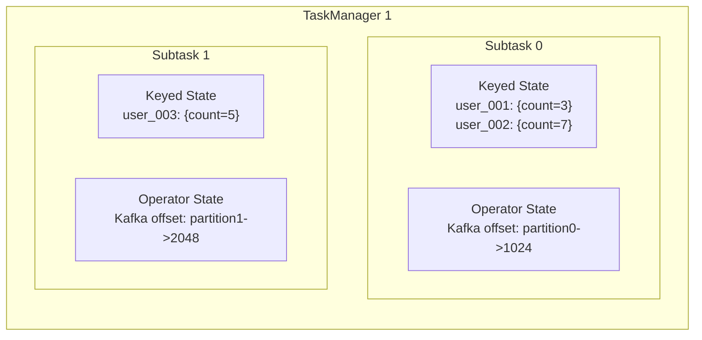
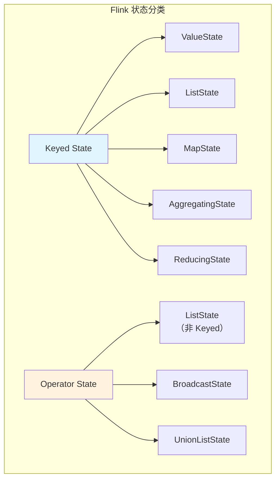
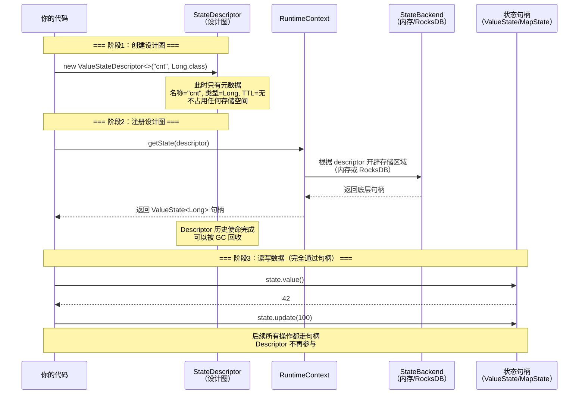
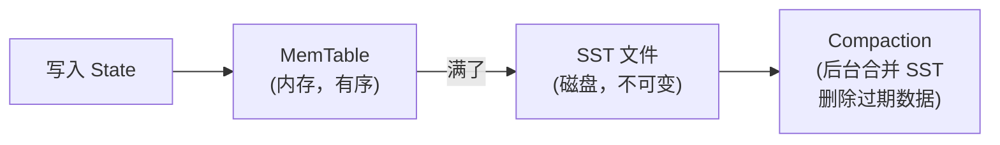

# 03 · 状态管理 / StateBackend

> **本章要回答：Flink 怎么"记住过去"？状态存哪里？太大了怎么办？怎么过期？**
>
> 实时计算不像批处理——你不能把数据全读出来再算。你需要一边消费一边记住"某个用户截至目前 GMV 是多少"、"这个 request_id 见过了没"。这就是状态。状态是 Flink 区别于无状态 ETL 的核心能力。


**阅读建议**：§1-§2 是基本概念（必读），§3-§4 是 StateBackend 选择和 TTL（高频追问），按顺序递进。

前置依赖：KeyedState 依赖 keyBy 机制（见 L01 §5）。

覆盖原题：5, 10, 32, 57, 26, 33, 34。

---

## 1. 有状态流处理

### 为什么实时计算离不开 State？

无状态处理 = 每条数据独立处理，不依赖历史。有状态处理 = **计算当前结果需要参考之前的数据或上下文**。

| 场景 | 需要记住什么 | 不用 State 行吗 |
|------|------------|---------------|
| **去重** | 哪些 request_id 已经见过了 | ❌ 只能用外部存储 |
| **累计聚合** | 当前累计值（GMV、PV） | ❌ 只能算当前这一条 |
| **窗口** | 窗口内的中间聚合结果 | ❌ |
| **维表缓存** | 上次查到的维度信息 | ❌ 每条都查外部，性能炸 |
| **会话** | 用户上一次行为的时间和内容 | ❌ |

**本质**：State 把"中间计算上下文"留在 Flink 内部——不需要每次计算都去外部存储读历史。

```java
// 无状态：每条独立处理，不知道上一秒发生了什么
stream.map(event -> event.amount * 1.1);   // 每条数据都一样

// 有状态：需要记住"这个用户截至目前总共多少"
stream.keyBy(event -> event.userId)
    .process(new KeyedProcessFunction<>() {
        ValueState<Double> total;           // ← 状态：记住累计值
        void processElement(Event e, Context ctx, Collector out) {
            Double current = total.value(); // 读历史
            total.update(current + e.amount); // 更新
            out.collect(total.value());
        }
    });
```

??? tip "面试嘴替 — 有状态流处理"
    **核心主张**（面试第一句就说对的）：
    > "State 是 Flink 实时计算的基石——去重靠 MapState 记已见的主键，累计靠 ValueState 保存中间结果，窗口靠 WindowState 存聚合值。没有 State 的流处理本质上只是无状态 ETL。Flink 把 State 管理在内部——不用每次算 GMV 都去 Redis 读一遍。"

    **常见追问 & 防御**：
    - 追问："为什么不能全用外部存储代替 State？" → 答："性能和一致性。外部存储每次读写都有网络延迟——一个 10 万 QPS 的作业，每条都查 Redis 会直接把它打爆。State 是本地访问（内存/RocksDB 本地磁盘），毫秒级。而且 State 随 Checkpoint 原子快照——外部存储做不到'和 Flink 算子状态同步回滚'。"
    - 追问："State 会丢吗？" → 答："不会——Checkpoint 周期备份到持久存储（HDFS/S3），故障时从快照恢复状态 + 位点。"

    **对比**：
    | 一般回答 | 优秀回答 |
    |---------|---------|
    | "State 就是保存中间结果" | "State 让流处理能'记住过去'——去重/聚合/窗口/维表缓存都靠它。存在本地（毫秒级访问），随 Checkpoint 做原子快照（一致性），故障时恢复（高可用）。不用外部存储是因为网络延迟和一致性无法保证" |

---

## 2. KeyedState vs OperatorState

### 为什么 KeyedState 比 OperatorState 更常见？

| | KeyedState | OperatorState |
|---|---|---|
| 绑定对象 | **key**（keyBy 之后） | **算子并行实例**（与 key 无关） |
| 隔离方式 | 每个 key 独立一份状态 | 每个 subTask 一份 |
| 并行度变化 | **KeyGroup 重分配**，状态自动迁移 | 需手动重分布（ListState 的 redistribute） |
| 典型用途 | 按 userId 累计、按 orderId 去重 | **Kafka Source 记录每个 partition 的 offset** |

### State 的"显式"与"隐式"——你看得见的和看不见的

**这是理解 Flink State 体系的关键分水岭。** 你写的 `ValueState`、`MapState`、`ListState` 只是冰山一角——Flink 内部还有大量"自动创建、自动维护"的隐式状态。



#### 显式 State：你自己声明和管理的

| State 类型 | 你写什么 | Flink 帮你做什么 | 在哪用 |
|-----------|---------|----------------|--------|
| `ValueState<T>` | `getRuntimeContext().getState(descriptor)` | 按 key 隔离，Checkpoint 自动备份 | 累计值、上一次时间戳 |
| `ListState<T>` | 同上 | 同上 | 窗口内缓存元素 |
| `MapState<K,V>` | 同上 | 同上 | 去重集合、维表缓存 |
| `ReducingState<T>` | 同上 + 提供 ReduceFunction | 自动执行 reduce 逻辑 | 累加/求最大 |
| `AggregatingState<IN,OUT>` | 同上 + 提供 AggregateFunction | 自动执行 aggregate 逻辑 | 复杂聚合 |

**这些是你"看得见"的**——你在 `open()` 里声明，在 `processElement()` 里读写，在 Checkpoint 时自动备份。

#### 隐式 State：Flink 自动创建和维护的

| 隐式 State | 谁创建的 | 存在哪 | 你能控制吗 |
|-----------|---------|--------|----------|
| **窗口 State（WindowState）** | `window().reduce/aggregate/process` 自动创建 | 每个 key + 每个窗口一份 | 不能直接读写，但可以通过选择增量/全量聚合控制大小 |
| **Timer State** | `ctx.timerService().registerEventTimeTimer()` 自动创建 | 每个 key 的定时器队列 | 不能直接读写，只能注册/删除 |
| **Kafka Source Offset** | KafkaSource 内部自动维护 | OperatorState（ListState） | 不能——Flink 自动管理 |
| **Broadcast State** | `connect(broadcastStream).process()` 自动创建 | 每个 subTask 一份（非 keyed） | 通过 `BroadcastState` 读写 |

**重点：窗口 State 的隐式创建**

当你写 `.keyBy().window().reduce(sum)` 时，Flink 在背后做了三件事：

1. **自动创建 WindowState**：每个 `(key, window)` 组合一个累加器
2. **自动更新**：每条数据到达时，找到对应的窗口，更新累加器——你不需要写 `state.update()`
3. **自动清理**：窗口过期（watermark 过了 `window.end + lateness`）后，自动删除状态

```java
// 你写的代码
stream.keyBy(e -> e.userId)
    .window(TumblingEventTimeWindows.of(Time.minutes(5)))
    .reduce((a, b) -> new Event(a.userId, a.amount + b.amount));

// Flink 在背后做的事（伪代码）
// 1. 为每个 (key, window) 自动创建 ReducingState<Event>
// 2. 每条数据到达：state.add(event)
// 3. watermark 过 window.end：触发输出
// 4. watermark 过 window.end + lateness：清理状态
```

**这就是为什么"窗口 State"是隐式的**——你从未写过 `getRuntimeContext().getState()`，但它确实存在，占用内存/磁盘，随 Checkpoint 备份，影响性能。你唯一能控制它大小的是：选择 `reduce/aggregate`（O(1) 累加器）而不是 `process`（O(N) 全量数据）。

#### 为什么理解"隐式 State"重要？

1. **状态膨胀排查**：如果 Checkpoint 越来越大，不仅要检查你显式写的 `MapState`，还要检查窗口 State（是不是窗口太长了？key 太多了？用了 `process` 全量缓存？）
2. **Timer 也是状态**：大量注册 Timer 会消耗内存——每个 Timer 约 30-40 字节。百万级 key 各注册一个 Timer = 额外 30-40MB 状态
3. **广播 State 不会自动清理**：和 KeyedState 不同，Broadcast State 没有 TTL 机制——旧规则会一直保留直到你手动清理

**KeyedState 更常见因为**：
- 实时计算的核心是"按某个维度聚合"（用户/商品/地区）——天然是 key 维度
- KeyGroup 机制让并行度变化时状态自动迁移——运维友好

### State 的分类体系：一张图看清



### 如果不 keyBy，算子就一定没有状态吗？

**不是。** 分三种情况：

| 场景 | 有状态吗 | 什么 State | 谁创建的 |
|------|---------|-----------|---------|
| **不 keyBy + Flink 自带无状态算子**（如 `map`、`filter`、`flatMap`） | ❌ 无状态 | — | — |
| **不 keyBy + Source**（如 KafkaSource） | ✅ 有 | **OperatorState**（记录 offset） | Flink 内部自动创建 |
| **不 keyBy + Sink**（如开启了 2PC 的 KafkaSink） | ✅ 有 | **OperatorState**（记录事务状态） | Flink 内部自动创建 |
| **不 keyBy + 自定义算子** | ✅ 可以有 | **OperatorState**（`getRuntimeContext().getListState()` 非 keyed 版） | 你自己写 |
| **不 keyBy + 窗口（`windowAll`）** | ✅ 有 | **OperatorState**（窗口状态） | Flink 内部自动创建 |
| **keyBy 之后** | ✅ 有 | **KeyedState**（你写的）+ 隐式窗口/Timer State（Flink 自动） | 你 + Flink |

**关键结论**：

1. **Flink 自带的无状态算子（`map`/`filter`/`flatMap`）确实没有状态**——它们每条数据独立处理，不依赖历史。这正是为什么这些算子可以随意 Chain、并行度可以随意调——没有状态就没有迁移成本。

2. **keyBy 是 KeyedState 的"开关"**——keyBy 之前你只能写 OperatorState（ListState/BroadcastState），keyBy 之后才能写 KeyedState（ValueState/MapState 等）。这不是语法限制，而是物理限制：KeyedState 需要"key 到 subTask 的映射"，这个映射只有 keyBy 之后才存在。

3. **Source/Sink 的 OperatorState 你永远看不到**——KafkaSource 的 offset、KafkaSink 的事务状态都是 Flink 内部管理的，你不需要也操作不了。你只需要知道它们存在、会随 Checkpoint 备份、影响 Checkpoint 大小。

4. **`windowAll` 是特例**——它是非 keyed 的窗口，状态是 OperatorState（因为不按 key 隔离，全局只有一个窗口）。生产几乎不用，因为单点瓶颈 + 状态无法按 key 分散。

### Flink 状态体系全景：四类状态总结

**这就是 Flink 状态的完整分类。** 理解这四类，你就理解了"谁有状态、状态在哪、谁管状态"。

| 分类 | 包含内容 | 关键特征 | 谁创建的 |
|------|---------|---------|---------|
| **1. Operator State** | Source 的 offset（Kafka）、Sink 的事务状态、自定义 Source/Sink | 每个并行子任务一份，不依赖 keyBy | Flink 内部自动 / 你自己 |
| **2. Keyed State（显式）** | `ValueState`、`ListState`、`MapState`、`ReducingState`、`AggregatingState` | **必须在 keyBy 之后**，通过 `getRuntimeContext().getState()` 声明 | 你自己 |
| **3. Keyed State（隐式）** | 窗口累加器（`aggregate/reduce`）、窗口元素列表（`process`）、Session 合并状态、Timer 状态 | 由 Flink 内部自动创建和维护，你无需写 state 代码 | Flink 内部自动 |
| **4. 无状态算子** | `map`、`filter`、`flatMap` 等（即使写在 keyBy 之后） | 来一条处理一条，不记住任何历史信息 | 无状态 |

**关于第 4 类的一个关键澄清**：

`keyBy` 本身不是算子——它只是一个**分区操作**（数据重分布）。真正有状态的是 keyBy **之后**的 `process`、`window`、`aggregate` 等算子。

```java
stream
    .keyBy(e -> e.userId)         // ← 分区操作，无状态
    .map(e -> enrich(e))          // ← 写在 keyBy 之后，但 map 本身无状态！
    .process(new MyStatefulFunc()) // ← 这里才有状态
```

**`map`/`filter`/`flatMap` 即使写在 `keyBy` 之后，只要你不显式使用 `getRuntimeContext().getState()`，它们依然是无状态的。** 它们的数据流已经被 keyBy 限定了（相同 key 的数据一定进同一个 subTask），但算子本身不携带任何状态。这就是为什么 Operator Chain 可以把 `keyBy → map → process` 中的 `map` 和 `process` 链在一起——`map` 没有状态，链不链都不影响状态语义。

**一句话总结**：Flink 的状态体系 = Operator State（Source/Sink 的元数据）+ 显式 KeyedState（你写的 ValueState/MapState）+ 隐式 KeyedState（窗口/Timer 的自动状态）+ 无状态算子（map/filter/flatMap）。keyBy 是 KeyedState 的物理开关，不是状态本身。

### StateDescriptor：状态的"设计图"，不是状态本身

**`ValueStateDescriptor` 并不存储任何数据**——它是一个元数据对象，携带了状态名称、数据类型和序列化信息。它扮演"设计图"或"出生证明"的角色。



**三个阶段**：

| 阶段 | Descriptor 在干什么 | 句柄在干什么 | 存储空间 |
|------|-------------------|------------|---------|
| **1. 创建设计图** | `new ValueStateDescriptor<>("cnt", Long.class)` | 还没出生 | ❌ 无 |
| **2. 注册 + 创建实体** | 传给 `getState(descriptor)`，Flink 在 StateBackend 中开辟空间 | 被返回给用户 | ✅ 已分配 |
| **3. 读写操作** | 可以被 GC 回收，不再使用 | `state.value()` / `state.update()` | ✅ 持续使用 |

**关键认知**：

1. **Descriptor 只在 `open()` 里活一次**——你永远不会在 `processElement()` 里再碰它。`open()` 结束后它就可以被 GC 了。
2. **句柄是 Descriptor 的产物**——`getState(descriptor)` 返回的 `ValueState<T>` / `MapState<K,V>` 才是你真正读写的东西。
3. **Descriptor 里的配置（名称、类型、TTL）会影响句柄的行为**——比如 `desc.enableTimeToLive(ttl)` 设置了 TTL，句柄在读写时会自动检查过期。

```java
public class MyFunc extends KeyedProcessFunction<String, Event, Result> {
    
    // 句柄：真正存储和读写数据的对象
    private transient ValueState<Long> countState;
    private transient MapState<String, Boolean> seenState;
    
    @Override
    public void open(Configuration params) {
        // === 阶段1+2：创建 Descriptor + 注册 ===
        
        // Descriptor 1：设计图
        ValueStateDescriptor<Long> countDesc = 
            new ValueStateDescriptor<>("count", Long.class);
        
        // Descriptor 2：设计图 + TTL 配置
        MapStateDescriptor<String, Boolean> seenDesc = 
            new MapStateDescriptor<>("seen", String.class, Boolean.class);
        seenDesc.enableTimeToLive(ttlConfig);
        
        // 注册设计图 → 获取句柄
        countState = getRuntimeContext().getState(countDesc);  // 句柄
        seenState = getRuntimeContext().getMapState(seenDesc);  // 句柄
        
        // open() 结束，countDesc 和 seenDesc 可以被 GC
    }
    
    @Override
    public void processElement(Event e, Context ctx, Collector<Result> out) {
        // === 阶段3：只通过句柄读写，Descriptor 不再参与 ===
        Long current = countState.value();
        countState.update(current + 1);
        
        if (seenState.contains(e.orderId)) return;
        seenState.put(e.orderId, true);
    }
}
```

### 四种 KeyedState 各适合什么场景？
| `ListState<T>` | 列表 | 窗口内缓存元素、待处理队列 |
| `MapState<K,V>` | 映射表 | **去重集合**（key=主键，value=已见） |
| `ReducingState<T>` | 带 reduce 的单值 | 自动累加/求最大 |

```java
// 去重：MapState 是最佳选择
MapState<String, Boolean> seen;
// seen.put(requestId, true);  ← O(1) 判断是否已见过
// seen.contains(requestId);    ← 比 ListState.contains() O(N) 快

// 累计：ValueState
ValueState<Double> total;
// total.update(total.value() + event.amount);
```

### KeyGroup 分配公式：key 怎么映射到 subTask 的？

```
key → hashCode() → murmurHash → KeyGroup ID → subtask

其中：KeyGroup ID = murmurHash(key.hashCode()) % maxParallelism
     subtask = KeyGroup ID / (maxParallelism / parallelism)
```

**示例**：`maxParallelism=128`, `parallelism=4`

| key | hashCode | murmurHash | KeyGroup ID | subtask |
|-----|----------|-----------|-------------|---------|
| "user_A" | 1234 | 56 | 56 | `56 <= 31` → subTask#0 |
| "user_B" | 5678 | 89 | 89 | `89 <= 95` → subTask#2 |
| "user_C" | 9012 | 120 | 120 | `120 <= 127` → subTask#3 |

每个 subTask 负责 `maxParallelism / parallelism = 32` 个连续 KeyGroup。并行度从 4 扩到 8，每个 subTask 从 32 个 KeyGroup 变成 16 个。

### KeyGroup 为什么是 maxParallelism 而不是 parallelism？

**为了支持并行度变更后状态重分配**。如果 KeyGroup 数量 = 当前并行度，那么并行度变化时 key 的归属会变化——状态就丢了。用固定的 `maxParallelism`（通常 128-1024），key 永远属于相同的 KeyGroup，只是 KeyGroup 范围在 subTask 间重分配。

??? tip "面试嘴替 — State 分类"
    **核心主张**（面试第一句就说对的）：
    > "KeyedState 按 key 隔离——每个 key 独立状态，生产的主流选择（去重/聚合/缓存）。OperatorState 绑定并行实例——主要是 Kafka Source 存 offset。KeyedState 下并行度变化时 KeyGroup 重分配自动迁移状态，不需要手动干预。"

    **常见追问 & 防御**：
    - 追问："去重用 MapState 还是 ListState？" → 答："MapState——contains() 是 O(1)。ListState 的 contains 要遍历全量 O(N)，流量大时会慢。MapState 还可以配合 TTL 自动过期。"
    - 追问："KeyedState 和 OperatorState 能同时用吗？" → 答："理论上可以（同一个算子同时用两种），但实际几乎不这样做。keyBy 后用 KeyedState；Source 用 OperatorState 存 offset。它们解决的问题域不同。"

    **对比**：
    | 一般回答 | 优秀回答 |
    |---------|---------|
    | "KeyedState 按 key 存，OperatorState 按算子存" | "KeyedState 按 key 隔离——valueState 累计，mapState 去重（O(1) contains）。OperatorState 主要用于 source 存 offset。KeyGroup 机制让 KeyedState 在并行度变化时自动迁移——这是 OperatorState 做不到的" |

---

## 3. StateBackend：状态存哪里

### HashMap 和 RocksDB 怎么取舍？

| | HashMapStateBackend | EmbeddedRocksDBStateBackend |
|---|---|---|
| 存储介质 | **JVM 堆内存** | **本地磁盘** + 堆外内存 |
| 读写速度 | 最快（内存直读） | 较慢（需序列化/反序列化 + 磁盘 IO） |
| 容量上限 | 受 JVM 堆大小限制 → 易 OOM | **受磁盘容量限制** → 可支撑 TB 级状态 |
| GC 影响 | 大状态 GC 压力大 | 状态在堆外，GC 不受影响 |
| Checkpoint | 全量快照 | **支持增量 Checkpoint**（只传变化的 SST 文件） |

### RocksDB 的 LSM-Tree 是什么？为什么适合 Flink？

RocksDB 用 **LSM-Tree** 存状态。它的写入方式：



**为什么这和 State 很搭？**
- **写入友好**：先写内存再批量刷盘 → 写入延迟低
- **天然增量**：SST 文件是不可变的 → checkpoint 时只传新增/变化的文件
- **后台清理**：Compaction 时删除过期的 TTL 状态 → 自动空间回收

### 生产怎么选？

| 状态量 | 推荐 | 理由 |
|--------|------|------|
| < 几 GB，时延敏感 | **HashMap** | 纯内存，最快 |
| > 几 GB，长窗口/大维表 | **RocksDB** | 磁盘容量，增量 Checkpoint |
| 超大状态（百 GB+） | **RocksDB + SSD + 增量 CK** | 避免磁盘成为瓶颈 |

```java
// RocksDB + 增量 Checkpoint（大状态标配）
env.setStateBackend(new EmbeddedRocksDBStateBackend(true)); // true = 启用增量
env.enableCheckpointing(60_000);
```

### RocksDB 调优：不是开了就行，参数决定性能

**关键参数和调优思路**：

| 参数 | 默认值 | 调优方向 | 为什么 |
|------|--------|---------|--------|
| `state.backend.rocksdb.block.cache-size` | 8 MB | **大状态 → 加大**（如 256 MB） | 缓存热点 SST 数据，减少磁盘 IO |
| `state.backend.rocksdb.writebuffer.size` | 64 MB | 写入密集型 → 加大（128-256 MB） | 减少 memtable 刷到 SST 的次数 |
| `state.backend.rocksdb.compaction.style` | LEVEL | 写多读少 → 用 UNIVERSAL | Level Compaction 写放大严重，Universal 适合 State 场景 |
| `state.backend.rocksdb.thread.num` | 1 | **增加**（如 4） | 多线程 compaction，减少写阻塞 |
| `state.backend.rocksdb.write-batch-size` | 2 MB | 状态吞吐大 → 加大 | 批量写入减少系统调用 |

```java
// RocksDB 调优配置（生产级）
EmbeddedRocksDBStateBackend backend = new EmbeddedRocksDBStateBackend(true);
backend.setPredefinedOptions(PredefinedOptions.SPINNING_DISK_OPTIMIZED); // 预定义配置

// 或者自定义
RocksDBOptionsFactory options = new DefaultConfigurableOptionsFactory() {{
    setBlockCacheSize(256 * 1024 * 1024L);  // 256 MB
    setWriteBufferSize(128 * 1024 * 1024L);  // 128 MB
}};
backend.setRocksDBOptions(options);
env.setStateBackend(backend);
```

**为什么 Compaction 会阻塞写入？**
RocksDB 在 Level 0 的 SST 文件数量达到阈值时，会暂停写入直到 compaction 完成——这叫做 write stall。大状态高吞吐场景下，调大 `writebuffer.size` 和 `max_write_buffer_number` 可以减少 stall。

### KeyGroup 分配公式

??? tip "面试嘴替 — StateBackend"
    **核心主张**（面试第一句就说对的）：
    > "HashMap：堆内存，最快但受堆大小限制。RocksDB：磁盘 + LSM-Tree，容量大、支持增量 Checkpoint，但有序列化开销和磁盘延迟。状态小选 HashMap，状态大选 RocksDB——这是生产大状态场景的标配。增量 Checkpoint 是 RocksDB 的核心优势。"

    **常见追问 & 防御**：
    - 追问："RocksDB 的增量 Checkpoint 怎么知道哪些文件变了？" → 答："SST 文件是不可变的——新写入生成新 SST 文件，旧文件不修改。Checkpoint 对比上次快照的 SST 列表，只上传新增的。MANIFEST 文件维护所有 SST 的引用链。"
    - 追问："为什么 HashMap 不支持增量？" → 答："HashMap 的状态在堆上是零散的 Java 对象，没有'文件'概念——每次 Checkpoint 必须全量序列化。RocksDB 天然以 SST 文件为单位，变化检测直接利用 LSM-Tree 的 compaction 元信息。"
    - 追问："RocksDB 的序列化开销有多大？" → 答："每次读写要（反）序列化——比内存直读写慢 2-10 倍。但对于大多数场景，瓶颈在网络和外部 IO 而非 StateBackend 的读写。只在极致低时延场景（<1ms）需要担心。"

    **对比**：
    | 一般回答 | 优秀回答 |
    |---------|---------|
    | "HashMap 内存快，RocksDB 磁盘大" | "HashMap = 堆内存 + 全量 CK + GC 压力。RocksDB = LSM-Tree + 增量 CK + 磁盘容量 + 序列化开销。状态小选 HashMap，大状态必须 RocksDB——增量 CK 是大状态能跑通的关键" |

---

## 4. State TTL：控制状态生命周期

### 不清理状态会怎样？TTL 怎么解决去重集合膨胀？

**不清理 → 状态无限增长 → 撑爆内存（HashMap）或磁盘（RocksDB）→ OOM / 磁盘满 → 作业挂。**

TTL 给状态设存活时间，过期自动清理。去重场景 = "只去重最近 N 小时"——过期的 request_id 从 MapState 中清除。

### TTL 的四个关键配置

```java
StateTtlConfig ttl = StateTtlConfig
    .newBuilder(Time.hours(24))           // 1. 存活 24 小时
    .setUpdateType(
        StateTtlConfig.UpdateType.OnCreateAndWrite  // 2. 创建和写入时刷新 TTL
    )
    .setStateVisibility(
        StateTtlConfig.StateVisibility.NeverReturnExpired  // 3. 不返回已过期值
    )
    .cleanupFullSnapshot()                // 4. 全量快照时清理（Checkpoint 时触发）
    .build();

ValueStateDescriptor<Long> desc = new ValueStateDescriptor<>("cnt", Long.class);
desc.enableTimeToLive(ttl);
```

| 配置 | 作用 | 误区 |
|------|------|------|
| `OnCreateAndWrite` | 每次写入刷新 TTL | 如果读取不刷新，访问即续命逻辑不对 |
| `NeverReturnExpired` | 已过期值不返回 | 防止读到脏数据——"这个 request_id 已经过期了但我还认为它重复" |
| `cleanupFullSnapshot()` | Checkpoint 时清理过期状态 | 结合 RocksDB compaction 后台清理 |
| `cleanupInBackground()`（RocksDB） | Compaction 时过滤过期 key | 减少状态文件体积 |

??? tip "面试嘴替 — State TTL"
    **核心主张**（面试第一句就说对的）：
    > "TTL 控制状态生命周期——去重设 24h 只去重最近一天的，维表缓存设 5min 过期回源刷新。不设 TTL 状态会无限膨胀最终 OOM。配合 RocksDB compaction 后台清理过期 key——零停机、零代码改动。"

    **常见追问 & 防御**：
    - 追问："TTL 的清理是立即生效的吗？" → 答："不是——TTL 是惰性删除：读取时检查是否过期，过期的直接返回空/清理。后台清理靠 RocksDB compaction 或全量快照清理——都是异步的，有一定延迟。"
    - 追问："TTL 和 allowedLateness 有关系吗？" → 答："概念上没有直接关系。TTL 管状态存活，lateness 管窗口触发后保留多久。但实际常一起用——窗口 lateness 和窗口状态的 TTL 要保持一致，避免窗口已销毁但状态还因 TTL 未清理而残存。"

    **对比**：
    | 一般回答 | 优秀回答 |
    |---------|---------|
    | "TTL 让状态过期" | "TTL = 状态的生命周期管理——去重只记最近 N 小时、缓存定时刷新。惰性删除 + RocksDB compaction 后台清理。不设 TTL 状态会无限膨胀 OOM——这是生产 State 的第一道防线" |

### TTL 三种清理策略：性能 vs 时效

| 策略 | 触发时机 | 清理方式 | 何时用 |
|------|---------|---------|--------|
| `cleanupFullSnapshot()` | **Checkpoint 时** | 全量扫描状态，删除过期 key | 默认推荐——不产生额外运行时开销 |
| `cleanupIncrementally(10)` | **每次状态访问** | 增量扫描 N 个条目 | 大状态不能等 Checkpoint 才清，需要逐步回收空间 |
| `cleanupInBackground()`（RocksDB） | **Compaction 时** | 根据 compaction filter 过滤过期 key | RocksDB 大状态最优策略——结合 compaction 自然清理，自动回收磁盘 |

```java
// 推荐的 TTL + RocksDB 组合：增量清理 + 后台清理
StateTtlConfig ttl = StateTtlConfig.newBuilder(Time.hours(24))
    .setUpdateType(StateTtlConfig.UpdateType.OnCreateAndWrite)
    .setStateVisibility(StateTtlConfig.StateVisibility.NeverReturnExpired)
    .cleanupIncrementally(100)    // 每次访问时扫 100 条
    .cleanupInBackground()        // RocksDB compaction 清理
    .build();
```

**增量 vs 全量快照清理的取舍**：cleanupFullSnapshot 只在 Checkpoint 时触发——如果 Checkpoint 间隔 10 分钟，过期 key 可能在内存/磁盘里多待 10 分钟。对于内存紧张的场景（HashMap），用 cleanupIncrementally 更及时但会带来少量读写开销。对于 RocksDB，cleanupInBackground 是最优雅的——compaction 本身就是定期运行的，不额外消耗 CPU。

??? example "代码：State 去重 + TTL + 累加"
    ```java
    --8<-- "code/L03/operator/StatefulDedupAndAgg.java"
    ```

---

## 面试串讲

> "State 是 Flink 实时计算的核心——去重用 MapState（O(1) contains），累计用 ValueState，窗口用 WindowState。KeyedState 按 key 隔离并通过 KeyGroup 支持并行度变化时状态迁移。
>
> StateBackend 选型：状态小选 HashMap（堆内存，最快），状态大选 RocksDB（磁盘 + LSM-Tree，增量 Checkpoint）。增量 CK 只传变化的 SST 文件——大状态能跑通的关键。RocksDB 的代价是序列化开销和磁盘延迟。
>
> TTL 是状态的第一道防线：去重设 24h 只记近期、缓存设 5min 回源刷新。不设 TTL 状态无限膨胀 OOM。配合 RocksDB compaction 后台清理——零停机。"

---

## 自测（先口述，再点开）

<details>
<summary><b>Q：有状态和无状态流处理的本质区别？举 3 个必须靠 State 的场景。</b></summary>

A：无状态 = 每条独立，不依赖历史。有状态 = 算当前需要昨天。必须靠 State：去重（MapState）、累计 GMV（ValueState）、窗口聚合（WindowState）、维表缓存——都需要"记住之前的计算结果"。

</details>

<details>
<summary><b>Q：KeyedState 和 OperatorState 怎么选？去重用哪种 KeyedState？</b></summary>

A：KeyedState 按 key 隔离（keyBy 后），生产主流。OperatorState 绑定并行实例（如 Source 存 offset）。去重用 **MapState**——`contains()` 是 O(1)，ListState 要 O(N) 遍历。配合 TTL 自动过期。

</details>

<details>
<summary><b>Q：HashMap 和 RocksDB 两个 StateBackend 怎么取舍？</b></summary>

A：HashMap = 堆内存 + 全量 CK + GC 压力 + 最快。RocksDB = 磁盘 + LSM-Tree + 增量 CK + 序列化开销。状态 < 几 GB 且时延敏感 → HashMap。状态大、长窗口、大维表 → RocksDB 标配，增量 CK 是大状态能跑通的关键。

</details>

<details>
<summary><b>Q：RocksDB 为什么支持增量 Checkpoint？HashMap 为什么不能？</b></summary>

A：RocksDB 状态以 SST 文件存磁盘——不可变文件，新写生成新文件 → Checkpoint 时只上传新增的 SST。MANIFEST 维护引用链。HashMap 状态在堆上是零散 Java 对象，没有"文件"概念——必须全量序列化。

</details>

<details>
<summary><b>Q：不设 TTL 会怎样？去重怎么用 TTL 控制状态规模？</b></summary>

A：不设 TTL → 状态无限膨胀 → OOM 或磁盘满。去重设 `StateTtlConfig.newBuilder(Time.hours(24)).setUpdateType(OnCreateAndWrite)`——只去重最近 24 小时，过期自动清。配合 `cleanupFullSnapshot()` 在 Checkpoint 时清理。

</details>

<details>
<summary><b>Q：RocksDB 的 LSM-Tree 是什么？为什么适合 Flink State？</b></summary>

A：LSM-Tree = 写入先到 MemTable（内存有序），满了刷成 SST 文件（磁盘不可变），后台 Compaction 合并清理。和 Flink State 契合：写入友好（先写内存）、天然增量（SST 不可变）、后台清理（Compaction 清过期 TTL）。

</details>

---

## 推荐源
- 状态管理：<https://nightlies.apache.org/flink/flink-docs-stable/docs/dev/datastream/fault-tolerance/state/>
- StateBackend：<https://nightlies.apache.org/flink/flink-docs-stable/docs/ops/state/state_backends/>
- State TTL：<https://nightlies.apache.org/flink/flink-docs-stable/docs/dev/datastream/fault-tolerance/state/#state-time-to-live-ttl>

!!! question "卡住了？"
    RocksDB compaction 对 Checkpoint 的影响、TTL cleanupFullSnapshot vs cleanupInBackground 的性能差异、自定义 StateBackend 的实现——直接问老师展开或出题。
