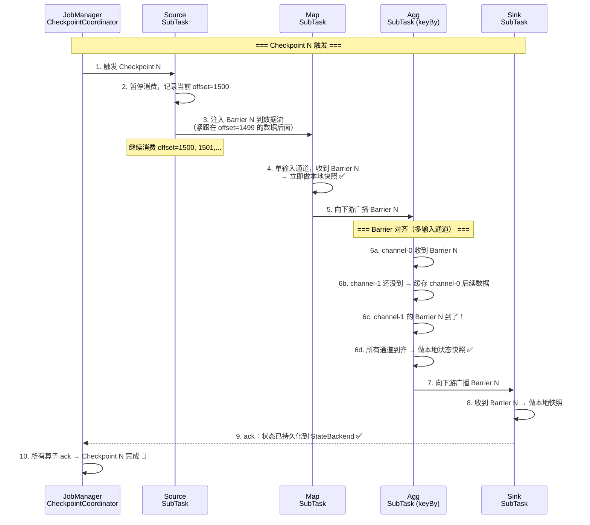
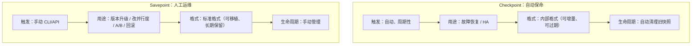
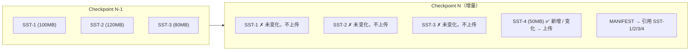
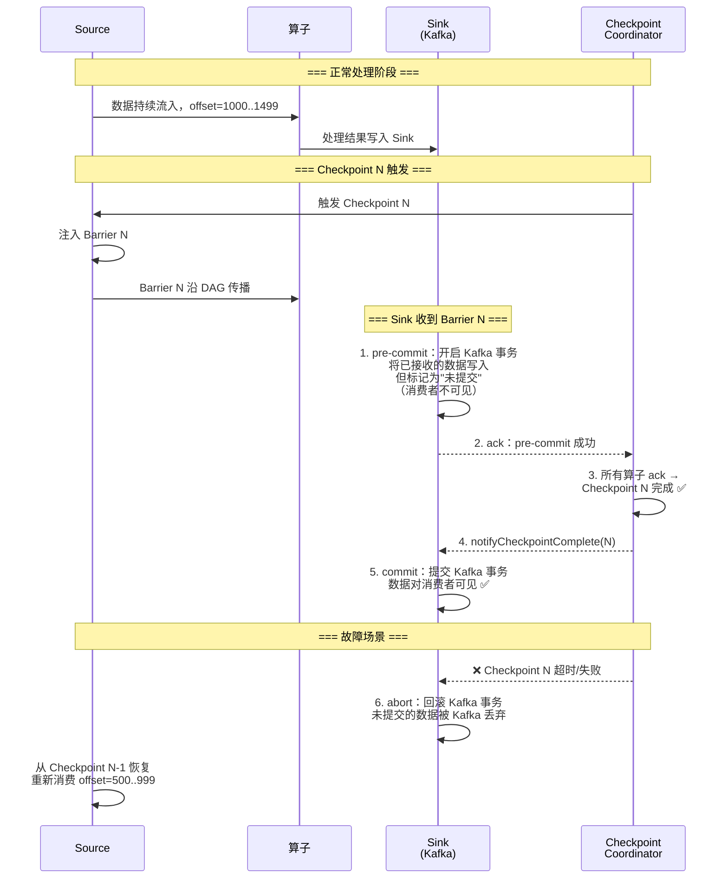
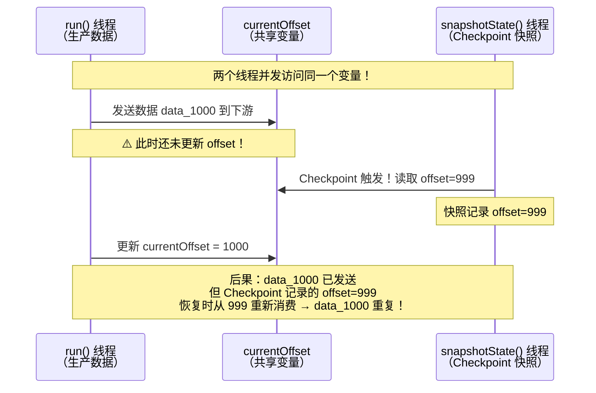

# 04 · Checkpoint / Savepoint / Exactly-once

> **本章要回答一个终极问题：Flink 的分布式流处理作业，怎么做到挂了自动恢复、数据一条不丢一条不重？**
>
> 你在面试或线上排查时，一定会被问到这些：Checkpoint 拍快照的原理、Barrier 为什么要对齐、Savepoint 和 Checkpoint 到底差在哪、Exactly-once 不是口号而是怎么落地的……
> 这些问题不是孤立的——它们沿着一条容错链路逐层递进。
>
> ```mermaid
> flowchart LR
>     A["Barrier 对齐 + 分布式快照<br/>Chandy-Lamport"] --> B["故障恢复<br/>状态回滚 + 位点重放"]
>     B --> C["失败自动恢复链路<br/>restart-strategy"]
>     A --> D["增量 Checkpoint<br/>RocksDB SST 增量上传"]
>     A --> E["Exactly-once 底层<br/>2PC + 状态快照 + source 可重放"]
>     
>     F["Checkpoint vs Savepoint<br/>自动保命 vs 人工运维"] -.->|对照理解| A
> ```
>
> **阅读建议**：§1 是整个容错体系的地基（必读），§2-§3 是恢复与运维的两种视角，§4 是性能优化，§5 是 Exactly-once 的端到端闭环——建议按顺序通读。
>
> **前置依赖**：本章依赖 §1 Barrier 机制需要了解 Flink 的数据流模型（L01），§5 两阶段提交涉及 Sink 的事务语义（L05 §1 有 Kafka Sink 端到端精确一次的详细内容），状态快照写入 StateBackend 依赖 L03 的基础。
>
> 覆盖原题：11, 20, 25, 51, 56, 60, 16, 48, 58。

---

## 1. Checkpoint 的 Barrier 对齐 & 分布式快照（原题 11, 25）

### Checkpoint 是怎么给整个分布式作业拍一张"全局一致快照"的？

**Checkpoint 的本质**：JobManager 周期性触发，给整个 DAG 的所有算子状态拍一张**逻辑瞬间的一致性快照**，存到持久化存储（HDFS/S3）。关键机制是 **Barrier（屏障）注入 + 对齐 + 分布式快照**——思想源自 Chandy-Lamport 分布式快照算法。

### Barrier 注入与传播链路



### Barrier 对齐在干什么？为什么非要对齐？

**你面对的是分布式流处理**：上游有多个并行实例同时给你发数据，如果不对齐就拍快照，快照里的状态会是"一部分数据来自 Barrier 前、一部分来自 Barrier 后"——**这不是某个逻辑瞬间的状态**。

对齐的代价与改进：

| 阶段 | 发生什么 | 代价 |
|------|---------|------|
| **收到第一个 Barrier N** | 该通道后续数据暂存到 **输入缓冲区**（不处理） | 引入短暂延迟 |
| **等待其他通道** | 其余通道继续消费，直到各自的 Barrier N 到达 | 取决于最慢通道的延迟 |
| **全部到齐** | 做本地状态快照，释放缓冲区，恢复正常处理 | 快照耗时（写 StateBackend） |

### Unaligned Checkpoint：什么时候可以不对齐？

**Flink 1.11+ 引入 Unaligned Checkpoint**：把 Barrier 到达时已在途的数据（in-flight data）也纳入快照，避免反压严重时对齐卡顿。

| | Aligned Checkpoint | Unaligned Checkpoint |
|---|---|---|
| 对齐行为 | 等所有通道 Barrier 到齐才快照 | **不等**——Barrier 一到就穿透 |
| in-flight 数据处理 | 暂存缓冲，不处理 | 和状态一起写入快照 |
| 快照大小 | 小（只有算子状态） | **更大**（含在途数据） |
| 延迟影响 | 反压时有卡顿（等最慢通道） | 无卡顿 |
| 适用场景 | 正常场景 | **反压严重**、背对背 checkpoint |

```java
// 启用 Unaligned Checkpoint
env.getCheckpointConfig().enableUnalignedCheckpoints();
```

??? tip "面试嘴替 — Barrier 对齐与分布式快照"
    **核心主张**（面试第一句就说对的）：
    > "Checkpoint 是 JobManager 协调的周期全局快照。Source 把 Barrier 注入数据流，算子收到所有输入通道的 Barrier 后才做本地状态快照——这叫 Barrier 对齐，保证快照是某个逻辑瞬间的一致性状态。状态写入 StateBackend（HDFS/S3），全部确认后 Checkpoint 完成。"
    
    **常见追问 & 防御**：
    - 追问："为什么要对齐？" → 答："不对齐的快照不是某个瞬间的状态——可能一半是 Barrier 前一半是 Barrier 后，恢复时数据对不上。对齐的本质是让所有上游在数据流中划一条'同一位置'的线。"
    - 追问："对齐会卡吗？" → 答："先收到 Barrier 的通道要等慢通道，后续数据暂存缓冲不处理——会引入短暂延迟。反压严重时对齐卡顿更明显，用 Unaligned Checkpoint 把在途数据也纳入快照来避免。"
    - 追问："Unaligned Checkpoint 有副作用吗？" → 答："快照变大（含在途数据），恢复时也要回放这部分 in-flight 数据。"
    
    **对比**：
    | 一般回答 | 优秀回答 |
    |---------|---------|
    | "Checkpoint 就是定期拍快照" | "Checkpoint 用 Barrier 对齐实现 Chandy-Lamport 分布式快照：Source 注入 Barrier → 多输入算子等所有通道到齐后做本地快照 → 保证全局一致性。反压严重用 Unaligned 避免卡顿" |

---

## 2. 故障恢复与自动重启（原题 56）

### 任务挂了，Flink 是怎么自己"活过来"的？恢复后为什么不会重复计算？

**Flink 的故障恢复不是简单的"重启重跑"——它从 Checkpoint 恢复状态 + 消费位点，做到原子性回滚。**


### 恢复后为什么不会重复计算？

**关键不是"不重跑"，而是"重跑后状态能对上"**：

1. **状态回滚**：算子状态（窗口聚合值、MapState 内容）恢复到 Checkpoint N 时的快照
2. **位点回滚**：Source 从 Checkpoint N 记录的 offset 重新消费
3. **状态 + 位点 = 同一快照** → 重放的数据恰好覆盖从 Checkpoint N 到故障点之间的 gap，算子状态继续在原基础上累加——和没挂过的结果一致

### Restart Strategy：怎么自动重启？

| 策略 | 行为 | 适用场景 |
|------|------|---------|
| **Fixed Delay** | 固定间隔重试 N 次 | 一般任务，临时故障（网络抖动） |
| **Exponential Delay** | 首次间隔短，后续指数增长，上限可配 | 生产推荐——避免频繁重试压垮外部系统 |
| **Failure Rate** | 时间窗口内失败次数超阈值才停 | 需要容忍偶尔失败但防止频繁故障 |
| **No Restart** | 直接失败 | 调试 / 批处理 |

```java
// 生产级重启策略：指数退避
env.setRestartStrategy(RestartStrategies.exponentialDelayRestart(
    Time.minutes(1),    // 初始间隔
    Time.minutes(10),   // 最大间隔
    1.5,                // 退避系数
    Time.minutes(1),    // 重置间隔（无故障多久后重置退避）
    0.1                 // 抖动因子
));
```

??? tip "面试嘴替 — 故障恢复与自动重启"
    **核心主张**（面试第一句就说对的）：
    > "故障恢复不是简单重启——它把整个作业的状态和消费位点从最近成功的 Checkpoint 原子性回滚。Source 从快照记录的位点重新消费，算子状态恢复到快照时刻，重放的数据在原有状态基础上继续累加——和没挂过的结果一致。配合指数退避重启策略，实现全自动恢复。"
    
    **常见追问 & 防御**：
    - 追问："恢复后重跑的那段数据不会重复算吗？" → 答："会的——重放 data 是重复了，但状态已经回滚到 Checkpoint 那个时间点的内容，重放的数据在该状态基础上重新处理，最终状态和一次也没挂过的作业相同。这是 'at-least-once 重放 + Checkpoint 去重'——状态快照就是去重点。"
    - 追问："Checkpoint 间隔内丢了多少数据？" → 答："丢的是从上一个 Checkpoint 到现在这个故障点之间的计算结果——不是原始数据。恢复后重放原始数据重新算一遍，结果不丢。只是这段窗口内的输出可能比正常多一点点延迟。"
    - 追问："重启策略怎么选？" → 答："生产用指数退避——避免临时故障时频繁重试压垮外部系统（Kafka、HDFS）。第一次等 1 分钟，第二次等 2 分钟，上限 10 分钟——让外部系统有喘息时间。"
    
    **对比**：
    | 一般回答 | 优秀回答 |
    |---------|---------|
    | "挂了自动重启，从 Checkpoint 恢复" | "故障恢复 = 状态 + 位点原子回滚。重放的数据重复消费但状态已回到快照时刻 → 最终结果一致。指数退避策略防止频繁重启压垮外部依赖" |

---

## 3. Checkpoint vs Savepoint（原题 51）

### Checkpoint 和 Savepoint 到底差在哪？什么时候用哪个？（原题 51）

**一句话**：Checkpoint 是"自动保命的"，Savepoint 是"人工运维的"。



| 维度 | Checkpoint | Savepoint |
|------|-----------|-----------|
| **触发方式** | 自动、周期性（`execution.checkpointing.interval`） | 手动（`flink savepoint` CLI / REST API） |
| **设计目的** | **故障恢复**——保证高可用 | **人工运维**——控制作业在哪个确切时间点"暂停" |
| **状态格式** | 内部增量格式（依赖 StateBackend） | **标准、自包含**——不依赖 StateBackend 元信息 |
| **可移植性** | 一般不跨集群/版本 | **可跨集群、跨版本、跨并行度** |
| **生命周期** | 自动清理（保留最近 N 个） | 手动管理，长期保留 |
| **并行度变更** | 不能改并行度恢复 | **可以**——这正是 Savepoint 的核心用途 |
| **代价** | 轻量、频繁（秒级~分钟级间隔） | 重、一次性（全量快照，耗时可能更长） |
| **典型场景** | 日常运行故障自愈 | 发版：`stop --savepointPath → 改代码 → start --fromSavepoint` |

### 项目里怎么用？

> "日常跑的作业配 Checkpoint 保命——挂了自动恢复；发版/改并行度时手动打 Savepoint：`flink stop --savepointPath hdfs://... jobId`，然后 `flink run --fromSavepoint hdfs://... new.jar`。**Checkpoint 是基础、Savepoint 是工具；日常用 Checkpoint，运维用 Savepoint。**"

### Savepoint 的底层实现

Savepoint 本质是一个**特殊的、手动触发的 Checkpoint**——但它生成的是标准格式、自包含的快照。关键区别在于：

1. **Checkpoint** 的状态文件由 StateBackend 管理，格式不对外暴露——依赖 JobManager 的元信息才能找到所有文件
2. **Savepoint** 把状态文件和元信息打包成**一个自包含的目录结构**——拷贝到另一个集群，换个并行度，也能恢复

??? tip "面试嘴替 — Checkpoint vs Savepoint"
    **核心主张**（面试第一句就说对的）：
    > "Checkpoint 是 Flink 自动周期拍的、用于故障恢复的内部快照；Savepoint 是手动触发、标准格式、可移植的快照，用于版本升级、改并行度、迁移集群等运维操作。日常用 Checkpoint 保命，运维用 Savepoint 精确控制。"
    
    **常见追问 & 防御**：
    - 追问："Savepoint 能改并行度恢复，Checkpoint 为什么不行？" → 答："Checkpoint 的状态分片是按 KeyGroup 分配的——N 个 SubTask 各管一部分 KeyGroup。并行度变了，KeyGroup 到 SubTask 的映射就要重新算。Checkpoint 的格式不记录原始 KeyGroup 到 SubTask 的映射方式（它依赖运行时的 DAG 结构），Savepoint 是自包含的，元信息足够让新 DAG 重新分配状态。"
    - 追问："Savepoint 触发后作业会停吗？" → 答："`flink stop --savepointPath` 会优雅停止——先打 Savepoint 再停作业。`flink savepoint` 不停作业，但它是在一直有数据进来的过程中拍照，状态一致性不如 stop。发版用 stop，备份用 savepoint。"
    
    **对比**：
    | 一般回答 | 优秀回答 |
    |---------|---------|
    | "Checkpoint 自动的，Savepoint 手动的" | "Checkpoint = 自动周期快照，用于故障恢复，格式随 StateBackend；Savepoint = 手动标准快照，自包含可移植，用于发版/改并行度/迁移——两者底层都是分布式快照，但用途和格式完全不同" |

---

## 4. 增量 Checkpoint（原题 60）

### "只传变化部分"——增量 Checkpoint 怎么知道哪些状态变了？

**增量 Checkpoint 只在 RocksDB StateBackend 下有效**。原因在于 RocksDB 的状态数据以 **SST 文件** 存储在本地磁盘——天然的"文件级"粒度。



### 增量 vs 全量 Checkpoint

| | 全量 Checkpoint | 增量 Checkpoint |
|---|---|---|
| 每次上传内容 | 全部状态文件 | 仅新增/变化的 SST 文件 |
| 上传量（大状态场景） | 每次几百 GB | 每次几十 MB ~ 几 GB |
| 耗时 | 随状态大小线性增长 | 随状态变化量增长（通常远小于全量） |
| 恢复 | 读一个目录即可 | 需回溯 MANIFEST 链找到所有引用的 SST |
| 共享文件清理 | 直接删 | **引用计数**——有 Checkpoint 引用就不删 |

### 为什么 HashMap StateBackend 不支持增量？

**HashMap（堆内存）状态没有"文件"的概念**——所有状态在堆上是零散的 Java 对象，Checkpoint 时需要序列化成二进制写入存储。没有"这个对象变了、那个没变"的文件级标记。RocksDB 天然以 SST 文件为单位管理状态，变化检测直接利用 RocksDB 的 LSM-tree compaction 元信息。

### 生产建议

```
状态 < 几 GB → HashMap（简单，全量也可以接受）
状态 > 几 GB + 长窗口/大维表 → RocksDB + 增量 Checkpoint（必须）
```

```java
// 启用增量 Checkpoint（RocksDB 下默认开启，显式声明更清晰）
env.enableCheckpointing(60_000);
env.setStateBackend(new EmbeddedRocksDBStateBackend(true)); // true = 启用增量
```

??? tip "面试嘴替 — 增量 Checkpoint"
    **核心主张**（面试第一句就说对的）：
    > "增量 Checkpoint 只在 RocksDB 下生效——RocksDB 状态以 SST 文件存本地磁盘，Checkpoint 时只上传新增或变化的 SST 文件，大幅降低大状态场景的上传量和耗时。通过 MANIFEST 文件维护 SST 的引用链，恢复时回溯找到所有引用的文件。HashMap 状态在堆上，没有文件级粒度，不支持增量。"
    
    **常见追问 & 防御**：
    - 追问："共享 SST 文件被删了怎么办？" → 答："RocksDB 增量 Checkpoint 用引用计数——只要还有任何一个 Checkpoint 引用了这个 SST 文件，它就不会被清理。只有在所有引用它的 Checkpoint 都过期后才被删除。"
    - 追问："增量 Checkpoint 有坑吗？" → 答："有——恢复时需要回溯 MANIFEST 链找到所有引用的 SST，如果 MANIFEST 链很长（几百次 Checkpoint 后），恢复可能变慢。配 `state.checkpoints.num-retained` 限制保留数量，或定期打全量 Savepoint 做基线。"
    
    **对比**：
    | 一般回答 | 优秀回答 |
    |---------|---------|
    | "增量 Checkpoint 只传变化的，快" | "RocksDB SST 文件天然适合增量——MANIFEST 追踪引用关系，只上传变化的 SST。引用计数防误删，但要控制保留数量避免 MANIFEST 链过长影响恢复速度" |

---

## 5. Exactly-once 底层：Barrier + 2PC + Source 可重放（原题 16, 48, 58）

### "精确一次"不是口号——底层三件套是怎么协作的？

**Exactly-once 语义 = 每条数据在最终结果和外部系统中都只生效一次，既不丢也不重。**

Flink 用**三个机制叠加**实现：

```
① Barrier + 状态快照 → 故障恢复后状态一致（Flink 内部保证）
② Sink 两阶段提交（2PC） → 外部输出与控制点绑定（跨系统保证）
③ Source 可重放 → 恢复时能回到故障位点（源头保证）

① + ② + ③ = 端到端精确一次
```

### 两阶段提交（2PC）的完整链路



### 2PC 为什么能保证"不丢不重"？

**核心是把 Sink 的提交时机与 Checkpoint 的完成事件绑定**：

| 阶段 | Sink 在干什么 | 数据状态 | Checkpoint 在干什么 |
|------|-------------|---------|-------------------|
| **数据处理** | 正常写入 Sink（事务内） | 写入了但**对外不可见** | 还没触发 |
| **Barrier 到达** | `preCommit()`——flush 数据、预备提交 | 仍在事务内，不可见 | 传播 Barrier、收集 ack |
| **Checkpoint 完成** | `notifyCheckpointComplete()` → `commit()` | **对外可见** ✅ | 全部算子 ack → 成功 |
| **Checkpoint 失败** | `abort()`——回滚事务 | 数据被 Kafka 丢弃 | 超时/失败 → 回退到上一个 Checkpoint |

**不丢**：因为 Checkpoint 成功 = 所有数据已持久化（状态在 StateBackend，输出在事务内预提交了）。就算挂了，恢复后重放的数据会在原有状态上继续，Sink 重新走事务。

**不重**：因为 Sink 在 Checkpoint 失败时 `abort()` 了事务——挂了那次的"未提交"数据被 Kafka 自动清理。恢复后重放的数据重新走一个新事务提交，不会和前一个失败的事务重叠。

### Exactly-once 的前提条件

| 条件 | 要求 | 不满足会怎样 |
|------|------|------------|
| Source 可重放 | Kafka / Pulsar 等支持按 offset 回放 | 无法精确回到故障点 → at-most-once 或 at-least-once |
| Sink 支持事务 | Kafka 事务 / HDFS rename / JDBC XA | 无法保证"要么全写、要么全不写" → at-least-once |
| Checkpoint 开启 | `EXACTLY_ONCE` 模式 | 没有状态快照 → 恢复只能重头来 |
| `transaction.timeout.ms` > checkpoint 间隔 × 2 | Kafka 事务不会在 checkpoint 之间过期 | 事务过期被 broker 强制 abort → 数据丢失 |

### Source 的并发陷阱：为什么只有 Source 需要手动加锁？

**这是 Flink 中唯一需要开发者手动处理线程安全的地方。** 下游算子（map/window/process）运行在单线程事件循环中——数据、Barrier、Timer 都在同一个线程里顺序处理，不存在并发修改共享状态的问题。Flink 框架已经保证了安全性，开发者不需要也不应该自己加锁。

**但 Source 不同——它是双线程模型。**



**两种竞态场景**：

| 场景 | 发生什么 | 后果 |
|------|---------|------|
| **数据已发，offset 未更新** | `run()` 发送了 data_1000，但在更新 `currentOffset=1000` 之前，`snapshotState()` 被触发，读到 `offset=999` | 恢复时从 999 重新消费 → data_1000 **重复** |
| **offset 已更新，数据未发** | `run()` 更新了 `currentOffset=1000`，但在发送 data_1000 之前，`snapshotState()` 被触发，读到 `offset=1000` | 恢复时从 1000 开始 → data_1000 **丢失** |

**解决方案**：用 `synchronized (ctx.getCheckpointLock())` 把"发送数据 + 更新 offset"包装成原子操作。

```java
public class MySource extends RichParallelSourceFunction<Event> {
    private volatile boolean running = true;
    private long currentOffset = 0;

    @Override
    public void run(SourceContext<Event> ctx) throws Exception {
        while (running) {
            Event event = readNextEvent();
            
            // ★ 必须加锁！确保"发数据 + 更新 offset"是原子的
            synchronized (ctx.getCheckpointLock()) {
                ctx.collect(event);              // 发送数据
                currentOffset++;                 // 更新 offset
            }
        }
    }

    @Override
    public void snapshotState(FunctionSnapshotContext context) throws Exception {
        // Checkpoint 线程：读取 offset（和 run() 用同一把锁）
        // Flink 框架会在调用 snapshotState 前自动获取 checkpointLock
        // 所以这里不需要手动加锁——但前提是 run() 里也用了同一把锁
    }
}
```

**`ctx.getCheckpointLock()` 的工作原理**：

1. Flink 在触发 Checkpoint 时，先获取 `checkpointLock`
2. 如果 `run()` 线程正在 `synchronized` 块内，Checkpoint 线程等待
3. `run()` 线程完成"发数据 + 更新 offset"后释放锁
4. Checkpoint 线程获取锁，读取 `currentOffset` → 此时 offset 和已发送数据精确对齐

**为什么下游算子不需要加锁？** 下游算子的 `processElement()` 和 `snapshotState()` 在**同一个线程**中顺序执行——Barrier 到达 → 处理完当前数据 → 做快照 → 继续处理下一条。没有并发，没有竞态。

**一句话总结**：Source 是 Flink 中唯一存在"双线程并发修改共享状态"的地方——`run()`（生产线程）和 `snapshotState()`（Checkpoint 线程）并发访问共享变量。必须用 `synchronized (ctx.getCheckpointLock())` 保护原子性。下游算子是单线程事件循环，不需要也不应该自己加锁。

??? example "代码：生产级 Checkpoint + 2PC 完整配置"
    ```java
    --8<-- "code/L04/job/ExactlyOnceConfig.java"
    ```

### 2PC 的代价

| 代价 | 说明 |
|------|------|
| **输出延迟** | 数据在 pre-commit 到 commit 之间不可见——最长等于 checkpoint 间隔 |
| **事务开销** | Kafka broker 侧事务状态管理有额外开销 |
| **幂等 Sink 不够** | 幂等写入（如 UPSERT）只在同一个 Sink 有效；跨 Sink（Kafka + MySQL）需要 2PC 协调 |

??? tip "面试嘴替 — Exactly-once 底层机制"
    **核心主张**（面试第一句就说对的）：
    > "Flink 的 Exactly-once 是三个机制叠加：Barrier + 状态快照保证 Flink 内部状态一致性；Sink 两阶段提交把外部输出与 Checkpoint 绑定——pre-commit 时数据写入但不可见，Checkpoint 成功后 commit 才对外可见，失败则 abort 回滚；Source 可重放保证恢复时能回到故障位点。三者缺一不可。"
    
    **常见追问 & 防御**：
    - 追问："2PC 的 pre-commit 和 commit 之间，数据去哪了？" → 答："数据已经写入 Kafka broker 了——只是标记为'事务未提交'。消费者默认 `read_committed` 隔离级别，看不到未提交的事务数据。commit 后同一批数据立即对消费者可见，没有任何数据移动。"
    - 追问："如果 notifyCheckpointComplete 消息丢了怎么办？" → 答："这是最危险的场景——Checkpoint 已经成功，但 Sink 没收到 commit 通知。Flink 会重试——JobManager 发现 Sink 还没确认当前 Checkpoint 的 commit，会重复发 notifyCheckpointComplete。但 Kafka 事务已经提交过一次了，重复 commit 是幂等的（Kafka 会忽略）。"
    - 追问："Exactly-once 和 At-least-once 的性能差多少？" → 答："外存 Sink 开启 2PC 比 at-least-once 的吞吐通常低 5-15%——主要开销在 Kafka 事务的 commit 协议（一轮额外的网络往返）和 barrier 对齐等待。对于绝大多数场景，这是值得的。"
    
    **对比**：
    | 一般回答 | 优秀回答 |
    |---------|---------|
    | "用 Checkpoint + 事务就能 Exactly-once" | "Exactly-once = Barrier 状态快照（内部一致性）+ Sink 2PC（输出原子性）+ Source 可重放（回退能力）。pre-commit 写入了但不可见，commit 绑定 notifyCheckpointComplete——成功则一起成功，失败则事务回滚 + 状态回退 + 重放，不丢不重" |

---

## 6. 项目表达模板（容错 & Exactly-once 口径）

> "生产作业开启 Checkpoint —— 60s 间隔 EXACTLY_ONCE 模式，StateBackend 用 RocksDB + 增量 Checkpoint。Barrier 对齐拍全局快照存 HDFS，故障恢复时状态 + offset 原子回滚，配合指数退避重启策略自动恢复。
>
> Sink 侧走两阶段提交：Kafka Sink 开启事务，pre-commit 写入数据但消费者不可见，Checkpoint 成功后 notifyCheckpointComplete 提交事务，失败则 abort 回滚——实现端到端精确一次。
>
> 发版/扩缩容时手动打 Savepoint：`flink stop --savepointPath` 优雅停止，改完代码后 `flink run --fromSavepoint` 恢复——状态不丢、并行度任意调整。
>
> **面试重点**：Barrier 对齐为什么能保证一致性快照；Checkpoint vs Savepoint 的核心差异；2PC 怎么绑定 checkpoint 完成事件；增量 Checkpoint 为什么只有 RocksDB 支持。"

---

## 自测（先口述，再点开）

<details>
<summary><b>Q：Barrier 对齐到底在干什么？为什么非要对齐？如果不对齐会怎样？</b></summary>

A：多输入通道的算子，各通道的数据流速不同，Barrier 到达时间也不同。**对齐 = 先收到 Barrier 的通道暂存后续数据，等所有通道的 Barrier 到齐后才做本地快照**。

不对齐的快照不是某个逻辑瞬间的全局一致性状态——可能一半是 Barrier 前数据、一半是 Barrier 后数据。恢复时状态对不上，会导致重复计算或漏算。

反压严重时对齐卡顿明显，用 Unaligned Checkpoint 把 in-flight 数据也纳入快照来避免——代价是快照变大。

</details>

<details>
<summary><b>Q：任务挂了从 Checkpoint 恢复，重放的那段数据不会重复计算吗？</b></summary>

A：**重放的数据确实重复消费了，但状态已经回滚到 Checkpoint 那个时间点的内容**——重放的数据在原有状态基础上重新处理，最终状态和一次也没挂过的作业相同。

这是 "at-least-once 重放 + Checkpoint 状态原子回滚"——状态快照就是"去重点"。需要 Sink 侧 2PC 配合：失败那次未提交的事务被 abort，恢复后重放的数据走新事务提交，不丢不重。

</details>

<details>
<summary><b>Q：Checkpoint 和 Savepoint 的核心区别？为什么 Savepoint 能改并行度恢复而 Checkpoint 不能？</b></summary>

A：Checkpoint = 自动周期、内部格式、用于故障恢复、依赖 StateBackend 元信息。Savepoint = 手动触发、标准自包含格式、用于运维（发版/改并行度/迁移）。

改并行度不行：Checkpoint 的状态分片按 KeyGroup → SubTask 映射，并行度变了映射就变了。Checkpoint 的元信息不记录原始映射方式，它依赖运行时的 DAG 结构。Savepoint 是自包含的，元信息充足，新 DAG 可以重新计算 KeyGroup → 新 SubTask 的映射，再按 KeyGroup 分配状态。

</details>

<details>
<summary><b>Q：增量 Checkpoint 为什么只有 RocksDB 支持？HashMap 堆上状态为什么不行？</b></summary>

A：RocksDB 状态以 **SST 文件**存本地磁盘——天然的文件级粒度，Checkpoint 只上传新增/变化的 SST，通过 MANIFEST 文件维护引用链。HashMap 状态在堆上是零散的 Java 对象，没有"文件"概念，每次 Checkpoint 必须全量序列化——没有"增量"的基础。

引用计数防止共享 SST 误删：只要有任何一个 Checkpoint 引用了该 SST，就不会清理。但要控制保留数量避免 MANIFEST 链过长影响恢复速度。

</details>

<details>
<summary><b>Q：两阶段提交（2PC）是怎么和 Checkpoint 绑定的？为什么能保证"不丢不重"？</b></summary>

A：**绑定点 = `notifyCheckpointComplete`**。

1. Barrier 到达 Sink → `preCommit()`：数据写入 Kafka 但标记为"事务未提交"（消费者不可见）
2. 所有算子 ack → Checkpoint 完成 → JobManager 调用 `notifyCheckpointComplete()`
3. Sink 收到通知 → `commit()`：提交 Kafka 事务，数据对外可见

失败场景：Checkpoint 超时/失败 → Sink `abort()` 回滚事务 → 未提交数据被 Kafka 丢弃 → 从上一个 Checkpoint 恢复重放 → 新事务重新写入提交。不丢（pre-commit 保证数据已写入 Kafka broker）、不重（失败的事务被 abort 丢弃，新事务是全新的）。

</details>

<details>
<summary><b>Q：端到端精确一次的三个前提是什么？缺一个会怎样？</b></summary>

A：① **Barrier + 状态快照**（Flink 内部一致性）→ 缺了状态不保证正确；② **Sink 支持事务**（跨系统原子性，如 Kafka 事务 / HDFS rename）→ 缺了只能 at-least-once；③ **Source 可重放**（如 Kafka offset 回放）→ 缺了故障后无法回到精确位点。

三者缺一不可。特殊提醒：`transaction.timeout.ms` 必须 > checkpoint 间隔 × 2，否则事务可能在 checkpoint 之间就过期被 broker 强制 abort，导致数据丢失。

</details>

<details>
<summary><b>Q：Flink 任务失败后的自动恢复链路是怎样的？重启策略怎么选？</b></summary>

A：JM 检测到 TM 心跳丢失/异常 → 标记 Task FAILED → 取消当前 Execution → 从最近成功 Checkpoint 恢复状态 + offset → 重新部署 Task（分发状态到各 SubTask）→ Source seek 到快照位点重新消费 → 恢复正常。

生产用**指数退避**策略：首次等 1 分钟、后续指数增长、上限 10 分钟。避免临时故障（网络抖动）时频繁重启，反复 seek Kafka、重新连接外部系统造成二次伤害。固定延迟适合简单场景，Failure Rate 适合需要容忍偶尔失败但防止频繁故障的场景。

</details>

---

## 推荐源

- Checkpoint 完整文档：<https://nightlies.apache.org/flink/flink-docs-stable/docs/ops/state/checkpoints/>
- Barrier 对齐与 Unaligned Checkpoint：<https://nightlies.apache.org/flink/flink-docs-stable/docs/ops/state/checkpointing_under_backpressure/>
- Savepoint 详解：<https://nightlies.apache.org/flink/flink-docs-stable/docs/ops/state/savepoints/>
- 容错保证（Exactly-once）：<https://nightlies.apache.org/flink/flink-docs-stable/docs/learn/overview/#fault-tolerance-via-state-snapshots>
- 端到端 Exactly-once（两阶段提交 Sink）：<https://flink.apache.org/2018/02/28/an-overview-of-end-to-end-exactly-once-processing-in-apache-flink-with-apache-kafka-too/>
- RocksDB 增量 Checkpoint：<https://nightlies.apache.org/flink/flink-docs-stable/docs/ops/state/large_state_tuning/#incremental-checkpoints>
- Kafka Connector 容错语义：<https://nightlies.apache.org/flink/flink-docs-stable/docs/connectors/datastream/kafka/#fault-tolerance>

!!! question "卡住了？"
    Unaligned Checkpoint 在 exactly-once 下的行为、Checkpoint 的 exactly-once vs at-least-once 模式在 Barrier 对齐上的差异、外部状态（非 Flink 管理）怎么纳入 2PC、Hybrid Shuffle 与 Checkpoint 的交互——任意点直接问老师展开或出题。
