# 05 · Kafka 集成 / Join / 去重 / SideOutput / Async I/O

> **本章要回答一个终极问题：Flink 作为实时计算引擎，数据怎么进出 Kafka？多条流之间怎么关联？脏数据和重复数据怎么治理？**
>
> 你在项目里大概率会遇到这些场景：Kafka 消费慢、offset 对不上、两条流 Join 的结果总对不齐、维表查询拖慢整个链路、重复数据导致指标虚高……
> 这些问题分布在数据链路的五个关键环节上，但它们共享一条主线——**数据从进到出的完整生命周期**。
>
> ```mermaid
> flowchart LR
>     subgraph 数据摄入
>         A["Kafka Source<br/>并行度 / offset"]
>     end
>     subgraph 数据治理
>         B["去重<br/>精确 / 近似"]
>         C["SideOutput 分流<br/>脏数据隔离"]
>     end
>     subgraph 数据关联
>         D["双流 Join<br/>Window / Interval"]
>         E["维表 Join<br/>Async I/O"]
>     end
>     subgraph 高级模式
>         F["Broadcast State<br/>规则广播"]
>     end
>     subgraph 数据写出
>         G["Kafka Sink<br/>端到端精确一次"]
>     end
>
>     A --> B
>     A --> C
>     A --> D
>     B --> D
>     D --> E
>     C --> G
>     B --> G
>     E --> G
>     F -.->|独立模式| D
> ```
>
> **阅读建议**：§1 是数据进出 Kafka 的基础（必读），§2-§4 是数据治理和关联的三种核心模式（依次递进），§5-§6 是两个独立但高频的高级模式。
>
> 覆盖原题：28, 39, 43, 49, 18, 21, 35。

---

## 1. Flink ↔ Kafka 集成（原题 28, 39）

### 消费 Kafka 时，并行度和分区数不一致会怎样？

**一句话结论**：建议 Source 并行度 **等于** Kafka 分区数，一一对应。不一致时"多"和"少"各有代价。

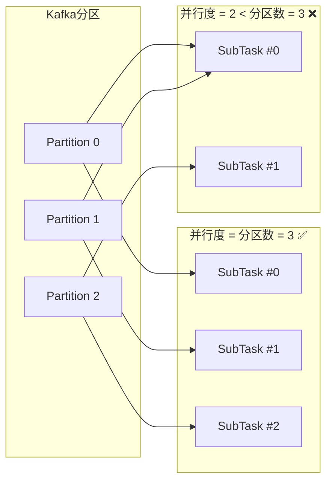

| 情况 | 现象 | 原因 | 解法 |
|------|------|------|------|
| **并行度 < 分区数** | 某个 subTask 消费多个分区 → 该 subTask CPU 打满 → 反压源头 | Kafka 分区分配策略：多出来的分区会堆到序号靠前的 subTask 上 | 并行度对齐分区数 |
| **并行度 > 分区数** | 部分 subTask 空闲（无数据）→ 浪费 Slot 资源 | 多余的 subTask 没有分区可消费，Kafka 不负责负载均衡到无分区 subTask | 降并行度或接受少量空闲 |

**根本原因**：Flink 的 Kafka Source 是一个 subTask 从 Kafka Server 直连消费，它不像 keyBy/rebalance 那样在 Flink 内部做数据重分布。Kafka 分区到 subTask 的映射是在 Source 初始化时定死的——每个 subTask claim 属于自己的分区，多出来的分区没有"溢出"到空闲 subTask 的机制。

!!! tip "你说的应该是…"
    "Kafka Source 并行度建议等于分区数，一一对应。如果并行度小于分区数，多出来的分区会堆到某个 subTask 上形成消费瓶颈——因为映射是初始化时定死的，不会动态再分配。如果并行度大于分区数，多出来的 subTask 空闲浪费 Slot。实际操作中，先看 Kafka topic 的分区数，再以此作为 Source 并行度的基准。"

??? example "代码：Kafka Source 完整配置"
    ```java
    --8<-- "code/L05/KafkaWindowAggJob.java"
    ```

---

### Offset 不用手动提交吗？Checkpoint 挂了，从哪恢复消费？

**Flink 的 offset 管理机制和传统 Kafka Consumer 完全不同。**

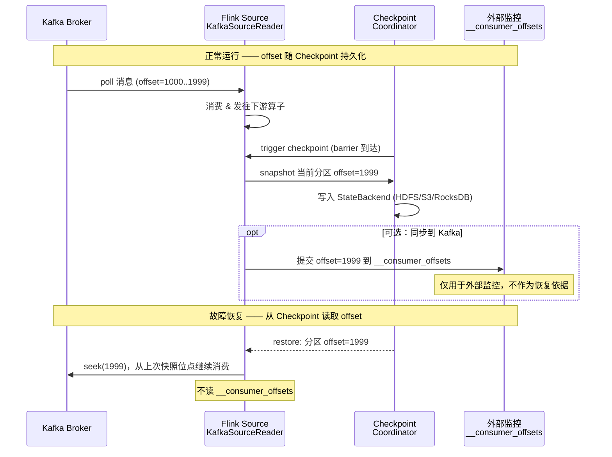

**核心区别**：

| 维度 | 传统 Kafka Consumer | Flink Kafka Source |
|------|---------------------|-------------------|
| offset 存储位置 | Kafka `__consumer_offsets` topic | Flink Checkpoint（StateBackend） |
| 提交时机 | 定时自动提交 / 手动 commitSync | Checkpoint 完成时一起持久化 |
| 恢复依据 | 从 `__consumer_offsets` 读上次提交位点 | 从 Checkpoint 恢复快照中的 offset |
| `__consumer_offsets` 作用 | **恢复依据**（必须） | **仅监控**（可选，方便外部工具看消费进度） |

**为什么 Checkpoint 是恢复依据而不是 `__consumer_offsets`？** Checkpoint 记录的 offset 和算子状态（窗口内聚合值、MapState 内容）是**同一个快照**——恢复时 offset 和状态是原子一致的时间点。如果靠 `__consumer_offsets` 恢复，可能出现"状态里已经聚合了 offset 1000-1500 的数据，但 offset 只恢复到了 1200"的不一致。

!!! tip "你说的应该是…"
    "Flink 不依赖 Kafka 的 `__consumer_offsets` 做故障恢复。开启 Checkpoint 后，每条分区的消费 offset 随算子状态一起存入快照。任务重启时，从最近一次成功的 Checkpoint 恢复所有状态和 offset——offset 和状态是同一快照的，不会出现数据断层或重复。`__consumer_offsets` 只是可选开启，方便 Grafana 之类的工具看消费 lag。"

---

### 怎么保证写到 Kafka 的数据一条不丢也不重？

**这本质上是端到端精确一次（End-to-End Exactly-Once）的问题**——L04 已经详细讲了 2PC 机制，这里从 Kafka Sink 视角快速回顾。

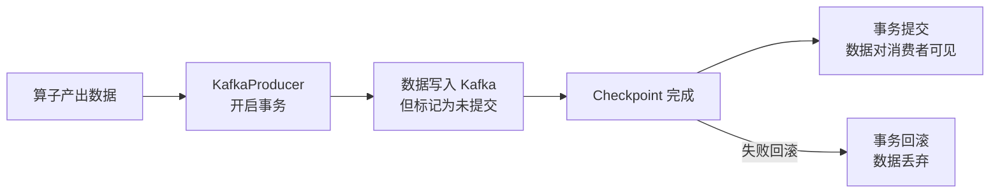

**两步语义绑定**：

```
KafkaSink 开启事务 (transactional.id 前缀)
     +
Flink Checkpoint 开启 (EXACTLY_ONCE)
     = 端到端精确一次
```

**关键是**：数据在 checkpoint 之间写入 Kafka 但标记为"未提交"（消费者默认看不到）。只有 Checkpoint 成功完成时，才在 `notifyCheckpointComplete` 中提交 Kafka 事务。如果任务挂了从上一个 checkpoint 恢复，未提交的事务数据会被 Kafka 自动回滚——重放的数据恰好覆盖上次未提交的部分。

| 配置项 | 作用 |
|--------|------|
| `Semantic.EXACTLY_ONCE` | 启用 Kafka 事务 |
| `transactional.id.prefix` | 事务 ID 前缀（每个算子实例唯一） |
| `transaction.timeout.ms` | 事务超时（必须 > checkpoint 间隔 × 2） |
| Checkpoint `EXACTLY_ONCE` | Flink 侧的精确一次保证 |

!!! tip "你说的应该是…"
    "Kafka Sink 配事务 + Flink Checkpoint EXACTLY_ONCE 实现端到端精确一次。数据在两个 checkpoint 之间写入 Kafka 但未提交（消费者不可见），只有 checkpoint 成功完成后才在 notifyCheckpointComplete 中提交事务。如果失败回滚，Kafka 自动丢弃未提交的事务数据，从上一个 checkpoint 重放正好补上——不丢不重。"

---

## 2. 双流 Join vs 维表 Join（原题 43）

### 两条流按 key 关联，怎么选 Window Join 还是 Interval Join？

**双流 Join** 的本质是：两条流都要保留历史状态，等对方的数据到来时做匹配。典型场景是"订单流 ↔ 支付流按 orderId 关联"。

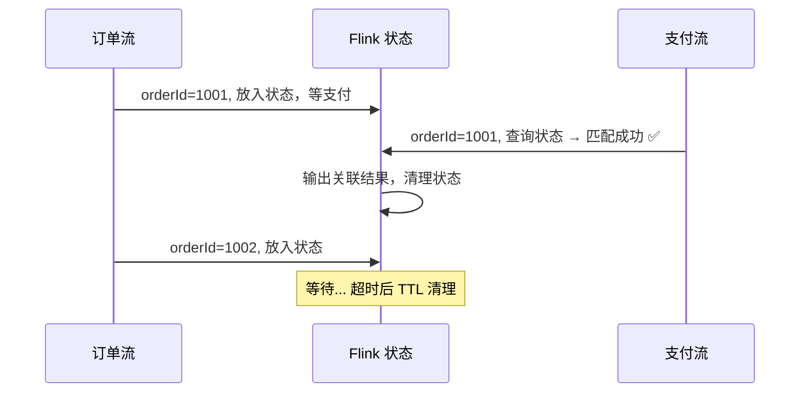

**Window Join vs Interval Join**：

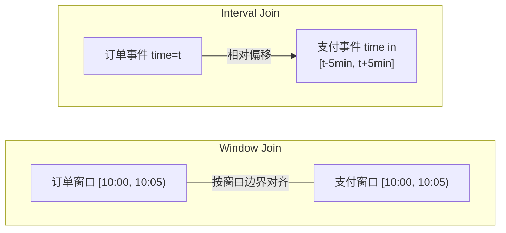

| 维度 | Window Join | Interval Join |
|------|-------------|---------------|
| 关联条件 | 两条事件落在**同一个窗口**内 | 一条事件时间落在另一条的**相对区间** `[t-lower, t+upper]` 内 |
| 适用场景 | 自然窗口统计（每 5 分钟关联一次） | 事件级关联（订单 5 分钟内支付即算匹配） |
| 灵活性 | 低——窗口边界固定 | 高——以每条事件时间为中心，前后偏移 |
| 状态清理 | 窗口触发后清理 | 基于时间触发清理（`EventTimeCleanup`） |
| 语义陷阱 | 订单在 10:04:59，支付在 10:05:01 → **不匹配**（窗口边界切割） | 订单在 10:04:59，支付在 10:05:01 → **匹配**（在上界内） |

**Interval Join 为什么比 Window Join 更"自然"？** 因为现实业务中，订单和支付的时间差是随机的，不是按你划的窗口边界精确对齐的。Interval Join 以每条事件时间为锚点，允许前后偏移——这才是业务语义。

**双流 Join 的状态代价警示**：两条流都要缓存未匹配的数据，且状态大小 = 未匹配事件数 × 每条事件大小。如果某条流长期没有匹配（如订单流有数据但支付流断流），状态会持续膨胀。必须配 TTL。

??? example "代码：Interval Join 示例"
    ```java
    // 订单流（key = orderId）interval join 支付流（key = orderId）
    // 支付时间在订单时间的 [-0, +5min] 区间内
    orderStream
        .keyBy(Order::getOrderId)
        .intervalJoin(payStream.keyBy(Pay::getOrderId))
        .between(Time.minutes(0), Time.minutes(5))     // lower=0, upper=5min
        .process(new ProcessJoinFunction<>() {
            @Override
            public void processElement(Order order, Pay pay, Context ctx,
                                       Collector<Enriched> out) {
                out.collect(new Enriched(order, pay));
            }
        });
    ```

---

### 事实流关联维表，为什么比双流 Join 代价低？

**维表 Join** 的本质是：**维度数据在外存（MySQL/HBase/Redis），事实流来时才查，流侧不存维度的全部历史。**

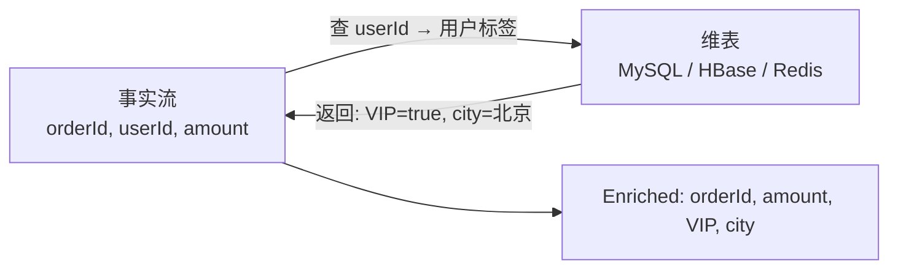

| 对比维度 | 双流 Join | 维表 Join |
|----------|-----------|-----------|
| 状态位置 | Flink 内（两条流的状态都缓存） | 外部存储（MySQL/HBase/Redis） |
| 状态大小 | = 未匹配事件数 × 事件大小（可能很大） | 流侧只缓短期热数据（MapState + TTL），极小 |
| 状态膨胀风险 | 高（某条流断流 → 状态堆积） | 低（维度在外部，不占用 Flink 状态） |
| 延迟 | 低（纯内存状态查询） | 较高（网络 IO 查外部） |
| 适用 | 两条流实时互关联（订单 ↔ 支付） | 事实流查外部维度（用户标签、商户信息） |

**维表 Join 的核心优化路径**：
1. **同步查**（`RichMapFunction` 内 JDBC/Redis）→ 每条阻塞几百 ms，吞吐极低，**生产禁用**
2. **Async I/O** → 异步并发查，吞吐量级提升（详见 §6）
3. **本地缓存** → MapState + TTL 缓存热维度，减少回源，命中率 90%+ 时外部压力降一个数量级
4. **批量查** → 攒一批 key 一起查（如 Redis mget），减少网络往返

!!! tip "你说的应该是…"
    "双流 Join 是两条流都在 Flink 内缓存状态互等对方，状态代价高，适合实时流对流的匹配场景（订单↔支付）。维表 Join 维度存外部，事实流来才查，状态代价低，适合事实流关联外部维度信息。维表 Join 的核心优化是 Async I/O 异步化 + 本地缓存减少回源。"

---

## 3. 去重（原题 49）

### 线上数据有重复，怎么用状态做精确去重？

**最直接的方案**：`MapState<bizKey, Boolean>` + TTL。把见过的业务主键记下来，重复的跳过。

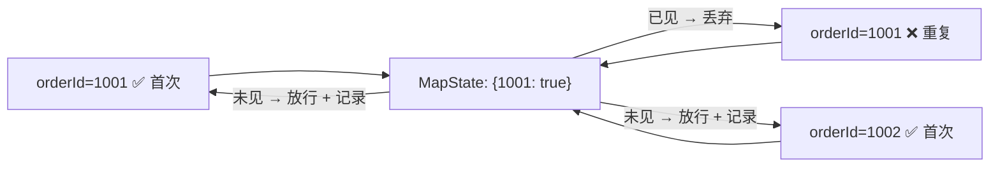

**核心参数**：TTL 设多久？这取决于"去重窗口"——多长时间内的重复算重复。

| 场景 | TTL 建议 | 原因 |
|------|---------|------|
| 防止 Kafka 重放导致的重复 | 24~48 小时 | Kafka 重放通常在小时级别，超过 2 天不太可能重放 |
| 业务幂等（同一订单不重复处理） | 7 天 | 业务重复可能跨天，状态存久一点安全 |
| UV 去重（按天） | 24 小时 + 当天零点清除 | 每天零点重置，只保留当天 |

**TTL 的两个关键配置**：

| 配置 | 含义 | 默认值 |
|------|------|--------|
| `UpdateType.OnCreateAndWrite` | 创建和更新时重置 TTL | 常用 |
| `UpdateType.OnReadAndWrite` | 读 + 写都重置 TTL（慎用：热 key 永远不过期） | — |
| `StateVisibility.NeverReturnExpired` | 过期数据不可见（推荐） | 推荐 |
| `StateVisibility.ReturnExpiredIfNotCleanedUp` | 过期但未清理时仍可读到（有风险） | — |
| `cleanupInBackground` | 后台线程定期扫描清理 | 默认开启 |
| `cleanupInRocksdbCompactFilter` | RocksDB compaction 时清理 | 仅在 RocksDB 后端生效 |

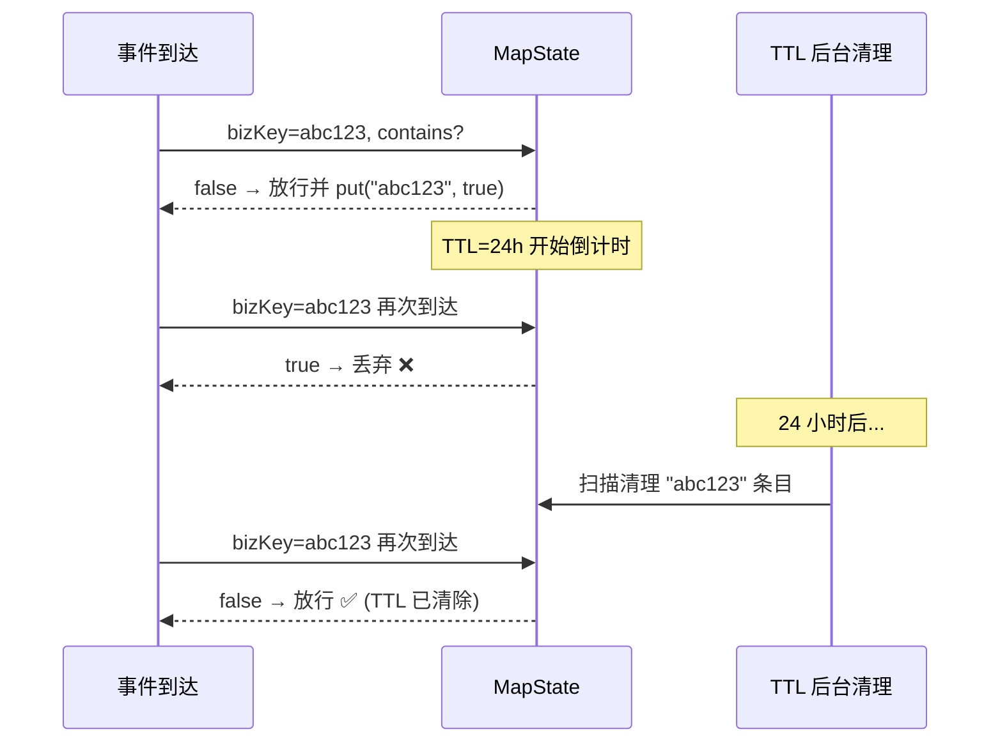

??? example "代码：MapState 精确去重 + TTL"
    ```java
    --8<-- "code/L05/StatefulDedupJob.java:44:67"
    ```

---

### 数据量极大，精确去重扛不住怎么办？

**当去重基数达到千万甚至亿级时，MapState 把全量 bizKey 存下来会导致状态膨胀到几十 GB**——此时需要降级方案。

| 方法 | 精确度 | 空间复杂度 | 适用场景 |
|------|--------|-----------|---------|
| **MapState + TTL** | 100% 精确 | O(N)，N = 去重窗口内唯一 key 数 | 百万级 key 以下 |
| **布隆过滤器（Bloom Filter）** | 近似（有误判，无误漏） | O(1)，~几 MB | **海量去重**：允许极少误判（如万分之三），但不允许漏判 |
| **HyperLogLog（HLL）** | 近似计数 | O(1)，~几 KB | **UV 估算**：不需要精确的去重个数 |
| **RoaringBitmap** | 100% 精确 | 压缩位图，远小于 MapState | **高基数精确**：用户 ID 集合去重，压缩后体积极小 |

**布隆过滤器的核心权衡**：

```
误判率（false positive） ← 允许：偶尔把新数据判为重复（丢弃了本不该丢的）
漏判率（false negative） ← 不允许：从不把重复数据判为新数据（不会放过重复）

本质：宁可错杀一个，不可放过一个——但错的概率极低（可配置）
```

**什么时候必须精确去重？** 涉及金钱、库存、订单状态等不可逆操作时，用 MapState 或 RoaringBitmap。UV 统计、点击去重、日志去重可用近似方法。

!!! tip "你说的应该是…"
    "按业务主键精确去重用 MapState + TTL，设好过期时间控制状态大小。海量数据去重降级用布隆过滤器（空间小、有可控误判）或 RoaringBitmap（精确、高压缩）。UV 统计用 HyperLogLog 近似估算。关键业务（金额、库存）必须精确——空间换正确性。"

---

## 4. SideOutput 分流（原题 18）

### 脏数据怎么单独处理而不影响主流？

**SideOutput（侧输出流）的本质：在一条流的处理过程中，把不同"命运"的数据路由到不同出口——主流继续正常逻辑，侧输出流独立处理。**

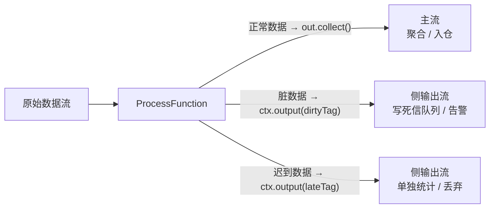

**和 filter 的本质区别**：

| 操作 | 数据命运 | 能否独立处理 |
|------|---------|-------------|
| `filter()` | 丢弃 = 彻底消失 | ❌ 被过滤的数据不可恢复、不可观察 |
| `OutputTag` + `getSideOutput()` | 分流 = 进入另一条独立流 | ✅ 侧输出流有自己的 keyBy、窗口、sink |

**典型使用场景**：

| 场景 | 主流 | 侧输出流 |
|------|------|---------|
| 数据清洗 | 干净数据 → 聚合写入 | 脏数据 → Kafka 死信 topic |
| 窗口处理 | 正常窗口数据 | 迟到数据 → 单独统计迟到率 |
| 流量分离 | 普通用户 | VIP 用户 → 专属逻辑 |
| 分流治理 | 正常流量 | 超大 key → 单独路由（如热门商品隔离） |

**OutputTag 的序列化陷阱**：必须声明为 `static final`，原因在于 Flink 序列化时用 tag 的 `id` 做身份比对。如果不是常量，反序列化后匿名内部类的 `id` 不一致 → `ClassCastException`。

```java
// ✅ 正确：静态常量
private static final OutputTag<String> DIRTY_TAG =
        new OutputTag<String>("dirty-data") {};

// ❌ 错误：局部变量（序列化后 id 不一致）
OutputTag<String> dirtyTag = new OutputTag<String>("dirty-data") {};
```

??? example "代码：SideOutput 分流完整示例"
    ```java
    --8<-- "code/L05/SideOutputDiversionJob.java"
    ```

!!! tip "你说的应该是…"
    "SideOutput 把脏数据、异常数据、迟到数据分流到侧输出流——它们和主流完全独立，各自 keyBy、各自 sink。和 filter 的区别是：filter 直接丢弃，被丢弃的数据不可观察；SideOutput 侧输出数据仍在 Flink 管控内，可以写死信队列、上报告警。OutputTag 必须声明为 static final，否则序列化后 id 不一致会抛 ClassCastException。"

---

## 5. Broadcast State 规则广播（原题 21）

### 规则变了怎么让所有算子秒级生效？

**Broadcast State 解决的核心矛盾**：有一条低吞吐的规则流需要被所有并行算子实例消费，但不想让每个实例都去外部系统轮询。

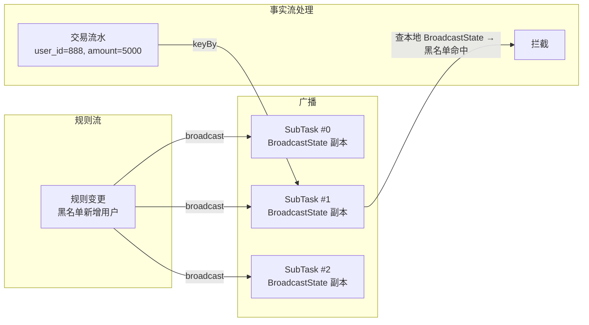

**工作原理**：

| 步骤 | 发生什么 |
|------|---------|
| 1. 规则流 `.broadcast(descriptor)` | 广播到所有下游算子实例 |
| 2. `processBroadcastElement()` | 每个实例收到规则后写入自己的 `BroadcastState` 副本 |
| 3. `processElement()` | 事实流到来时查 `ReadOnlyBroadcastState`，零网络开销 |
| 4. 规则更新 | 写入 `BroadcastState` → 所有实例秒级生效 |

**为什么不用维表 Join？**

| 方案 | 每次查询开销 | 规则更新延迟 | 外部依赖 |
|------|------------|------------|---------|
| 维表 Join（查 Redis） | 网络 IO ~1ms | 取决于缓存 TTL（通常≥1min） | 依赖 Redis 可用性 |
| Broadcast State | **零**（纯内存） | **秒级**（广播即生效） | 无外部依赖 |

**但 Broadcast State 有严格的使用限制**：
- 规则流必须**低吞吐**（配置变更 / 黑名单更新，每分钟几条到几十条）
- 广播数据会存储在每个算子实例中 → 规则总量不能太大（推荐 < 几 MB）
- `MapStateDescriptor` 在 `connect()` 和 `getBroadcastState()` 两端**必须是同一个实例**（引用相等比较）

### 广播状态的底层机制：Descriptor 与懒初始化

**为什么必须用 `MapStateDescriptor`？** 广播状态在 Flink 内部**强制以 Map 结构存储**——因为你需要通过 key 来查找规则（如 `state.get(ruleId)`）。List 或 Value 结构无法支持这种按 key 查找的模式。

**广播状态不是作业启动时一次性创建好的**。`.broadcast(descriptor)` 调用时，Flink 只是记住了"这个广播流用这个 descriptor 描述"。真正的状态空间是在**每个 SubTask 收到第一条广播数据时，才在自己的 StateBackend 中懒初始化**。

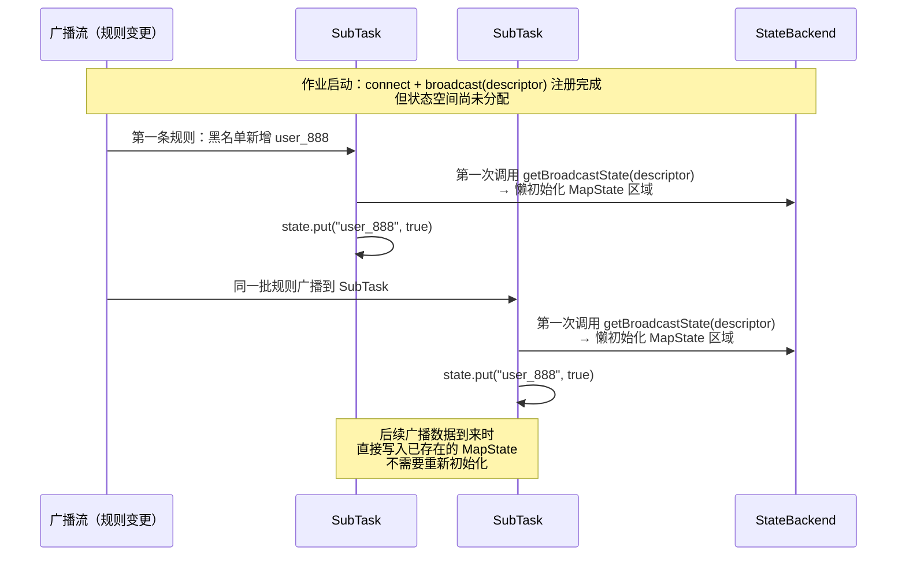

**关键认知**：

1. **广播状态是懒初始化的**——不是作业启动时预分配所有 SubTask 的存储空间，而是每个 SubTask 在收到第一条广播数据时才创建。这在大量 SubTask 的场景下节省了启动时的内存开销。

2. **`processBroadcastElement()` 负责写，`processElement()` 负责读**——广播数据到达时更新状态（写），事实流到达时查询状态（读）。读写分离，互不阻塞。

3. **广播状态没有 TTL**——和 KeyedState 不同，BroadcastState 没有内置的 TTL 机制。旧规则不会自动过期，你需要手动在 `processBroadcastElement()` 里清理（如 `state.remove(oldRuleId)`）。

4. **`MapStateDescriptor` 必须是同一个实例**——`connect()` 里的 descriptor 和 `getBroadcastState()` 里的 descriptor 必须是引用相等的同一个对象。Flink 通过引用相等来判断"这是不是同一个广播状态"。如果你 `new` 了两个内容相同但引用不同的 descriptor，Flink 会认为这是两个不同的状态。

### 规则更新的端到端链路：从 MySQL 到 BroadcastState

**广播状态的"秒级生效"不是魔法——它依赖一条完整的实时数据管道。**

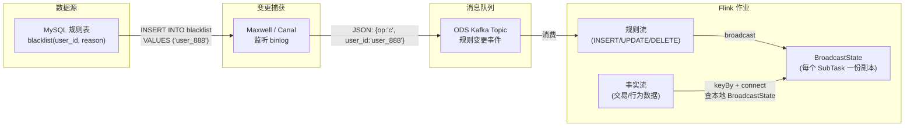

**链路拆解**：

| 步骤 | 谁 | 做什么 | 延迟 |
|------|----|--------|------|
| 1 | 运维/DBA | `INSERT INTO blacklist VALUES ('user_888', '欺诈用户')` | — |
| 2 | Maxwell/Canal | 监听 MySQL binlog，解析出变更事件 → 写入 ODS Kafka Topic | ~100ms |
| 3 | Flink 规则流 | 消费 ODS Topic，解析 JSON → 调用 `processBroadcastElement()` | ~1s |
| 4 | `processBroadcastElement()` | `ctx.getBroadcastState(descriptor).put("user_888", true)` → 写入 BroadcastState | 内存操作，<1ms |
| 5 | 事实流 `processElement()` | 交易数据到达 → `state.get("user_888")` → 命中黑名单 → 拦截 | 内存操作，<1ms |

**从 MySQL 写入到所有 SubTask 生效，端到端延迟通常 1-3 秒。**

### 为什么 connect 不需要每次"重新读取"？

**connect 只做一次——在作业启动时。** 之后规则流和事实流各自持续运行：

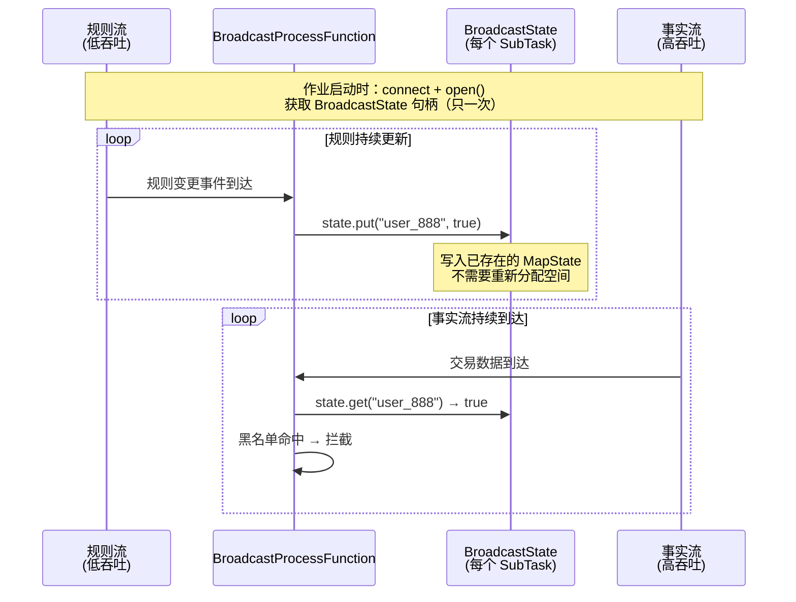

**connect 不是"每次读取规则时重新连接"**——它是作业拓扑的一部分，在 DAG 构建时就确定了。运行时 `processBroadcastElement()` 和 `processElement()` 共享同一个 `BroadcastState` 句柄，一个写一个读，天然同步。

**一句话总结**：规则更新的实时性不靠"定时拉取"，靠的是 binlog → Kafka → Flink 这条和业务数据完全相同的实时链路。广播只是把这条链路的输出复制到所有 SubTask，让事实流能本地零延迟查询。

### 广播流 vs 主流：数据流向的根本差异

**广播流和主流在 connect 之后的命运完全不同。** 这是理解 Broadcast State 最关键的一点。

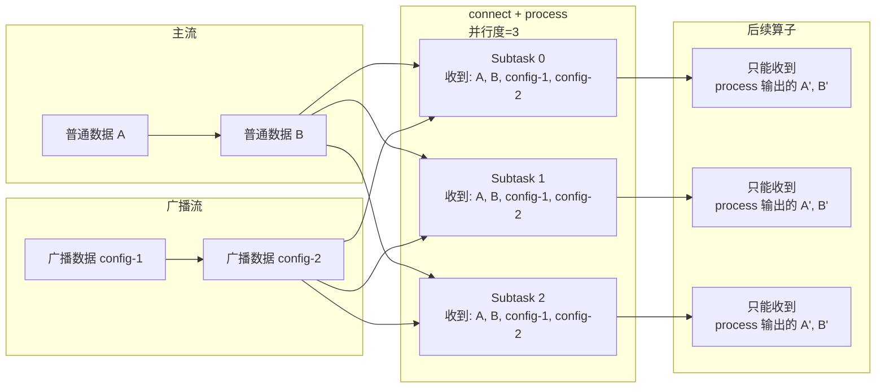

**关键差异**：

| | 广播流数据 | 主流数据 |
|---|---|---|
| **处理入口** | `processBroadcastElement()` | `processElement()` |
| **处理方式** | 存入 BroadcastState，到此为止 | 查 BroadcastState → 业务逻辑处理 |
| **是否输出到下游** | ❌ **不输出**——广播数据的唯一使命是更新状态 | ✅ `out.collect()` 正常输出 |
| **能否走侧输出流** | ❌ 不能 | ✅ `ctx.output(outputTag, data)` |
| **消费语义** | 被处理后就"消费掉了"，不再传递 | 处理后继续往下游流转 |

**广播流的三个必要条件**：

1. **必须 `connect` 一个主流（或 keyed 流）**——单独的广播流没有意义
2. **必须用 Broadcast 专属的 ProcessFunction**——`BroadcastProcessFunction` 或 `KeyedBroadcastProcessFunction`
3. **广播数据不会自动往下游走**——如果你想输出广播数据的处理结果，需要在 `processBroadcastElement()` 里主动调用 `out.collect()`

**主流数据不受任何限制**——`processElement()` 里可以 `out.collect()` 输出到下游、`ctx.output()` 走侧输出流、读写 KeyedState，一切照常。广播流只是"附着"在主流上的配置通道。

??? example "代码：Broadcast State 规则广播完整示例"
    ```java
    --8<-- "code/L05/BroadcastRuleMatcherJob.java"
    ```

!!! tip "你说的应该是…"
    "Broadcast State 把低吞吐的规则流广播到所有算子实例，每个实例存一份规则副本。事实流到来时查本地内存，零网络开销、秒级生效。适合规则/配置更新的场景——比如风控黑名单、动态限流阈值。对比维表 Join：不需要每次查外部存储，规则更新延迟从分钟级降到秒级。但规则总量不能太大（每个实例都会存完整副本）。"

---

## 6. Async I/O 维表异步查询（原题 35）

### 维表查询为什么一定要异步？

**同步查的瓶颈不是网络慢，是"等"浪费了线程。**

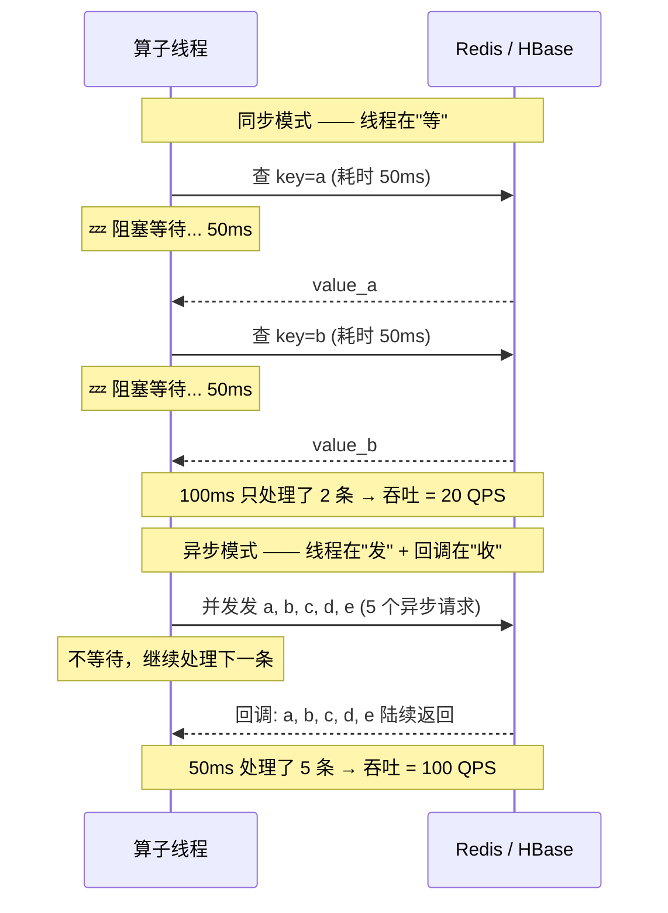

**同步 vs 异步的数学差距**：

```
假设：外部查询延迟 = 50ms，并发能力 = 100

同步吞吐 = 1000ms / 50ms = 20 QPS
异步吞吐 = 1000ms / 50ms × 100（并发） = 2000 QPS

差距：100 倍
```

**Async I/O 的两个核心参数**：

| 参数 | 含义 | 设多少 |
|------|------|--------|
| `timeout` | 单个异步请求的超时时间 | 通常 5~10s，略大于外部存储的 P99 延迟 |
| `capacity` | 最大并发请求数 | 取决于外部存储的连接池大小和单机承受能力 |

**unorderedWait vs orderedWait**：

| 模式 | 行为 | 适用场景 |
|------|------|---------|
| `unorderedWait` | 结果谁先回来先输出，不保序 | 绝大多数场景——维表关联不要求顺序，吞吐最高 |
| `orderedWait` | 严格按输入顺序输出（即使结果先回来也要排队等前面的先输出） | 需要保序的场景——极少用，会显著降低吞吐 |

**Async I/O 的完整优化链路**：

```
1. 同步查 → 阻塞线程 → 吞吐 O(1/延迟)
2. Async I/O 异步化 → 并发发出 → 吞吐 O(并发数/延迟)
3. + 本地缓存 (MapState+TTL) → 命中直接返回 → 减少 90% 外部请求
4. + 批量查 (攒一批 mget) → 一次网络往返拿多条 → 再降一个数量级
5. + 限流 → 保护外部存储不被压垮
```

??? example "代码：Async I/O 维表异步查询"
    ```java
    --8<-- "code/L05/StatefulDedupJob.java:69:77"
    ```

!!! tip "你说的应该是…"
    "同步查外部维表，每条记录的等待时间（50ms+）全部浪费在线程阻塞上，吞吐极低。AsyncDataStream.unorderedWait 让单个算子实例并发发出多个异步请求、回调时收集结果——把等待时间重叠起来，吞吐量级提升。再配合本地缓存 MapState+TTL（缓存热维度减少回源）和批量查 mget，外部存储压力降一个数量级。unorderedWait 比 orderedWait 吞吐高，维表关联不需要保序。"

---

## 7. 项目表达模板

> "上游 Kafka 承接业务消息，Flink Source 并行度对齐分区数消费 —— offset 随 Checkpoint 持久化，不依赖 `__consumer_offsets` 做恢复。数据清洗阶段用 SideOutput 把脏数据分流到死信队列、主流按业务主键精确去重（MapState + 24h TTL）。
>
> 需要关联维度的用 Async I/O 异步查 Redis/HBase（ unorderedWait + 本地缓存 MapState 减少回源）。双流 Join 用 Interval Join（允许时间偏移，比 Window Join 更贴合业务）。动态规则（如风控黑名单）走 Broadcast State 广播到所有实例，秒级生效。
>
> 结果写 Kafka 走 2PC 事务 + Checkpoint EXACTLY_ONCE 实现端到端精确一次。
>
> **面试重点**：Kafka 消费并行度与分区数一一对应；维表为什么用 Async I/O 而不是同步查；去重与状态 TTL 的关系；SideOutput 和 filter 的本质区别。"

---

## 自测（先口述，再点开）

<details>
<summary><b>Q：Flink 消费 Kafka 时，并行度怎么设最合理？offset 靠什么恢复？和传统 Kafka Consumer 有什么本质不同？</b></summary>

A：消费并行度建议等于 Kafka 分区数，一一对应避免某 subTask 扛多 partition 成瓶颈。开启 Checkpoint 后 offset 随状态存入快照，恢复时从 checkpoint 记录的位点精准重放——**不依赖写回 `__consumer_offsets`**。传统 Kafka Consumer 靠 `__consumer_offsets` 做恢复依据，Flink 只是可选开启供外部监控用。

恢复时 offset 和算子状态是同一快照 → 原子一致，不会出现"状态聚合了但 offset 对不上"的问题。

</details>

<details>
<summary><b>Q：Window Join 和 Interval Join 到底有什么区别？为什么说 Interval Join 更"自然"？</b></summary>

A：Window Join 要求两条流的事件落在**同一个固定窗口**内（如 [10:00, 10:05)），窗口边界是死的——订单在 10:04:59、支付在 10:05:01 → 不匹配（被窗口边界切割了）。

Interval Join 以每条事件时间为锚点，允许相对于对方流的时间偏移 `[t - lower, t + upper]`。订单在 10:04:59、支付在 10:05:01 → 在 [t, t+5min] 区间内 → **匹配**。

Interval Join 更自然因为**现实业务中事件的时间差是随机的**，不是按你画的窗口线对齐的。

</details>

<details>
<summary><b>Q：去重有哪些方法？精确去重和 UV 估算分别用什么？海量数据用 MapState 的风险在哪？</b></summary>

A：精确去重用 MapState + TTL（按业务主键，设好过期控制状态大小）。海量数据时 MapState 存全量 bizKey 会导致状态膨胀到几十 GB——降级用布隆过滤器（空间小、有可控误判但无误漏）或 RoaringBitmap（高压缩精确位图）。UV 统计用 HyperLogLog 近似估算。

涉及金额、库存等不可逆操作必须精确——空间换正确性。关键配置：TTL 时长 = 去重窗口；`UpdateType.OnCreateAndWrite`（读不重置 TTL，避免热 key 永不超时）；`NeverReturnExpired`（过期数据对业务不可见）。

</details>

<details>
<summary><b>Q：SideOutput 有什么用？和 filter 的本质区别在哪？OutputTag 为什么必须是 static final？</b></summary>

A：SideOutput 把脏数据、异常、迟到数据分流到独立侧输出流，和主流各自 keyBy/窗口/sink。和 filter 的本质区别：**filter 直接丢弃，被丢弃的数据不可恢复、不可观察**；SideOutput 侧输出数据仍在 Flink 管控范围内，可写死信队列、上报告警。

OutputTag 必须 `static final` 因为 Flink 用 tag 的 `id` 做身份比对，如果不是常量，反序列化后匿名内部类的 `id` 不一致 → `ClassCastException`。

</details>

<details>
<summary><b>Q：Broadcast State 的工作原理？什么时候用它而不是维表 Join？有什么限制？</b></summary>

A：规则流 `.broadcast(descriptor)` 广播到所有算子实例 → 每个实例通过 `processBroadcastElement()` 把规则写入本地 `BroadcastState` 副本 → 事实流到来时 `processElement()` 读 `ReadOnlyBroadcastState`，零网络开销、秒级生效。

vs 维表 Join：每次查外部需要网络 IO、规则更新延迟取决于缓存 TTL。Broadcast State 适合低吞吐规则流（黑名单/配置），查规则零延迟、无外部依赖。

限制：规则总量不能大（每个实例存完整副本，推荐 < 几 MB）；规则流吞吐必须低（每分钟几条到几十条）；`MapStateDescriptor` 在 `connect()` 和 `getBroadcastState()` 两端必须是同一个实例。

</details>

<details>
<summary><b>Q：为什么维表关联要用 Async I/O？同步查的瓶颈在哪？orderedWait 和 unorderedWait 怎么选？</b></summary>

A：同步查外部每条约阻塞几十~几百 ms，线程大部分时间在等待网络返回——吞吐 = 1 / 单次延迟（极低）。Async I/O 单线程并发发起多个外部请求、回调时收集结果，把等待时间重叠——吞吐 = 并发数 / 单次延迟（量级提升）。

`unorderedWait`：谁先回来先输出（不保序），吞吐最高，维表关联不需要保序 → 首选。`orderedWait`：严格按输入顺序输出（后面的结果要排队等前面的先返回），吞吐低 → 极少用。

完整优化链路：Async I/O → 本地缓存 MapState+TTL → 批量查 mget → 限流保护外部存储。

</details>

<details>
<summary><b>Q：Kafka Sink 怎么实现端到端精确一次？事务在哪一步提交？</b></summary>

A：Kafka Sink 开启事务 + Flink Checkpoint EXACTLY_ONCE = 端到端精确一次。数据在两个 checkpoint 之间写入 Kafka 但标记为"未提交"（消费者不可见）。只有 checkpoint 成功完成时，在 `notifyCheckpointComplete` 中提交 Kafka 事务，数据才对消费者可见。如果任务失败回滚，未提交的事务被 Kafka 自动丢弃，从上个 checkpoint 重新消费恰好补上——不丢不重。

关键：`transaction.timeout.ms` 必须 > checkpoint 间隔 × 2（防止事务在 checkpoint 中间超时）。

</details>

---

## 推荐源

- Kafka Connector 完整文档：<https://nightlies.apache.org/flink/flink-docs-stable/docs/connectors/datastream/kafka/>
- Window Join & Interval Join：<https://nightlies.apache.org/flink/flink-docs-stable/docs/dev/datastream/operators/joining/>
- Async I/O：<https://nightlies.apache.org/flink/flink-docs-stable/docs/dev/datastream/operators/asyncio/>
- Broadcast State 模式：<https://nightlies.apache.org/flink/flink-docs-stable/docs/dev/datastream/fault-tolerance/broadcast_state/>
- Side Output：<https://nightlies.apache.org/flink/flink-docs-stable/docs/dev/datastream/side_output/>
- Flink 状态 TTL：<https://nightlies.apache.org/flink/flink-docs-stable/docs/dev/datastream/fault-tolerance/state/#state-time-to-live-ttl>

!!! note "📦 配套代码"
    本节所有代码示例均为生产级，非 Demo。完整源码在 `code/` 目录：
    | 文件 | 覆盖 |
    |------|------|
    | [`KafkaWindowAggJob.java`](code/L05/KafkaWindowAggJob.java) | §1 Kafka Source + Watermark + 窗口聚合 + Sink |
    | [`StatefulDedupJob.java`](code/L05/StatefulDedupJob.java) | §3 MapState 去重 + TTL + §6 Async I/O 维表关联 |
    | [`SideOutputDiversionJob.java`](code/L05/SideOutputDiversionJob.java) | §4 SideOutput 脏数据分流 |
    | [`BroadcastRuleMatcherJob.java`](code/L05/BroadcastRuleMatcherJob.java) | §5 Broadcast State 规则广播 |
    详见 [`code/README.md`](code/README.md)

---

!!! question "卡住了？"
    Interval Join 与 Window Join 的语义差异、Async I/O orderedWait 的使用场景、Broadcast State 的 Checkpoint 行为、布隆过滤器在 Flink 中的集成方式——任意点直接问老师展开或出题。
