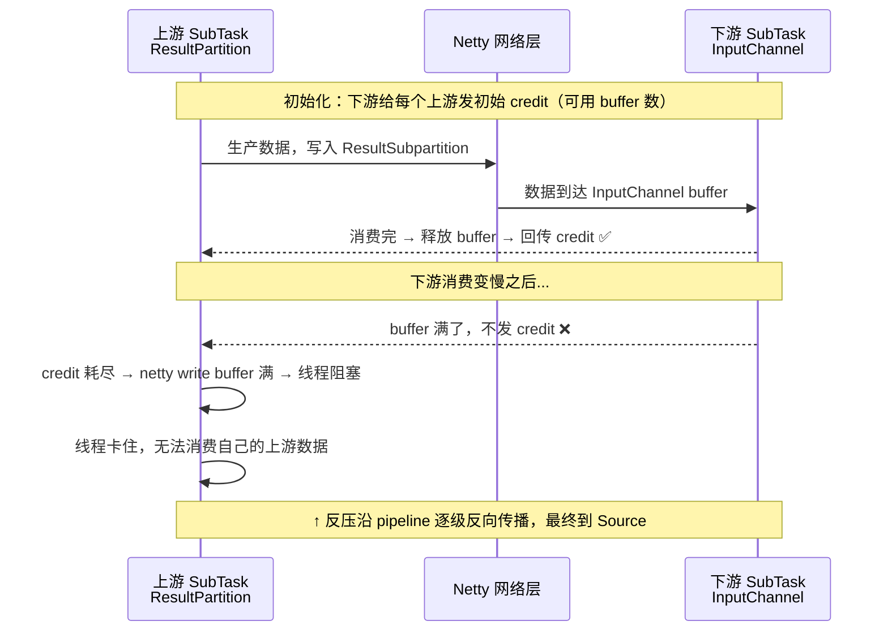
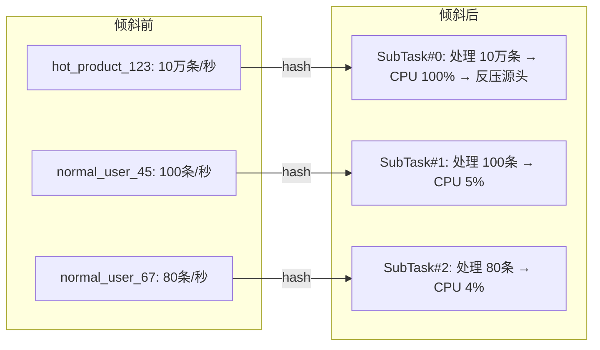
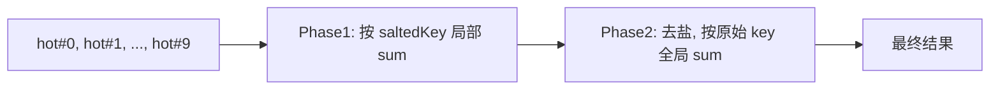
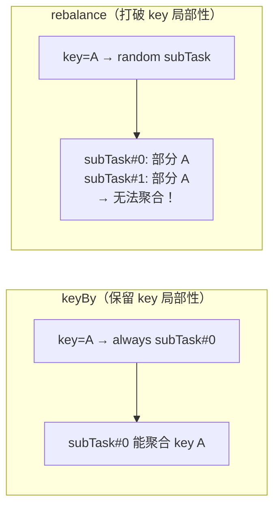
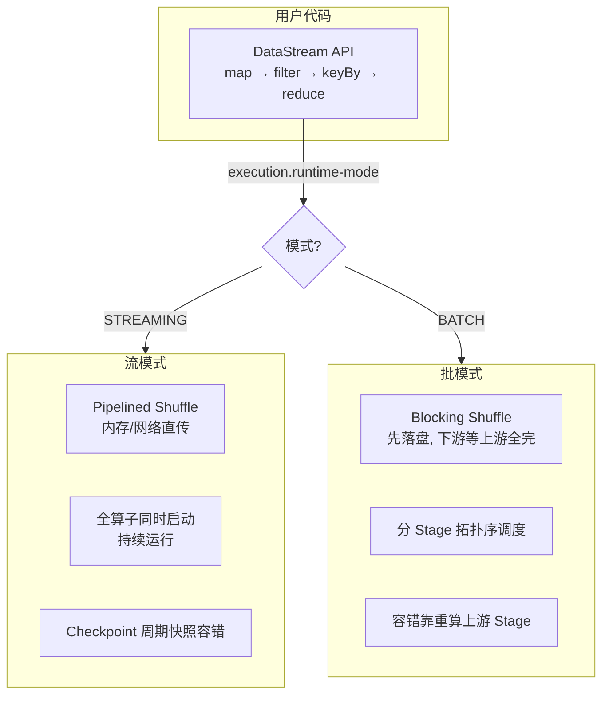

# 06 · 性能调优与流批一体

> **本章要回答一个终极问题：Flink 作业上线后，性能不如预期怎么办？**
>
> 你大概率会遇到这些场景：吞吐量上不去、个别算子 CPU 打满、checkpoint 越来越慢、任务频繁重启……
> 这些问题不是孤立的——它们沿着一条链路相互影响。
>
> ```mermaid
> flowchart LR
>     A[并行度 / Slot 配置不当] --> B[反压 — 所有性能问题的晴雨表]
>     B --> C[数据倾斜 — 反压的最常见原因]
>     B --> D[序列化 — 被低估的性能杀手]
>     C --> E[两阶段聚合 — 倾斜解法]
>     D --> F[Operator Chain — 微观优化]
>     B --> G[监控 — 诊断而非瞎猜]
>     
>     H[流批一体] -.->|独立主题| I[同一套代码跑实时 + 离线]
> ```
>
> **阅读建议**：§1-§4 是性能调优主干（依次递进），§5-§6 是两个独立但高频的主题，§7 放在最后是因为要先理解问题才能学会诊断。
> 
> 覆盖原题：23, 42, 66, 14, 17, 59, 13, 19, 30, 47。

---

## 1. 并行度调优（原题 23, 55）

### 并行度是不是越大越好？

**不是。** 这句话面试官不一定直接问，但你说出"不是越大越好"+ 给出理由，比你只报一个数字强 10 倍。

**核心公式**：

```
p_max ≤ TM数量 × taskSlots
```

超过 Slot 总数，作业直接提交失败。


**具体怎么做？**

| 算子类型 | 并行度策略 |
|----------|-----------|
| Source（Kafka） | = Kafka 分区数（一一对应，一个 subTask 扛多 partition 会成瓶颈） |
| map / flatMap | 和 source 对齐，CPU 密集就更高 |
| keyBy 后的算子 | 看数据量和计算复杂度，靠反压监控定位后单独提 |

**不是越大越好的三个理由**：
1. Shuffle 网络开销随并行度平方级增长（每个 subTask 要连所有下游 subTask）
2. Checkpoint 协调开销增加（JobManager 要对齐更多子任务）
3. 调度延迟边际收益递减

??? example "代码：并行度配置"
    ```java
    --8<-- "code/L06/job/SkewTwoPhaseAggregationJob.java:40:60"
    ```

---

## 2. 反压（Backpressure）（原题 42, 66）

### 下游慢了，上游怎么"感应"到的？

**Flink 没有专门的"慢信号"通道。** 它是靠**网络层天然的 credit-based flow control** 自动传递的。这和 TCP 流控原理一致——没有人在通知"慢点"，是物理上缓冲满了就写不进去。

### Credit-based Flow Control 链路



**和 Spark Streaming 反压的本质区别？**

| | Flink | Spark Streaming |
|---|---|---|
| 机制 | **Credit-based**，TCP 层天然反压 | **PID 控制器**动态调 micro-batch 间隔 |
| 粒度 | 单条级别 | Batch 级别 |
| 协调 | 无中心（逐级自动传播） | 有中心（Driver 收集吞吐反馈） |
| 响应 | 即时 | 有调节延迟（batch 间隔 + PID 收敛时间） |

### 怎么定位反压源头？

Web UI 的 **BackPressure 页**对每个 Task 做 **Thread Stack Trace 采样**：

| 状态 | 采样结果 | 含义 |
|------|---------|------|
| **OK** | 阻塞比例 < 5% | 正常 |
| **LOW** | 5% ~ 50% | 偶尔卡在写缓冲 |
| **HIGH** | > 50% | 持续卡在写缓冲 → **这就是反压点** |

配合 Metrics：

| Metric | 用来看什么 |
|--------|----------|
| `outPoolUsage` | 接近 1 → 下游堵了 |
| `numRecordsOutPerSecond` | 断崖下降 → 反压已经传导到输出端 |
| `watermarkLag` | 持续增长 → 数据积压严重 |

### 治理动作（从瓶颈源头入手）

1. **提高瓶颈算子并行度** — 最直接
2. **解决数据倾斜**（见 §3）
3. **拆链** `disableChaining()`：瓶颈算子独占 Slot
4. **调网络缓冲**（治标）：`taskmanager.network.memory.buffers-per-channel`
5. **异步化**：瓶颈在外部访问 → Async I/O
6. **减状态/序列化开销**：换高效序列化器，避免 Kryo fallback

!!! tip "你说的应该是…"
    "反压不是 Bug，是自我保护。Flink 没有显式的反压通道——它是 credit-based 的：下游消费后发 credit，下游慢了就不发 credit → 上游缓冲满 → 线程阻塞 → 反向传播。定位用 Web UI BackPressure 页采样线程栈，outPoolUsage 接近 1 的就是瓶颈点。"

---

## 3. 数据倾斜（原题 14, 59）

### 有个热门商品的数据量是普通商品的 100 倍，keyBy 之后会发生什么？



**KeyGroup 层面的原理**：`key → murmurHash → KeyGroup ID → subtask`。热点 key 的 hash 全部映射到同一个 KeyGroup → 该 KeyGroup 归属的 subTask = 倾斜点。其他 subTask 空转。

### 解法：两阶段聚合（加盐打散）

**一句话思路**：给 key 加随机前缀分散到 N 个桶 → 先局部聚合 → 再去掉前缀全局聚合。



??? example "代码：两阶段聚合管道"
    ```java
    --8<-- "code/L06/job/SkewTwoPhaseAggregationJob.java"
    ```

**其他手段**：

| 手段 | 适用 |
|------|------|
| `rebalance()` 轮询重分区 | 无 key 的 map 类算子 |
| `rescale()` 局部轮询 | 轻量重分区（同 TM 内） |
| SideOutput 隔离 | 少数超大 key 单独路由 |
| 局部 combiner | source 端预聚合，减少 shuffle |

**两阶段聚合的注意事项**：聚合操作必须是**可分的**（sum/count 可以，countDistinct 不行）。

### 重平衡操作：rebalance、rescale 怎么优化数据分布？

**rebalance 能解决 keyBy 倾斜吗？不能。**



| 策略 | 行为 | 保留 key 局部性 | 适用 |
|------|------|----------------|------|
| `keyBy()` | 按 key 哈希分区 | ✅ 相同 key 进同一 subTask | 聚合、去重 |
| `rebalance()` | 轮询均匀分发 | ❌ 打破 | 无 key 的 map/filter，打散数据分布 |
| `rescale()` | 局部轮询（同 TM 内） | ❌ 打破 | 轻量重分区——减少跨 TM 网络开销 |
| `shuffle()` | 随机分发 | ❌ 打破 | 同 rebalance 但随机（分布不如轮询均匀） |

**什么时候用哪个？**

- **map 类算子下游负载不均** → `source.rebalance().map(...)` — 轮询让下游 subTask 均分数据
- **keyBy 倾斜** → **两阶段聚合**（不是 rebalance）— rebalance 会破坏 key 局部性，同一 key 散到不同 subTask 后无法聚合
- **source 并发 < 下游并发** → `rescale()` — 只在同 TM 内轮询，比 rebalance 网络开销小

??? tip "面试嘴替 — 数据倾斜"
    "热点 key 用两阶段聚合：Phase 1 给 key 加 0-9 随机前缀按 key#N 局部聚合；Phase 2 去前缀按原始 key 全局聚合。加盐桶数 10 通常是经验值，极端倾斜可加大。countDistinct 不可分，不能直接用两阶段，要用 Bitmap 或 HLL 近似。rebalance 只能打散无 key 数据，不能解决 keyBy 倾斜——会破坏 key 局部性。"

---

## 4. Operator Chain（原题 17）

### Flink 为什么不把每个算子都单独跑？链在一起有什么代价？

**链在一起的好处**：
- 同一线程顺序执行 → **零序列化、零网络**
- 减少线程切换开销

**但代价呢？** 一个算子是瓶颈，和它链在一起的其他算子也跟着跑同一线程 → 瓶颈算子阻塞时，整条链停摆。

**什么时候自动断链？** 满足以下任一条件就断：

| 条件 | 例子 |
|------|------|
| 数据分发不是 FORWARD | `keyBy()` / `rebalance()` |
| 并行度不同 | source(4) → map(8) |
| 不在同一 SlotSharingGroup | `slotSharingGroup("heavy")` |
| 下游有多个输入 | coGroup / union |
| 手动禁用 | `disableChaining()` |

**什么时候主动拆链？**

| 场景 | 做法 |
|------|------|
| 瓶颈算子要单独监控/调并行度 | `heavyMap.disableChaining()` |
| CPU 密集算子不和轻量算子挤线程 | `heavyOp.slotSharingGroup("cpu-heavy")` |
| 调试时想看各算子独立指标 | `startNewChain()` 从某个算子起新链 |

??? example "代码：三种拆链方式"
    ```java
    --8<-- "code/L06/operator/ChainControlPipeline.java"
    ```

---

## 5. 序列化优化（原题 38）

### Flink 怎么知道你的对象怎么序列化的？什么时候会"退化"到 Kryo？

Flink 的类型系统分为三层（速度从快到慢）：

```
PojoTypeInfo / TupleTypeInfo  ← 最快：Flink 知道字段结构，列式序列化
    ↓ (如果不满足 POJO 条件)
BasicTypeInfo (Int/String/Long...)
    ↓ (如果也不是基本类型)
GenericTypeInfo (Kryo)        ← 最慢：每次全量序列化 + 类元信息
```

**为什么 Kryo 慢？** Flink 不感知数据结构 → 无法列式/增量序列化 → 每次都是全量 serial + deserial → 体积也大（要写类元信息）。

**怎样才能走 PojoTypeInfo 快通道？**

1. 类必须是 **public**
2. 必须有 **public 无参构造器**
3. 字段必须是 **public**（或标准 getter/setter）
4. 字段类型必须是 Flink 原生类型（String, int, long, double, ...），**不能有泛型、集合、自定义类嵌套**

??? example "代码：PojoTypeInfo 优化 POJO"
    ```java
    --8<-- "code/L06/model/OrderEvent.java"
    ```

**生产级优化三板斧**：

```java
// 1. 禁用 Kryo fallback — 宁可报错也要发现问题
env.getConfig().disableGenericTypes();

// 2. 对象复用（谨慎：算子不能缓存上一条数据引用）
env.getConfig().enableObjectReuse();

// 3. 如果用 Kryo，注册类型减少元信息
env.getConfig().registerTypeWithKryoSerializer(MyClass.class, MySerializer.class);
```

---

## 6. 流批一体（原题 13, 19, 30, 47）

### "同一套代码跑实时和离线"——真的是同一套吗？

**API 层面是同一套。运行时不是。**



| 维度 | STREAMING | BATCH |
|------|-----------|-------|
| Shuffle | Pipelined：产出立刻发 | Blocking：落盘后才消费 |
| 调度 | 全算子同时启动 | 分 Stage（下游等上游全部完成） |
| 容错 | Checkpoint 周期快照 | 重算上游 Stage（不需要 Checkpoint） |
| 终止 | 无界流永不终止 | 有界读完自动结束 |

### 项目里怎么用？

> "实时链路消费 Kafka 走 STREAMING 模式，离线补数读 Iceberg/Hive 切 BATCH 模式。同一套代码，切换 `-Dexecution.runtime-mode=BATCH` 即可。好处是**口径一致**——避免了实时 Spark 一份、离线 Flink 一份导致指标对不齐的问题。"

??? example "代码：流批一体模式配置"
    ```java
    --8<-- "code/L06/job/BatchUnifiedOrderCountJob.java"
    ```

---

## 7. 监控工具（原题 31）

### 线上作业突然吞吐量下降，你先看哪个指标？

诊断链路：

```
Web UI BackPressure 页 → 哪个算子 HIGH？
    ↓
该算子的 Metrics → outPoolUsage 接近 1？
    ↓
确认是下游慢还是自身倾斜 → 治理
```

### 不能只靠内置指标

Flink 内置 Metrics 只能看系统层面的健康度。**业务指标**需要自己上报。

??? example "代码：自定义 Metrics（Counter + Meter + Histogram）"
    ```java
    --8<-- "code/L06/operator/MetricExposingEnricher.java"
    ```

### 关键指标速查

| 指标 | 看什么 | 红线 |
|------|--------|------|
| `outPoolUsage` | 输出缓冲池 | > 0.8 = 下游反压 |
| `numRecordsOutPerSecond` | 吞吐量 | 断崖下降 = 反压 |
| `watermarkLag` | watermark 延迟 | > 2 × 窗口长度 = 数据积压 |
| `checkpointDuration` | checkpoint 耗时 | > checkpoint 间隔 = 背对背 |
| `checkpointSize` | 快照大小 | 突然猛增 = 状态膨胀 |
| `currentInputWatermark` | 输入 watermark | = `Long.MIN_VALUE` = 有空闲分区 |

---

## 8. 项目表达（调优 & 流批一体口径）

> **调优**："先 Web UI 看 BackPressure → 定位瓶颈算子 → 提并行度 / 两阶段聚合治倾斜 / `disableChaining()` 拆链隔离 / Async I/O 异步化。"

> **流批一体**："实时用 Kafka 无界流 STREAMING 模式，离线补数读 Iceberg 有界流走 BATCH 模式，同一套 Flink 逻辑统一口径。BATCH 模式走 Blocking Shuffle + 分 Stage 调度，容错靠重算而非 Checkpoint。"

---

!!! note "📦 配套代码"
    本节所有代码示例均为生产级，非 Demo。完整源码在 **[`code/L06/`](code/L06/)**：
    | 文件 | 覆盖 |
    |------|------|
    | [`SkewTwoPhaseAggregationJob.java`](code/L06/job/SkewTwoPhaseAggregationJob.java) | §1-4 并行度/反压/倾斜/链控制 |
    | [`BatchUnifiedOrderCountJob.java`](code/L06/job/BatchUnifiedOrderCountJob.java) | §6 流批一体 |
    | [`ChainControlPipeline.java`](code/L06/operator/ChainControlPipeline.java) | §4 拆链三种方式 |
    | [`OrderEvent.java`](code/L06/model/OrderEvent.java) | §5 序列化优化 |
    | [`MetricExposingEnricher.java`](code/L06/operator/MetricExposingEnricher.java) | §7 自定义 Metrics |
    详见 [`code/L06/README.md`](code/L06/README.md)

---

## 自测（先口述，再点开）

<details>
<summary><b>Q：Flink 的反压是怎么从下游传到上游的？和 Spark 的本质不同在哪？</b></summary>

A：Flink 是 credit-based flow control：下游 InputChannel 消费后发 credit → 下游慢就不发 → 上游 buffer 满 → netty 写线程阻塞 → 反向传播。**无中心、逐级自动、单条粒度**。

Spark 是 PID 控制器动态调 micro-batch 间隔，有中心协调（Driver）、batch 粒度、有调节延迟。

</details>

<details>
<summary><b>Q：Web UI 的 BackPressure 是怎么测的？HIGH = 多少概率？</b></summary>

A：对每个 Task 采样 Thread Stack Trace，统计有多少次卡在 netty 写操作的栈帧。> 50% → HIGH（反压点），5%-50% → LOW，< 5% → OK。

</details>

<details>
<summary><b>Q：热门商品倾斜，用两阶段聚合怎么解决？有哪些注意事项？</b></summary>

A：Phase 1 key 加随机盐值 `#0-#9` → keyBy 新 key 局部 sum → Phase 2 去盐，keyBy 原始 key 全局 sum。

注意事项：聚合操作必须**可分**（sum/count 可以，countDistinct 不行）；不能再开窗口（两阶段聚合本身是窗口语义的替代）；result 结果不是最终值（需要 Phase 2 完成后才是）。

</details>

<details>
<summary><b>Q：哪些条件会自动打断 Operator Chain？什么时候该主动拆链？</b></summary>

A：自动断链：keyBy/rebalance（非 FORWARD）、并行度不同、不同 SlotSharingGroup、下游多输入、手动 disableChaining。

主动拆链：瓶颈算子需独立监控/调并行度、CPU 密集算子隔离线程、调试看独立指标。

</details>

<details>
<summary><b>Q：Flink 序列化中，Kryo 为什么最慢？POJO 要满足什么条件才能走快通道？</b></summary>

A：Kryo 慢因为 Flink 不感知字段结构，每次全量序列化 + 写类元信息，体积大且无法列式优化。

POJO 快通道条件：public 类 + public 无参构造 + public 字段（或标准 getter/setter）+ 字段类型必须是 Flink 原生类型（String/int/long/double）。嵌套泛型、集合会自动 fallback 到 Kryo。

</details>

<details>
<summary><b>Q：流批一体的"统一"是什么意思？运行时有什么区别？</b></summary>

A：API 统一（同一套 DataStream 代码），**运行时不同**。

流：Pipelined Shuffle（内存直传）、全算子同时启动、Checkpoint 容错。批：Blocking Shuffle（落盘）、分 Stage 调度、重算容错。通过 `execution.runtime-mode` 切换。

</details>

<details>
<summary><b>Q：线上作业突然吞吐断崖下降，你的排查链路是什么？</b></summary>

A：Web UI BackPressure → 找 HIGH 算子 → Metrics 确认 outPoolUsage > 0.8 → 判断是下游慢（提下游并行度）还是自身倾斜（两阶段聚合）→ 同时看 checkpointDuration 是否异常、watermarkLag 是否飙升。

</details>

---

## 推荐源
- Flink 网络栈 deep-dive：<https://flink.apache.org/2019/06/05/a-deep-dive-into-flinks-network-stack/>
- 反压定位：<https://nightlies.apache.org/flink/flink-docs-stable/docs/ops/debugging/debugging_event_time/>
- 流批一体：<https://nightlies.apache.org/flink/flink-docs-stable/docs/learn/overview/#unified-batch-and-stream-processing>
- Flink Metrics：<https://nightlies.apache.org/flink/flink-docs-stable/docs/ops/metrics/>

!!! question "卡住了？"
    Unaligned Checkpoint 下的反压行为、Hybrid Shuffle（1.16+）、AdaptiveBatchScheduler 自动并行度推断——任意点直接问老师展开或出题。
