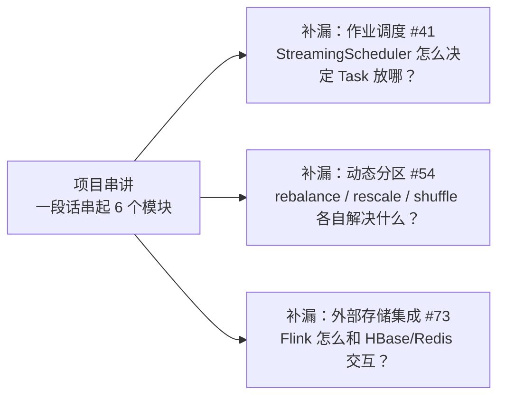
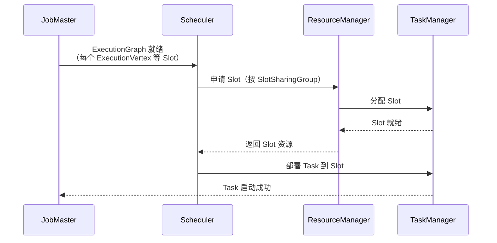
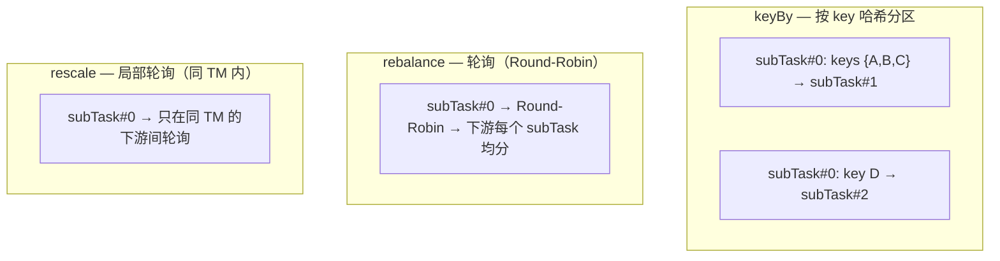

# 07 · 项目串讲 / 防守补漏

> **本章要回答：前 6 个模块学了这么多，面试时怎么用一段连贯的话把 Flink 能力串起来？以及还有哪些低频但可能被问到的防守题？**



覆盖原题：73, 41, 54。

前置依赖：本章串讲部分依赖 L01-L06 全部内容。

---

## 1. 项目串讲：一段话串起 Flink 全链路

**场景**：面试官问"你在项目里怎么用 Flink 的？"——你需要在 3-5 分钟内从架构到细节都提到。

### 完整串讲模板（可背诵）

> "我们项目的实时数仓链路：上游 Kafka 承接埋点和业务消息，Flink 作为核心计算引擎做清洗、分流、聚合、状态计算，结果写入 ClickHouse 供实时查询。
>
> **架构层面**：JobManager 管调度和 Checkpoint 协调，TaskManager 提供 Slot 跑算子——Slot Sharing 下一条 pipeline 共享 Slot 省网络开销。Source 并行度对齐 Kafka 分区数，算子级并行度按反压监控动态调整。
>
> **时间与状态**：指标按 **Event Time** 统计——保证口径一致。Watermark 用有界乱序策略（5s 容忍），空闲分区用 withIdleness 防卡住。窗口 5 分钟 Tumbling，增量聚合 + ProcessWindowFunction 补充窗口时间——状态 O(1)。
>
> **去重与关联**：去重用 **MapState + TTL**（24h 只去重近期），高基数 UV 用 HyperLogLog 近似或 Bitmap 精确。维表关联用 **Async I/O** 异步查 HBase/Redis——带本地 MapState 缓存 + TTL 5min 回源刷新。
>
> **容错与精确一次**：Checkpoint 60s 间隔 EXACTLY_ONCE 模式。Barrier 对齐拍全局快照，状态存 RocksDB + 增量 Checkpoint 到大状态。Kafka Sink 开启事务 + 两阶段提交——pre-commit 写数据（不可见），Checkpoint 成功后才 commit（对外可见），失败则 abort 回滚 → 端到端 Exactly-once。
>
> **调优**：反压用 Web UI BackPressure 页定位瓶颈算子 → 提并行度 / 两阶段聚合治倾斜（key 加随机盐 #0-#9，先局部后全局）。序列化优先 POJO——避免 Kryo fallback。RocksDB TTL 配 cleanupFullSnapshot 控制状态规模。"

### 项目绑定的 4 个常见问题

**Q1："你的 Flink 作业怎么保证 Exactly-once？"**
→ Checkpoint Barrier 对齐 + Kafka Sink 事务 2PC。见 L04。

**Q2："作业挂了怎么恢复？"**
→ JM 检测心跳丢失 → 从最近 Checkpoint 恢复状态 + offset → 指数退避重启策略。见 L04。

**Q3："反压了你怎么排查？"**
→ Web UI BackPressure 页 → HIGH 算子 → Metrics outPoolUsage → 治理。见 L06。

**Q4："数据倾斜怎么解决？"**
→ 两阶段聚合：Phase 1 key 加盐 #0-#9 局部聚合，Phase 2 去盐全局聚合。见 L06。

---

## 2. 补漏：作业调度机制

### Flink 怎么决定哪个 Task 跑在哪个 Slot 上？

**调度流程**：



**Scheduler 怎么选 Slot？**

| 策略 | 行为 | 适用 |
|------|------|------|
| **Default Scheduler** | 按 Slot 申请顺序分配 | 流作业（默认） |
| **Adaptive Batch Scheduler**（1.15+） | 根据数据量**自动推断并行度** | 批作业——不用手动设并行度 |

**默认调度器的分配原则**：
- 优先把同一 SlotSharingGroup 的 Task 部署到同一 Slot（减少网络）
- 尽量均匀分布到不同 TM（避免单 TM 过载）
- 如果 Slot 不够 → 作业起不来，直接失败

### 怎么优化调度效率？

1. **Slot Sharing 合理分组**：轻重算子混在一组 → 轻算子空闲时资源给重算子用
2. **避免过高的 maxParallelism**：默认 128 足够，设 32768 会增加 KeyGroup 管理开销
3. **减少 unnecessary shuffle**：能 chain 的算子让它 chain——减少 Task 数量 = 减少调度对象
4. **批作业用 Adaptive Batch Scheduler**：不用手动推断并行度

---

## 3. 补漏：动态分区与重平衡

### rebalance、rescale、shuffle、keyBy——各自在什么场景用？



| 分区策略 | 行为 | key 局部性 | 适用 |
|----------|------|-----------|------|
| `keyBy()` | 按 key 哈希 | ✅ 保留——**相同 key 进同一 subTask** | 聚合、去重、状态操作 |
| `rebalance()` | 轮询 | ❌ **打破**——均匀分发 | 无 key 的 map/filter，打散倾斜 |
| `rescale()` | 局部轮询 | ❌ 打破 | 轻量重分区——减少跨 TM 网络 |
| `shuffle()` | 随机分发 | ❌ 打破 | 同 rebalance 但随机（分布不如轮询均匀） |
| `broadcast()` | 全量广播 | N/A | Broadcast State——规则/配置下发 |
| `forward()` | 直连（默认，不触发 shuffle） | ✅ 保留 | Chain 内的邻接算子 |

### 重平衡怎么优化数据分布？

**场景 1：map 类算子无 key，下游负载不均 → `rebalance()`**

```java
source.map(event -> enrich(event))
    .rebalance()  // 轮询重分区，均匀打散到下游
    .addSink(...);
```

**场景 2：keyBy 后的聚合倾斜 → 两阶段聚合（不是单纯重平衡）**

`rebalance()` 不能解决 keyBy 倾斜——因为 rebalance 会**打破 key 局部性**，key 被随机分发到不同 subTask，同一 key 的数据无法聚合。正确做法是两阶段聚合（见 L06 §3）。

**场景 3：Source 并发数 < 下游并发数 → `rescale()`**

`rescale()` 只在同一 TM 内轮询，比 `rebalance()` 网络开销更小（不跨 TM）。但下游 subTask 必须 ≥ 上游。

---

## 4. 补漏：外部存储集成

### Flink 怎么和 HBase / Redis 交互？

**本质**：Flink 不内置外部存储的连接器——你在算子里直接调用对应 Client。

| 方式 | 实现 | 推荐度 |
|------|------|--------|
| **同步查询** | 在 map/process 中同步调 HBase get | ❌ 阻塞线程，低吞吐 |
| **Async I/O** | `AsyncDataStream.unorderedWait()` | ✅ 异步化，并发等待，吞吐高 |
| **缓存增强** | Async I/O + MapState 本地缓存 + TTL | ✅✅ 最优——减少回源，性能最好 |

```java
// 缓存增强的 Async I/O（推荐模式）
public class CachedAsyncFunction extends RichAsyncFunction<Order, Enriched> {
    private transient MapState<String, Dim> cache; // 本地缓存
    private transient AsyncHBaseClient hbase;      // 异步客户端

    @Override
    public void asyncInvoke(Order o, ResultFuture<Enriched> rf) {
        Dim cached = cache.get(o.getDimKey());
        if (cached != null) {
            rf.complete(Collections.singletonList(enrich(o, cached))); // 命中缓存 → 直接返回
            return;
        }
        hbase.asyncGet(o.getDimKey()).thenAccept(dim -> {
            cache.put(o.getDimKey(), dim);          // 回填缓存
            rf.complete(Collections.singletonList(enrich(o, dim)));
        });
    }
}
```

### 和外部系统交互的通用原则

1. **永远异步** → 不要同步阻塞 Flink 的处理线程
2. **本地缓存** → MapState + TTL，减少回源
3. **限流保护** → 异步并发数配上限（`capacity` 参数），防止打爆外部系统
4. **一致性** → Flink 不保证外部系统的一致性（除非外部支持事务如 Kafka）

---

## 面试串讲

> "面试时如果被问到'你的 Flink 链路整体是什么样的'，从 Kafka Source → Event Time + Watermark → 窗口聚合/状态去重 → Async I/O 维表关联 → Kafka Sink 2PC Exactly-once，按 L01-L06 的顺序讲。每个点提到 1-2 个关键词：并行度对齐分区数、Event Time 保证口径、两阶段聚合治倾斜、增量 Checkpoint 减小快照、TTL 控制状态膨胀。
>
> 防守题：调度机制——知道 Default Scheduler 按 Slot 均匀分配，批作业用 Adaptive Batch Scheduler 自动推并行度即可。重平衡——rebalance 轮询打散无 key 数据，keyBy 倾斜不能用 rebalance（破坏 key 局部性），要用两阶段聚合。外部存储——Async I/O + 本地 MapState 缓存 + TTL，永远异步。"

---

## 自测（先口述，再点开）

<details>
<summary><b>Q：面试时用一段话串起你的 Flink 全链路（从 Source 到 Sink，覆盖 6 个模块）？</b></summary>

A：Kafka → Event Time + BoundedOutOfOrderness(5s) → keyBy → 5min TumblingWindow → 增量聚合 + ProcessWindowFunction → MapState 去重 + TTL(24h) → Async I/O 维表缓存 → Kafka Sink 2PC → Checkpoint 60s EXACTLY_ONCE → RocksDB 增量 CK。

</details>

<details>
<summary><b>Q：Flink 怎么决定 Task 放哪个 Slot？批作业怎么自动推并行度？</b></summary>

A：Default Scheduler 按 SlotSharingGroup 分配，优先同 Slot、均匀分布 TM。Slot 不够作业提交失败。批作业用 Adaptive Batch Scheduler（1.15+）→ 根据数据量自动推断并行度。

</details>

<details>
<summary><b>Q：rebalance 和 keyBy 的本质区别？rebalance 能解决 keyBy 倾斜吗？</b></summary>

A：keyBy 按 key 哈希分区（保留 key 局部性——相同 key 进同一 subTask）。rebalance 轮询均匀分发（打破 key 局部性）。rebalance 不能解决 keyBy 倾斜——因为 rebalance 打破 key 局部性后同一 key 数据散在不同 subTask，无法聚合。正确解法是两阶段聚合（key 加盐 → 去盐）。

</details>

<details>
<summary><b>Q：Flink 怎么和外部存储（HBase/Redis）交互？有什么最佳实践？</b></summary>

A：用 Async I/O 异步化（不阻塞线程）+ 本地 MapState 缓存 + TTL 过期回源。三条原则：永远异步、本地缓存、限流保护（capacity 参数）。Flink 不保证外部系统的一致性（除非外部支持事务）。

</details>

---

## 推荐源
- Flink 架构总览：<https://nightlies.apache.org/flink/flink-docs-stable/docs/concepts/flink-architecture/>
- Adaptive Batch Scheduler：<https://nightlies.apache.org/flink/flink-docs-stable/docs/deployment/elastic_scaling/>
- Async I/O：<https://nightlies.apache.org/flink/flink-docs-stable/docs/dev/datastream/operators/asyncio/>

!!! question "卡住了？"
    项目串讲时如果被追问具体数字（并行度多少、窗口多大、数据量多少），准备 1-2 个真实/合理数字即可——面试官要的不是精确值，是你"知道为什么选这个数字"。
