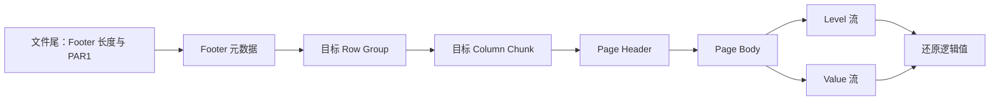
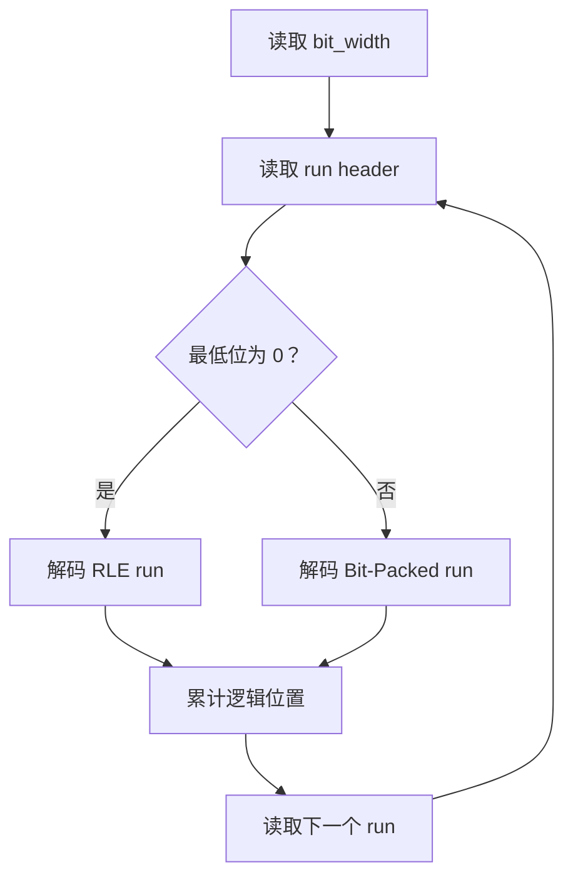
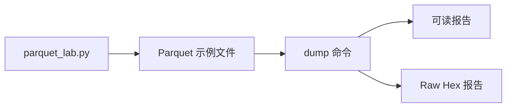

# 从 Footer 到 RLE：Parquet 的物理表示与读取路径

_本文章把工作目录中的学习笔记整理成一条从文件结构到读取器的连续主线。文中的偏移、Hex 和 run 都来自小型实验；概念示例会单独标明。_

---

## 🧭 先看全景：读取一列时发生了什么

Parquet 是列式存储格式。逻辑上的表按行组织，但落盘时会被拆成 Row Group、列和 Page。

读取一列时，reader 通常先从文件尾部找到 Footer，再根据 Footer 中的元数据定位目标列的 Column Chunk，最后解析 Page 并还原逻辑值。



这条链路也说明了后文的组织方式：先看文件级定位，再看 Page 的物理结构，最后深入 Level、Dictionary Index 和 RLE / Bit-Packing Hybrid。

## 🧪 实验材料与示例边界

工作目录中有三组 Parquet 示例。为了避免把文件名当成文章主线，正文只在实验材料和复现命令中使用具体文件名；其余地方使用“主示例”“重复示例”和“混合示例”。

| 材料 | 用途 | 主要观察对象 |
| --- | --- | --- |
| `demo_50x10.parquet` | 主示例 | 文件布局、Footer、10 个列块和 Page 偏移 |
| `demo_rle_50x4.parquet` | 重复示例 | 长段重复下标、Definition Level 和 RLE |
| `demo_mixed_50x5.parquet` | 混合示例 | 不规则下标、Bit-Packed 与 RLE 的组合 |
| `parquet_lab.py` | 分析脚本 | 解码 Page Header、Page Body、字典值和下标 |
| `demo_50x10_layout.txt` | 布局报告 | 文件中的连续区间和 Footer / Page Header 的职责 |
| `demo_50x10_meta.txt` | 元数据报告 | Schema、Column Chunk 统计和偏移字段 |

文中会区分四种内容：

- **规范模型**：描述 Parquet 一般如何组织数据
- **实际观察**：从实验文件中读到的偏移、编码或统计信息
- **概念示例**：为了说明某个编码过程而人工构造的序列
- **实验产物**：脚本写出的可读报告或原始 Hex 文本

当前实验环境是 PyArrow 25.0.0，实验日期为 2026-07-27。环境信息属于这组实验的上下文，不代表所有 Parquet 文件都会具有完全相同的布局。

## 📦 文件级结构：Footer、Row Group 与 Column Chunk

### 从逻辑表到物理文件

一个简化的 Parquet 文件可以表示为：

```text
文件
├── File Header: PAR1
├── Row Group 0
│   ├── Column Chunk: id
│   │   ├── Dictionary Page（可选）
│   │   └── Data Page ...
│   ├── Column Chunk: name
│   └── ...
├── Row Group 1 ...
├── File Footer（Schema、Row Group、Column Chunk、统计信息、偏移量）
├── Footer length（4 字节，小端）
└── File Tail: PAR1
```

Row Group 是一批行的水平切片。Column Chunk 则是某个 Row Group 中某一列的全部 Page。

因此，文件既保留了表的行语义，又把同一列的数据放在相对连续的区域中。只读取少数列时，reader 不必把所有列都读入内存。

### 主示例的文件尾部

主示例是一个 50 行、10 列的小文件，总大小为 4,820 字节。它的关键范围如下；所有区间都使用半开区间 `[start, end)`。

| 区域 | 偏移范围 | 大小 | 作用 |
| --- | ---: | ---: | --- |
| File Header | `[0, 4)` | 4 B | `PAR1` 文件标记 |
| `id` 字典页 | `[4, 235)` | 231 B | 保存字典中的真实值 |
| `id` 数据页 | `[235, 350)` | 115 B | 保存 Level 和字典下标 |
| `name` 字典页 | `[350, 634)` | 284 B | 保存字典中的真实值 |
| `name` 数据页 | `[634, 731)` | 97 B | 保存 Level 和字典下标 |
| `age` 字典页 | `[731, 887)` | 156 B | 保存字典中的真实值 |
| `age` 数据页 | `[887, 986)` | 99 B | 保存 Level 和字典下标 |
| `score` 字典页 | `[986, 1,316)` | 330 B | 保存字典中的真实值 |
| `score` 数据页 | `[1,316, 1,431)` | 115 B | 保存 Level 和字典下标 |
| `city` 字典页 | `[1,431, 1,507)` | 76 B | 保存字典中的真实值 |
| `city` 数据页 | `[1,507, 1,580)` | 73 B | 保存 Level 和字典下标 |
| `is_active` 数据页 | `[1,580, 1,630)` | 50 B | 未使用字典页 |
| `balance` 字典页 | `[1,630, 2,008)` | 378 B | 保存字典中的真实值 |
| `balance` 数据页 | `[2,008, 2,123)` | 115 B | 保存 Level 和字典下标 |
| `level` 字典页 | `[2,123, 2,159)` | 36 B | 保存字典中的真实值 |
| `level` 数据页 | `[2,159, 2,212)` | 53 B | 保存 Level 和字典下标 |
| `register_date` 字典页 | `[2,212, 2,432)` | 220 B | 保存字典中的真实值 |
| `register_date` 数据页 | `[2,432, 2,531)` | 99 B | 保存 Level 和字典下标 |
| `description` 字典页 | `[2,531, 2,764)` | 233 B | 保存字典中的真实值 |
| `description` 数据页 | `[2,764, 2,855)` | 91 B | 保存 Level 和字典下标 |
| Footer | `[2,855, 4,812)` | 1,957 B | 保存文件元数据 |
| Footer length | `[4,812, 4,816)` | 4 B | 保存 Footer 长度 |
| File Tail | `[4,816, 4,820)` | 4 B | 结束标记 `PAR1` |

文件尾的 8 个字节由 Footer length 和最后的 `PAR1` 组成。Footer 起点可以由文件大小和 Footer length 反推：

$$
\mathrm{footer\_start}
=\mathrm{file\_size}-8-\mathrm{footer\_length}
=4820-8-1957
=2855
$$

Footer length 的四个字节是：

```text
a5 07 00 00
```

按小端解释，它表示 1,957。文件尾部的第二个 `PAR1` 只是结束标记，不是数据。真正的数据页和字典页位于文件头之后、Footer 之前。

### Footer 与 Page Header 的职责

Footer 和 Page Header 都包含元数据，但作用范围不同。

| 结构 | 作用范围 | 典型内容 |
| --- | --- | --- |
| Footer | 整个文件 | Schema、Row Group、Column Chunk、列级统计和偏移 |
| Page Header | 单个 Page | 页类型、编码、值数量、压缩大小和页级字段 |
| Page Index | 可选的页级索引 | Column Index、Offset Index 等独立索引结构 |

Footer 更像文件级目录，reader 通常先解析它。Page Header 位于每个 Page 的前面，reader 定位到 Page 后再解析它。

### Row Group 的大小

主示例只有 50 行，因此默认写出了 1 个 Row Group。Row Group 数量不是查询时临时决定的，而是在写文件时由 writer 根据目标大小或行数规划。

例如指定 `row_group_size=10` 时，50 行通常会得到约 5 个 Row Group。

Row Group 较大时，单个任务处理的数据更多，压缩可能更好，但读取和并行粒度较粗。Row Group 较小时，更容易跳过无关数据，并行粒度更细，但 Footer 和 Page / Chunk 元数据开销会增加。

### Column Chunk 保存什么

一个 Column Chunk 是某个 Row Group 中某一列的全部 Page。例如，主示例的 `id` 列在 Row Group 0 中有一个 Column Chunk。

Footer 的 Column Metadata 可能记录：

- `dictionary_page_offset`
- `data_page_offset`
- `total_compressed_size`
- `total_uncompressed_size`
- `encodings`
- `statistics`，例如 `min`、`max` 和 `null_count`

这些字段让 reader 不必从文件头一路扫描到目标列，而是可以直接定位目标 Column Chunk。

## 📄 Page：Header、Body、Dictionary Page 与 Data Page

### Page 的物理边界

Page 可以先抽象为：

```text
[Page Header][compressed Page Body]
```

Page Header 在文件中是实际存在的。Page Body 在落盘时可能已经经过 Codec 压缩；解压后，Body 才能按 Level 和 Value 的结构读取。

主示例的 `id` 字典页位于文件偏移 4：

```text
page_file_offset = 4
page_header_size = 16
compressed_page_size = 215

Page Header:    [4, 20)
compressed body: [20, 235)
下一页从 offset 235 开始
```

Page Header 的 16 B 不是固定规则。Page Header 是用 Thrift Compact Protocol 序列化的结构，字段是否存在、数值大小和 VarInt 长度都会影响最终大小。

因此，Page Header 可能是 16 B，也可能是其他长度。读取 Header 必须按协议解码，不能只凭 Hex 中某一字节的位置硬切。

Page Header 通常包含：

- `type`：页类型，例如 `DATA_PAGE` 或 `DICTIONARY_PAGE`
- `uncompressed_page_size`：解压后的 Body 大小
- `compressed_page_size`：文件中 Body 的大小
- `crc`：可选校验值
- `dictionary_page_header`：字典页专属字段
- `data_page_header`：数据页专属字段

Data Page Header 还会描述：

- `num_values`
- `encoding`
- `definition_level_encoding`
- `repetition_level_encoding`
- `repetition_levels_byte_length`
- `definition_levels_byte_length`

### Dictionary Page 与 Data Page 的分工

当一个 Column Chunk 使用字典编码时，通常先写 Dictionary Page：

```text
Dictionary Page:
    [不同的真实值]

Data Page:
    [dictionary index, dictionary index, ...]
```

例如：

| Dictionary index | 真实值 |
| ---: | --- |
| 0 | `A` |
| 1 | `B` |
| 2 | `C` |

Data Page 的逻辑下标：

```text
0, 0, 1, 2, 0
```

经过字典查找后得到：

```text
A, A, B, C, A
```

字典页本身的值一般使用 PLAIN 编码。字典属于一个 Column Chunk，也就是一个 Row Group 内的一列；不同 Row Group 不应默认共享同一套字典。

字典顺序也不应默认是字典序。reader 必须读取该 Column Chunk 的实际 Dictionary Page，再按照实际下标建立映射。

主示例的 `id` 字典页中有 `1, 2, 3, ..., 50`。因此看到下面的字节时，它们表示 PLAIN 编码的 INT32 值，而不是 Data Page 的下标流：

```text
01 00 00 00
02 00 00 00
03 00 00 00
```

## 🔤 编码如何分层

实验输出中会同时出现 `PLAIN`、`RLE` 和 `RLE_DICTIONARY`。它们可能作用于不同层次，不是三个互相排斥的“整文件压缩算法”。

| 名称 | 主要作用位置 | 表示什么 |
| --- | --- | --- |
| `PLAIN` | Dictionary Page 或普通值流 | 直接写真实值 |
| `RLE` | Definition Level、Repetition Level 或 Hybrid run | 表示连续重复值 |
| `RLE_DICTIONARY` | Data Page 的值流 | 先使用字典下标，再编码下标流 |
| `SNAPPY` | Page Body | 对 Page Body 做通用 Codec 压缩 |

可以把主示例的一列理解为下面的分层：

```text
Dictionary Page: PLAIN 写真实字典值
Data Page Level: RLE 写 definition/repetition level
Data Page Value: RLE_DICTIONARY 写字典下标
Page Body: 再由 Snappy 压缩后落盘
```

### PLAIN

PLAIN 直接写真实值。例如：

- INT32：固定 4 字节，小端
- INT64：固定 8 字节，小端
- BYTE_ARRAY：4 字节长度加原始字节

Dictionary Page 常用 PLAIN。字符串 `ABC` 的 BYTE_ARRAY PLAIN 形态可以表示为：

```text
03 00 00 00 41 42 43
```

其中前四个字节表示长度 3，后面是 `ABC` 的原始字节。

### RLE

RLE 是 Run-Length Encoding。连续重复的值只需要记录一次值和重复次数。

Parquet 中常见的 RLE 使用位置包括：

- Definition Level
- Repetition Level
- RLE / Bit-Packing Hybrid 中的重复下标

例如，50 个连续的 Definition Level 1 可以写成一个长度为 50 的 run。

在 bit width 为 1 的 Level RLE 表示中，可能看到：

```text
64 01
```

因为：

```text
50 << 1 = 100 = 0x64    # run header
01                      # 重复的 level 值
```

### RLE_DICTIONARY

`RLE_DICTIONARY` 表示 Data Page 的数据值采用字典编码：

```text
真实值 -> dictionary index
```

这些 index 随后使用 RLE / Bit-Packing Hybrid 编码。Snappy 是另一层 Codec，不是 `RLE_DICTIONARY` 的同义词。

## 🧩 Level 如何帮助 reader 还原逻辑值

### Definition Level 表示值是否存在

Definition Level 用来表示一个值在嵌套结构中“定义到了哪一层”。最常见的用途是区分 NULL，并处理嵌套 optional 字段。

对一个平面表中的 optional 列，假设：

```text
max_definition_level = 1
```

那么：

- Definition Level 0 表示该值是 NULL
- Definition Level 1 表示该值存在

概念示例：

```text
逻辑数据：          [10, NULL, 30, NULL, 50]
Definition Level：  [1, 0, 1, 0, 1]
真实值流：          [10, 30, 50]
```

reader 通过 Level 流把存在的值放回逻辑位置，最终还原为：

```text
[10, NULL, 30, NULL, 50]
```

因此，Data Page 的 `num_values` 不能简单理解为 Body 中有多少个真实值。在有 NULL 时，它还包括由 Level 描述的逻辑位置；真实值数量由 Definition Level 决定。

主示例中的数据基本全是非 NULL，因此 Definition Level 近似为：

```text
[1, 1, 1, ..., 1]    # 共 50 个
```

这正是 RLE 很有用的场景。

### Repetition Level 表示重复结构

Repetition Level 用来表示 repeated 或 list 结构中的行边界和重复层级。

概念示例：

```text
row 0: items = [A, B]
row 1: items = [C]

展开后的值：       A, B, C
Repetition Level： 0, 1, 0
```

其中：

- 0 表示新行的第一个元素
- 1 表示仍属于当前行，是 repeated 列表中的后续元素
- 下一次 0 表示进入下一行

当前实验文件是平面表，`max_repetition_level = 0`。因此它没有真正的 repeated 层次，Repetition Level 基本不承载有用的重复结构信息。

### Data Page Body 的顺序

对常见的 Data Page V1，可以把解压后的 Body 抽象为：

```text
[repetition level section]
[definition level section]
[encoded value section]
```

两个 Level 区域的长度由 Page Header 中的字段给出：

- `repetition_levels_byte_length`
- `definition_levels_byte_length`

reader 先按这两个长度切出 Level，再解码后面的值流。Dictionary Page 没有 Data Page 的 Level 和 dictionary index，它只负责提供字典内容。

## 🔢 Dictionary index 如何进入 Hybrid Encoding

### bit width 表示下标需要多少位

在字典编码的数据流中，`bit_width` 表示一个 dictionary index 需要多少 bit，而不是原始数字本身需要多少 bit。

如果字典有 `D` 个值，则可以写成：

$$
b=\lceil\log_2(D)\rceil
$$

例如：

| 字典大小 | `bit_width` |
| ---: | ---: |
| 5 | 3 bit |
| 50 | 6 bit |
| 65 | 7 bit |

这里的 65 指 65 个不同的字典值，不是 65 行数据。如果有 65 行但只有 5 个不同值，仍然只需要 3 bit。

字典下标是 `0, 1, 2, ...`，不是字典中的真实值。真实值即使是 100、1000、9999，也可以先映射为 0、1、2。

### RLE run 与 Bit-Packed run

字典下标流使用 RLE / Bit-Packing Hybrid。一个完整的值流可以抽象成：

```text
[bit_width][run header + run data][run header + run data]...
```

RLE run 的 Header 是：

```text
header = run_length << 1
```

最低位为 0，后面写一个用 `ceil(bit_width / 8)` 字节表示的值。

例如 bit width 为 3，dictionary index 7 连续出现 10 次：

```text
run_length = 10
header = 10 << 1 = 20 = 0x14
value = 07
```

逻辑上表示：

```text
[7, 7, 7, 7, 7, 7, 7, 7, 7, 7]
```

Bit-Packed run 每组固定打包 8 个值。它的 Header 是：

```text
header = (num_groups << 1) | 1
```

最低位为 1。后面紧跟 `num_groups * 8` 个 index，每个 index 占 `bit_width` bit，按位拼接成字节。

例如 bit width 为 3，8 个 index 需要：

```text
8 * 3 = 24 bit = 3 byte
```

Bit-Packed 更适合紧凑表示不连续的小下标，RLE 更适合长段重复下标。

### reader 如何判断两种 run

Data Page Header 只声明：

```text
encoding = RLE_DICTIONARY
```

RLE 与 Bit-Packed 的切换发生在 Data Page 的 index body 内。reader 读取每个 run 的 Header，再检查最低位：



因此，同一个 Data Page 内可以连续出现：

```text
[RLE run][Bit-Packed run][RLE run]...
```

切换不需要重新声明 Data Page Header。

### 一个不规则序列

下面是一个概念示例。假设字典顺序为：

| 真实值 | dictionary index |
| --- | ---: |
| `A` | 0 |
| `B` | 1 |
| `C` | 2 |
| `D` | 3 |
| `E` | 4 |

逻辑数据为：

```text
AAABAABBBBCCDDCCCCDDEAAAAEEEE
```

对应的字典下标为：

```text
0 0 0 1 0 0 1 1 1 1 2 2 3 3 2 2 2 2 3 3 4 0 0 0 0 4 4 4 4
```

字典内容不会因为出现模式改变而改变。只要仍在同一个 Column Chunk 中，Dictionary Page 仍可以保存 `A, B, C, D, E`，Data Page 只改变下标序列。

这个序列同时包含重复段和不规则段。writer 可能把它分成多个 RLE 和 Bit-Packed run，但具体分段由 writer 的编码策略决定，不能只根据逻辑值序列唯一推导；必须查看实际 Data Page Body 的 run Header。

在混合示例的 `run_id` 列中，实验报告观察到：

```text
BIT_PACKED(groups=5, slots=40)
RLE(run_length=10, value=7)
```

这正好展示了不规则部分和长段重复部分可以出现在同一个下标流中。

## 🔎 Reader 如何定位一个值

RLE / Bit-Packing 解码后是一串按逻辑顺序排列的下标。每个 run 的长度就是它覆盖的逻辑位置跨度。

例如：

```text
RLE(run_length=10, value=7)
```

它覆盖逻辑位置 `0..9`。下一个 run 从位置 10 开始。查询第 12 个值时，reader 先跳过前一个 run 的 10 个位置，再在后续 run 中找到位置 12，得到 dictionary index，最后用 `dictionary[index]` 取真实值。

reader 不需要为每个逻辑值保存独立的 byte offset，而是维护：

```text
current_position += run_length
```

对于最简单的 PLAIN INT32 流，每个值固定 4 字节，可以直接按下式定位：

$$
\mathrm{byte\_offset}=\mathrm{value\_index}\times 4
$$

例如：

```text
00 00 00 00 -> 0
01 00 00 00 -> 1
02 00 00 00 -> 2
03 00 00 00 -> 3
04 00 00 00 -> 4
```

两种定位方式的区别如下：

| 数据形式 | 定位方式 | 是否有固定的每值字节偏移 |
| --- | --- | --- |
| PLAIN INT32 | 下标乘以 4 | 有 |
| RLE / Bit-Packing Hybrid | 按 run 累计逻辑位置 | 没有 |

Footer 的 offset 主要用于定位 Column Chunk 和 Page，不是每个值的 offset。如果文件有 Page Index，reader 可以依据页级 `min` / `max` 等信息跳过整页，但进入目标页后，通常仍需要按 run 解码。

## 🛠️ 实验输出与复现

### “压缩前报告”到底是什么

`parquet_lab.py` 生成的 `*_precompression.txt` 是为了观察而写出的文本报告，不是 Parquet 标准中的额外文件。

它展示：

- Page Header 的原始 Hex
- Snappy 解压后的 Page Body 全部 Hex
- Dictionary Page 解码后的真实值
- Data Page 的 Level run
- Data Page 的 dictionary index run
- Footer 的原始 Hex

报告中的 `BODY_BEFORE_CODEC` 表示 Page Body 在 Codec 压缩之前的字节。Page Header 和 Footer 本身不是与 Page Body 一起被 Snappy 压缩的。

`*_precompression_raw.txt` 尽量去掉解释性文本，只保留：

- 页边界分隔线
- Header 的原始 Hex
- `BODY_BEFORE_CODEC` 的原始 Hex
- Footer 的原始 Hex
- 文件头和文件尾

Raw 报告仍然是 Hex 文本，不能当作“解压后的二进制 Parquet 文件”直接读取。它的用途是让人眼对照页边界、Header、Body 和 Footer。

### 从脚本到观察报告



### 复现实验

以下命令都应在实验工作目录中运行：

```bash
python3 parquet_lab.py make-rle-example
python3 parquet_lab.py make-mixed-example
```

查看主示例文件：

```bash
python3 parquet_lab.py dump demo_50x10.parquet \\
  -o demo_50x10_precompression.txt \\
  -r demo_50x10_precompression_raw.txt
```

查看混合示例文件：

```bash
python3 parquet_lab.py dump demo_mixed_50x5.parquet \\
  -o demo_mixed_50x5_precompression.txt \\
  -r demo_mixed_50x5_precompression_raw.txt
```

两类报告的用途不同：可读报告适合理解结构，Raw 报告适合把解释文字拿掉后观察原始字节。

## 📋 最后总结

Parquet 的读取过程可以压缩成下面几条：

1. 文件尾的 Footer length 和 `PAR1` 帮助 reader 找到 Footer
2. Footer 告诉 reader 每个 Row Group 和 Column Chunk 在哪里
3. Column Chunk 由 Dictionary Page 和 Data Page 组成，也可能只有 Data Page
4. Dictionary Page 使用 PLAIN 保存不同的真实值
5. Data Page 的 Level 流描述 NULL、嵌套和行边界
6. Data Page 的 Value 流保存普通值或 dictionary index
7. RLE / Bit-Packing Hybrid 让 Level 或 dictionary index 更紧凑
8. Snappy 对 Page Body 做通用 Codec 压缩
9. reader 依次定位 Page、解压 Body、解码 Level、解码 index，再还原列值

最需要保持清楚的几组区分是：

| 容易混淆的对象 | 应该如何区分 |
| --- | --- |
| dictionary value 与 dictionary index | 前者是真实值，后者是字典中的位置 |
| `bit_width` 与原始数字 | 前者表示下标需要的位数 |
| RLE 与 `RLE_DICTIONARY` | 前者是 run 的表示方式，后者是 Data Page 的字典编码声明 |
| Snappy 与 RLE | 前者是 Page Body 的 Codec，后者是数据流中的编码方式 |
| Footer offset 与 value offset | 前者定位 Chunk / Page，后者通常不能直接由它得到 |
