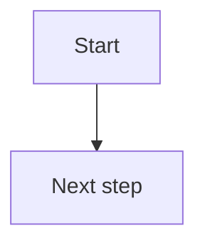

# Notes

This directory is the source of truth for Lero β's public notes.

Create one Markdown file per note using a stable filename:

```text
YYYY-MM-DD-short-slug.md
```

Each note should begin with front matter like this:

```yaml
---
title: A note title
date: 2026-07-27
summary: One sentence for the notes index.
draft: false
---
```

The site will render these files into static pages. Keep drafts as
`draft: true` until they are ready to publish.

## Writing rules

The article page uses Markdown with GitHub-Flavored Markdown extensions. The
front matter `title` is the canonical title, and `summary` becomes the page
description. Use H2 for major sections and H3 for subsections. A body H1 that
repeats the title is allowed for Obsidian, but do not add another different H1.

Keep the article's claims, numbers, formulas, code, and uncertainty intact
when asking an agent to format or polish it. Ask explicitly if you want the
agent to fact-check, add citations, change the argument, or reorganize sections.

## Math

Prefer standard Markdown math delimiters:

```md
行内公式：$E = mc^2$

独立公式：

$$
\int_0^1 x^2\,dx = \frac{1}{3}
$$
```

Obsidian-style `\(...\)` and `\[...\]` are also accepted. Keep formulas out
of code fences, and do not ask an agent to silently “fix” a formula's meaning.

## Diagrams, code, and images

Keep flowcharts and other structural diagrams as Mermaid source:

````md

````

Use `snake_case` node IDs and avoid Mermaid theme directives or inline styles.
Article pages enhance valid Mermaid blocks into themed SVG diagrams in the
browser; the Markdown source remains canonical, and a syntax error leaves the
source block visible. Use a language-labelled code fence, such as a Python
fence, and Markdown images with descriptive alt text. Emoji can be used as
sparse textual accents, but there is no article icon library yet.

## A useful request to an agent

> Please polish the language and Markdown structure. Preserve all scientific
> claims, data, formulas, code, Mermaid source, and uncertainty. List any
> suspected factual or mathematical issue separately instead of changing it.
